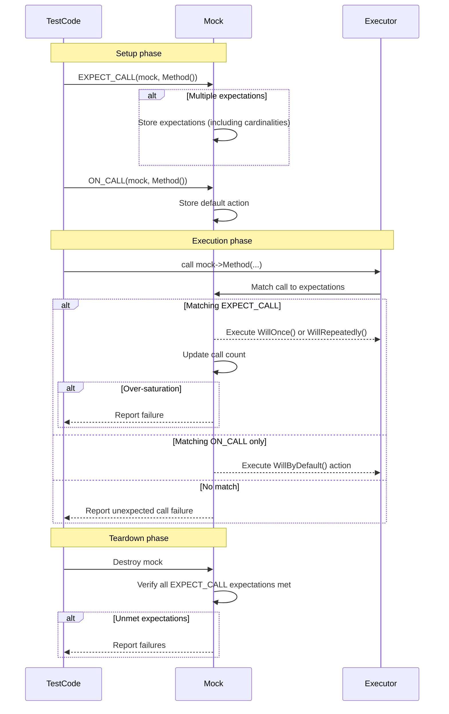

# Mock Expectations and Cardinalities

Understand how GoogleMock models expectations on mocked functions, how cardinalities specify expected call counts, and the roles of `ON_CALL` and `EXPECT_CALL` in defining mock behavior and verifying interactions. This guide explains sequencing, default behavior, and nuances of expectation specification to help you craft precise and reliable tests.

---

## Introduction to Mock Expectations

In GoogleMock, expectations describe how mock methods are anticipated to be invoked during a test. They specify _what calls_ should be made, _how often_, with _what arguments_, and _what they should do_. Properly setting expectations ensures your tests precisely verify the interactions your code has with its dependencies.

Two main constructs define mock behavior:

- **`EXPECT_CALL`**: Sets an expectation that a mock method _will be called_, defining both the verification aspect (the call _must_ occur) and behavior (what to do when called).
- **`ON_CALL`**: Defines the default behavior for calls but does _not_ impose any expectation on whether the method is actually called.


<Check>
Always use `EXPECT_CALL` when you want to assert that a call happens. Use `ON_CALL` to specify default behavior for calls you don't want to enforce.
</Check>


## Defining Expectations with `EXPECT_CALL`

### Basic Syntax

```cpp
EXPECT_CALL(mock_object, Method(matchers...))
    .Times(cardinality)
    .WillOnce(action)
    .WillRepeatedly(action);
```

- `mock_object`: Your mock instance.
- `Method`: The mock method.
- `matchers`: Argument matchers specifying expected call parameters.
- `.Times()`: Specifies how many times this call is expected.
- `.WillOnce()`: Defines sequential actions for each call.
- `.WillRepeatedly()`: Defines behavior for all calls after `WillOnce()`s are exhausted.


### Matchers: Specifying Arguments

Matchers express what arguments are expected for a call to be considered matching. Use:

- Concrete values (e.g., `100`).
- Wildcards `_` to match any argument.
- Composite matchers like `Ge(5)` for ‘greater or equal to 5’.

If the method is overloaded, argument matchers are mandatory to disambiguate the expected call.


### Cardinalities: Specifying Call Counts

The `.Times()` clause specifies _how often_ the call must happen. Cardinalities include:

| Cardinality       | Meaning                              |
| ----------------- | ----------------------------------- |
| `AnyNumber()`     | Call may occur any number of times. |
| `AtLeast(n)`      | Called at least `n` times.          |
| `AtMost(n)`       | Called at most `n` times.           |
| `Between(m,n)`    | Called between `m` and `n` times.  |
| `Exactly(n)`      | Called exactly `n` times (alias: `n`).|

If `.Times()` is omitted, GoogleMock infers the count based on the number of `WillOnce()` clauses and the presence of `WillRepeatedly()`:

- No `WillOnce()` or `WillRepeatedly()`: `Times(1)` is assumed.
- `n` `WillOnce()` calls, no `WillRepeatedly()`: `Times(n)`.
- `n` `WillOnce()` calls, with `WillRepeatedly()`: `Times(AtLeast(n))`.


<Warning>
Omitting `.Times()` can cause unexpected failures if call counts differ. Always verify if automatic inference matches your intent.
</Warning>


### Actions: Defining What Happens When Calls Occur

- Each `WillOnce(action)` defines what the mock should do for the _nth_ call.
- The optional `WillRepeatedly(action)` defines behavior after all `WillOnce` actions are used.
- Default actions apply if no behavior is specified (e.g., returning zero or false for built-in types).

Example:

```cpp
EXPECT_CALL(turtle, GetX())
    .WillOnce(Return(100))
    .WillOnce(Return(200))
    .WillRepeatedly(Return(300));
```

The mock will return 100 on the first call, 200 on the second, and 300 on every subsequent call.


## Setting Default Behavior with `ON_CALL`

`ON_CALL` defines default behavior _without_ asserting that the call must happen:

```cpp
ON_CALL(mock_object, Method(matchers...))
    .WillByDefault(action);
```

This allows specifying sensible fallback behavior for calls not covered by `EXPECT_CALL`. Where multiple `ON_CALL`s match, the last one takes precedence.


<Note>
`ON_CALL` and `EXPECT_CALL` manage separate sets of rules. `EXPECT_CALL`’s behaviors override `ON_CALL` during their matched calls.
</Note>

## Combining Multiple Expectations

GoogleMock allows multiple expectations on the same method with different argument matchers:

```cpp
EXPECT_CALL(turtle, GoTo(_, _)).Times(AnyNumber());
EXPECT_CALL(turtle, GoTo(0, 0)).Times(2);
```

The matching expectation is chosen by searching _backwards_: newer expectations override older ones. The last matching active expectation handles the call.


### Sticky Expectations

Expectations remain active even if their call count upper bound is reached, making them "sticky". This means calls exceeding limits still match, resulting in immediate test failure. To avoid this, use `.RetiresOnSaturation()` to mark expectations to retire once fully invoked.


## Controlling Call Order

### Sequences via `InSequence` and `Sequence`

By default, calls matching different expectations don’t have to occur in any particular order. To enforce call order:

- Use the `InSequence` RAII object to group expectations in scope:

```cpp
{
  InSequence seq;
  EXPECT_CALL(obj, A());
  EXPECT_CALL(obj, B());
}
```

Here, `A()` must be called before `B()`, or the test fails.

- Use explicit `Sequence` objects with `InSequence(sequence)` clause:

```cpp
Sequence s1, s2;
EXPECT_CALL(obj, Reset()).InSequence(s1, s2);
EXPECT_CALL(obj, GetSize()).InSequence(s1);
EXPECT_CALL(obj, Describe()).InSequence(s2);
```

This defines a partial order where `Reset()` precedes both `GetSize()` and `Describe()`, but the latter two can be called in any order relative to each other.


### Partial Ordering with `.After()`

Use `.After(expectations...)` to specify that a call is expected only after other expectations have been satisfied.

```cpp
Expectation e1 = EXPECT_CALL(obj, InitX());
Expectation e2 = EXPECT_CALL(obj, InitY());
EXPECT_CALL(obj, Describe()).After(e1, e2);
```

The `Describe()` method will only match after both `InitX()` and `InitY()` calls.

`.After()` accepts up to five `Expectation` or `ExpectationSet` arguments.


### Expectation Lifetime and Retirement

- Expectations retire (become inactive) after:
  - Saturation in a sequence (when a subsequent expectation in sequence is invoked).
  - Explicit `.RetiresOnSaturation()` clause.

Retiring limits matching calls to active expectations only.


## Behavior on Uninteresting and Unexpected Calls

- **Uninteresting call:** A call made to a mock method that has _no_ `EXPECT_CALL` expectations.
  - By default, GoogleMock performs the default action but outputs a warning.
  - Can be suppressed with `NiceMock` or by adding broad `EXPECT_CALL(...).Times(AnyNumber())`.

- **Unexpected call:** A call that matches no active `EXPECT_CALL` but where expectations _exist_ for that method.
  - Always treated as test failure.

### Strictness Modes

- `NaggyMock` (default): warns on uninteresting calls.
- `NiceMock`: suppresses warnings for uninteresting calls.
- `StrictMock`: treats uninteresting calls as errors.

Choose strictness mode to suit test robustness and verbosity needs.


## Common Best Practices and Pitfalls

- Always set expectations _before_ exercising the code under test.
- Use `ON_CALL` to set sensible default behavior shared across tests.
- Use `EXPECT_CALL` sparingly, only when verifying specific interactions.
- Remember that expectations are sticky by default; consider `.RetiresOnSaturation()` to avoid spurious failures.
- For methods with overloads, always specify argument matchers or use disambiguation helpers like `Const()`.
- Use sequences or `.After()` to enforce call orders when necessary.
- Use broad expectations (e.g., `Times(AnyNumber())`) to allow calls you do not want to verify explicitly.


## Troubleshooting Expectations

- GoogleMock reports detailed diagnostics when expectations are violated, including mismatched argument values, unsatisfied pre-requisites, or called too many times.
- Use `--gmock_verbose=info` to log all mock calls and matching details during test execution.
- Ensure matchers are pure and side-effect free.
- Avoid mixing `EXPECT_CALL` statements and actual calls to mock methods in the same test step; define expectations before test actions.


## Example: Setting Expectations with Specific Cardinalities and Actions

```cpp
using ::testing::Return;
using ::testing::_;  // wildcard matcher

class MockTurtle {
 public:
  MOCK_METHOD(int, GetX, (), (const));
};

MockTurtle turtle;

EXPECT_CALL(turtle, GetX())
    .Times(3)
    .WillOnce(Return(10))
    .WillOnce(Return(20))
    .WillOnce(Return(30));

int x1 = turtle.GetX(); // returns 10
int x2 = turtle.GetX(); // returns 20
int x3 = turtle.GetX(); // returns 30
```


## Example: Using `ON_CALL` for Defaults and `EXPECT_CALL` for Verified Calls

```cpp
using ::testing::Return;
using ::testing::_;

MockTurtle turtle;

// Default behavior: GetX returns 0 unless overridden.
ON_CALL(turtle, GetX()).WillByDefault(Return(0));

// Verify GetX() will be called with any argument once.
EXPECT_CALL(turtle, GetX()).Times(1);

int x = turtle.GetX(); // returns 0
```


## Mock Expectations Order and Priority

GoogleMock searches for matching expectations from latest to earliest:

- New expectations override prior ones.
- General catch-all expectations (`EXPECT_CALL(mock, Method(_)).Times(AnyNumber())`) are usually listed first.

Example:

```cpp
EXPECT_CALL(turtle, GoTo(_, _)).Times(AnyNumber());
EXPECT_CALL(turtle, GoTo(0, 0)).Times(2);
```

A call `GoTo(0, 0)` matches the second (newer) expectation; other calls fall back to the first.


## Summary Diagram: Expectation Lifecycle and Interaction Flow




## Practical Tips

- Use `.RetiresOnSaturation()` to automatically retire expectations after they are satisfied. This is especially useful for multiple sequential expectations on the same method.
- Use `InSequence` or explicit `Sequence` objects to enforce call order; use `.After()` to specify partial order constraints.
- Add catch-all `EXPECT_CALL(...).Times(AnyNumber())` expectations when you want to tolerate calls outside your critical verification points.
- Use `ON_CALL` for common default behaviors shared across many tests, minimizing test-specific setup overhead.
- Always define expectations before any calls to the mock happen for deterministic and meaningful failures.

## Troubleshooting Common Failures

- **Lower-bound violation:** Calls are fewer than the minimum expected.
- **Upper-bound violation:** Calls exceed allowed number.
- **Unexpected call:** Call doesn’t match any expectation.
- **Uninteresting call:** Call to mock method without expectations, triggers warnings unless suppressed.

Use the diagnostic output, enabled with `--gmock_verbose=info`, to investigate failing expectations.


# Additional Resources

For deeper understanding and expanded recipes, consult:

- [gMock for Dummies](../guides/getting-started/first-mock-example) - beginner guide on mocks
- [Mocking Reference](../api-reference/gmock-mocking-framework/mock-methods-and-classes) - API details
- [gMock Cookbook](../docs/gmock_cook_book.md) - recipes for advanced usage
- [Matchers and Actions Reference](../api-reference/gmock-mocking-framework/matchers-and-cardinalities) - how to use matchers and cardinalities
- [Strictness Modes & Behaviors](../api-reference/gmock-mocking-framework/strictness-modes-and-behaviors) - controlling mock verbosity and strictness

---

For foundational knowledge on writing your first mock or test, see the [Getting Started with GoogleMock](../getting_started/first_test_and_validation/using_googlemock_basics) guide.

For an architectural overview of how mocks fit within GoogleTest execution lifecycle, refer to the [Mocking Framework Design](../concepts/core-architecture/mocking-architecture) concepts page.

To explore sequences, partial orders, and advanced expectation ordering, see the [Expectations, Actions & Sequences API Reference](../api-reference/gmock-mocking-framework/expectations-actions-and-sequences).


---

This guide equips you with necessary insights into modeling mock expectations, cardinalities, and call behaviors. Mastering these concepts allows you to write expressive, maintainable tests that rigorously verify code interactions and fulfill your testing goals efficiently.

