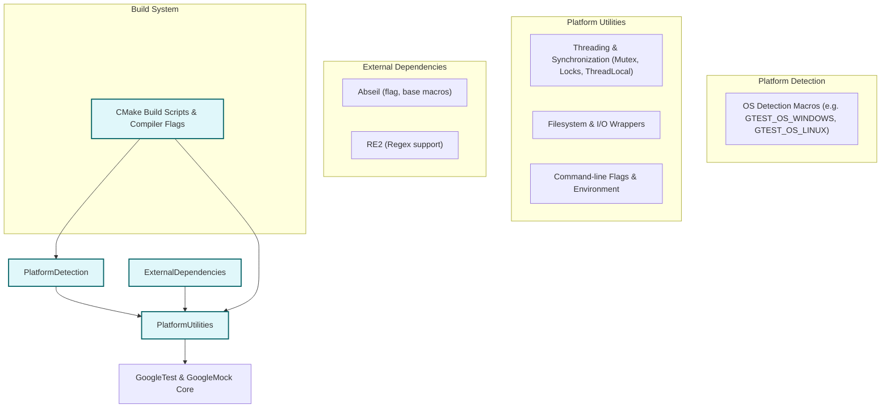

# Portability & Platform Integration

GoogleTest is built to be highly portable across a wide range of platforms and operating systems. This documentation explains the design choices and integration techniques that enable GoogleTest and GoogleMock to function seamlessly regardless of the underlying platform.

---

## Overview

Portability in GoogleTest addresses the need for a testing framework that works consistently across different operating systems, compiler settings, and build environments. It achieves this through abstraction of OS-specific features, conditional compilation, and integration with external dependencies such as Abseil.

GoogleTest detects and adapts to the host platform at compile-time, leveraging a set of macros to enable or disable features based on platform capabilities. This ensures that users do not need to worry about platform-specific details when writing tests.

This page focuses specifically on how GoogleTest handles portability and integrates platform-specific utilities, distinct from the overall system architecture or user-facing testing APIs.

---

## Platform Detection and OS Abstraction

At the core of GoogleTest's portability strategy is automatic platform detection. The framework defines a comprehensive list of macros that identify the operating system where it is being compiled. Examples include:

- `GTEST_OS_WINDOWS` and sub-macros such as `GTEST_OS_WINDOWS_DESKTOP`, `GTEST_OS_WINDOWS_MINGW`
- `GTEST_OS_LINUX` and `GTEST_OS_LINUX_ANDROID`
- `GTEST_OS_MAC` and `GTEST_OS_IOS`
- Other Unix and BSD variants like `GTEST_OS_FREEBSD`, `GTEST_OS_OPENBSD`, etc.

These macros are defined in the internal header <code>gtest-port-arch.h</code> and are used throughout the framework to conditionally include platform-specific implementations.

### Key Advantages

- Consistent feature support: GoogleTest compiles and works uniformly across major platforms.
- Conditional compilation prevents unsupported API calls on certain platforms.
- Enables clean layering to separate platform-neutral test code from platform-dependent utilities.

---

## Threading and Synchronization

Thread safety is a crucial aspect of any modern test framework. GoogleTest integrates platform-specific threading and synchronization primitives transparently:

- On Unix-like platforms with pthread support, GoogleTest uses native pthread mutexes, thread-local storage, and thread creation APIs.
- On Windows, synchronization uses native Windows critical sections and handles without requiring the full `<windows.h>` header.
- For platforms where threading is unavailable or disabled, a dummy implementation is used to ensure compilation but without actual thread safety.

Users can check thread-safety availability by querying the macro `GTEST_IS_THREADSAFE`. If threading support is enabled, GoogleTest internally manages mutexes and thread-local storage, allowing tests to run concurrently safely.

### Practical Implications

- Tests that require multi-threading can confidently run with full thread-safe support on supported platforms.
- Framework internals like death tests and output capturing rely on these abstractions.

---

## Filesystem and I/O Wrappers

GoogleTest abstracts filesystem access and file I/O to account for platform differences:

- File descriptors and file handling are adapted to Windows, POSIX, embedded platforms, and others.
- Functions such as `open`, `fopen`, `stat`, `rename`, and directory operations are wrapped to provide a uniform interface.
- Special handling exists for Windows to convert between UTF-8 and UTF-16 file paths transparently.

This approach simplifies test writing and internal features such as XML output generation, death test file management, and test artifacts handling.

---

## Environment and Command-line Flag Integration

GoogleTest supports command-line flags that control test execution behavior. The set of flags defined by GoogleTest and GoogleMock are integrated with the underlying platform's flag parsing mechanisms:

- When Abseil libraries are available, GoogleTest uses Abseil's `absl::Flag` for flag declaration, parsing, and querying.
- Without Abseil, GoogleTest falls back to its own mechanism using global variables.

GoogleMock similarly declares its own flags using macros like `GMOCK_DEFINE_bool_` and `GMOCK_DECLARE_string_`. The portable porting layer ensures these flags are declared and accessible consistently, regardless of platform or available dependencies.

Users writing custom test executables can invoke `InitGoogleTest` or `InitGoogleMock` to initialize flags parsing---these calls will handle the portable differences automatically.

---

## Build System and Compiler Integration

GoogleTest offers robust support for multiple popular build systems and compilers, easing cross-platform adoption:

- **CMake Integration:**
  - GoogleTest ships with CMake scripts that define compiler flags, detect platform features, and enforce minimum standards (for example, requiring C++17).
  - Compiler-specific compiler and linker flags are tweaked to address warnings, runtime library linkage, exception handling, and static vs. shared CRT usage.

- **Compiler Compatibility:**
  - The build logic adapts flags for MSVC, GCC, Clang, Intel LLVM, SunPro, VisualAge, and others.
  - Static and shared library builds are supported.
  - For MSVC, handling includes UTF-8 encoding settings and suppression of deprecation warnings.

- **Threading Policy:**
  - The build system detects pthread support and configures accordingly.

This flexible build integration means users can quickly incorporate GoogleTest into new or existing projects without manual platform-specific tweaks.

---

## Support for External Dependencies (Abseil and RE2)

Where available, GoogleTest leverages external libraries to enhance portability and capability:

- **Abseil Integration**
  - Provides feature-rich flag parsing and command-line environment utilities.
  - Macros and utilities such as `GMOCK_DEPRECATE_AND_INLINE` and flag declarations are backed by Abseil when present.

- **Regular Expressions**
  - On supported platforms, GoogleTest uses the RE2 library (often bundled with Abseil) for high-performance regex matching.
  - Otherwise, it falls back on POSIX regex or a simplified internal regex implementation.

This layered approach ensures that GoogleTest's platform utilities evolve alongside evolving dependencies while retaining backwards compatibility.

---

## Common Pitfalls & Troubleshooting

- **Flag Conflicts:** When embedding GoogleMock, ensure flags are initialized properly and avoid re-initialization to prevent duplicate flag errors.
- **Thread Support:** On platforms lacking pthreads or Windows API threading, multi-threaded tests might not work as expected.
- **Build Warnings:** Custom build environments should respect compiler flags adjustments for warnings and runtime linkage.
- **File I/O Issues:** File path encoding differences on Windows can cause issues—using GoogleTest's IO wrappers avoids this.

Users encountering portability-related issues should consult the build system integration guides and the common installation troubleshooting documentation.

---

## Visual Diagram: Portability Layer Overview

---

## Practical Tips for Users

- Link your tests with `gtest_main` or `gmock_main` to automatically use the provided main entry point, which properly initializes platform-specific flags and settings.
- If you manually initialize the framework, call `InitGoogleTest()` or `InitGoogleMock()` early in your main function to ensure portable flag parsing.
- Avoid assuming threading is always available; guard multi-threaded tests or synchronization code with checks against `GTEST_IS_THREADSAFE`.
- When building on Windows, verify that the CRT linkage flags and Unicode settings are properly configured to avoid runtime mismatches.
- Leverage the build scripts and CMake integration provided by GoogleTest to ensure consistent cross-platform builds.

---

## Summary

GoogleTest’s portability and platform integration design abstracts away the complexities of operating system differences, threading models, file I/O, and build environment variations. By providing well-tested macros, conditional compilation, and dependency modularity (like Abseil), it empowers developers to write and run tests reliably on any supported platform without manual adjustments.

For users, this means focusing on writing robust tests with confidence that GoogleTest manages environment-specific intricacies internally.

---

## Related Documentation & Resources

- [System Architecture Overview](/overview/architecture-and-concepts/system-architecture)
- [Supported Platforms & Integrations](/overview/introduction-and-value/supported-platforms-integrations)
- [Basic Configuration](/getting-started/initial-configuration-validation/basic-configuration)
- [Common Installation & Build Issues](/getting-started/troubleshooting-support/common-issues)
- [Portability & Platform Utilities API Reference](/api-reference/advanced-topics/portability-utilities)
- [GoogleMock Framework README](https://github.com/google/googletest/blob/main/googlemock/README.md)

---

## Next Steps

- Review the [Basic Configuration](https://github.com/google/googletest/tree/main/docs#getting-started) and [Installation Guides](https://github.com/google/googletest/tree/main/docs#getting-started-prerequisites-installation) for build setup.
- Consult the portability utilities API ([Portability & Platform Utilities](https://github.com/google/googletest/tree/main/docs/api-reference/advanced-topics/portability-utilities)) for advanced customization.
- Explore multi-platform continuous integration setups leveraging the portability of GoogleTest.

---

For detailed build configurations, threading models, and platform constraints, explore the source headers `gtest-port.h`, `gtest-port-arch.h`, and `gmock-port.h` available in the GoogleTest repository.

---

_Take advantage of GoogleTest’s powerful platform abstraction today and focus purely on your test code while the framework manages the rest._