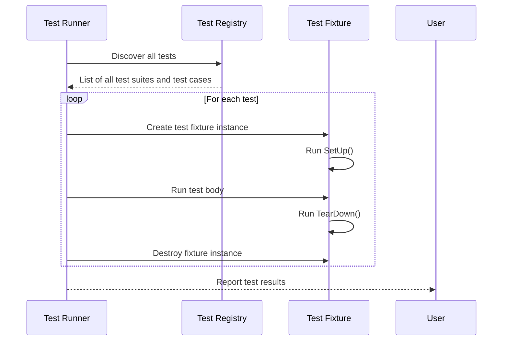
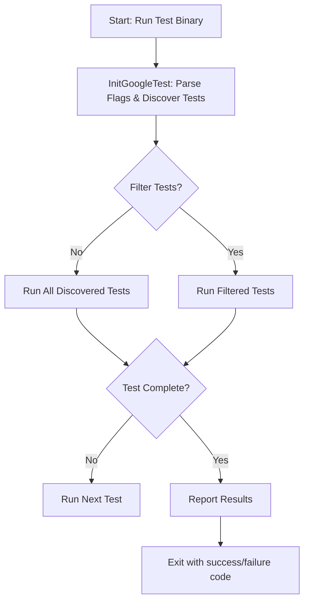

# Test Discovery and Execution Model

GoogleTest automates the process of discovering and running tests, enabling efficient and flexible execution of large test suites. This model supports parallel execution, filtering tests for selective runs, and managing test lifecycle to provide fast feedback and scalable test management.

---

## Automatic Test Discovery

GoogleTest discovers tests automatically by scanning for test suites and test cases defined through its macros such as `TEST()`, `TEST_F()`, and `TEST_P()`. This discovery occurs at runtime before the execution of tests begins.

- All registered tests are enumerated without needing explicit manual registration.
- Test suite and test names are collected and organized into an internal registry.
- This enables tools and test runners to query and list all available tests before running them.

> **User Benefit:** This frees you from managing a test inventory manually and allows running tests immediately after compilation.

---

## Test Execution Flow

Once the test discovery phase completes, GoogleTest executes tests in a controlled sequence:

1. Initialization via `testing::InitGoogleTest()` parses command-line flags and sets up the test environment.
2. Tests execute one by one unless parallelization is configured externally.
3. For each test:
   - A fresh test fixture instance is created if applicable.
   - Setup routines (`SetUp()`) run before the test body.
   - The test body runs.
   - Teardown routines (`TearDown()`) run after the test body using the same test fixture instance.
   - Test fixture instance is destroyed.
4. Results (pass/fail, failure messages, stack traces) are collected and reported.

> **Key Detail:** Each test is isolated with a dedicated fixture instance, ensuring test independence and repeatability.

### Test Lifecycle Diagram




---

## Parallel and Selective Test Execution

GoogleTest supports running tests selectively and in parallel, which is vital for large, complex projects:

- **Filtering Tests:**
  - Use command-line flags like `--gtest_filter` to run specific test suites or test cases.
  - Allows focusing on areas of interest or quick validation of particular functionality.

- **Parallel Runs:**
  - While GoogleTest itself does not manage parallel test execution internally, it is designed to work well with external parallelization tools and Continuous Integration systems.
  - Since tests are isolated and independent, multiple tests can be executed in parallel processes safely.

> **User Scenario:** Run only failing tests for quick feedback.

Example: Run all tests from `MySuite` except those named `FlakyTest`:

```bash
./my_test_binary --gtest_filter=MySuite.*-MySuite.FlakyTest
```

---

## Test Management and Configuration

GoogleTest provides additional utilities and flags to aid execution management:

- **Command-Line Flags:**
  - `--gtest_repeat` to rerun tests multiple times.
  - `--gtest_break_on_failure` for debugging by breaking when a failure occurs.
  - `--gtest_shuffle` to randomize test order for detecting inter-test dependencies.

- **Environment Setup:**
  - `SetUpTestCase()` and `TearDownTestCase()`/`SetUpTestSuite()` and `TearDownTestSuite()` for test suite-level lifecycle management.

- **Output & Reporting:**
  - Generates detailed, machine-parsable test output formats such as XML for CI tools.

> **Tip:** Parse the output logs and flags to integrate testing phases smoothly in your CI/CD pipelines.

---

## Troubleshooting Test Discovery and Execution

### Common Issues

- **Tests not discovered:**
  - Ensure tests are correctly defined with the `TEST` macros.
  - Make sure the test binary includes the relevant object files.

- **Tests not running:**
  - Check that `RUN_ALL_TESTS()` is called in your `main()`.
  - Confirm proper initialization with `testing::InitGoogleTest(&argc, argv)`.

- **Tests run but no output:**
  - Check verbosity flags.
  - Verify test names and filters.

### Best Practices

- Always return the value of `RUN_ALL_TESTS()` in your `main()`.
- Use `--gtest_list_tests` to verify test discovery.
- Use command-line filters to isolate problems.

---

## Visual Summary



---

## Conclusion

GoogleTest's Test Discovery and Execution Model ensures that tests are found automatically, executed in isolation for reliability, and can be managed flexibly through filtering and external parallelization support. These capabilities empower developers to maintain fast, scalable, and reliable test suites that fit seamlessly into diverse development workflows.

---

## References and Further Reading

- [GoogleTest Primer (Writing Tests)](primer.md)
- [Mocking with GoogleMock Guide](guides/advanced-testing/mocking-with-googlemock)
- [Test Structure and Execution API Reference](api-reference/core-testing-api/test-structure)
- [Configuration Basics Guide](getting_started/essentials_setup/configuration_basics)
- [Managing Large Test Suites](guides/practical-integrations/managing-large-test-suites)

For more information on test filtering and command-line options, refer to the [GoogleTest Flags and Options](api-reference/core-testing-api/test-configuration) documentation.

---

*This completes your understanding of how GoogleTest orchestrates the lifecycle of tests from discovery through execution and final reporting.*