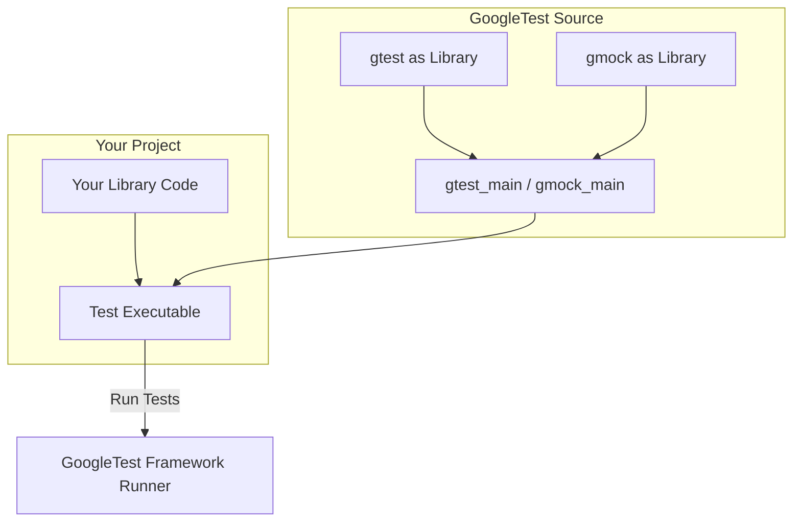

# Integration Patterns and Build Systems

Integrating GoogleTest and GoogleMock effectively into your C++ projects involves understanding the interplay between the testing framework, your build system, and your project's structure. This guide walks you through recommended integration patterns, best practices for build system configuration, and dependency management tailored for common build tools such as CMake and Bazel, as well as considerations for custom build systems.

---

## Overview of Integration Goals

When integrating GoogleTest and GoogleMock, your primary goals are:

- Seamless compilation and linking within your project environment.
- Reliable dependency management to avoid conflicts or duplications.
- Ease of test discovery and execution.
- Maintainability and scalability as your test suite grows.

This guide targets these goals from the user perspective, focusing on practical approaches to get the testing framework working smoothly in your development workflow.

---

## Supported Build Systems

GoogleTest and GoogleMock officially support the following build systems out-of-the-box:

- **CMake**: Recommended for most projects due to its wide adoption, expressive capabilities, and integration ease.
- **Bazel**: Used mainly in large-scale or Google-internal projects, offering fast builds and advanced dependency management.

For custom or other build systems, you will need to adapt these recommendations accordingly.

---

## Integration with CMake

### Downloading and Adding Sources

GoogleTest and GoogleMock can be used as an incorporated part of your project or as external dependencies.

- **Option 1: Add as a Submodule or Vendor in Your Repository**

  - Clone or add GoogleTest source code under your source tree.
  - Add `add_subdirectory(googletest)` in your `CMakeLists.txt`.

- **Option 2: Use ExternalProject or FetchContent**

  - Use `FetchContent` or `ExternalProject` modules in CMake to download GoogleTest during the build process.

### Build and Link Targets

GoogleTest provides the following targets after adding as a subdirectory:

- `gtest` - the core library without main entry point
- `gtest_main` - library that includes `gtest` and a main() function
- `gmock` - the GoogleMock library
- `gmock_main` - GoogleMock with a main() function

You typically want to link your test executables against `gtest_main` or `gmock_main` to use the default main provided by the framework.

### Sample CMakeLists.txt for a Test Executable

```cmake
cmake_minimum_required(VERSION 3.10)
project(MyProjectTests)

# Add googletest subdirectory (assumes it is part of your repo)
add_subdirectory(googletest)

# Add your library
add_library(myproject_lib src/my_code.cpp)

enable_testing()

# Add the test executable
add_executable(myproject_tests tests/my_tests.cpp)

# Link against GoogleTest and your library
target_link_libraries(myproject_tests
  PRIVATE
    myproject_lib
    gtest_main
    gmock
)

# Register the test
include(GoogleTest)
gtest_discover_tests(myproject_tests)
```

### Best Practices

- **Link to `gmock_main` only if you use GoogleMock**
- **Avoid linking multiple test executables to the main function libraries**; each executable should have only one main.
- **Use `gtest_discover_tests` to register tests automatically**.
- Keep GoogleTest and GoogleMock updated to leverage the latest bug fixes and features.

### Common Pitfalls

- Forgetting to enable testing with `enable_testing()`.
- Linking test executables without `gtest_main` or `gmock_main` leading to undefined main errors.
- Multiple versions of GoogleTest or GoogleMock in submodules causing link conflicts.

---

## Integration with Bazel

### Workspace Setup

- Add the official GoogleTest and GoogleMock repositories as external dependencies in your `WORKSPACE` file.
- Define `http_archive` or similar rules to fetch the source.

### Build Targets

- Use `cc_test` rules to define test targets.
- Link the Bazel test targets against the appropriate `:gtest` and `:gmock` targets.

### Example `BUILD` File

```starlark
cc_library(
    name = "my_project",
    srcs = ["my_code.cc"],
    hdrs = ["my_code.h"],
    visibility = ["//visibility:public"],
)

cc_test(
    name = "my_project_tests",
    srcs = ["my_tests.cc"],
    deps = [
        ":my_project",
        "@com_google_googletest//:gmock",
        "@com_google_googletest//:gtest_main",
    ],
)
```

### Best Practices

- Use Bazel's sandboxing features to isolate test execution.
- Keep your dependencies declarative for easier reproducibility.

---

## Custom and Other Build Systems

For other build systems, such as Makefiles or other proprietary systems, the recommended approach is:

1. Include the GoogleTest and GoogleMock source tree in your project.
2. Compile GoogleTest and GoogleMock source files to build static libraries.
3. Link your test executables against these static libraries.

Ensure consistent compiler flags and C++ standard settings across your project and the testing framework.

---

## Dependency Management

GoogleTest depends on Abseil library components internally, which are now included as dependencies within GoogleTest’s source tree. When using CMake or Bazel, these dependencies are automatically handled.

- When integrating manually, ensure the appropriate Abseil components are included and compiled.
- Avoid mixing different versions of Abseil or GoogleTest to prevent ABI conflicts.

---

## Organizing Tests for Maintainability

### Directory Structure

- Keep test code separate from production code.
- Group related tests by feature or module.

### Test Suites and Naming

- Use clear and consistent test suite and test naming conventions.
- Utilize parameterized tests for broader coverage with less code duplication.

### Continuous Integration

- Integrate test execution in your CI workflows.
- Use test filtering, sharding, and parallel test execution for efficiency.

---

## Troubleshooting Common Integration Issues

- **Linker Errors**: Ensure correct linkage to `gtest_main`, `gmock_main`, and your libraries.
- **Test Discovery Failures**: Use CMake’s `gtest_discover_tests()` or explicitly register tests.
- **Conflicting Versions**: Clean your build and ensure only one GoogleTest/GoogleMock version is included.
- **Compiler Compatibility**: Verify your compiler supports C++11 (minimum) and that standard flags match.

Refer to the [Troubleshooting Common Setup Issues](/getting-started/first-test-run/troubleshooting-setup) guide for detailed diagnostics.

---

## Summary

Integrating GoogleTest and GoogleMock requires attention to your build system, dependency management, and test organization. CMake and Bazel are the most supported systems, with clear conventions and built-in support. For custom builds, manual handling of the source and linkage is necessary. Proper organization and CI integration ensure maintainable and efficient testing over time.

---

## Additional Resources

- [GoogleTest Architecture Overview](/overview/architecture-and-concepts/product-architecture)
- [Integration & Dependencies](/overview/architecture-and-concepts/integration-and-dependencies)
- [Setup Essentials with CMake](/getting-started/setup-basics/configuration-setup)
- [GoogleMock README](https://github.com/google/googletest/blob/main/googlemock/README.md)
- [gMock for Dummies](https://github.com/google/googletest/blob/main/docs/gmock_for_dummies.md)
- [GoogleTest & GoogleMock Build Troubleshooting](/getting-started/first-test-run/troubleshooting-setup)

---

## Example Diagram: Simplified CMake Integration Flow



Highlighting the linkage between your library, testing binaries, GoogleTest libraries, and test runner.
