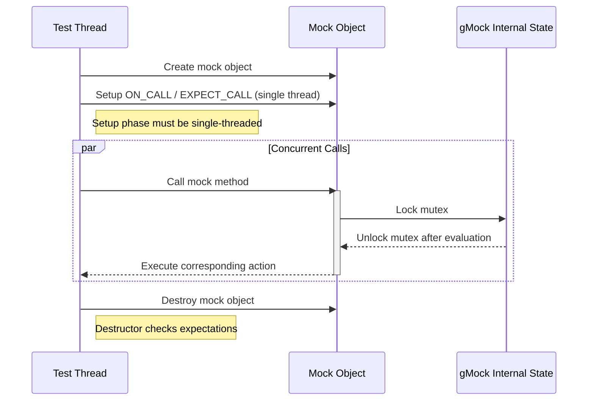

# Performance, Scalability, and Large-Scale Usage

This guide helps you gain insight into performance considerations, practical strategies for scaling Google Mock test suites, and patterns for efficient execution — including parallelization, filtering, and test grouping in large projects.

---

## Understanding Performance Considerations in Google Mock

When working with extensive C++ codebases, efficient testing is paramount. Google Mock (gMock) is designed to be robust and expressive for mocking C++ interfaces, but as your suite grows, performance and scalability become critical.

### Key Performance Goals

- **Fast test execution:** Minimize overhead during mock creation, expectations setup, and method call dispatch.
- **Low test fragility:** Avoid brittle tests that frequently fail, keeping maintenance manageable.
- **Concurrent safety:** Support running many mocks across multiple threads safely.

The following sections distill best practices and mechanisms Google Mock provides to meet these goals.

---

## Scaling Your Mock-Based Tests

### Efficient Mock Class Definitions

- Use the new generic `MOCK_METHOD` macro instead of legacy `MOCK_METHODn` macros. This reduces boilerplate and compile-time overhead.
- Declare mock methods only in the `public:` section for simplicity and access by mock frameworks.
- Move mock class constructors and destructors into `.cc` files to accelerate compile times for large projects by reducing template code instantiation.

### Managing Expectations and Default Behaviors

- Prefer `ON_CALL` to set common behaviors without expectations to reduce overly strict test specifications and minimize spikes in test failures due to implementation changes.
- Use `EXPECT_CALL` only for interactions you truly intend to verify.
- To handle recurring but non-critical calls, combine a catch-all `EXPECT_CALL(...).Times(AnyNumber())` with more specific expectations listed later. Remember, the newest expectation takes precedence.
- Avoid excessive cardinalities and actions in expectations to balance between coverage and maintainability.

### Controlling Call Ordering and Sequences

- Use `Sequence` or `InSequence` blocks to enforce call order when necessary, making interdependent mocks reliable and explicit.
- Leverage partial ordering with `.After()` and multiple `Sequence` objects for complex interaction patterns without over-constraining tests.

### Using NiceMock, NaggyMock, and StrictMock for Test Strictness

- Start with `NiceMock` for suppressing warnings on uninteresting calls, reducing noisy output while catching real issues.
- Use `NaggyMock` (default) or `StrictMock` to increase vigilance as needed.
- Applying the correct strictness level across your test suite keeps tests informative, focused, and faster to diagnose.

---

## Patterns for Efficient Execution of Large Test Suites

### Parallelizing Mock Usage

Google Mock supports safe use of mocks across multiple threads with the following guidelines:

- Do all test **setup** (mock object creation, defining `ON_CALL` and `EXPECT_CALL`) in a single thread.
- Execute the actual **calls to the mock objects’ methods** concurrently from multiple threads—gMock internally serializes and safely manages state.
- Mock objects must not have expectations or default actions changed concurrently with method invocation.
- Your mock actions must be thread-safe if they share any state, especially when invoked simultaneously in different threads.

Refer to the `gmock_stress_test.cc` for example tests demonstrating concurrency safety.

### Filtering and Grouping Tests

- Use GoogleTest's and GoogleMock's test filtering capabilities to run only relevant subsets at a time. This reduces overall test runtime.
- When running large suites, group related tests by their purposes or dependencies to isolate performance bottlenecks.

### Reducing Overhead in Mock Calls

- Avoid overly complex or expensive custom matcher and action implementations. Keep matchers pure and side-effect free.
- Use built-in actions and matchers wherever possible for optimized performance.

---

## Common Pitfalls in Large-Scale Use and Troubleshooting

### Common Issues

- **Test flakiness due to over-constrained call sequences:** Avoid unnecessary ordering constraints that cause fragile test failures.
- **Unintended side effects in matchers or actions:** Matchers must be pure functions without side effects to ensure determinism.
- **Improper thread synchronization:** While gMock guarantees thread safety internally, your actions and the code under test must honor thread-safety principles.
- **Memory leaks of mock objects:** Always let mock objects destruct or explicitly allow leak if intended (via `Mock::AllowLeak`) to ensure expectations are verified.

### Troubleshooting Tips

- Run tests with `--gmock_verbose=info` to get detailed tracing for call matching and expectation evaluation.
- Use `InSequence` to isolate ordering problems in complex interaction scenarios.
- Verify that all `EXPECT_CALL` statements are set before the corresponding calls happen.
- Enable heap checking during test runs for dynamically allocated mocks to detect lifetime issues.

---

## Summary of Best Practices for Large-Scale gMock Usage

| Aspect                      | Recommendation                                                   |
|-----------------------------|-----------------------------------------------------------------|
| Mock Class Definition        | Use `MOCK_METHOD` macro; move ctor/dtor to .cc for better compile times |
| Expectations Setup           | Use `ON_CALL` for default behaviors; reserve `EXPECT_CALL` for actual verification |
| Call Ordering               | Use `InSequence` and `Sequence` for order enforcement selectively |
| Strictness Levels           | Default to `NiceMock`; escalate to `NaggyMock` or `StrictMock` as needed |
| Multithreading              | Initialize mocks in one thread; invoke in multiple threads; ensure actions are thread-safe |
| Performance Optimization    | Prefer built-in matchers/actions; use filtering and grouping; keep matchers pure |

---

## Additional Resources

- [gMock for Dummies](https://google.github.io/googletest/gmock_for_dummies.html) — Learn mocking basics and idiomatic usage.
- [Mocking Reference](https://github.com/google/googletest/blob/main/docs/reference/mocking.md) — Full reference for macros, classes, state management.
- [gMock Cookbook](https://google.github.io/googletest/gmock_cook_book.html) — Recipes for advanced mocking scenarios.
- [gmock_stress_test.cc](https://github.com/google/googletest/blob/main/googlemock/test/gmock_stress_test.cc) — Demonstrates multi-thread usage of mocks.
- GoogleTest documentation on [test discovery and parallel execution](https://github.com/google/googletest/blob/main/docs/concepts/core-architecture/test-discovery-execution.md).

---

## Diagram: Typical Mock Invocation Flow in Multi-Threaded Context

---

## Troubleshooting Section

### Problem: Unexpected or Uninteresting Call Warnings

- Cause: Calls to mock methods without matching `EXPECT_CALL` or with arguments not matching any expectation.
- Solution: Add relevant `EXPECT_CALL`s or use `NiceMock` to suppress warnings if calls are expected but not enforced.

### Problem: Test Fails Due to Over-Specified Cardinalities or Ordering

- Cause: Expectations too strict or ordering not matching real usage.
- Solution: Relax `Times()` cardinalities; use partial ordering (`After`, multiple sequences); retire expectations via `.RetiresOnSaturation()` when appropriate.

### Problem: Test Failures When Running Multi-Threaded

- Cause: Violations of gMock rules (setup in multiple threads) or non-thread-safe actions.
- Solution: Initialize and set expectations in one thread only. Make actions thread-safe. Use synchronization primitives if needed in test code.

### Problem: Slow Compilation of Large Mock Classes

- Cause: Mock methods defined inline with `MOCK_METHOD` generating large template expansions in every compile unit.
- Solution: Declare mock class constructor and destructor in headers and define in `.cc` files to reduce redundant compile overhead.

---

For full mastery of performance and scalability in gMock-driven testing, combine these concepts with good test hygiene, modular test design, and leveraging GoogleTest's filtering and parallel run capabilities.
