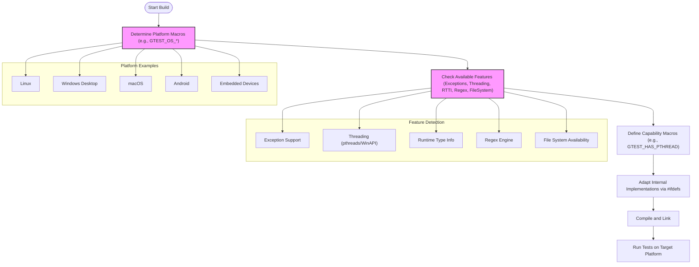

# Portability, Platform Support, and Feature Detection

GoogleTest and GoogleMock are built to be robust testing frameworks that work seamlessly across a wide variety of platforms, compilers, and operating environments. This documentation explains the strategies, abstractions, and mechanisms the frameworks use to detect platform capabilities, support diverse operating systems, and conditionally enable features to maintain cross-platform compatibility.

---

## Understanding Platform Independence

At their core, GoogleTest and GoogleMock rely on a carefully designed portability layer that abstracts away the differences between operating systems and compilers. This ensures that tests written for one platform run identically on others.

The portability infrastructure continuously detects features such as threading support, exception handling, runtime type information (RTTI), and available system libraries at compile time. These checks allow the framework to adapt dynamically and avoid runtime failures on unsupported platforms.


## Platform Detection Mechanisms

The framework employs predefined macros to identify the target platform during compilation. Supported platforms include desktop and mobile operating systems such as:

- Linux (including Android)
- Windows (Desktop, Mobile, Store Apps, Phone)
- macOS and iOS
- FreeBSD, OpenBSD, NetBSD
- Solaris, AIX, HP-UX
- Embedded and specialized systems like ESP32, Xtensa, QNX

Based on these checks, GoogleTest defines macros like `GTEST_OS_LINUX`, `GTEST_OS_WINDOWS_DESKTOP`, `GTEST_OS_MAC`, and others, which guide platform-specific implementations internally.

### Example of Platform Macro Usage

```cpp
#ifdef GTEST_OS_WINDOWS_DESKTOP
  // Windows-specific code here
#elif defined(GTEST_OS_LINUX)
  // Linux-specific code here
#endif
```

This approach enables conditional compilation of platform-specific features and system calls.


## Feature Detection and Conditional Support

Beyond platform detection, the framework identifies support for key features:

- **Exception Handling (`GTEST_HAS_EXCEPTIONS`)**: Detects if compiler exceptions are enabled, allowing the framework to switch modes for environments lacking exception support.

- **Threading Support (`GTEST_HAS_PTHREAD`, `GTEST_IS_THREADSAFE`)**: Checks for the availability of pthreads or native threading capabilities to provide synchronization primitives and thread safety in GoogleTest.

- **RTTI (`GTEST_HAS_RTTI`)**: Determines if runtime type information is available, which affects certain test internals like typed tests.

- **Unicode and Wide String (`GTEST_HAS_STD_WSTRING`)**: Verifies support for wide string types across different standard libraries.

- **Regular Expression Support**: Chooses the regex implementation to use—RE2 library, POSIX regex, or a simple built-in engine—based on environment availability.

- **Stream Redirection (`GTEST_HAS_STREAM_REDIRECTION`)**: Determines if stdout or stderr can be redirected programmatically, a requirement for some test features like death tests.

- **File System Access (`GTEST_HAS_FILE_SYSTEM`)**: Checks if file system APIs are available for operations dependent on file I/O.

### Impact of Feature Detection

GoogleTest adapts its behavior based on these environment properties, enabling or disabling features:

- Tests requiring death tests are enabled only on platforms with file system access and proper permissions.

- Thread-safe execution paths and synchronization are activated when native thread support is detected.

- Built-in or external regex engines are selected automatically for test name filtering and other regex needs.


## Key Portability Utilities

GoogleTest includes many low-level utilities that abstract platform inconsistencies:

- **File and Directory Operations:** Cross-platform wrappers for file descriptors, directory removal, and status.
- **Synchronized Primitives:** Mutexes, locks, and thread-local storage that work with Windows critical sections or pthread mutexes.
- **Character Type Utilities:** Uniform handling of character classifications and transformations such as `IsAlpha()`, `ToUpper()`, accounting for signed/unsigned char differences.
- **Error Handling and Logging:** Unified error messages, formatted output, and logging across various compilers and platforms.


## Compiler and Language Version Requirements

GoogleTest mandates C++17 as the minimum standard to leverage modern language features securely and uniformly.

Certain compilers require explicit flags or versions (e.g., Visual C++ 2015 or higher) for successful builds.

## Customization Points and Flags

Users can influence portability and platform-specific behavior using predefined flags. These include flags to enable or disable threading support, exceptions, and other environment-dependent features.

GoogleMock introduces its own abstractions atop GoogleTest's portability layer, with additional feature gating.


## Best Practices for Ensuring Portability

- **Check platform-specific macros when writing custom tests or extensions** to handle edge cases.
- **Avoid reliance on exceptions and RTTI** if targeting embedded or minimal environments.
- **Use GoogleTest threading utilities** instead of direct pthread or Windows threading APIs to maintain test portability.
- **Run tests on target platforms early** to verify configuration and feature detection.


## Common Pitfalls and Troubleshooting

- **Build errors on unsupported compilers or platforms** often stem from unmet minimum compiler version or C++17 requirements.
- **Unexpected absence of threading support** can cause flaky tests; verify `GTEST_HAS_PTHREAD` or equivalent macro.
- **Death tests disabled silently on unsupported platforms**; verify `GTEST_HAS_DEATH_TEST` macro if using death tests.
- **Localization or character encoding issues** might arise if `GTEST_HAS_STD_WSTRING` is disabled.

For issue resolution, consult the Setup Essentials and Troubleshooting docs alongside platform detection macros.


## Summary Diagram of Portability Detection Flow




## Additional Resources

- [Supported Platforms Summary](docs/platforms.md) provides an up-to-date list of officially supported platforms and compiler versions.
- [GoogleTest Architecture Overview](overview/architecture-and-concepts/product-architecture.md) for understanding how portability fits into core design.
- [Setup Essentials and Installation Guides](getting-started/setup-basics/) to prepare your environment correctly.
- [Mocking and Integration Guides](overview/architecture-and-concepts/integration-and-dependencies.md) for extended platform and build system integration.

---

**This page focuses exclusively on GoogleTest and GoogleMock's portability, platform recognition, and feature gating strategies to ensure a dependable testing experience across environments.**
