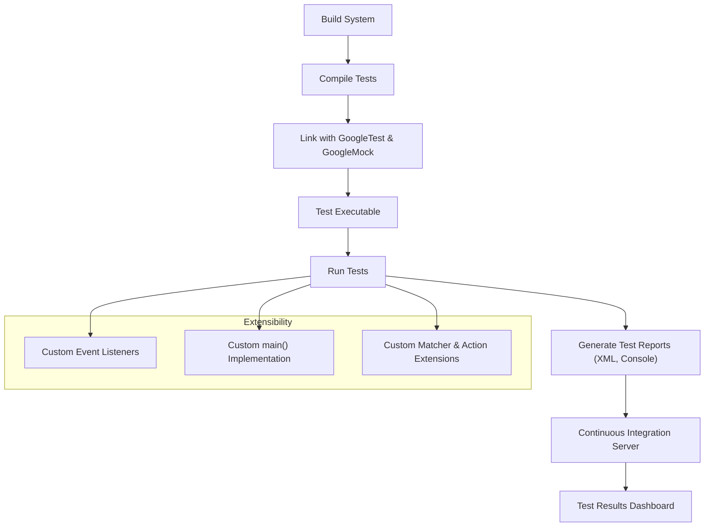

# Integration Patterns & Extensibility

GoogleTest and GoogleMock are designed to fit seamlessly into a wide range of development and testing environments. This page guides you through the integration patterns, extensibility hooks, and customization points that enable these frameworks to connect with your build systems, CI pipelines, and test runners.

---

## Integration with Build Systems

GoogleTest and GoogleMock can be integrated with various build systems, including CMake, Bazel, and others. Integration enables automated test compilation, linking, and execution as part of your overall build pipeline.

### Build System Integration Patterns

- **Standalone Build**: Compile and link GoogleTest as a standalone library that your tests depend on.
- **Subdirectory Embedding**: Embed GoogleTest directly into your project's source tree, allowing tighter control and easier modifications.
- **FetchContent / External Dependencies**: Use CMake's FetchContent or equivalent mechanisms to dynamically download and build GoogleTest during your build.

### Practical Tips for Build Integration

- Always ensure that your test targets link against both GoogleTest and GoogleMock libraries.
- If mocking is used, link your tests against GoogleMock to get access to mocking API macros and behavior.
- Use target properties and interface libraries when working with modern CMake to propagate include directories and compiler flags to your test targets.

<Callout>
Note: For detailed step-by-step instructions, see the [Integration with Build Systems](https://github.com/google/googletest/tree/main/docs/quickstart_integration.md) documentation.
</Callout>

---

## Continuous Integration (CI) & Test Runner Compatibility

Integrating GoogleTest and GoogleMock into CI workflows ensures automated verification of code correctness on every commit or pull request.

### CI Integration Workflow

1. **Test Compilation**: Automated build scripts compile tests with GoogleTest and GoogleMock linked.
2. **Test Execution**: Use command-line test runners provided by GoogleTest (`*_test` executables) or integrate with CI test runners (Jenkins, GitLab CI, GitHub Actions). GoogleTest supports JUnit/XML outputs compatible with many CI servers.
3. **Result Reporting**: GoogleTest can export results in XML format which CI servers consume for reporting and metrics.

### Test Runner Integration

- GoogleTest executables can be run standalone, or invoked by external tools.
- Enable verbose flags or filter tests via command line options (`--gtest_filter`, `--gmock_verbose`) to control output.
- Integrate with IDEs and test runners using GoogleTest adapters or plugins.

---

## Extensibility Hooks

GoogleTest and GoogleMock offer extensibility points to tailor the framework or hook into the test lifecycle.

### Event Listener API

The Event Listener API enables custom code to respond to events in the test execution lifecycle such as test start, test end, or assertion results.

- Implement classes derived from `::testing::TestEventListener`.
- Register listeners via `::testing::UnitTest::AddTestEventListener()`.
- Use listeners to collect metrics, synchronize test runs, or enhance logging.

### Custom Main Function

While GoogleTest provides a standard `main()` function, you can write your own:

- To control initialization order or customize command-line parsing.
- To integrate with platform-specific threading or logging.

Example:

```cpp
int main(int argc, char** argv) {
  ::testing::InitGoogleTest(&argc, argv);
  // Add custom initialization or listeners here.
  return RUN_ALL_TESTS();
}
```

### Custom Assertion and Matcher Extensions

- Define new matchers using macros like `MATCHER`, `MATCHER_P`, or by implementing matcher interfaces.
- Extend actions by creating custom action functors or using the ACTION family of macros.
- This enables testing code for domain-specific behaviors and validation.

### Mock Object Strictness Modes

Choose from strictness modes like `NiceMock`, `NaggyMock`, and `StrictMock` to control the test feedback noise and rigor on uninteresting/missing expectations.

---

## Real-World Integration Example

Imagine a CI pipeline that clones your repo, runs CMake to configure the build including GoogleTest and GoogleMock, compiles tests, and then runs them:

1. Configure GoogleTest as a subdirectory in your project.
2. Link test targets against `gtest` and `gmock` libraries.
3. Execute all tests using the built-in test runner binary.
4. Export test results to XML.
5. Upload results to CI server dashboard.

This integration flow ensures consistent, automated validation that scales with your project.

---

## Troubleshooting Integration Issues

- **Missing Symbols at Link Time**: Ensure both GoogleTest and GoogleMock libraries are linked.
- **Unexpected Runtime Failures**: Verify proper initialization with `InitGoogleTest` and that `RUN_ALL_TESTS` is invoked.
- **Test Discovery Issues**: Confirm test registration and naming conventions.
- **Uninteresting Call Warnings**: Use `NiceMock` or explicit expectations to reduce noise.

Refer to [Common Installation & Configuration Issues](../getting-started/setup-troubleshooting/common-issues.md) for detailed guidance.

---

## Summary

This page clarified how GoogleTest and GoogleMock integrate with external build systems, CI workflows, and various test runners. It covered key extensibility hooks such as custom listeners and main functions to adapt GoogleTest for complex or specialized environments.

---

## References

- [GoogleTest & GoogleMock Integration with Build Systems](../overview/quickstart-integration/integration-options.md)
- [CI/CD and Project Integration Guide](../guides/advanced-and-integrations/test-integration-workflows.md)
- [Framework Initialization and Main Entrypoints](../api-reference/platform-configuration/framework-initialization.md)
- [Event Listener API](../api-reference/core-apis/test-assertions.md#test-event-listener)
- [Mock Object Strictness Modes](../guides/advanced-and-integrations/mock-object-strictness.md)
- [Common Installation & Configuration Issues](../getting-started/setup-troubleshooting/common-issues.md)

---

## Diagram: Integration Flow



This diagram illustrates the typical test integration pattern from build to CI dashboard with extensibility points emphasized.
