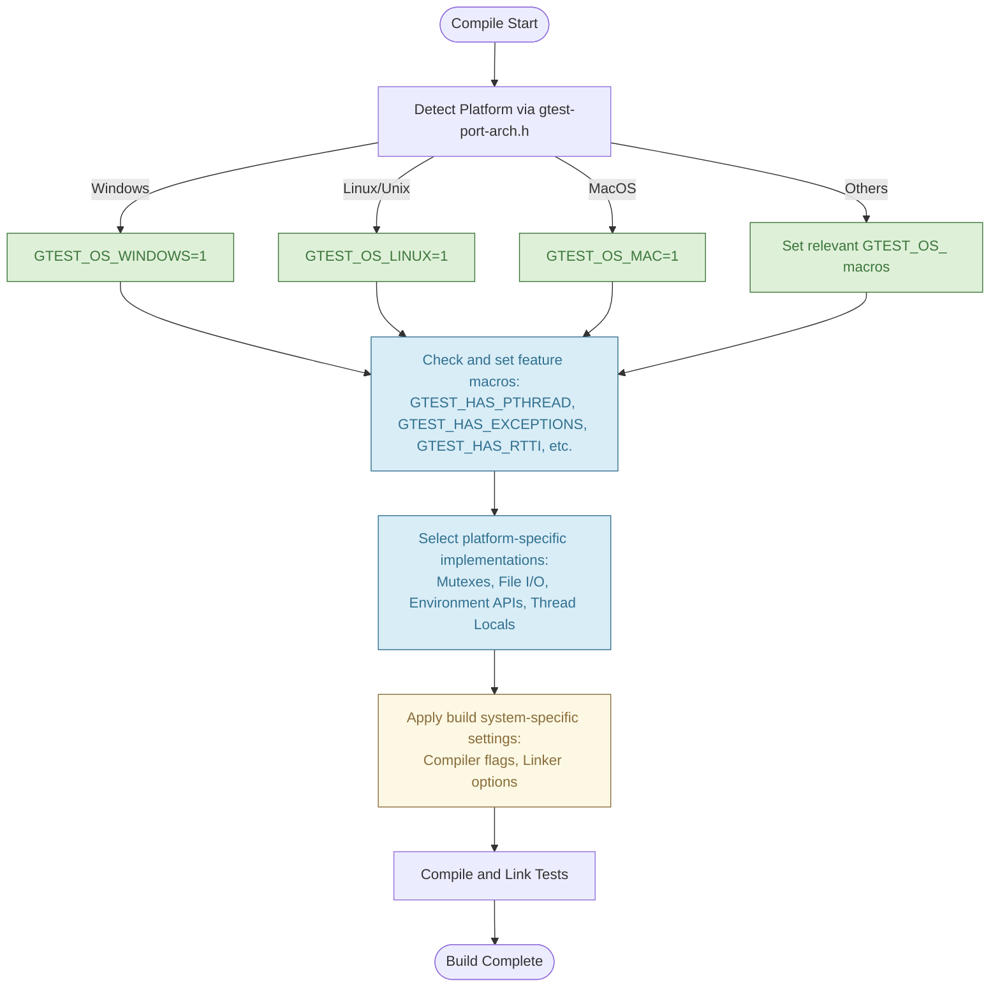

# Portability & Platform Abstraction

GoogleTest and GoogleMock stand out as highly portable C++ testing frameworks, designed to seamlessly operate across a diverse range of compilers, operating systems, and environments. This page unpacks the core strategies and mechanisms enabling such portability, focusing on platform abstraction layers, conditional compilation, and platform detection techniques that ensure consistent behavior regardless of the underlying platform.

---

## Why Portability Matters

Imagine you're developing software that must run on Linux, Windows, macOS, and embedded devices. Writing tests that work consistently across these platforms without manual tweaking or breakage is crucial for reliable, maintainable projects. GoogleTest and GoogleMock deliver this capability through a carefully crafted abstraction that isolates platform-specific differences.

This abstraction empowers developers to write tests once and trust their execution everywhere, dramatically reducing configuration overhead and environment-specific bugs.

## Core Mechanisms of Portability

### 1. Platform Detection

GoogleTest implements sophisticated compile-time detection of the build target platform to adjust its behavior dynamically. This process relies on a set of well-defined macros indicating the operating system and compiler environment.

- These macros (e.g., `GTEST_OS_LINUX`, `GTEST_OS_WINDOWS`, `GTEST_OS_MAC`) are automatically set based on compiler-provided definitions or build system inputs.
- Detection is centralized in include headers such as `gtest-port-arch.h`, which serves as the source of truth for platform-specific conditions.

<Info>
The platform detection macros are always defined to either 1 (platform detected) or left undefined, never set to 0. This design allows users to use conditional compilation effectively with `#if` checks.
</Info>

### 2. Conditional Compilation and Feature Flags

Once the platform is identified, GoogleTest leverages conditional compilation to enable or disable features, or provide alternate implementations where necessary.

- Feature availability macros like `GTEST_HAS_PTHREAD`, `GTEST_HAS_EXCEPTIONS`, or `GTEST_HAS_RTTI` indicate specific capability support on the platform.
- If certain features are unsupported, GoogleTest provides fallback implementations, such as dummy synchronization primitives on non-threadsafe systems.
- Users can override these feature macros manually if auto-detection is insufficient.

### 3. Platform Abstraction Layers

To unify APIs that differ across platforms, GoogleTest implements internal wrappers and utility functions within its internal namespaces, such as the `posix` namespace.

- Functions like file operations, environment variable access, and stream handling are wrapped with platform-specific versions.
- For example, `posix::FOpen` has different definitions for Windows and POSIX systems.
- Synchronization primitives (mutexes, locks, thread locals) abstract platform threading APIs — notably using Windows critical sections or pthread mutexes as appropriate.

### 4. Build System Support for Platform Differences

Build files like Bazel's `BUILD.bazel` integrate conditional configuration based on detected platforms (e.g., `windows`, `qnx`, `freebsd`). Compiler options, compiler/linker flags, and dependencies are adjusted accordingly.

- This integration prevents platform-specific build failures.
- For instance, pthread flags are linked on platforms that support pthreads, while Windows exports symbols differently.

### 5. Integration with External Libraries

GoogleTest can optionally leverage third-party libraries like Abseil (Absl) and RE2 for enhanced portability and functionality.

- When Absl is enabled, thread-safe flags and regex implementations switch accordingly.
- Compile-time macros signal Absl presence, influencing internal code paths.

## Practical Example: Using GoogleTest on Multiple Platforms

Suppose your project builds on Windows and Linux. GoogleTest will detect the platform via its `gtest-port-arch.h` header, setting `GTEST_OS_WINDOWS` or `GTEST_OS_LINUX` macros. Behind the scenes:

- On Windows, synchronization uses Windows critical sections and the build system ensures Windows-specific link options.
- On Linux, pthreads are used for threading constructs, and `-pthread` is linked automatically.

Your test code stays identical, relying on GoogleTest’s abstraction layers to resolve all platform differences.

## How Users Can Leverage and Customize Portability

- **Manual Macro Overrides**: Users can manually define or undefine feature or platform macros via compiler flags to fix detection issues in custom or unusual environments.

- **Flag to Enable/Disable Thread Safety**: If your platform misdetects pthread availability, defining `-DGTEST_HAS_PTHREAD=0` or `1` assists behavior tuning.

- **Shared vs. Static Library Configuration**: Shared library builds require specific compiler flags (`-DGTEST_CREATE_SHARED_LIBRARY`) and linker settings; GoogleTest documents this clearly for multi-platform consistency.

- **Custom Platform Support**: Advanced users can extend platform detection and abstraction layers in `custom/gtest-port.h` to support new environments.

## Common Pitfalls and Troubleshooting

<Warning>
- If GoogleTest incorrectly detects platform features, causing compilation errors or runtime failures, verify macro definitions.
- Lack of pthread linkage on POSIX-based systems results in linker errors; ensure your build system passes proper flags.
- When building on Windows, mismatched runtime library linkage may cause linker conflicts — use the recommended CMake `gtest_force_shared_crt` option or equivalent.
- Custom embedded or mobile platforms may require manual configuration of feature macros.
</Warning>

## Diagram: Platform Detection and Abstraction Flow

## Further Reading

- [Supported Platforms](../../docs/platforms.md) — Complete list of officially supported platforms and compilers.
- [Portability and Configuration APIs](/api-reference/platform-configuration/portability-configuration) — In-depth API details for customizing platform-specific behavior.
- [Framework Initialization and Main Entrypoints](/api-reference/platform-configuration/framework-initialization) — How platform differences affect initialization.
- [GoogleTest BUILD.bazel](../../BUILD.bazel) — Example of build configurations handling platform differences.

---

By understanding these foundational portability and abstraction layers, you can confidently use GoogleTest and GoogleMock across an array of environments, ensuring your test suite runs reliably wherever your C++ code does.
