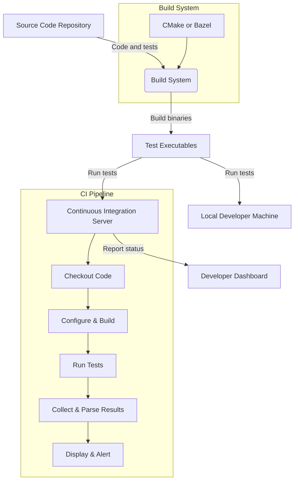

# Integration with Build and CI Systems

This page guides you through the core concepts and best practices for integrating GoogleTest within modern build systems like CMake and Bazel, as well as continuous integration (CI) workflows. By understanding these integration models, you can effectively include your tests as part of automated development pipelines that build, verify, and deliver high-quality C++ code.

---

## Why Integrate GoogleTest with Build and CI Systems?

GoogleTest is a powerful C++ testing and mocking framework, but its value is fully realized when seamlessly integrated into your project’s build process and automated testing infrastructure. Integration enables:

- **Automatic Test Discovery:** Ensures all tests are found and executed without manual listing.
- **Consistent and Repeatable Test Runs:** Runs tests with expected configurations every build.
- **Continuous Verification:** Quickly detects regressions via CI pipelines, enabling rapid feedback.
- **Rich Reporting:** Provides detailed test results to developers, enhancing diagnostics.
- **Scalability:** Supports large codebases with parallel and incremental testing.

By including GoogleTest in your build and CI systems, you optimize your test workflow, reduce friction, and enforce quality checkpoints throughout your development lifecycle.

---

## Supported Build Systems

GoogleTest supports smooth integration with popular build systems, primarily:

- **CMake:** The most commonly used cross-platform build system for C++.
- **Bazel:** Google's fast, scalable build and test system.

Additionally, custom script-based build environments can incorporate GoogleTest by invoking test executables directly.

### 1. CMake Integration

CMake offers first-class support for configuring and building GoogleTest and your tests.

**Typical User Flow:**

1. **Add GoogleTest as a Submodule or FetchContent:** Include GoogleTest dependencies in your project sources.
2. **Configure Test Targets:** Use `add_executable()` to build test binaries.
3. **Link GoogleTest Libraries:** Link test executables against `gtest` and `gtest_main` libraries.
4. **Enable Testing:** Use `enable_testing()` to activate CTest support.
5. **Register Tests:** Use `add_test()` to register each test executable for discovery.
6. **Run Tests:** Invoke tests via `ctest` or through IDE integration.

**Example CMake Snippet:**

```cmake
cmake_minimum_required(VERSION 3.10)
project(MyProject)

# Add GoogleTest
include(FetchContent)
FetchContent_Declare(
  googletest
  URL https://github.com/google/googletest/archive/refs/tags/release-1.13.0.zip
)
FetchContent_MakeAvailable(googletest)

# Enable testing
enable_testing()

# Add test executable
add_executable(MyTest test/my_test.cpp)

target_link_libraries(MyTest gtest_main)

# Register the test
add_test(NAME MyTest COMMAND MyTest)
```

**Best Practices:**

- Keep GoogleTest as a submodule or external dependency to stay up to date.
- Use `gtest_main` to avoid writing your own main function.
- Keep individual test binaries small and focused for faster incremental rebuilds.
- Use `ctest` with parallel flags (`-j`) for faster test execution.

### 2. Bazel Integration

Bazel provides native rules to build and run GoogleTest-based tests seamlessly.

**Typical User Flow:**

1. **Declare GoogleTest in WORKSPACE:** Import GoogleTest repository.
2. **Define Test Targets:** Use `cc_test` rules for your test binaries.
3. **Set Dependencies:** Include `@com_google_googletest//:gtest_main` as a dependency.
4. **Run Tests:** Use `bazel test` to build and execute all tests.

**Sample `BUILD` File:**

```python
cc_test(
    name = "my_test",
    srcs = ["my_test.cc"],
    deps = ["@com_google_googletest//:gtest_main"],
)
```

**Best Practices:**

- Use Bazel’s sandboxing and caching for reliable and fast builds.
- Group related tests in packages for better organization.
- Use Bazel test tags to integrate tests into CI pipelines efficiently.

---

## Continuous Integration (CI) Workflow Integration

To fully leverage GoogleTest’s power, integrate test execution into your CI pipelines (e.g., Jenkins, GitHub Actions, GitLab CI, Travis CI).

### Key Concepts:

- **Test Automation:** Build and run tests automatically upon each code commit or pull request.
- **Test Discovery and Execution:** CI should detect GoogleTest executables and run them without noise or manual intervention.
- **Result Reporting:** Parse test results to fail builds on test failures and provide actionable feedback.
- **Parallel Runs and Sharding:** For large test suites, distribute tests across multiple agents or shards for speed.

### Example User Flow in CI:

1. **Checkout source code** including GoogleTest.
2. **Configure build system** with proper flags for GoogleTest inclusion.
3. **Build test binaries** using your build system (CMake, Bazel).
4. **Run tests:** Invoke tests with output format options for machine-readable results (e.g., JUnit XML).
5. **Collect results:** Parse test results to enable failures to block merges.
6. **Report:** Display test pass/fail summaries with logs available for troubleshooting.

### Best Practices for CI Integration:

- Use command line options like `--gtest_output=xml:` to produce machine-readable reports.
- Capture and upload test results to CI reporting dashboards.
- Utilize parallel test execution capabilities to reduce feedback cycles.
- Integrate test coverage tools alongside GoogleTest for quality insights.

---

## Common Pitfalls and Troubleshooting

### Problems

- **Tests Not Discovered:** Ensure test executables are registered correctly in build systems.
- **CI Not Failing on Test Errors:** Verify CI parses GoogleTest output and reacts to exit codes.
- **Slow Builds or Tests:** Break tests into smaller suites; use parallel execution.
- **Flaky Tests:** Use mocks effectively to isolate flaky external dependencies.

### Troubleshooting Tips

- Run tests locally using the same commands as in CI to debug.
- Use verbose output flags in GoogleTest (`--gtest_verbose=info`) for detailed logs.
- Check build system configurations for correctness in linking.
- Review test dependencies and mocks to remove external system reliance.

---

## Summary

Integrating GoogleTest with CMake, Bazel, and your CI platform unlocks automated, robust, and efficient testing workflows. Proper configuration ensures consistent test execution, immediate feedback on failures, and scalable test management across large teams and projects.

---

## References & Further Reading

- [GoogleTest User's Guide](https://google.github.io/googletest/)
- [CMake Integration Guide](https://google.github.io/googletest/quickstart-cmake.html)
- [Bazel and GoogleTest](https://docs.bazel.build/versions/main/be/c-cpp.html#cc_test)
- [Integrating with CI and Build Systems](https://google.github.io/googletest/integration-ci-build.html)
- [Troubleshooting Common Setup Issues](https://google.github.io/googletest/troubleshooting-common-issues.html)
- [gMock for Dummies](https://google.github.io/googletest/gmock_for_dummies.html)


---



This diagram presents a high-level view of integration: source code including tests flows through the build system to create test executables, which run locally or on CI servers. CI pipelines automate checkout, build, test running, result parsing, and reporting back to developers.
