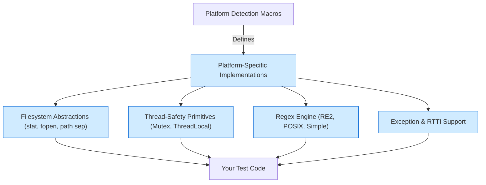

# Platform Abstraction and Portability

GoogleTest is designed to work reliably and consistently across a vast range of platforms, compilers, and operating systems. This page explains the platform abstraction and portability concepts that make this cross-platform compatibility possible. It highlights platform detection mechanisms, filesystem handling, and thread-safety primitives that ensure your tests execute correctly regardless of the underlying environment.

---

## Why Platform Abstraction Matters

When you write tests using GoogleTest, you expect them to run the same way whether you're on Linux, Windows, macOS, or any supported environment. Achieving this is challenging due to differences in filesystem APIs, threading models, compiler features, and system calls. GoogleTest manages these discrepancies by abstracting platform-specific details behind a uniform API layer.

**User Benefit:** You can focus on writing meaningful tests without worrying about environment-specific quirks or manual porting of your test code.

---

## Key Platform Detection

GoogleTest uses preprocessor macros to detect the target platform at compile time. This detection enables conditional compilation of platform-specific implementations, ensuring optimal support and stability.

### Platform Macros

- `GTEST_OS_WINDOWS`, `GTEST_OS_LINUX`, `GTEST_OS_MAC`, `GTEST_OS_ANDROID`, `GTEST_OS_IOS`, and others identify the operating system exactly.
- Sub-platforms such as `GTEST_OS_WINDOWS_DESKTOP`, `GTEST_OS_WINDOWS_MINGW`, or mobile platforms like `GTEST_OS_WINDOWS_PHONE` allow further granularity.

### Compiler and Feature Detection

- GoogleTest enforces C++17 support as a minimum requirement, checked at compile time.
- Features like exceptions, RTTI, POSIX thread availability, and filesystem support are auto-detected or can be overridden via compiler flags.

**Example:** If you are on macOS, `GTEST_OS_MAC` is set; on Windows with MinGW, `GTEST_OS_WINDOWS_MINGW` is set, enabling appropriate platform adaptations.

---

## Filesystem Handling

Portable filesystem access is a common source of subtle bugs due to different path separators, file operations, and encoding.

### Path Separators

- Windows uses `\\` as the path separator, while UNIX-like systems (Linux, macOS) use `/`.
- GoogleTest abstracts this difference using macros:

```cpp
#ifdef GTEST_OS_WINDOWS
#define GTEST_PATH_SEP_ "\\"
#else
#define GTEST_PATH_SEP_ "/"
#endif
```

Use `GTEST_PATH_SEP_` rather than hardcoded separators to build file paths.

### File Operations

GoogleTest wraps common filesystem functions like `stat()`, `rm_dir()`, and `fopen()` inside its own `posix` namespace with platform-specific adaptations.

For instance, on Windows, `_stat` and `_rmdir` are called, while UNIX systems use their standard equivalents. This approach ensures consistent APIs for file existence checks, file size queries, and directory removals.

### File Descriptors and Streams

Functions such as `fileno()`, `isatty()`, and `fdopen()` are similarly adapted. For example, Windows uses `_fileno()`, and POSIX systems use `fileno()`.

---

## Thread-Safe Primitives

GoogleTest ensures thread safety with abstractions over mutexes, locks, and thread-local storage that work uniformly across platforms.

### Mutex and Lock

- On Windows, GoogleTest employs Windows Critical Section APIs wrapped inside its `Mutex` and `MutexLock` classes.
- On POSIX platforms, pthread mutexes are used.

The API is consistent regardless of the underlying implementation, letting tests run safely in multi-threaded contexts.

### Thread-Local Storage

- Implemented using Windows `TlsAlloc()` and related functions on Windows.
- Implemented using `pthread_key_create()` and associated pthread APIs on POSIX platforms.

GoogleTest provides a templated `ThreadLocal<T>` class for convenient thread-local variable management, abstracting away platform details.

### Thread Counting

GoogleTest exposes a function to query the current number of threads (`GetThreadCount()`), which returns `0` if the count cannot be detected.

---

## Regular Expressions

- GoogleTest uses different regex implementations depending on the platform and build options:
  - RE2 with Abseil integration where available.
  - POSIX Extended Regular Expressions on UNIX-like platforms.
  - A simplified internal regex fallback elsewhere.

This abstraction ensures reliable and consistent pattern matching, which is essential for features like death test output matching and test filtering.

---

## Exception and RTTI Support

To maximize compatibility:

- Exception handling support is detected and any unhandled exceptions during tests are caught gracefully when available.
- Runtime Type Information (RTTI) is detected or disabled according to compiler capabilities or settings.

If exceptions or RTTI are disabled, GoogleTest disables related features appropriately, avoiding undefined behavior.

---

## Thread Safety Indicator

Macro `GTEST_IS_THREADSAFE` tells if GoogleTest was built with thread safety enabled. This depends on:

- Availability of mutex and thread-local storage primitives.
- Platform-specific constraints.

You can check this macro in your test code to enable or disable thread-dependent behavior.

---

## Practical Tips

- **Override Detection If Needed:** If GoogleTest misdetects platform capabilities (e.g., pthread availability), use compiler definitions like `-DGTEST_HAS_PTHREAD=1` or `-DGTEST_HAS_PTHREAD=0`.

- **Use Provided Abstractions:** Always use GoogleTest provided file and thread APIs instead of platform-specific calls to maintain portability.

- **Consider Compiler Flags:** Maintain consistency in compiler/runtime flags between your test code and GoogleTest libraries, e.g., regarding static vs dynamic CRT linkage on Windows (`gtest_force_shared_crt` option).

- **Check Thread Safety:** Use `GTEST_IS_THREADSAFE` macro when writing tests involving multi-threading to confirm your environment supports safe concurrent testing.

---

## Summary Diagram of Platform Abstractions



---

## Further Reading and Related Pages

- [Supported Platforms & Compatibility](/overview/integrations/supported-platforms): Understand officially supported OSes, compilers, and build tools.
- [Platform Abstraction and Portability Concepts](/concepts/platform-scalability/platform-abstraction): Complementary conceptual deep dive.
- [System Architecture (with Diagram)](/overview/architecture-concepts/system-architecture): See how platform abstractions fit in the overall GoogleTest architecture.
- [Common Setup and Troubleshooting Issues](/getting-started/first-steps-validation/common-setup-issues): Practical help for resolving environment-related problems.

---

## Summary

Platform abstraction enables GoogleTest to run uniformly across diverse systems by detecting and adapting to operating systems, compiler features, and runtime capabilities. File and threading APIs are wrapped for consistent use, and features like exceptions and RTTI are managed flexibly. Understanding these abstractions empowers you to write portable, reliable C++ tests that behave consistently in your development and CI environments.

---

## Source and Contribution

GoogleTest platform abstractions reside primarily in [`gtest/include/gtest/internal/gtest-port.h`](https://github.com/google/googletest/blob/main/googletest/include/gtest/internal/gtest-port.h) and [`gtest/include/gtest/internal/gtest-port-arch.h`](https://github.com/google/googletest/blob/main/googletest/include/gtest/internal/gtest-port-arch.h). For advanced customization, you can define certain macros in your build system or modify platform-specific utility implementations.

---

> For detailed build instructions and platform-specific tweaks, refer to [GoogleTest README](https://github.com/google/googletest/blob/main/README.md).


