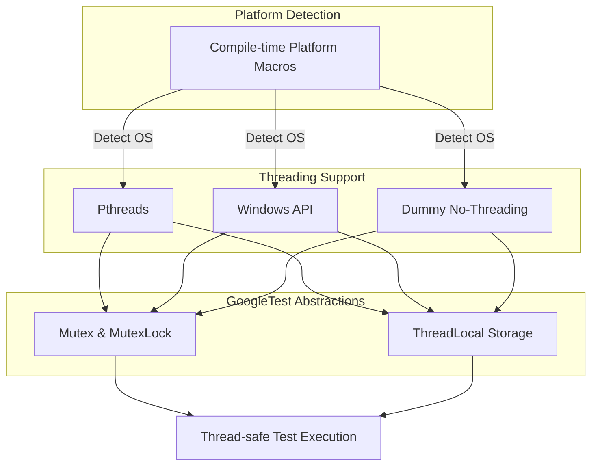

# Portability and Platform Abstraction

GoogleTest ensures your C++ tests run reliably across diverse operating systems and environments by providing a robust layer of portability and platform abstractions. This page dives into the mechanisms behind GoogleTest's cross-platform compatibility, the threading and synchronization primitives it offers, and platform detection strategies that enable consistent test execution everywhere.

---

## Why Portability Matters in Testing

In modern development, software must run seamlessly on a variety of platforms: Linux, Windows, macOS, embedded systems, and more. Writing tests that only run on one platform limits their utility and hinders continuous integration and deployment.

GoogleTest addresses this by abstracting away platform-specific details, so you can write your tests once and confidently run them anywhere. This results in:

- **Consistent Test Behavior**: Results are reliable and predictable regardless of environment.
- **Reduced Maintenance**: No need for platform-specific test modifications.
- **Broader Reach**: Enables testing on niche or embedded platforms alongside mainstream OSes.

---

## Key Portability Concepts

### 1. Platform Detection

GoogleTest automatically detects the compilation platform using compile-time macros. These include platform identifiers like `GTEST_OS_LINUX`, `GTEST_OS_WINDOWS`, `GTEST_OS_MAC`, and many others for less common platforms.

Detection influences feature availability and underlying implementation choices without requiring user intervention.

### 2. Threading and Synchronization Abstractions

GoogleTest provides thread-safe test execution by adapting to available platform threading APIs:

- **Pthreads**: Used on POSIX-like systems (Linux, macOS, BSD variants).
- **Windows API**: Used for Windows desktop and related variants.
- **No Threads / Dummy Implementations**: Used on platforms without threading support to allow compilation albeit without concurrency.

Synchronizations such as mutexes and locks are abstracted via internal `Mutex` and `MutexLock` classes that wrap platform-native primitives, ensuring uniform usage across codebases.

### 3. Thread-local Storage

To maintain thread-specific data safely, GoogleTest supplies an interface for thread-local variables, implemented using either native thread-local storage (`__thread`, `thread_local`) or platform-specific mechanisms like `pthread_key_t` or Windows TLS APIs.

---

## How GoogleTest Implements Portability

The foundation for GoogleTest's portability lies in the internes of its **gtest-port.h** and **gtest-port-arch.h** headers. These form the platform abstraction core and include:

- Definition of platform macros for reliable OS recognition.
- Conditional inclusion of suitable headers and types.
- Wrappers around platform-specific functions and types.

In particular:

- `GTEST_HAS_PTHREAD` macro enables detection of pthread availability.
- Mutex and ThreadLocal classes adapt implementation depending on detected platform.
- File I/O and environment variables are abstracted to account for APIs and behaviors that vary.

This allows GoogleTest to internally offer a coherent API for essential operations, hiding platform quirks and reducing user burden.

---

## User Perspective: What This Means for You

As a user writing tests with GoogleTest, you don't have to worry about:

- Detecting or handling platform differences.
- Manually selecting threading or synchronization APIs.
- Writing separate code paths for Windows, Linux, or embedded devices.

GoogleTest automatically compiles with the right settings and uses the optimal implementations based on your environment, from desktop down to specialized embedded systems.

However, some scenarios require awareness:

- **Compiler and Platform Requirements**: GoogleTest requires C++17 support and platform compatibility as documented in setup guides.
- **Build Configuration**: Use supplied CMake scripts or appropriate build flags to ensure platform detection and threading support are enabled correctly.
- **Customization Points**: Advanced users can override default abstractions via custom macros if special platform behavior is needed.

---

## Practical Tips for Portable Testing

- **Confirm Platform Macros**: When debugging unusual platform-specific issues, check the defined `GTEST_OS_*` macros in your builds to verify correct detection.

- **Check Threading Support**: Inspect `GTEST_HAS_PTHREAD` to confirm if pthreads is in use or if Windows threading primitives are applied.

- **Use Default Build Scripts**: Leverage the provided CMake integration which auto-configures platform-related flags, enabling smooth builds across different OSes.

- **Avoid Platform-specific Code in Tests**: To maximize portability, write tests using GoogleTest idioms and avoid OS-specific calls.

---

## Illustrative Example: Platform Detection

A snippet of what GoogleTest does internally to identify the platform:

```cpp
#ifdef _WIN32
#define GTEST_OS_WINDOWS 1
#elif defined(__linux__)
#define GTEST_OS_LINUX 1
#elif defined(__APPLE__)
#define GTEST_OS_MAC 1
#endif
```

From this detection, GoogleTest configures the threading and synchronization strategy, which users benefit from transparently.

---

## Threading and Synchronization Abstracted Usage

GoogleTest provides classes you leverage indirectly, for example in internal test runners. Here’s an overview:

| Abstraction  | Platform-specific Implementation |
|--------------|---------------------------------|
| Mutex        | pthread_mutex_t, CRITICAL_SECTION on Windows |
| MutexLock    | RAII lock guard over Mutex |
| ThreadLocal  | pthread_key_t, Windows TLS APIs or C++11 thread_local |

This abstraction ensures correct locking and thread separation under the hood.

---

## Troubleshooting Common Platform Issues

### Problem: Tests fail to build or link on certain platforms

- Verify C++17 compliance of your compiler.
- Confirm proper platform and threading detection macros are defined.
- Use CMake-provided build to ensure thread libraries (e.g., pthread) are linked.

### Problem: Thread-safety macros indicate threading is unavailable

- Check if the platform truly supports pthread or Windows threading.
- On some embedded platforms, threading is disabled; tests run single-threaded.

### Problem: Environment variables or file APIs behave unexpectedly

- Some embedded or mobile platforms have limited or no support.
- Ensure your tests do not rely on unavailable features, or detect support conditionally.

---

## Summary Diagram: Portability Architecture



---

## Further Reading and Related Documentation

- [Prerequisites & System Requirements](/getting-started/setup-prerequisites-installation/prerequisites-system-requirements) — Prepare your build environment.
- [Configuration and Initial Setup](/getting-started/setup-prerequisites-installation/configuration-and-initial-setup) — How to set up GoogleTest including platform-specific steps.
- [Integration and Platform Support](/overview/features-integration/integration-and-platforms) — Details on integrating GoogleTest with your build system for cross-platform use.

---

By abstracting platform details and standardizing synchronization and threading, GoogleTest delivers an industrial-strength C++ testing framework you can trust across any environment you choose to target.