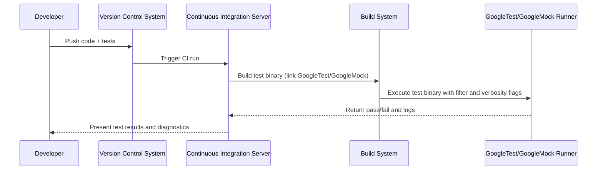
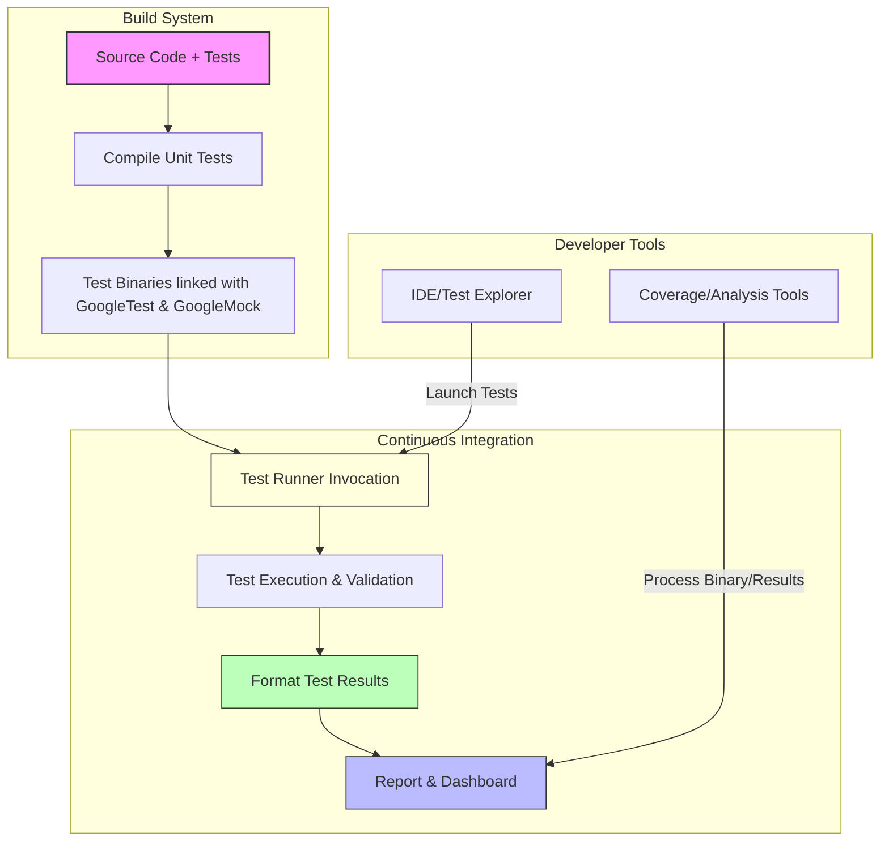

# Integration Patterns and Ecosystem Fit

GoogleTest and GoogleMock are designed as foundational frameworks that integrate seamlessly within diverse development toolchains, build systems, and continuous integration (CI) pipelines. This guide provides a conceptual overview of how these testing libraries fit into the broader software ecosystem, highlighting integration conventions, typical user workflows, and extensibility points that ensure smooth adoption across varied environments.

---

## Understanding Integration Context

At its core, GoogleTest is a C++ testing framework, and GoogleMock is its companion mocking framework. Neither requires proprietary tooling or runtime environments, enabling them to operate flexibly in almost any development setup. Understanding this ecosystem fit is essential to make the most of their capabilities and to streamline your build and test workflows.

### Typical Toolchain and Build System Integration

GoogleTest and GoogleMock are commonly integrated into build systems such as:

- **Bazel:** GoogleTest and GoogleMock provide Bazel BUILD rules, allowing tests to be specified and run naturally within Bazel’s build graph.
- **CMake:** The libraries have known CMake configurations, facilitating smooth linkage and configuration.
- **Other build systems:** They can be manually integrated into Makefiles or custom build scripts.

Integration generally involves:

1. **Adding GoogleTest and GoogleMock as dependencies:** Both frameworks can be included as source dependencies or pre-built libraries.
2. **Linking test targets:** Tests link against GoogleTest and GoogleMock libraries to gain access to the testing and mocking APIs.
3. **Specifying test execution:** Tests are defined as executables triggered within the build system or CI.

### Continuous Integration (CI) Pipelines

GoogleTest and GoogleMock support integration into popular CI systems and workflows:

- **Test Discovery & Execution:** Test binaries created with GoogleTest automatically register tests at runtime. CI scripts simply execute these binaries with optional filtering.
- **Output Formats:** GoogleTest supports output formats like XML and JSON, which CI systems can consume to present dashboards and analytics.
- **Flag Customization:** Flags such as `--gtest_filter` and `--gmock_verbose` allow fine control over test selection and diagnostic verbosity within automated runs.

### Developer Tool Compatibility

The frameworks support development tools such as:

- **IDEs:** Visual Studio, CLion, and others recognize GoogleTest tests, enabling in-IDE test running, breakpoint setting, and debugging.
- **Code Coverage Tools:** Easily integrate with coverage analysis tools by compiling with coverage flags and interpreting GoogleTest results.
- **Static and Dynamic Analysis:** Can be combined with sanitizers, linters, and static analyzers to improve test quality.

---

## Core Integration Conventions

To facilitate robust integration, GoogleTest and GoogleMock follow conventions designed for clarity and extensibility.

### Test Entry Points

- Inclusion of either `gtest_main` or `gmock_main` libraries provides default `main()` functions that initialize frameworks and run all registered tests.
- Users can implement custom `main()` functions to add initialization or teardown sequences specific to their environment.

### Test Naming & Registration

- Tests are defined using macros like `TEST` and `TEST_F`, which register test cases automatically.
- GoogleMock adds macros such as `MOCK_METHOD` and `EXPECT_CALL` to define and drive mock behaviors.

### Output and Reporting

- Built-in formatters support console output and XML for CI coverage.
- Verbosity flags (`--gmock_verbose`) allow toggle of diagnostic detail for integration with logging systems.

---

## Extensibility Points for Diverse Environments

GoogleTest and GoogleMock recognize that environments vary widely in constraints and requirements. To accommodate this, they expose extensibility points:

### Custom Test Environments

Users can define test environment classes to set up or tear down global state, such as configuring logging, managing mock factories, or altering test filters, ensuring tests execute cleanly in customized contexts.

### Behavior Modifiers for Mocks

GoogleMock supports strictness wrappers (e.g., `NiceMock`, `NaggyMock`, `StrictMock`), enabling tuning of uninteresting call behaviors. This allows teams to adapt the test behavior to their tolerance for warnings and errors during integration.

### Custom Matchers and Actions

Users can extend matching and action capabilities to better fit their domain-specific checks and behaviors, facilitating seamless integration into advanced test strategies or domain-specific tools.

### Flags and Environment Variables

GoogleTest and GoogleMock respond to environment variables and flags that control behavior without code changes, improving adaptability within CI and diverse developer setups.

---

## Example User Flow in a CI Environment

This flow shows how GoogleTest and GoogleMock fit naturally as binaries invoked by build systems within CI, leveraging test discovery and reporting to provide feedback.

---

## Best Practices for Integration

- **Set expectations early:** Define mock expectations before executing test code to prevent undefined behavior.
- **Use strictness modifiers wisely:** Prefer `NiceMock` for maintainability but use `StrictMock` to catch unwanted calls early.
- **Leverage output flags:** Use `--gmock_verbose=info` for detailed diagnostics when debugging intermittent test failures.
- **Integrate consistent reporting:** Enable XML output in CI for aggregated results.
- **Isolate build dependencies:** Keep GoogleTest and GoogleMock versions consistent across build environments.

---

## Troubleshooting Common Integration Issues

- **Compilation errors related to mocking:** Ensure all mocked methods are virtual and destructors are virtual.
- **Test discovery failures:** Confirm test binaries link against GoogleTest or GoogleMock main.
- **Uninteresting call warnings:** Consider wrapping mocks with `NiceMock` or specify default actions via `ON_CALL`.
- **Test flakiness in CI:** Review thread-safety of mocks; GoogleMock supports multi-threaded tests with precautions.

See the [Common Setup Issues and Solutions](https://google.github.io/googletest/getting-started/troubleshooting-support/common-issues-fixes) guide for detailed help.

---

## Visual Summary

This diagram illustrates the typical relationships and integrations of GoogleTest and GoogleMock within build systems, CI environments, and developer tools.

---

## Additional Resources

- [gMock Cookbook](https://google.github.io/googletest/gmock_cook_book.html) — Recipes for effective mocking
- [Mocking Reference](https://google.github.io/googletest/reference/mocking.html) — Macro and API details
- [Strictness and Mock Behavior Modifiers](https://google.github.io/googletest/reference/mocking-framework/strictness-and-behavior-modifiers.html)
- [Setting Expectations](https://google.github.io/googletest/reference/mocking-framework/setting-expectations.html) — Best practices for EXPECT_CALL
- [Supported Platforms and Integration Ecosystem](https://google.github.io/googletest/overview/features-and-getting-started/supported-platforms-and-integrations.html) — Platform-specific integration tips

For a deeper dive into continuous integration workflows, see the [Continuous Integration Workflows](https://google.github.io/googletest/guides/integration-best-practices/continuous-integration-workflows.html) guide.

---

## Summary

GoogleTest and GoogleMock are designed to slot easily into existing C++ development infrastructures, providing flexible, extensible, and robust testing capabilities. Their conventions and integration points such as build system compatibility, CI pipeline support, and extensible mocking behavior enable teams to adopt them with minimal friction. Understanding these integration patterns ensures efficient test automation and ongoing maintainability.
