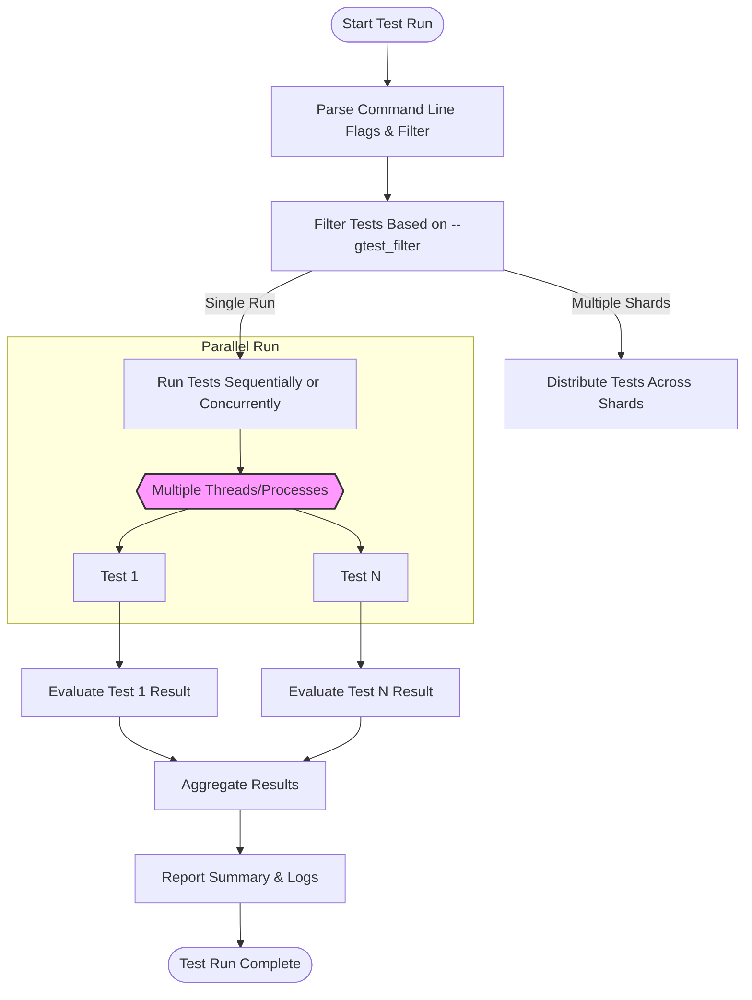

# Performance and Scalability Fundamentals

GoogleTest is trusted for managing tests at any scale—whether it's a small module or a large, complex codebase with thousands of tests. This page explores the core concepts that underpin GoogleTest’s ability to **scale efficiently** and ensure **fast and reliable test execution**.

You will learn about:

- How GoogleTest enables selective test execution through filtering mechanisms.
- Patterns supporting parallel test execution to handle large test suites.
- Failure-handling strategies designed to maintain speed without sacrificing robustness.

Understanding these fundamentals will empower you to optimize your testing workflows and maintain your feedback loops lightning-fast, no matter how massive your test suite grows.

---

## Test Filtering: Targeted Execution at Scale

Running every test in a large suite can be time-consuming. GoogleTest provides robust filtering capabilities that allow you to **focus test runs** on subsets of tests that matter most, accelerating your development and debugging cycles.

### How Filtering Works

GoogleTest lets you specify test filters by name patterns, controlling which tests to **include** and which to **exclude**. Filters are applied at test discovery time, so only matching tests are executed.

Typical syntax for filters:

```bash
--gtest_filter=<positive_patterns>[-<negative_patterns>]
```

- `<positive_patterns>` selects tests to run (wildcards `*` allowed).
- `-<negative_patterns>` excludes matching tests.

For example, to run all tests whose names contain `Factorial` except those ending with `HandlesZeroInput`:

```bash
./your_test_binary --gtest_filter=*Factorial*-*HandlesZeroInput
```

### Benefits for Scalability

- **Skip irrelevant tests:** Target a subtree of functionality you're currently working on.
- **Reduce run time:** Run only a slice of tests during iterative development.
- **Parallelize runs:** Distribute filtered subsets across multiple runners or machines.

### Tips for Effective Filtering

- Name your test suites and tests consistently and meaningfully to leverage filtering.
- Use filtering combined with test parameterization to isolate failing configurations.
- Consider scripting filtered runs to break large test suites into smaller chunks.

<Check>
Harness test filters to **dramatically reduce time and resources** in large testing environments without sacrificing correctness.
</Check>

---

## Parallel Test Execution Patterns

To scale beyond what serial test execution permits, GoogleTest supports several patterns and best practices to **run tests in parallel**, effectively using all available CPU cores and machines.

### Internal Concurrency Support

GoogleTest itself is thread-safe and can run tests concurrently in multithreaded environments when combined with process-level parallelization shells or runners (e.g., `gtest-parallel`).

### Common Parallel Execution Strategies

1. **Test Binary-Level Parallelism**
   - Run multiple instances of the test binary with different filter subsets simultaneously.
   - You'll configure each instance to cover a distinct slice of the test suite, reducing overlap.

2. **Shard Testing**
   - Divide tests into shards (partitions) executed on separate agents or machines.
   - Each shard receives a unique filter to cover its subset.

3. **Parallel Test Fixtures and Threads**
   - Design tests and fixtures to be independent and thread-safe (no shared mutable state).
   - Use GoogleTest's thread-safe synchronization primitives if necessary.

4. **Avoid Shared State and Inter-Dependencies**
   - Each test must be self-contained to avoid flaky results when run in parallel.

### Implementation Details from the Codebase

GoogleTest offers synchronization primitives, including `Mutex` and `ThreadLocal`, designed specifically for thread-safe test execution. Internally, these features:

- Track and protect shared resources.
- Allow safe concurrent test runs.
- Provide mechanisms like `ThreadWithParam` to manage threads for test functions.

### Best Practices

- Use the `--gtest_filter` flag to split tests among parallel runners.
- Ensure fixtures do not share state unless protected by locks.
- Use GoogleTest's thread-local storage when per-thread data isolation is needed.
- Prefer process-level parallelism for maximum isolation and reproducibility.

<Note>
GoogleTest's built-in concurrency features enable seamless integration with external parallel test runners like `gtest-parallel` to scale with your resources.
</Note>

---

## Failure-Handling Strategies

When scaling tests, dealing with failures gracefully becomes crucial. GoogleTest incorporates strategies to help maintain performance **without halting the entire test suite** due to single test failures.

### Types of Failures in GoogleTest

- **Fatal Failures** (`ASSERT_` macros): Abort the current test function immediately.
- **Non-Fatal Failures** (`EXPECT_` macros): Record failure but allow test execution to continue.

### Impact on Scalability and Performance

- Fatal failures prevent wasteful execution of dependent code but can cause early test termination.
- Non-fatal failures enable detecting multiple issues in one run, reducing debugging cycles.

### Isolation for Fast Feedback

Tests are isolated, so one failure does not block others. This isolation is critical when combined with parallel execution, as failures in one thread/process don't affect others.

### Retry and Failure Management

Although not natively supported by GoogleTest, various CI systems and test runners can:

- Retry failing tests separately.
- Rerun tests selectively based on failure history.

### Logging and Output Capture

GoogleTest includes output capturing for stdout and stderr streams, letting you analyze failures without clutter. Capturing is thread-aware to support concurrent tests safely.

### Practical Tips

- Use `EXPECT_` macros when you wish to collect multiple errors in one test.
- Use `ASSERT_` when failure should prevent further steps to avoid cascading errors.
- Monitor logs and test outputs actively to identify sporadic flakes.

---

## Summary

GoogleTest’s performance and scalability arise from its thoughtfully designed filtering, concurrency, and failure-handling capabilities. By combining selective test execution, safe parallelization patterns, and robust failure isolation, your testing workflows become efficient and resilient—even with massive test suites.

Harness these fundamentals to **optimize your testing** and keep your feedback loops fast and dependable.

---

## Further Resources

- [GoogleTest Primer](https://google.github.io/googletest/primer.html) — For foundational understanding.
- [Organizing and Running Tests Guide](https://google.github.io/googletest/guides/core-workflows/organizing-and-running-tests.html) — Covers filtering and parallelization.
- [Test Runner & Invocation API Reference](https://google.github.io/googletest/reference/core-testing-apis/test-runner-and-invocation.html) — Details on execution control.
- [Thread Safety Tests](googletest/test/gtest_stress_test.cc) — Practical examples of concurrency in GoogleTest.

---

## Visual Overview: Parallel Testing Workflow



This diagram illustrates how GoogleTest uses filters to prepare test subsets, which are then executed in parallel threads or processes. After individual test evaluation, results are aggregated for a unified report.

---