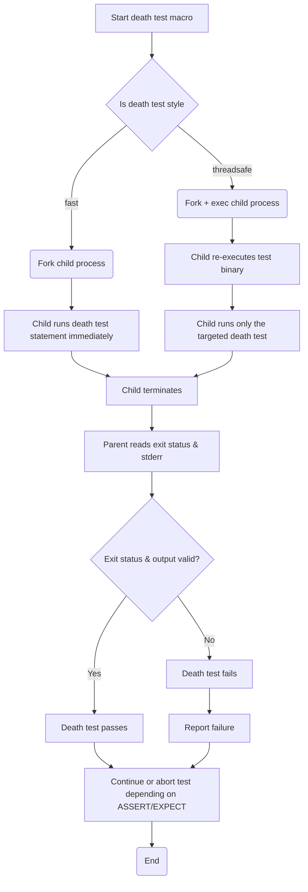

# Death Tests: Validating Termination Paths

Death tests in GoogleTest verify that specific pieces of code cause the program to terminate as expected. They are essential for testing guard conditions such as assertion failures or fatal errors that lead to process termination rather than exception handling or ordinary return. This page explains when and why to use death tests, how they are designed, and practical examples to help you write effective death tests.

---

## What Are Death Tests?

Death tests are a special category of tests that confirm your program terminates in specific scenarios where continuing execution is unsafe or incorrect.

- They check that a statement or block of code causes the program to **abort** or **exit with a non-zero exit status**.
- They verify that the program produces an expected error message on `stderr` when this termination occurs.

This is particularly valuable for testing defensive programming paths such as consistency checks, fatal assertions, or unrecoverable conditions that must stop the program early.

<Info>
The code under test runs in a **subprocess** so that it can be terminated safely without crashing your test runner or parent process.
</Info>


## When To Use Death Tests

Use death tests when you want to confirm:

- Your program correctly detects and reacts to invalid inputs or states by terminating.
- Defensive assertions or checks trigger failures as intended.
- Critical error paths properly exit or abort.

For example, when writing robust systems where corrupted state should *never* propagate, death tests ensure those checks remain effective and visible during testing.


## Writing Death Tests: Macros and Usage

GoogleTest provides several macros tailored for death tests:

| Macro                      | Description                                         | Outcome on Failure                             |
|----------------------------|-----------------------------------------------------|-----------------------------------------------|
| `EXPECT_DEATH(statement, regex)`        | Checks `statement` causes death & `stderr` matches `regex`. Continues on failure. | Records nonfatal failure, continues test.     |
| `ASSERT_DEATH(statement, regex)`        | Like `EXPECT_DEATH` but aborts current test on failure.            | Records fatal failure, aborts current test.    |
| `EXPECT_EXIT(statement, predicate, regex)` | Checks `statement` causes exit matching `predicate` with `stderr` matching `regex`. Continues on failure.| Recorded as nonfatal failure on mismatch. |
| `ASSERT_EXIT(statement, predicate, regex)` | Same as `EXPECT_EXIT` but aborts test on failure.                   | Recorded as fatal failure and aborts test.    |
| `EXPECT_DEBUG_DEATH(statement, regex)` | Acts like `EXPECT_DEATH` only in debug mode; in optimized builds executes but does not assert. | Nonfatal failure in debug build if assertion fails. |
| `ASSERT_DEBUG_DEATH(statement, regex)` | Like `EXPECT_DEBUG_DEATH` but aborts on failure in debug builds. | Fatal failure on failure in debug build.


### Key Points:

- The second parameter (usually a string) is a regex that matches the expected `stderr` output. Bare strings are treated as substring regexes, not exact matches.
- `ASSERT_*` versions abort the current test immediately upon failure, preventing further execution.
- The code inside the death test statement runs in a **separate process** launched by the test framework, isolating crashes.
- If the code does not terminate or produces output that does not match the regex, the death test fails.


## Sample Death Test Examples

```cpp
// Death test that verifies Foo crashes with a particular error message.
TEST(FooDeathTest, CrashesOnBadInput) {
  ASSERT_DEATH({
    // Compound statement to test multiple lines inside ASSERT_DEATH
    Foo(-1);  
  }, "Invalid input detected");
}

// Death test that checks exit code and error output.
TEST(ExitDeathTest, ExitsSuccessfully) {
  EXPECT_EXIT(NormalExit(), testing::ExitedWithCode(0), "Success");
}

// Death test that expects the process to be killed by SIGKILL.
bool KilledBySIGKILL(int status) {
  return WIFSIGNALED(status) && WTERMSIG(status) == SIGKILL;
}

TEST(KillDeathTest, HandlesSignal) {
  EXPECT_EXIT(SendSIGKILL(), KilledBySIGKILL, "Received SIGKILL");
}

// Looping over death tests ensures repeated patterns die as expected.
TEST_WITH_DEATH_LOOP, MultipleInputs) {
  for (int i = 0; i < 3; ++i) {
    EXPECT_DEATH(ProcessInput(i), "Invalid input");
  }
}
```


## How Death Tests Work Internally

GoogleTest runs death tests in a child process to safely capture termination behavior:

- **On POSIX systems:** Uses `fork()` or `clone()` to spawn child processes.
  - In “fast” style, the child immediately runs the death test statement after forking.
  - In “threadsafe” style, the child re-executes the entire test binary with flags to run only the death test, to avoid thread-related issues.
- **On Windows:** Always uses a process spawning mechanism where the child re-executes the test binary with appropriate flags (similar to threadsafe style).

The parent process:

1. Starts the child process with the death test
2. Waits for child termination
3. Captures exit status and error output
4. Matches the output against the expected regex
5. Passes or fails the test accordingly

<Info>
Unsafe for death tests to run while multiple threads are active, as `fork()` is only safe in single-threaded contexts. GoogleTest warns if multiple threads are detected.
</Info>


## Important Flags and Settings

- `--gtest_death_test_style=` determines if death tests use “fast” or “threadsafe” mode.
  - Default is “fast” unless overridden.
  - “threadsafe” mode enhances reliability when running with multiple threads but increases runtime overhead.
- `GTEST_FLAG_SET(death_test_style, "threadsafe");` can be used to programmatically set the style in code.

Example:
```cpp
int main(int argc, char** argv) {
  testing::InitGoogleTest(&argc, argv);
  GTEST_FLAG_SET(death_test_style, "threadsafe");
  return RUN_ALL_TESTS();
}
```


## Best Practices & Tips

- **Name your death test suites ending with `DeathTest`** to ensure they run before other tests and to alert maintainers.
- Avoid putting multiple death tests on the same line; they may cause compilation issues.
- Avoid using assertions or other statements inside the death test code that cause premature returns or exceptions; such behavior fails the test.
- Be cautious that any side effects inside the death test won't affect your program state since death tests run in isolated processes.
- When using mocks with death tests expecting specific exit codes, allow mocks to leak (via `Mock::AllowLeak`) to prevent leak detector false positives.
- Use `SCOPED_TRACE` to add diagnostic context inside death tests.


## Troubleshooting Common Issues

### Test Does Not Die as Expected
- Confirm that the code path under test actually triggers termination.
- Verify the regex matches the expected output on `stderr`.
- Check for silent failures where code continues instead of triggering the intended abort.

### Regex Matching Failures
- Use simple regular expressions matching subsets of expected output.
- Remember that bare strings are matched as substrings, not exact equality.

### Problems with Threads
- Death tests warn if multiple threads are active.
- Switch to "threadsafe" style for better multi-thread support.
- Minimize threads before the death test if possible.

### Unexpected Return or Exception
- Death tests fail if the code inside returns instead of dying.
- They also fail if the code throws exceptions escaping the death test. Use `EXPECT_DEATH` carefully and avoid throwing from the test statement.


## Related Macros

| Macro                     | Description
|---------------------------|--------------------------------------------------
| `EXPECT_DEATH_IF_SUPPORTED` | Like `EXPECT_DEATH`, but does nothing if death tests are not supported on your platform.
| `ASSERT_DEATH_IF_SUPPORTED` | Like `ASSERT_DEATH`, but does nothing if death tests are not supported.


## Summary

Death tests validate that code terminates as expected under error or fatal conditions. GoogleTest manages the complexity by isolating such tests in child processes and matching exit status and error output against expected patterns. By carefully crafting death tests, you ensure your program robustly handles critical failures and defensive checks.

---

## Additional Resources

- [Assertions Reference](../reference/assertions.md#death) — Details on death test assertion macros.
- [Using Death Tests Effectively Guide](../guides/mocking-and-advanced-usage/using-death-tests.md) — Practical recommendations and examples for death tests.
- [Core Testing Architecture Overview](../concepts/core-architecture/architecture-overview.md) — Conceptual foundation for test execution flow.
- [Core Terminology & Mental Models](../overview/architecture-concepts/core-terminology.md) — Definitions of testing concepts.
- [Handling Failures in GoogleTest](../docs/advanced.md#catching-failures) — Guidance on handling assertions and failures.

---

## Visual Overview: Death Test Process Flow




<Tip>
Follow naming conventions by using `*DeathTest` suffix for test suites containing death tests to run them early and avoid thread-related pitfalls.
</Tip>
<Warning>
Avoid running death tests in multi-threaded contexts with the “fast” style to prevent undefined behavior; prefer "threadsafe" style when multiple threads exist.
</Warning>
<Check>
Ensure that the regex matched against `stderr` in your death test accurately reflects the error message produced during termination.
</Check>

---