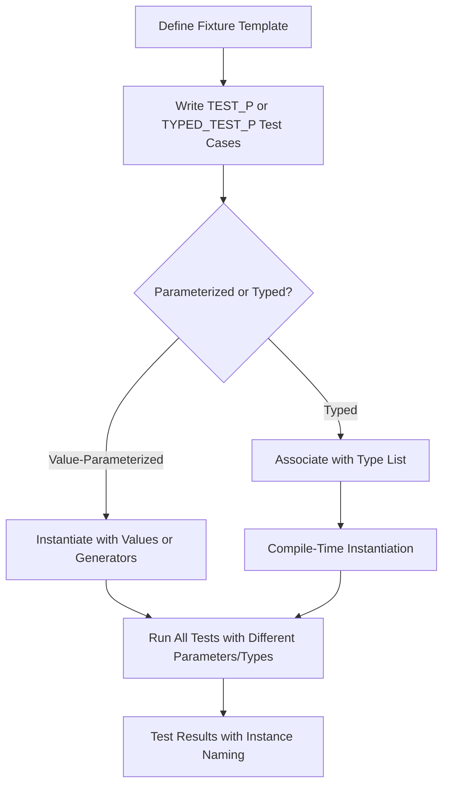

# Parameterized and Type-Parameterized Tests

GoogleTest empowers you to write flexible, scalable tests that automatically run across multiple values or types without redundant code. This page explores how GoogleTest supports different flavors of parameterized testing, enabling you to achieve DRY (Don't Repeat Yourself) test design and maintain large, cross-cutting test suites efficiently.

---

## Introduction to Parameterized Tests

When your code needs to be tested over a variety of inputs or configurations, writing the same test logic repeatedly for each case is tedious and error-prone. Parameterized tests allow you to write the test logic once and automatically run it multiple times with different parameters.

GoogleTest offers *value-parameterized tests* (testing over multiple values) and *typed tests* (testing over multiple types) as foundational tools to achieve scalable, maintainable tests.

## 1. Value-Parameterized Tests

### Concept

Value-parameterized tests let you write test fixtures that accept parameters (typically values) and then run the same test multiple times with different parameter values. This approach encourages concise test code and broad coverage.

### Writing Value-Parameterized Tests

1. **Define a Fixture Class Template:**
   Your fixture must derive from both `testing::Test` and `testing::WithParamInterface<T>`, usually simplified by deriving from `testing::TestWithParam<T>`, where `T` is the parameter type.

```cpp
class FooTest : public ::testing::TestWithParam<int> {
  // Usual fixture code
};
```

2. **Write Tests Using `TEST_P`:**
   Define parameterized tests using the `TEST_P` macro. Inside each test, access the current parameter via `GetParam()`.

```cpp
TEST_P(FooTest, IsEven) {
  int param = GetParam();
  EXPECT_EQ(param % 2, 0);
}
```

3. **Instantiate the Test Suite:**
   Use `INSTANTIATE_TEST_SUITE_P` to specify the set of parameters to run the tests with. GoogleTest provides parameter generators like `Values()`, `Range()`, `ValuesIn()`, `Bool()`, and `Combine()` for this purpose.

```cpp
INSTANTIATE_TEST_SUITE_P(EvenNumbers, FooTest, testing::Values(2, 4, 6, 8));
```

### Parameter Generators Overview

| Generator       | Description                                  | Example Usage                      |
|-----------------|----------------------------------------------|----------------------------------|
| `Range(begin, end[, step])` | Generates a sequence from begin up to but excluding end | `Range(1, 5)` yields 1,2,3,4    |
| `Values(v1, v2, ..., vN)`   | Explicitly enumerates parameter values            | `Values(10, 20, 30)`            |
| `ValuesIn(container)` or `ValuesIn(begin, end)` | Generates parameters from containers or iterator ranges | `ValuesIn(my_vector)`          |
| `Bool()`                   | Generates `false` and `true`                       | `Bool()`                       |
| `Combine(g1, g2, ..., gN)` | Cartesian product of multiple generators           | `Combine(Values(1,2), Bool())` |

### Naming Parameterized Test Instances

You can customize the test names generated for parameter instances by providing a naming function as the last argument to `INSTANTIATE_TEST_SUITE_P`. This function receives a `TestParamInfo` struct containing the parameter and its index, and returns a string used as the test suffix.

```cpp
INSTANTIATE_TEST_SUITE_P(
    CustomNames, FooTest, testing::Values(1,2,3),
    [](const testing::TestParamInfo<int>& info) {
      return "Param" + std::to_string(info.param);
    });
```

### Abstract Tests with Parameterization

If you want to define parameterized tests once and instantiate them multiple times (potentially in different translation units), separate the definition (in a header) from the instantiation (in a source file). This pattern is useful for defining interface compliance tests that multiple implementations can reuse.

### Best Practices & Tips
- Always declare `SetUpTestSuite()` and `TearDownTestSuite()` as **public** if you use them with parameterized tests.
- The test parameter type `T` must be copyable.
- Instantiations of the parameterized test suite must use unique prefixes as the first argument to avoid test name collisions.
- You can instantiate a test suite multiple times with different parameter sets.

---

## 2. Typed Tests

### Concept

Typed tests allow you to write tests that are repeated for a predetermined list of types. This is useful when you want to verify that a template or type-dependent code behaves correctly for all types of interest.

### Writing Typed Tests

1. **Define a Fixture Template:**
   The fixture is a template class parameterized by a type.

```cpp
template <typename T>
class MyTypedTest : public testing::Test {
 public:
  T value_ = T();
};
```

2. **Associate the List of Types:**
   Use `::testing::Types` to define the type list and `TYPED_TEST_SUITE` to bind your fixture template to these types.

```cpp
using MyTypes = ::testing::Types<int, double, char>;
TYPED_TEST_SUITE(MyTypedTest, MyTypes);
```

3. **Write Tests with `TYPED_TEST`:**
   Tests written with this macro will be run once for each type.

```cpp
TYPED_TEST(MyTypedTest, IsDefaultConstructible) {
  TypeParam value = this->value_;
  EXPECT_EQ(value, TypeParam{});
}
```

4. **Running Typed Tests:**
   These tests are compiled once per type and executed individually, appearing with suffixes indicating their type.

### Custom Type Names

You can provide a custom name generator class with a static template method `GetName` to convert type parameters into meaningful names for test suites.

```cpp
class MyTypeNames {
 public:
  template <typename T>
  static std::string GetName(int) {
    if (std::is_same<T, int>::value) return "Int";
    if (std::is_same<T, double>::value) return "Double";
    return "Unknown";
  }
};

TYPED_TEST_SUITE(MyTypedTest, MyTypes, MyTypeNames);
```

### Best Practices
- Typed test fixtures must derive from `testing::Test`.
- Use `TypeParam` inside tests to refer to the current type.
- Typed tests are ideal when the list of types is known at compile time.

---

## 3. Type-Parameterized Tests

### Concept

Type-parameterized tests generalize typed tests by allowing you to define an abstract parametrized test suite without knowing the types upfront. The pattern can then be instantiated with different type lists multiple times and across translation units.

This is particularly valuable for verifying interface-conformance or concept compliance across different implementations.

### Writing Type-Parameterized Tests

1. **Define a Fixture Template:**
   As with typed tests, create a template fixture class derived from `testing::Test`.

```cpp
template <typename T>
class MyTypeParamTest : public testing::Test {};
```

2. **Declare a Type-Parameterized Test Suite:**
   Use `TYPED_TEST_SUITE_P` to declare your test suite as pattern-based.

```cpp
TYPED_TEST_SUITE_P(MyTypeParamTest);
```

3. **Define Tests with `TYPED_TEST_P`:**
   Write test definitions with this macro, just like typed tests.

```cpp
TYPED_TEST_P(MyTypeParamTest, HasDefaultConstructor) {
  TypeParam value;
  (void)value;  // Use value to avoid warnings
}
```

4. **Register Tests:**
   Register all test names using `REGISTER_TYPED_TEST_SUITE_P`.

```cpp
REGISTER_TYPED_TEST_SUITE_P(MyTypeParamTest, HasDefaultConstructor);
```

5. **Instantiate the Test Suite:**
   Instantiate the pattern with specified type lists.

```cpp
using MyTypes = ::testing::Types<int, double>;
INSTANTIATE_TYPED_TEST_SUITE_P(MyInstantiation, MyTypeParamTest, MyTypes);
```

This process can be split into header/source files to allow for reuse and multiple instantiations.

### Advantages
- Decouples test logic from specific type lists.
- Allows instantiation in multiple translation units.
- Facilitates interface or concept compliance testing.

---

## User Flow: Writing Parameterized and Typed Tests

<Steps>
<Step title="Define Fixture">
Create a test fixture template appropriate for value- or type-parameterized test styles.
</Step>
<Step title="Write Test Cases">
Use `TEST_P`, `TYPED_TEST`, or `TYPED_TEST_P` macros to declare the test logic, referencing parameters as `GetParam()` or `TypeParam`.
</Step>
<Step title="Register and Instantiate">
Register test names when required and instantiate your tests with parameter or type lists using the provided macros.
</Step>
<Step title="Run Tests">
Compile, link, and run your tests. GoogleTest runs each combination as a distinct test with descriptive names.
</Step>
</Steps>

---

## Common Pitfalls and Troubleshooting

- **Missing Instantiation:** Failing to instantiate parameterized tests leads to silent test suite emptiness and failures. Use `GTEST_ALLOW_UNINSTANTIATED_PARAMETERIZED_TEST` to suppress errors when instantiation is intentionally deferred or not needed.

- **Parameter Type Requirements:** Parameter types must be copyable and support required constructors. Otherwise, test compilation fails.

- **Test Naming Conflicts:** Always provide distinct prefixes in instantiations to prevent overlapping test names.

- **Incorrect Access to Parameters:** Use `GetParam()` in value-parameterized tests and `TypeParam` in typed/type-parameterized tests. Using them interchangeably causes compilation errors.

- **SetUpTestSuite Visibility:** When using `TEST_P`, `SetUpTestSuite()` and `TearDownTestSuite()` must be **public**, or you will get access errors.

- **Generator Evaluation Timing:** Parameter generators are evaluated during test framework initialization, not at instantiation site or test run time. Avoid depending on side effects.

---

## Practical Examples

### Value-Parameterized Test Example

```cpp
class IsEvenTest : public testing::TestWithParam<int> {};

TEST_P(IsEvenTest, CheckIsEven) {
  EXPECT_EQ(GetParam() % 2, 0);
}

INSTANTIATE_TEST_SUITE_P(EvenValues, IsEvenTest, testing::Values(2, 4, 6));
```

### Typed Test Example

```cpp
template <typename T>
class NumericTest : public testing::Test {
 public:
  T zero_ = T();
};

using NumericTypes = ::testing::Types<int, double, long>;
TYPED_TEST_SUITE(NumericTest, NumericTypes);

TYPED_TEST(NumericTest, ZeroIsDefault) {
  EXPECT_EQ(this->zero_, TypeParam{});
}
```

### Type-Parameterized Test Example

```cpp
template <typename T>
class ContainerTest : public testing::Test {};

TYPED_TEST_SUITE_P(ContainerTest);

TYPED_TEST_P(ContainerTest, CanBeDefaultConstructed) {
  TypeParam container;
}

TYPED_TEST_P(ContainerTest, InitialSizeIsZero) {
  TypeParam container;
  EXPECT_EQ(0U, container.size());
}

REGISTER_TYPED_TEST_SUITE_P(ContainerTest, CanBeDefaultConstructed, InitialSizeIsZero);

using MyContainers = ::testing::Types<std::vector<int>, std::list<char>>;
INSTANTIATE_TYPED_TEST_SUITE_P(MyInstantiation, ContainerTest, MyContainers);
```

---

## Key Benefits

- **DRY Test Logic:** Write once, test many input values or types.
- **Scalability:** Easily maintain large suites with many configurations.
- **Reusability:** Define abstract test suites for interface verification.
- **Clear Naming:** Test outputs distinguish instances clearly.
- **Integrated with `RUN_ALL_TESTS()`:** Seamless test discovery and execution.


---

## See Also

- [GoogleTest Primer](../primer.md) — Core concepts and introductory tutorial.
- [Advanced GoogleTest Topics](../advanced.md#typed-tests) — In-depth explanations and examples.
- [Testing Reference — Parameterized & Typed Tests](../reference/testing.md#parameterized-typed-tests) — Macro and API details.
- [Writing Effective Assertions](../guides/core-testing-workflows/writing-effective-assertions.mdx) — Improve test expressiveness.
- [Organizing and Running Test Suites](../guides/core-testing-workflows/organizing-and-running-test-suites.mdx) — Best practices for test management.


---

## Diagram: Parameterized and Typed Tests Workflow



---

<Tip>
Start with value-parameterized tests when varying runtime values; use typed tests when your goal is to verify behavior across multiple data types.
</Tip>

<Note>
Properly instantiate all parameterized test suites; omitting instantiation leads to tests being silently excluded from runs.
</Note>

<Warning>
Remember that parameter generators are evaluated during GoogleTest initialization, so avoid runtime-dependent values in the generator expressions.
</Warning>
