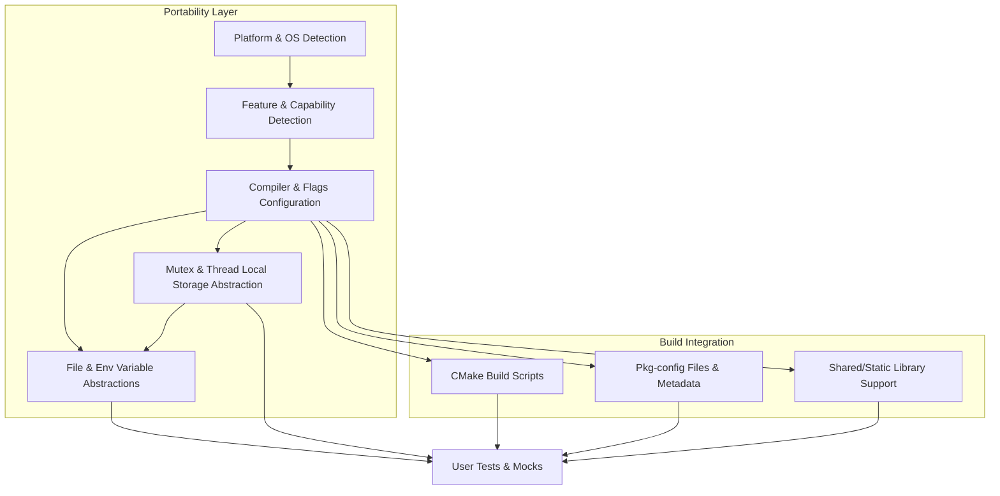

# Portability and Platform Integration

Ensuring your tests run reliably on a wide variety of platforms and build environments is critical to using GoogleTest and GoogleMock effectively. This document explains the portability and platform integration fundamentals that allow GoogleTest and GoogleMock to maintain consistent behavior across diverse compilers, operating systems, and build systems.

---

## Portability Layers and Environment Detection

GoogleTest and GoogleMock include robust portability layers within their core codebase. These layers detect details about your compilation environment, such as the operating system, compiler type and version, availability of threading support, exception handling, and more.

### Platform and OS Identification

At compile time, GoogleTest identifies the target platform through predefined macros and sets internal flags accordingly. Some of the operating systems it detects include:

- Windows (Desktop, Mobile, MinGW)
- Mac OS and iOS
- Linux and Android
- BSD variants (FreeBSD, NetBSD, OpenBSD)
- Solaris, HP-UX, AIX
- Embedded platforms (ESP8266, ESP32)

This detection ensures platform-specific code paths and integrations work correctly.

### Feature Detection

GoogleTest determines the availability of key language and system features such as:

- Exception support
- Runtime type information (RTTI)
- POSIX regular expressions
- Pthreads and thread safety
- Stream redirection

Flags such as `GTEST_HAS_EXCEPTIONS`, `GTEST_HAS_PTHREAD`, and `GTEST_HAS_RTTI` are set to signal feature presence, enabling the framework to adapt its behavior.

---

## Compiler and Build System Integration

The portability model extends to compiler and build environment configuration, ensuring compatibility with a variety of common toolchains.

### Compiler Flags Setup

GoogleTest applies specialized configurations to compiler and linker flags optimized for each supported compiler (e.g., MSVC, Clang, GCC, IntelLLVM). This includes:

- Switching runtime library linkage for MSVC (e.g., `/MT` vs `/MD`) to avoid runtime conflicts
- Enabling stricter warning levels
- Handling exception and RTTI flags explicitly

These configurations help prevent hard-to-debug runtime errors caused by inconsistent runtime libraries or missing language features.

### Support for Shared vs. Static Libraries

These builds adapt to shared (DLL) or static library usage. The framework provides macros like `GTEST_CREATE_SHARED_LIBRARY` and `GTEST_LINKED_AS_SHARED_LIBRARY` to indicate whether components are being built or linked as shared, ensuring proper symbol visibility and linkage.

### Threading and Synchronization

On platforms with pthread support, GoogleTest uses it for thread safety and synchronization. On Windows, native threading primitives and critical sections are used. If neither is available, a no-op dummy implementation is used to maintain compatibility, with thread safety disabled.

---

## Platform-Specific Abstractions and Utilities

GoogleTest provides platform-specific abstractions to normalize OS-level differences such as file operations, environment variables, and character encoding.

### File and Directory Operations

- Uses platform-specific APIs for file descriptors and directory handling
- Normalizes path separators (`/` on POSIX, `\` on Windows)
- Supports UTF-8 and wide string handling on Windows through conversions

### Environment Variables

Access to environment variables is abstracted to gracefully handle platforms without environment support (e.g., embedded systems).

### Synchronization Primitives

Provides mutex, thread-local storage, and thread abstractions tailored for each platform:

- On Windows, critical sections and OS handles
- On pthread platforms, pthread mutex and keys
- Fallback no-op versions on unsupported systems

---

## Build Integration Basics

GoogleTest and GoogleMock support smooth integration with modern build systems, especially CMake and pkg-config.

### CMake Integration

- GoogleTest includes a complete, configurable CMake build script
- Applies the necessary platform/compiler tweaks
- Supports building as a static or shared library
- Provides convenient targets like `gtest`, `gtest_main`, `gmock`, and `gmock_main`

### Pkg-config Support

- `.pc` files are provided to automatically supply the required compiler, linker, and macro flags
- Compatibility with cross-compilation systems is supported by correctly handling sysroots and library prefixes
- Users can easily incorporate GoogleTest flags and libraries into their build scripts through pkg-config

---

## User Experience Implications

Thanks to these layers of portability and integration:

- Users can run their tests on Linux, Windows, Mac, and many embedded platforms without code changes
- Tests leverage native features like threading and exceptions when available
- Builds adapt automatically to the environment, easing setup and reducing configuration errors
- Linking and compiling with GoogleTest and GoogleMock in diverse environments (including shared/static, cross-compilation) is streamlined

---

## Practical Tips and Best Practices

- Always ensure your compiler supports at least C++17, as recent GoogleTest versions require it.
- When building on Windows with MSVC, set `-Dgtest_force_shared_crt=ON` if you need to align runtime DLL usage.
- Use the provided CMake scripts or pkg-config metadata whenever possible to minimize manual flags management.
- If you target embedded or less common platforms, verify feature macros like `GTEST_HAS_PTHREAD` and `GTEST_HAS_EXCEPTIONS` are appropriately set.

---

## Troubleshooting Common Integration Issues

<AccordionGroup title="Troubleshooting Portability and Integration">
<Accordion title="Build Failures Related to Compiler Flags">
If you encounter errors about conflicting runtime libraries on MSVC, check that `gtest_force_shared_crt` is set consistently.

On pthread-enabled platforms, ensure the compiler and linker flags include `-pthread` or equivalent.
</Accordion>
<Accordion title="Runtime Errors When Using Shared Libraries">
Make sure that macros `GTEST_LINKED_AS_SHARED_LIBRARY` and `GTEST_CREATE_SHARED_LIBRARY` are correctly defined during build and use phases.
</Accordion>
<Accordion title="Platform Detection Issues">
If GoogleTest's platform detection fails on a niche or embedded environment, you may need to define relevant macros manually in your build.
</Accordion>
</AccordionGroup>

---

## Visualizing Portability Architecture

---

## Summary

GoogleTest and GoogleMock's portability and platform integration layers provide a seamless testing experience across diverse operating systems and compilers. By automatically detecting platform features and adapting compiler and build configurations, they relieve developers from environment-specific hassles. The included CMake and pkg-config support streamlines incorporation into typical C++ build workflows.

For developers, understanding these portability foundations empowers confident and efficient cross-platform test development and deployment.

---

## See Also

- [GoogleTest Primer](primer.md) — Introduction to GoogleTest usage
- [Build System Integration](guides/integration-and-best-practices/build-system-integration.mdx) — Details integrating GoogleTest with CMake and Bazel
- [Platform Support Documentation](docs/platforms.md) — Overview of officially supported platforms
- [GoogleTest Portability Internals](api-reference/advanced-extensibility/portability-internals.mdx) — Deep dive into GoogleTest's internal portability utilities

---

<meta property="og:title" content="Portability and Platform Integration - GoogleTest Documentation" />
<meta property="og:description" content="Learn how GoogleTest and GoogleMock maintain portability across compilers and OSes, and integrate seamlessly with common build environments." />