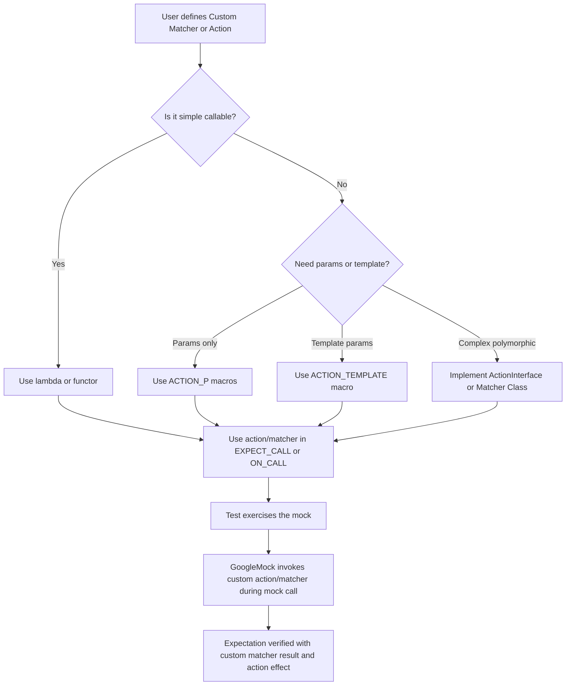

# Custom Actions and Matchers

Extend the power of GoogleMock beyond its built-in capabilities by creating your own custom actions and matchers. This guide explains the design patterns and techniques you need to build highly specific or complex behaviors and argument validations, helping your tests remain flexible, expressive, and maintainable.

---

## Understanding Custom Actions

### What Is a Custom Action?
In GoogleMock, *actions* define what a mock method does when it is invoked. While GoogleMock provides many built-in actions like returning fixed values or invoking callbacks, complex test scenarios often demand tailored behaviors.

A custom action lets you implement any behavior you need — from complex transformations, side effects, to invoking nested callbacks — precisely matching your testing requirements.

### When Should You Create Custom Actions?
- When the built-in actions (`Return()`, `Invoke()`, `DoAll()`, etc.) cannot express the behavior you want.
- When you want to reuse a particular behavior pattern across multiple tests or mocks.
- When you need to pass explicit template parameters for the action behavior that cannot be inferred.

### Defining Custom Actions

GoogleMock offers multiple ways to create custom actions, balancing ease of use and flexibility:

- **Lambda or Functor-Based Actions:** The simplest way. You can use any callable (lambda, functor, function pointer) whose signature matches the mock method signature. This is often enough when behavior is straightforward.

- **`ACTION` and `ACTION_P*` Macros:** For C++11 and later, these macros let you define named actions inside namespaces. They provide macros like `ACTION_P2` to create parameterized actions quickly, without verbose boilerplate.

- **`ACTION_TEMPLATE` Macro:** When your action requires explicit template parameters that cannot be deduced automatically, use this powerful macro. It enables defining generic actions with typed template and value parameters.

- **Implementing the `ActionInterface`:** For full customization and polymorphic support, you can implement the `::testing::ActionInterface<F>` template where `F` is the mocked function type. This is the most flexible method but requires deeper understanding.

### Example: Creating a Simple Custom Action
```cpp
ACTION(IncrementArg1) {
  ++(*arg1);  // arg1 is the 1st argument (0-based) of the mocked function
}
```
Use it in your tests like:
```cpp
EXPECT_CALL(mock, SomeMethod(_)).WillOnce(IncrementArg1());
```

### Using `InvokeArgument` for Callback Arguments

GoogleMock provides a special built-in action template `InvokeArgument<N>(args...)` that calls the N-th argument (a callable) of the mock method with specified arguments.

For example, if the second argument is a callback that you want to invoke:

```cpp
EXPECT_CALL(mock, DoThis(_, _))
    .WillOnce(InvokeArgument<1>(5)); // calls the 2nd argument with 5
```

**Notes:**
- If the callable expects reference parameters, use `std::ref()`.
- Arguments passed to `InvokeArgument` are copied internally to ensure they stay alive.

### Best Practices for Custom Actions
- Prefer lambdas or callable objects when possible for simpler and readable code.
- Use `ACTION` macros when defining small reusable behaviors that fit well in macro syntax.
- Use `ACTION_TEMPLATE` when you need explicit template parameters for advanced generic behavior.
- Implement `ActionInterface` only if you need polymorphic or type-restricted custom actions.
- Use `DoAll()` to combine multiple actions, remembering that only the last action's return value counts.

---

## Creating Custom Matchers

### What Is a Custom Matcher?
Matchers define criteria to validate arguments passed to mock methods. GoogleMock provides an extensive standard library of matchers but sometimes you need to validate very specific conditions or complex invariants.

A custom matcher lets you encapsulate that logic, improving test readability and expressiveness.

### Techniques for Writing Custom Matchers

- **`MATCHER` Macros:** The easiest way to write matchers. You write boolean logic based on the argument value and provide optional description strings.

- **`MATCHER_P` and `MATCHER_Pn` Macros:** For parameterized matchers that accept one or more runtime parameters for flexible matching.

- **Matcher Classes:** For full control, define a class implementing:
  - `bool MatchAndExplain(const T& arg, std::ostream* os)`
  - `void DescribeTo(std::ostream* os)`
  - `void DescribeNegationTo(std::ostream* os)`

- **Polymorphic Matchers:** Create matcher factory objects that generate matchers for multiple types depending on context.

### Example: Simple Custom Matcher with `MATCHER`
```cpp
MATCHER(IsEven, "is an even number") {
  return (arg % 2) == 0;
}
```
Use in tests:
```cpp
EXPECT_CALL(mock, Foo(IsEven()));
```

### Example: Parameterized Matcher with `MATCHER_P`
```cpp
MATCHER_P(IsDivisibleBy, divisor, "is divisible by " + std::to_string(divisor)) {
  return (arg % divisor) == 0;
}
```
Use it as:
```cpp
EXPECT_CALL(mock, Bar(IsDivisibleBy(5)));
```

### Using Matchers to Validate Object Members

GoogleMock provides `Field()` and `Property()` matchers that let you compose matchers based on specific members or getter methods of objects.

```cpp
// Matches objects where foo.bar is 42
EXPECT_CALL(mock, Foo(Field(&MyClass::bar, 42)));
```

### Writing Pure Matchers

All matchers must be side-effect free and pure; they should not modify state or call mocked functions in their matching logic.

### Best Practices for Matchers
- Start with `MATCHER` macros for simple and parameterized matchers.
- Provide clear and informative description strings for better test diagnostics.
- For complex matchers, implement the `MatchAndExplain` method for detailed matching feedback.
- Use composition of matchers (`AllOf()`, `AnyOf()`, etc.) before resorting to custom matchers.

---

## Patterns to Keep Your Test Code Flexible and Maintainable

### Intent-Based Design of Actions and Matchers
Build custom actions and matchers focusing on **what you want to achieve** in your test rather than low-level implementation details. Express test intent clearly.

### Reusing Custom Actions and Matchers
Encapsulate reusable behaviors and validations into named actions/matchers to improve readability and reduce duplication.

### Progressive Complexity
Start tests with simple default actions and expectations. Introduce custom actions and matchers only as complexity demands.

### Handling Reference and Move-only Types
Follow GoogleMock guidelines when designing custom actions to support modern C++ types like `const&` and `std::unique_ptr`. Use lambdas that capture state by move when needed.

### Common Pitfalls
- Ensure custom matchers are pure and side-effect free.
- Avoid sharing state in actions unintentionally unless explicitly desired.
- Use `.RetiresOnSaturation()` with repeatable expectations to prevent sticky expectations causing unexpected failures.

### Troubleshooting
- When your custom action or matcher behaves unexpectedly, run tests with `--gmock_verbose=info` for detailed invocation trace.
- Use `EXPECT_NONFATAL_FAILURE` in tests to validate failure behavior.

---

## Additional Resources
- [gMock Cookbook](https://google.github.io/googletest/gmock_cook_book.html): Offers practical recipes including creating custom matchers and actions.
- [Mocking Reference](https://google.github.io/googletest/reference/mocking.html): Detailed usage of macros and matcher/action interfaces.
- [Actions Reference](https://google.github.io/googletest/reference/actions.html): Full list of built-in actions and ways to define new ones.
- [Matchers Reference](https://google.github.io/googletest/reference/matchers.html): Comprehensive guide on matchers and writing custom ones.

---

Feel empowered to sculpt GoogleMock to fit any niche scenario by leveraging custom actions and matchers. This flexibility is key for robust, expressive, and maintainable C++ test suites.


---

## Mermaid Diagram: Custom Actions and Matchers Integration Flow


