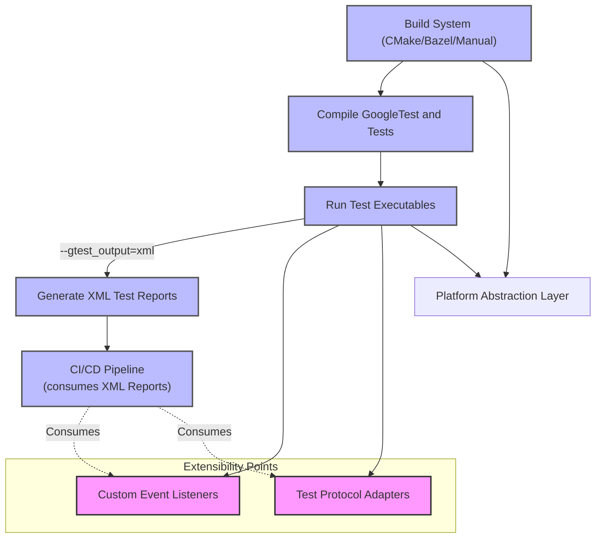

# Integration & Extensibility Patterns

GoogleTest and GoogleMock are designed to fit seamlessly into diverse development environments. This page introduces how these frameworks integrate with external build systems, continuous integration (CI)/continuous delivery (CD) pipelines, and test runners. It also highlights key extension points enabling you to adapt GoogleTest to your specific environment, emphasizing platform abstraction layers and mechanisms for event listening and protocol adaptation.

---

## Integrating with External Build Systems

GoogleTest and GoogleMock support integration with common build systems like CMake and Bazel, as well as manual build environments. While the detailed setup is covered elsewhere, the core concept of this integration is to incorporate test compilation and execution as part of your build pipeline, ensuring your tests remain in-sync with your codebase.

- **CMake:** GoogleTest provides official CMake support with `FetchContent` and `ExternalProject` modules, allowing projects to include it as a dependency, build test binaries, and run them conveniently.
- **Bazel:** GoogleTest and GoogleMock come with Bazel build files optimized for scalable and incremental builds.
- **Manual Integration:** You can compile test binaries and link against GoogleTest/GoogleMock manually as needed.

The key takeaway is that these integrations facilitate automated building and execution of tests, making your workflow efficient and aligned with continuous integration standards.

## Continuous Integration (CI)/Continuous Delivery (CD) Pipelines

In modern development workflows, GoogleTest supports smooth integration into CI/CD pipelines by providing machine-readable output and customization hooks.

- **XML Test Reporting:** Use the built-in flag to generate JUnit-style XML test reports (`--gtest_output=xml:path/to/report.xml`). These reports can be consumed by popular CI servers (e.g., Jenkins, GitLab CI, GitHub Actions) for test result analysis and rendering.

- **Event Listeners:** GoogleTest offers event listener APIs that let you customize test execution monitoring and reporting layers. With these, you can adapt test progress and results to custom display formats or trigger other automated processes.

- **Parallel Test Runners:** Support for external parallel test runners like [gtest-parallel](https://github.com/google/gtest-parallel) enables running tests concurrently for faster feedback in CI.

<Info>
Ensure that test generation and reporting are properly configured in your CI jobs to avoid inconsistent test visibility.
</Info>

## Adapting GoogleTest to Different Environments

GoogleTest’s design includes extension points for adapting to numerous environments and workflows.

### Platform Abstractions

GoogleTest abstracts environmental differences to behave consistently across platforms. These abstractions encapsulate:

- Operating system detection
- Filesystem and path handling
- Threading primitives and synchronization
- Character utilities

By relying on GoogleTest's portability and platform helpers, you avoid manual platform-specific code, simplifying write-once test suites.

### Event Listeners & Custom Test Hooks

Event listeners form a powerful mechanism for extending test execution behaviors.

- You can implement custom **`TestEventListener`** classes to respond to lifecycle events: test start, test end, test case start, test case end, and so on.
- This allows adding hooks for logging, custom metrics, test retry strategies, integration with external monitoring systems, or generating specialized artifacts.

### Protocol Adapters & Integration Points

GoogleTest supports standardized interfaces for integration with other test runners and build tools:

- Support for protocols like Test Anything Protocol (TAP) or custom XML formats can be layered atop event listeners.
- Test sharding, filtering, and repeated run support ensure GoogleTest fits into sophisticated test orchestration environments.

## Common User Workflows

### Incorporating GoogleTest in Your Build and CI

1. Add GoogleTest and GoogleMock to your build system (via CMake, Bazel, or manual).
2. Define and compile tests into executables.
3. Configure test runs to export XML reports using `--gtest_output=xml:<file>`.
4. Add test execution steps into your CI configuration, collecting and parsing reports.
5. Optionally, use event listeners or custom reporters for richer integration.

### Developing Extensions

- For deeper customization, implement `TestEventListener` subclasses.
- Use platform helper APIs when writing tests or extensions that interact with environment specifics.

## Practical Example: Integrating Tests into a CI Pipeline

```bash
# Run tests with XML output for CI consumption
./my_test_binary --gtest_output=xml=build/reports/test-results.xml
```

Your CI server consumes `test-results.xml` to show pass/fail counts, run durations, and failure details.

## Tips and Best Practices

- **Order of Expectation and Setup:** Always set expectations before invoking tests to ensure correct behavior and reporting.

- **Use `ON_CALL` for Defaults:** Use `ON_CALL()` to define default behaviors that don’t enforce expectations but prevent warnings about uninteresting calls.

- **Care with `EXPECT_CALL` Clauses:** Leverage `InSequence` and `After` clauses to define call order constraints where relevant.

- **Leverage `RetiresOnSaturation` to avoid Sticky Expectations:** This helps control when expectations become inactive.

- **Suppressing Uninteresting Call Warnings:** Wrap mock classes in `NiceMock` or use `Mock::AllowUninterestingCalls()` for less verbose logs.

- **Ensure Environment-Specific Flags Are Set Correctly:** Including `--gtest_filter` or `--gmock_verbose` can tailor output verbosity and execution.

## Troubleshooting Common Integration Issues

- **Test Execution Not Detected by CI:** Confirm XML report generation is enabled and paths match.
- **Build System Fails to Link GoogleTest:** Verify dependencies and compiler flags; see installation guides for CMake or Bazel.
- **Warnings About Uninteresting Calls:** Use `ON_CALL` to set defaults or switch to `NiceMock`.
- **Hook Not Firing in Event Listener:** Ensure listener is registered before tests run.

## References & Further Reading

- [Getting Started with GoogleTest](../getting-started/gtest-core-guides/getting-started.md)
- [Integrating GoogleTest with Your Build System](../guides/integration-and-best-practices/build-integration.md)
- [Integrating with CI & Test Runners](../guides/integration-and-best-practices/ci-and-test-runner-integration.md)
- [Platform Helpers API](../api-reference/support-and-internals/portability-and-platform-helpers.md)
- [Core Testing APIs: Test Structure and Lifecycle](../api-reference/core-testing-apis/test-structure-and-lifecycle.md)
- [Mocking Guide](../guides/mocking-guide/mocking-basics.md)

<Source url="https://github.com/google/googletest" branch="main" paths={[{"path": "googlemock/src/gmock-spec-builders.cc", "range": "1-354"}]} />

---


```
