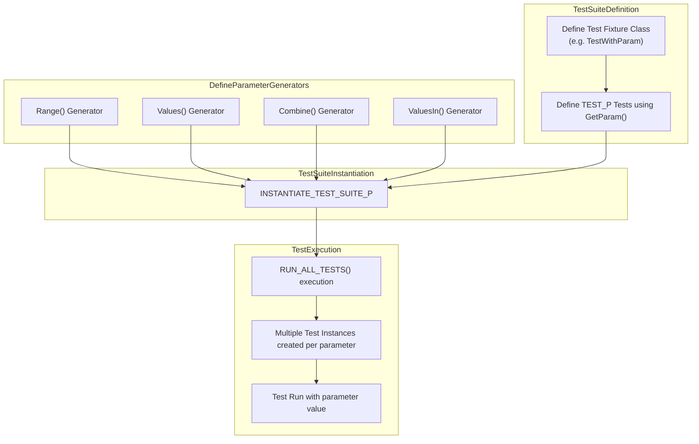

# Parameterized & Typed Tests

GoogleTest provides powerful mechanisms for scaling your test coverage through *parameterized* and *typed* tests. These features enable you to write flexible, reusable test code that systematically exercises your implementation under varied inputs and types — without duplicating test logic.

Through this guide, you will understand the fundamental concepts behind these test types, learn how to implement them, and discover best practices for maintaining efficient and robust test suites.

---

## Value-Parameterized Tests

### Concept Overview

Value-parameterized tests let you run the same test logic multiple times with different input values. This approach avoids writing repetitive tests for each input manually, enabling comprehensive input coverage with minimal code duplication.

In GoogleTest, you achieve this by:

- Defining a *test fixture* class that inherits from `testing::TestWithParam<T>`, where `T` is the type of the parameter.
- Writing tests with the `TEST_P` macro using this fixture, accessing the parameter via `GetParam()`.
- Instantiating the test suite multiple times with different parameter values using the `INSTANTIATE_TEST_SUITE_P` macro.

### Typical User Flow

1. **Define the test fixture:**

   ```cpp
   class MyTestSuite : public ::testing::TestWithParam<int> {
     // Fixture setup and helpers
   };
   ```

2. **Write one or more parameterized tests:**

   ```cpp
   TEST_P(MyTestSuite, CheckPositive) {
     int param = GetParam();
     EXPECT_GT(param, 0);
   }
   ```

3. **Instantiate the test suite with a set of parameters:**

   ```cpp
   INSTANTIATE_TEST_SUITE_P(MyInstantiation, MyTestSuite, testing::Values(1, 2, 3));
   ```

   This causes GoogleTest to run the `CheckPositive` test three times, once with each of the values `1`, `2`, and `3`.

### Parameter Generators

GoogleTest provides a variety of built-in generators to produce the test parameters:

| Generator                   | Description                                               |
| --------------------------- | --------------------------------------------------------- |
| `Range(begin, end [, step])`| Generates values from `begin` to `end` (exclusive), stepping by `step` (default `1`). |
| `Values(v1, v2, ..., vN)`   | Generates the specified sequence of values.               |
| `ValuesIn(container)`       | Generates values from a container or iterator range.      |
| `Bool()`                   | Generates `false` and `true`.                             |
| `Combine(g1, g2, ..., gN)`  | Produces the Cartesian product (all combinations) of the generator sequences. |

Example using multiple parameters:

```cpp
class AnimalTest : public testing::TestWithParam<std::tuple<std::string, int>> {};

TEST_P(AnimalTest, HasValidAttributes) {
  std::string name;
  int age;
  std::tie(name, age) = GetParam();
  EXPECT_FALSE(name.empty());
  EXPECT_GE(age, 0);
}

INSTANTIATE_TEST_SUITE_P(
    AnimalVariations, AnimalTest,
    testing::Combine(
      testing::Values("cat", "dog"),
      testing::Range(0, 5)));
```

This runs all combinations of animal names and ages 0 to 4.

### Custom Naming of Tests

To make test results clearer, you can provide a *custom name generator* lambda or functor as the last argument of `INSTANTIATE_TEST_SUITE_P`. This function takes a `TestParamInfo` object and returns a unique, valid test suffix string (alphanumeric and underscores only).

Example:

```cpp
INSTANTIATE_TEST_SUITE_P(
  NamedAnimals, AnimalTest,
  testing::Combine(testing::Values("cat", "dog"), testing::Range(0, 3)),
  [](const testing::TestParamInfo<AnimalTest::ParamType>& info) {
     std::string name = std::get<0>(info.param) + "_age" + std::to_string(std::get<1>(info.param));
     // Replace invalid characters with '_'
     for (char& c : name) {
       if (!isalnum(c)) c = '_';
     }
     return name;
  });
```

### Common Pitfalls & Best Practices

- Both the test fixture name and test names passed to `TEST_P` must **not** contain underscores.
- The parameter type `T` must be copyable.
- The parameters passed to `INSTANTIATE_TEST_SUITE_P` are **not** evaluated immediately but upon initializing GoogleTest via `InitGoogleTest()`. Avoid complex side-effects.
- Always ensure unique test parameter names when providing custom name generators.
- Use `GTEST_ALLOW_UNINSTANTIATED_PARAMETERIZED_TEST` if you define a value-parameterized test suite but do not instantiate it yet, to avoid failing verification tests.

---

## Typed Tests

### Concept Overview

Typed tests allow you to run the same test logic with different C++ types. This is essential when verifying template classes, generic algorithms, or whenever different data types require validation against identical behavior.

The key difference from value-parameterized tests is that typed tests vary over types, not values.

### Implementation Steps

1. **Define a class template fixture that inherits from `testing::Test`:**

   ```cpp
   template <typename T>
   class MyTypedTest : public testing::Test {
    public:
      // Optional shared fixture data
   };
   ```

2. **Specify the list of types to test:**

   ```cpp
   using MyTypes = testing::Types<int, double, std::string>;
   ```

3. **Associate the type list with the test suite using `TYPED_TEST_SUITE`:**

   ```cpp
   TYPED_TEST_SUITE(MyTypedTest, MyTypes);
   ```

4. **Define typed tests with `TYPED_TEST`. Use `TypeParam` to refer to the current type:**

   ```cpp
   TYPED_TEST(MyTypedTest, CanDefaultConstruct) {
     TypeParam instance{};
     // Test logic
   }
   ```

### Typed Tests in Action

```cpp
template <typename T>
class NumericTest : public testing::Test {};

using NumericTypes = testing::Types<int, long, double>;
TYPED_TEST_SUITE(NumericTest, NumericTypes);

TYPED_TEST(NumericTest, ZeroIsLessThanOne) {
  EXPECT_LT(TypeParam(0), TypeParam(1));
}

TYPED_TEST(NumericTest, CanBeDefaultConstructed) {
  TypeParam value{};
  (void)value;  // Suppress unused variable warning
}
```

Each test defined with `TYPED_TEST` will run once per type in the `NumericTypes` list.

### Extending Typed Tests: Custom Naming

You can define a name generator class with a templated `GetName(int index)` method for custom, readable test suite names:

```cpp
class MyTypeNames {
 public:
  template <typename T>
  static std::string GetName(int) {
    if constexpr (std::is_same_v<T, int>) return "Int";
    if constexpr (std::is_same_v<T, double>) return "Double";
    if constexpr (std::is_same_v<T, long>) return "Long";
    return "Other";
  }
};

TYPED_TEST_SUITE(MyTypedTest, MyTypes, MyTypeNames);
```

This affects the test suite names seen in output, aiding clarity.

### Limitations & Tips

- Typed tests require the complete list of types upfront.
- The class template must publicly derive from `testing::Test` and be defined before using the macros.
- For multiple typed test suites, make sure type aliases and macros do not clash.

---

## Type-Parameterized Tests

Type-parameterized tests are a variation of typed tests with more flexibility:

- The test suite is defined independently of the type list.
- The test patterns are declared with macros ending in `_P` and registered.
- They can be instantiated with multiple different type lists, even in different translation units.

### Workflow

1. **Define a template test fixture class:**

   ```cpp
   template <typename T>
   class MyParamTest : public testing::Test {};
   ```

2. **Declare a type-parameterized test suite:**

   ```cpp
   TYPED_TEST_SUITE_P(MyParamTest);
   ```

3. **Define tests with `TYPED_TEST_P`:**

   ```cpp
   TYPED_TEST_P(MyParamTest, Test1) {
     TypeParam value{};
     EXPECT_TRUE(...);
   }
   ```

4. **Register tests:**

   ```cpp
   REGISTER_TYPED_TEST_SUITE_P(MyParamTest, Test1, Test2);
   ```

5. **Instantiate the suite with a type list:**

   ```cpp
   using MyTypes = testing::Types<int, double>;
   INSTANTIATE_TYPED_TEST_SUITE_P(MyInstance, MyParamTest, MyTypes);
   ```

### Advantages

- Suitable for library authors defining generic tests once, allowing clients to instantiate with their specific types.
- Supports instantiations across different codebases without duplicating tests.

### Example

```cpp
template <typename T>
class StackTest : public testing::Test { /* ... */ };

TYPED_TEST_SUITE_P(StackTest);

TYPED_TEST_P(StackTest, IsEmptyInitially) {
  TypeParam stack;
  EXPECT_TRUE(stack.empty());
}

REGISTER_TYPED_TEST_SUITE_P(StackTest, IsEmptyInitially);

using MyTypes = testing::Types<std::stack<int>, std::stack<double>>;
INSTANTIATE_TYPED_TEST_SUITE_P(My, StackTest, MyTypes);
```

---

## Summary Table

| Feature                 | Usage                                  | Macro(s)                            | Parameterization Type               |
| ----------------------- | ------------------------------------- | --------------------------------- | --------------------------------- |
| Simple Test             | Basic tests with fixed code            | `TEST`, `TEST_F`                   | None                              |
| Value-Parameterized Test| Same test logic for multiple values   | `TEST_P`, `INSTANTIATE_TEST_SUITE_P` | Vary over input values (runtime) |
| Typed Test              | Same test logic for multiple types    | `TYPED_TEST_SUITE`, `TYPED_TEST`    | Vary over types (compile-time)     |
| Type-Parameterized Test | Abstract typed test suites instantiated later | `TYPED_TEST_SUITE_P`, `TYPED_TEST_P`, `REGISTER_TYPED_TEST_SUITE_P`, `INSTANTIATE_TYPED_TEST_SUITE_P` | Vary over types with deferred instantiation |

---

## Practical Tips & Best Practices

- Choose value-parameterized tests when you want to vary input data but keep the test logic type fixed.
- Use typed tests when verifying templated code for a predefined list of types.
- Opt for type-parameterized tests when designing generic test suites to be reused flexibly across multiple type lists.
- Always ensure unique and valid test and suite names; avoid underscores in test and suite names to comply with GoogleTest rules.
- Use custom name generators when human-friendly test names will improve test output readability.
- Leverage `GetParam()` (value-parameterized) and `TypeParam` (typed tests) accessors appropriately.
- Use `SetUpTestSuite()` and `TearDownTestSuite()` to share expensive resources across tests in parameterized or typed test suites.

---

## Troubleshooting

<AccordionGroup title="Troubleshooting Parameterized & Typed Tests">
<Accordion title="TEST_P Macro Causes Errors">
Make sure both your test fixture and test names do NOT contain underscores `_` and are valid C++ identifiers. Underscores are disallowed in these names when using `TEST_P` and `INSTANTIATE_TEST_SUITE_P`.
</Accordion>
<Accordion title="Instantiated Tests Not Running">
Verify that you have called `INSTANTIATE_TEST_SUITE_P` for your `TEST_P` fixture. By default, if you define `TEST_P` but don’t instantiate, GoogleTest reports fail in `GoogleTestVerification`.
If you intentionally want to defer instantiation, mark your test fixture with `GTEST_ALLOW_UNINSTANTIATED_PARAMETERIZED_TEST(FixtureName);`.
</Accordion>
<Accordion title="Custom Test Names Not Applied">
Ensure your custom name generator returns valid names: non-empty, unique per parameter, and only consists of alphanumeric characters or underscores.
Remember the generator is invoked during GoogleTest initialization, so avoid side-effects or dependencies on out-of-date state.
</Accordion>
<Accordion title="Typed Test Names Are Not Human-Readable">
Use a name generator class with a static templated `GetName()` method to create descriptive names for type instantiations.
</Accordion>
</AccordionGroup>

---

## Visualizing the Test Parameter Flow


```

---

## Further Reading & Resources

- [Value-Parameterized Tests](reference/testing.md#TEST_P)
- [Instantiating Parameterized Tests](reference/testing.md#INSTANTIATE_TEST_SUITE_P)
- [Typed Tests](reference/testing.md#TYPED_TEST and #TYPED_TEST_SUITE)
- [Type-Parameterized Tests](reference/testing.md#TYPED_TEST_P and #REGISTER_TYPED_TEST_SUITE_P)
- [GoogleTest Primer](primer.md)
- [Advanced GoogleTest Topics: Parameterized and Typed Tests](advanced.md#Value-Parameterized-Tests)

---