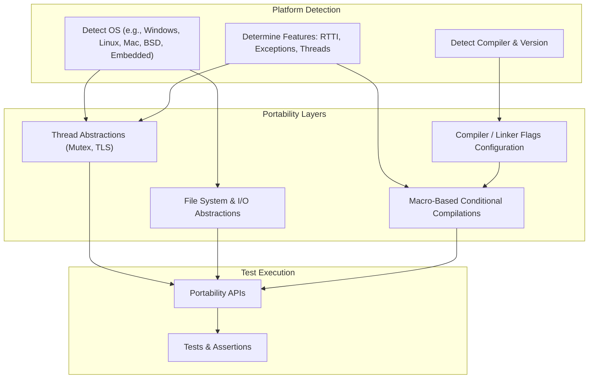

# Cross-Platform and Portability Concerns

GoogleTest is designed to work seamlessly across a wide range of platforms, operating systems, compilers, and environments. This page explores the abstractions and portability mechanisms GoogleTest employs to maintain consistent behavior and robust functionality regardless of the underlying platform specifics.

---

## Why Portability Matters in GoogleTest

C++ projects vary widely in their platform and compiler environments. Writing portable tests means your test suites can build and run on Linux, Windows, Mac, embedded systems, and more without modification. GoogleTest achieves this portability by abstracting platform differences and adapting features based on compiler capabilities and language standards.

Portability ensures:
- **Reusability:** Test cases written once can be used everywhere.
- **Integration:** GoogleTest integrates into diverse build systems and CI environments seamlessly.
- **Reliability:** Consistent behavior even in constraints such as lack of exceptions, RTTI, or threading support.

---

## Core Portability Layers

GoogleTest implements its portability through several core mechanisms, which users should understand to troubleshoot platform-specific issues or customize builds.

### 1. Platform Detection

GoogleTest detects the compilation platform at build time via predefined macros in header files like [`gtest/internal/gtest-port-arch.h`](https://github.com/google/googletest/blob/main/googletest/include/gtest/internal/gtest-port-arch.h). This detection covers a broad spectrum of OSes:

- Windows (desktop, mobile variants, MinGW)
- Cygwin
- Linux (with Android variants)
- Mac and iOS
- BSDs (FreeBSD, NetBSD, OpenBSD, DragonFly)
- Solaris, AIX, HP-UX
- Embedded targets (ESP8266, Xtensa, QNX, etc.)

This macro-driven approach enables later code paths or configurations to adapt to platform capabilities.

### 2. Compiler and Language Feature Detection

GoogleTest requires at least C++17 support. It detects compiler versions and their capabilities (e.g., RTTI, exceptions) in headers like [`gtest-port.h`](https://github.com/google/googletest/blob/main/googletest/include/gtest/internal/gtest-port.h). Key checks include:

- Exception handling availability (`GTEST_HAS_EXCEPTIONS`)
- Runtime Type Information support (`GTEST_HAS_RTTI`)
- Thread safety and pthread availability (`GTEST_HAS_PTHREAD`)

When features are absent, GoogleTest adapts by disabling or emulating parts of functionality (for example, dummy synchronization primitives if threads are unsupported).

### 3. Threading and Synchronization Abstractions

Depending on platform and compiler support, GoogleTest provides abstractions over mutexes, thread-local storage, and thread management.

- On POSIX platforms with pthreads, native pthread APIs are used.
- On Windows desktop, Windows APIs are used without requiring heavyweight headers.
- Where threading support is absent or disabled, dummy implementations allow single-threaded use without errors.

This approach guarantees thread-safe test execution on supported platforms like Linux and Mac while allowing GoogleTest to compile on embedded targets.

### 4. File System and I/O Abstraction

GoogleTest wraps file system interactions and basic I/O to handle different platform APIs:

- Differences in file descriptor retrieval and manipulation
- Directory handling and stat information
- Stream redirection capabilities

For example, on Windows, wide-character versions of file functions are used internally to support UTF-8 and Unicode paths.

### 5. compile-time Configuration (CMake Integration)

GoogleTest's CMake scripts (e.g., [`cmake/internal_utils.cmake`](https://github.com/google/googletest/blob/main/googletest/cmake/internal_utils.cmake)) define build flags and compile options tailored per compiler and platform.

These scripts adjust warning levels, exception flags, and CRT linkage (particularly on MSVC). They also verify pthread support, link threading libraries when available, and ensure the use of C++17 features.

Users can override defaults via CMake options for special environments or debug builds.

---

## Portable Features and Limitations

### Assertions and Test Discovery

GoogleTest offers portable assertions and automatic test discovery, relying on the portability layers to ensure consistent behavior. Even on platforms with limited exception or RTTI support, GoogleTest provides meaningful failure reporting.

### Death Tests and Stream Redirection

Death tests require reliable stream redirection and process control. GoogleTest enables them on platforms with file system support and suitable OS features, excluding some embedded and mobile platforms.

### Exception Handling

GoogleTest detects whether exceptions are enabled. On platforms without exceptions, certain failure modes behave differently, and exceptions should not be relied upon in tests.

### RTTI and Dynamic Casting

Dynamic casts and typeid are used internally when available. Absence of RTTI disables some RTTI-related checks but does not prevent running most tests.

### Unicode and Wide Strings

Handling for wide strings varies per OS and standard library. GoogleTest defines macros (`GTEST_HAS_STD_WSTRING`) to disable related features on unsupported platforms.

---

## Best Practices for Portability

- Ensure your development environment meets GoogleTest’s C++17 support requirements.
- Use the provided CMake scripts to build GoogleTest, which automate platform and compiler flag detection.
- In cross-compilation or embedded builds, verify pthread and exception availability and adjust macro definitions accordingly.
- Avoid overriding GoogleTest macros arbitrarily unless necessary; prefer higher-level APIs.
- When writing tests, rely on GoogleTest’s portable features and avoid platform-specific assumptions.

---

## Troubleshooting Common Portability Issues

<AccordionGroup title="Troubleshooting Portability Issues">
<Accordion title="Compilation Errors Related to C++ Standard or Compiler">
If you see errors related to missing C++17 features, verify your compiler version and ensure that the `-std=c++17` flag (or equivalent) is passed during compilation. In CMake, set `CMAKE_CXX_STANDARD` to 17 and `CMAKE_CXX_STANDARD_REQUIRED` to ON.
</Accordion>
<Accordion title="Linker Errors Due to Missing Pthreads or Thread Libraries">
GoogleTest relies on pthreads on most POSIX systems. Make sure your linker includes pthreads (e.g., add `-lpthread`). CMake normally handles this automatically. For cross-compilation, verify that threading support is correctly enabled.
</Accordion>
<Accordion title="Runtime Failures on Windows Related to CRT"
>
Ensure the runtime linkage matches between your project and GoogleTest library (static vs dynamic CRT). Use the `gtest_force_shared_crt` CMake option if building with dynamic runtimes to avoid conflicts.
</Accordion>
<Accordion title="Absence of Exceptions or RTTI Affects Test Behavior">
On platforms or builds without exceptions or RTTI, some GoogleTest features degrade gracefully, but certain advanced tests or user code may need to be adjusted to avoid using these features.
</Accordion>
</AccordionGroup>

---

## Diagram: Platform Detection and Abstraction Layers

---

## Further Reading and Related Documentation

- [GoogleTest Primer](https://github.com/google/googletest/blob/main/docs/primer.md): Introduction to GoogleTest fundamentals.
- [Supported Platforms](https://github.com/google/googletest/blob/main/docs/platforms.md): Official list of supported platforms and compilers.
- [Integration, Build, and CI Dependencies](../overview/core-concepts-architecture/integration-dependencies.md): How GoogleTest fits with continuous integration and build systems.
- [Installation Guides](../../getting-started/setup-and-installation/installation-platforms.md): Platform-specific installation instructions.

---

## Tips for Advanced Users

- To customize or extend GoogleTest’s portability, consider editing the files in `googletest/include/gtest/internal/` such as `gtest-port.h` and `gtest-port-arch.h`.
- Use CMake options to force enable or disable pthread support when cross-compiling.
- Monitor compile-time flags and macro definitions to avoid unexpected platform-specific code paths.

---

By understanding the robust portability design GoogleTest offers, you can confidently write and run tests across development environments from embedded platforms to large desktop OSes without rewriting or debugging platform incompatibilities.