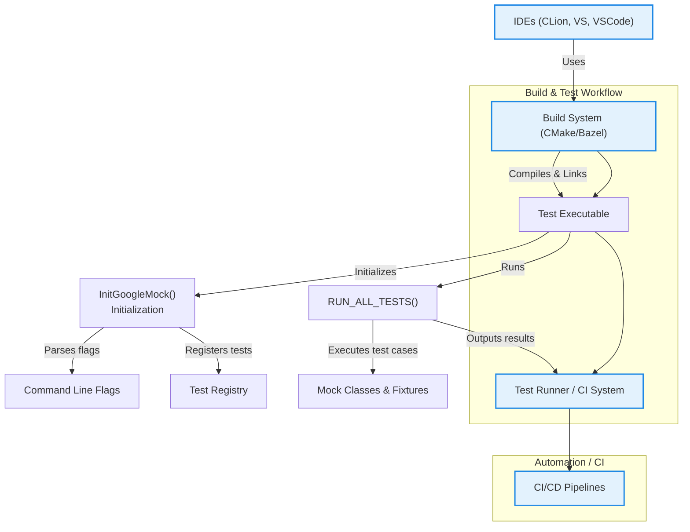

# Integration with Build Tools and Test Runners

GoogleTest and GoogleMock are designed to integrate seamlessly into a variety of build environments and test automation workflows. This flexibility enables you to scale testing from small projects to large, continuous integration pipelines, leveraging popular build systems, IDEs, and test runners.

---

## Modular Header Design

At the core of integration is the well-organized modular header structure. Including `<gmock/gmock.h>` brings in all necessary mocking functionalities, while `<gtest/gtest.h>` provides core testing APIs. These headers are designed to minimize compilation overhead and simplify inclusion across build configurations.

### Key Header Inclusions

- `<gmock/gmock.h>`: Primary header for mocking, covering mock class declaration, expectations, and matchers.
- `<gtest/gtest.h>`: Core GoogleTest APIs for assertions, test fixtures, and test lifecycle management.

By including these modular headers, your tests are straightforward to build and maintain.

---

## CMake Integration

CMake is one of the most widely used build systems in C++. GoogleTest and GoogleMock supply official CMake targets that facilitate straightforward integration:

- **Targets Provided:** `gtest`, `gtest_main`, `gmock`, and `gmock_main`.

### Example: Adding GoogleMock with CMake

```cmake
# Find the GoogleTest package, which bundles both gtest and gmock
find_package(GTest REQUIRED)

# Link your test executable with gmock_main to get a default main()
add_executable(my_tests test_main.cc other_test_files.cc)
target_link_libraries(my_tests PRIVATE GTest::gmock_main)

# Enable CTest to run the tests
enable_testing()
add_test(NAME MyTests COMMAND my_tests)
```

This setup ensures your test binary links GoogleMock and the included main function, allowing direct execution and compatibility with test runners.

You can also build with `pkg-config` using the `gmock.pc` and `gmock_main.pc` files provided in the CMake installation.

---

## Bazel Integration

For projects using Bazel, GoogleTest and GoogleMock offer native Bazel build targets. These targets can be added as dependencies to your test rules, streamlining test compilation and execution.

Typical workflow:

1. Include GoogleTest and GoogleMock in your workspace.
2. Declare dependencies on `@com_google_googletest//:gmock` or `@com_google_googletest//:gmock_main`.
3. Define your test targets that link with mocks.

This lightweight integration supports Bazel's caching and parallelism effectively.

---

## IDE Support

Popular C++ IDEs such as CLion, Visual Studio, and VS Code often integrate conveniently with CMake and Bazel projects. By including GoogleTest and GoogleMock as dependencies via these build systems, the IDEs can:

- Discover test cases and suites automatically.
- Provide test execution and debugging interfaces.
- Offer inline results and failure navigation.

Many IDEs also support GoogleTest filter flags, enabling fine-grained control over which tests to run from inside the IDE.

---

## Test Discovery and Execution

The main entry point for running GoogleTest and GoogleMock tests is usually provided by the bundled `gmock_main` or `gtest_main` libraries. These libraries contain a `main()` function that:

- Calls `testing::InitGoogleMock(&argc, argv)` to initialize GoogleMock and GoogleTest.
- Ensures command-line flags for disabling/enabling tests or setting verbosity are parsed.
- Runs all registered tests via `RUN_ALL_TESTS()`.

If you require a custom test runner, you can implement `main()` yourself and call these initialization functions manually.

---

## Command Line Options and Flags

GoogleMock recognizes and parses custom flags for controlling test behavior and output verbosity. Integration with build tools allows these flags to be passed seamlessly:

- `--gmock_verbose=LEVEL`: Controls message verbosity (`info`, `warning`, `error`).
- `--gmock_catch_leaked_mocks=0|1`: Toggles reporting of leaked mock objects.

All recognized GoogleMock flags are parsed and removed from `argv` during initialization for clean test execution.

---

## Continuous Integration (CI) and Automation

GoogleTest and GoogleMock complement CI systems such as Jenkins, GitHub Actions, and GitLab CI by:

- Supporting XML output format for easy aggregation of test results.
- Providing environment variable hooks and filters for focused test execution.
- Enabling parallel test execution via sharding and test timeouts.

Build systems can configure GoogleTest targets to run tests as part of automated pipelines, ensuring rapid feedback and code quality.

---

## Large-Scale Test Suites and Modular Discovery

For very large projects, GoogleTest supports:

- Automatic test discovery without manual registration.
- Grouping tests into suites reflecting code modules.
- Selective execution using filter expressions.

This modularity scales cleanly with build integration, minimizing burden on test harnesses and build pipelines.

---

## Summary Diagram



---

## Troubleshooting Integration Issues

- **Problem:** Tests not discovered in IDE or build system.
  - **Tip:** Ensure that test files include correct headers (`gmock/gmock.h`) and link with `gmock_main` or `gtest_main`.

- **Problem:** Command-line flags ignored.
  - **Tip:** Call `InitGoogleMock(&argc, argv)` early in `main()`. Passing incomplete `argc`/`argv` can cause parsing issues.

- **Problem:** Linking errors.
  - **Tip:** Verify linking against appropriate GoogleTest and GoogleMock libraries. Check your build files and paths.

- **Problem:** Slow build times.
  - **Tip:** Use header precompilation and modular test organization. Avoid recompiling large headers unnecessarily.

---

## Best Practices

- Use the provided `gmock_main` or `gtest_main` library for default `main` implementations to simplify integration.
- Leverage the modular headers `<gmock/gmock.h>` and `<gtest/gtest.h>` for concise code.
- Configure your build system to enable parallel test execution and easy test discovery.
- Pass GoogleMock flags via your CI or test runner’s command-line interface to control verbosity and behavior.
- Keep mocks and tests in their own libraries or targets for better maintenance.

---

## Additional Resources

- [GoogleMock README](https://github.com/google/googletest/blob/main/googlemock/README.md)
- [gMock Cheat Sheet](https://google.github.io/googletest/gmock_cheat_sheet.html)
- [Integrating GoogleTest and GoogleMock with CMake](https://github.com/google/googletest/blob/main/googletest/README.md#cmake)
- [GoogleTest Primer](https://google.github.io/googletest/primer.html)
- [GoogleMock Cookbook](https://google.github.io/googletest/gmock_cook_book.html)

---

By aligning your build configurations with GoogleTest’s modular headers and recommended libraries, and taking advantage of recognized flags and test discovery mechanisms, you ensure smooth integration into any modern C++ development workflow and continuous testing pipeline.