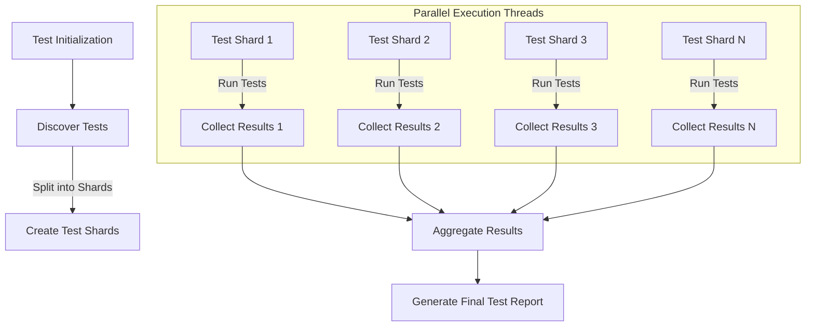

# Performance and Parallel Testing

GoogleTest empowers developers working on large C++ codebases to achieve rapid and reliable test feedback by efficiently running tests in parallel, minimizing overhead, and structuring test suites for optimal performance. This guide explains how to leverage GoogleTest’s capabilities to run tests concurrently, manage flaky tests effectively, isolate failures, and enable incremental builds that speed up the development feedback loop.

---

## Parallel Test Execution: Accelerating the Feedback Loop

Running tests in parallel is critical for large projects to reduce wall-clock test time. GoogleTest supports parallel test execution both at the process level and within a single test binary where possible.

### How Parallelism Works in GoogleTest

- **Process-level Parallelism:** Splitting tests across multiple processes or shards, with each process running a subset of tests. This is external but well-supported by CI systems integrated with GoogleTest.
- **Thread-level Parallelism:** Some internal tests use multi-threading to stress-test thread-safety and concurrency behavior in GoogleTest and GoogleMock.

The provided stress tests demonstrate the framework’s robust handling of concurrent test execution and multi-threaded mocks:

- `googletest/test/gtest_stress_test.cc` shows that GoogleTest assertions, records, and failure reporting operate correctly across 50 concurrent threads.
- `googlemock/test/gmock_stress_test.cc` confirms that mocks can safely handle numerous simultaneous threads invoking methods on mock objects including complex call order constraints.

### Benefits

- Massive reductions in test suite runtime, especially when combined with sharding.
- Possibility to expose flaky tests that reveal intermittent thread-related bugs.

<Note>
To fully leverage parallel execution, your test infrastructure (build system, CI pipelines) must support distributing and running test shards or test binaries concurrently. GoogleTest provides command-line and environment flag options to facilitate this.
</Note>

## Minimizing Overhead with Efficient Suite Structuring

The granularity and grouping of tests directly influence performance.

### Best Practices

- Group related tests into **test suites** that share fixture setup to reduce global setup costs.
- Use facilities like `TEST_F` and `SetUp()`/`TearDown()` to reuse expensive initialization.
- Avoid unnecessarily large or monolithic test suites that slow down failure isolation.

<Warning>
Over-fragmented suites can produce excessive overheads due to repeated setup/teardown. Strive for balanced grouping to optimize run times.
</Warning>

## Managing Flakiness and Isolating Failures

Performance optimization also entails maintaining test reliability.

### Strategies

- Prefer **non-fatal assertions** (`EXPECT_`) over fatal ones (`ASSERT_`) when safe, to let more failures surface in one execution.
- Use GoogleTest’s detailed failure reports and filtering (`--gtest_filter`) to pinpoint flaky or slow tests.
- Mark particularly flaky tests temporarily with `DISABLED_` prefix and address root causes with debugging aids.

### Isolating Tests

Run individual or subsets of tests when iterating locally via the familiar `RUN_ALL_TESTS()` and filtering options to quickly recreate and diagnose failure scenarios.

## Incremental Builds and Test Runs

GoogleTest smoothly fits continuous integration workflows where incremental builds and selective test runs are vital.

- Leverage your build system integration (e.g., CMake or Bazel) for incremental compilation and test binary generation.
- Use GoogleTest’s test discovery capabilities to execute only affected or targeted tests to maximize feedback efficiency.

---

## Summary

GoogleTest’s design and capabilities strongly support the needs of large-scale C++ projects with features for parallel test execution, stress testing concurrency, and structuring test suites for performance.

Developers should combine GoogleTest’s parallelism and sharding with balanced test suite organization, vigilant flaky test management, and incremental build integration to achieve fast, reliable, and maintainable test cycles.

---

## Additional Resources

- [Performance and Scalability Guide](/guides/patterns-integration/performance-optimizations)
- [Writing Maintainable Tests](/guides/troubleshooting-and-patterns/writing-maintainable-tests)
- [Running and Building Tests Introduction](/getting-started/first-test-experience/building-and-running-tests)
- [GoogleMock Cookbook](https://google.github.io/googletest/gmock_cook_book.html) for advanced mocking in multithread scenarios
- Stress test source files for concurrency examples:
  - [`gtest_stress_test.cc`](https://github.com/google/googletest/blob/main/googletest/test/gtest_stress_test.cc)
  - [`gmock_stress_test.cc`](https://github.com/google/googletest/blob/main/googlemock/test/gmock_stress_test.cc)

---

## Frequently Encountered Scenarios & Tips

<AccordionGroup title="Performance and Parallel Testing Troubleshooting">
  <Accordion title="Test Failures in Parallel Runs">
When running tests in parallel, failures might be harder to correlate. Use GoogleTest's detailed output with thread and test identifiers to trace failures. Running tests with `--gtest_output=xml` helps aggregate and analyze results in CI.
  </Accordion>
  <Accordion title="Detecting and Handling Flaky Tests">
Flaky tests often surface under parallel execution. Temporarily disable them with `DISABLED_` prefix and use verbose output (`--gtest_verbose=info`) to diagnose intermittent issues.
  </Accordion>
  <Accordion title="Optimizing Test Suites for Parallelism">
Aim to have roughly equal-sized test suites to avoid load imbalance. Use test sharding flags (`--gtest_shards=<num>`, `--gtest_shard_index=<index>`) to split workloads.
  </Accordion>
  <Accordion title="Common Pitfalls">
- Forgetting to make test fixtures thread-safe when multi-threading tests.
- Over-fragmenting tests causing excessive setup overhead.
- Ignoring flaky tests which degrade confidence in parallel test results.
</Accordion>
</AccordionGroup>

---

## Diagram: Flow of Parallel Test Execution in GoogleTest



---

## Quickstart: Setting Up Parallel Test Execution

<Steps>
<Step title="Enable Sharding">
Set the environment or command line flags:

```bash
--gtest_shards=4 --gtest_shard_index=0  # Run shard 0 of 4
```
Each shard runs a subset of total tests; run all shards in parallel on different machines/processes.
</Step>
<Step title="Invoke Tests in Each Shard">
Run the test binary in each shard with appropriate shard index. This can be automated in CI.
</Step>
<Step title="Collect and Aggregate Results">
Use `--gtest_output=xml` to export results and merge after all shards complete.
</Step>
</Steps>

---

## Practical Tips

- Consider putting time-consuming setup code in fixtures with `SetUpTestSuite()` to share across tests in the suite.
- Use `SCOPED_TRACE()` to add context inside concurrent multi-threaded tests.
- When debugging flaky or parallel tests, increase verbosity with `--gtest_verbose=info`.
- Be mindful that GoogleMock and GoogleTest are thread-safe when used correctly; avoid setting expectations concurrently while running tests.

<Check>
Test code interacting with mocks should set expectations before multi-threaded calls.
</Check>

---

## Troubleshooting

- **Test discovery failures in parallel:** Check that all shards have access to the full test binary and environment.
- **Race conditions/failures in multi-threaded tests:** Ensure thread safety in fixtures and avoid shared mutable state without synchronization.
- **Slower than expected test runtime:** Profile tests to find heavyweight slow tests; consider sharding at finer granularity.
- **Flaky failures reported only under parallel runs:** Investigate for data races or order dependencies.

---

GoogleTest’s inherent thread safety and parallel test execution support are powerful tools you must harness with attention to test organization and CI orchestration. Together, they dramatically improve testing speed and code quality in large-scale C++ projects.
