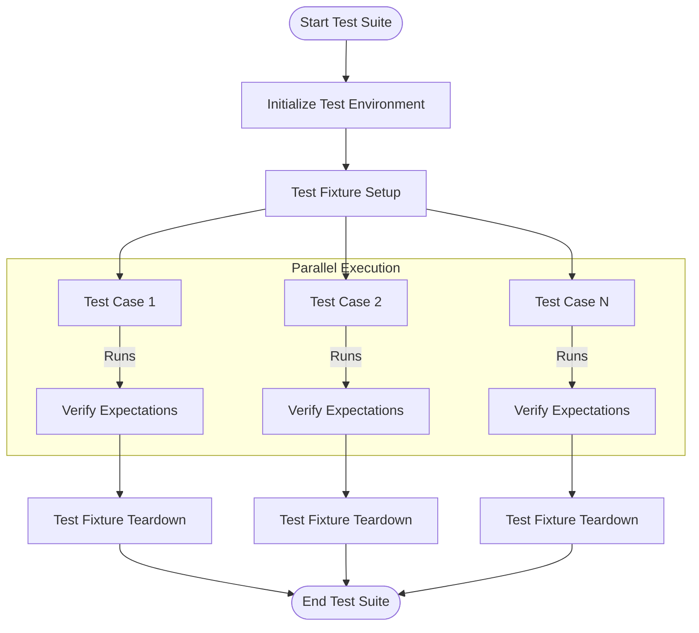

# Scalability and Performance Characteristics

## Introduction

As your project grows, your GoogleTest test suites increase in size and complexity — sometimes dramatically. Maintaining fast, reliable, and manageable test execution in large codebases is critical to ensuring developer productivity and continuous integration efficiency. This guide covers the essential concepts and best practices for scaling GoogleTest in large projects, focusing on test isolation, resource management, parallelism, and actionable diagnostics.

## Test Isolation and Independence

### Why Isolation Matters

Tests that depend on shared mutable state or resources are prone to flaky failures and non-deterministic behaviors. Such brittleness severely hinders scalability because a single flaky test can intermittently block your entire pipeline.

GoogleTest encourages writing tests that are fully isolated and independent:

- **No shared global states:** Avoid global variables or singleton states that affect tests.
- **Test fixture re-creation:** Each test runs with a fresh instance of the test fixture, minimizing cross-test pollution.
- **Avoid external dependencies:** Minimize reliance on external systems like databases, file systems, or network calls unless those are isolated or mockable.

### Using Mocks and Stubs for Dependencies

GoogleMock complements GoogleTest by providing powerful mocking capabilities.

Use mocking to replace slow or unstable external dependencies with precise expectations and controlled behaviors, ensuring tests remain fast and deterministic.

#### Example:

```cpp
class DatabaseInterface {
 public:
  virtual bool Connect() = 0;
  virtual int GetData(int id) = 0;
  virtual ~DatabaseInterface() = default;
};

class MockDatabase : public DatabaseInterface {
 public:
  MOCK_METHOD(bool, Connect, (), (override));
  MOCK_METHOD(int, GetData, (int id), (override));
};

TEST(MyFeatureTest, QueriesDatabase) {
  MockDatabase mock_db;
  EXPECT_CALL(mock_db, Connect()).WillOnce(Return(true));
  EXPECT_CALL(mock_db, GetData(42)).WillOnce(Return(100));

  MyFeature feature(&mock_db);
  EXPECT_TRUE(feature.Initialize());
  EXPECT_EQ(feature.GetValue(42), 100);
}
```

This approach allows you to simulate various scenarios instantly, improving coverage and speed.

## Resource Management

Large test suites often share limited resources such as files, hardware devices, or network ports.

### Best Practices

- **Use Scoped Resource Allocation:** Utilize RAII patterns or `SetUp`/`TearDown` to allocate and release resources cleanly per test.
- **Avoid Resource Contention:** Coordinate resource usage across tests to prevent conflicts; avoid multiple tests trying to use the same resource simultaneously.
- **Isolate via Test Fixtures:** Use test fixture classes to manage resource lifecycles per test.

### Handling Leaked Mocks and Objects

GoogleTest catches leaked mocks that remain undeleted at program exit, which could indicate unfinished verification or improper test teardown.

- Use `testing::Mock::AllowLeak(mock_object);` to explicitly allow intentional leaks.
- Prefer proper destruction of mocks to ensure expectations are verified and no hidden side effects remain.

## Parallel Test Execution

GoogleTest supports running tests in parallel, speeding up the execution time significantly on multi-core machines.

### Enabling Parallelism

- Use tools like `gtest-parallel` or leverage build systems that support parallel test execution.
- Make sure tests are independent and stateless, as parallel runs may expose concurrency issues.
- Consider sharding tests across multiple processes or machines.

### Thread Safety in Tests

- GoogleMock supports multi-threaded testing scenarios but requires synchronization when setting expectations and during setup/teardown phases.
- Always configure expectations *before* tests run in parallel threads.
- Avoid changing mock objects' behavior concurrently.

## Efficient Failure Diagnostics

### Verbosity Levels

GoogleMock provides configurable verbosity levels (`info`, `warning`, `error`) that control the amount of logging for mock calls and failures.

- Use `--gmock_verbose=info` for detailed call traces during debugging.
- Use `--gmock_verbose=warning` (the default) to get warnings for uninteresting calls.
- Use `--gmock_verbose=error` to reduce noise, showing only errors.

This flexibility helps keep test outputs manageable and focused.

### Improving Error Clarity

- Use clear, precise matchers in `EXPECT_CALL` clauses to reduce ambiguous failures.
- Structure expectations to avoid over-specification that leads to brittle tests.
- Leverage sequences and partial ordering (`InSequence`, `After`) to clarify call order requirements.

### Dealing with Excessive or Unexpected Calls

- GoogleMock reports failures for calls that exceed expectations or calls that don't match any expectation.
- Use `.RetiresOnSaturation()` to make expectations inactive once saturated.
- Use `Times(AnyNumber())` or appropriate cardinalities to catch uninteresting calls explicitly when needed.

## Continuous Integration and Scalability

### Test Suite Sharding

- Split large test suites into smaller shards to distribute load.
- GoogleTest reports can be merged to produce aggregated results.

### Test Filtering

- Use `--gtest_filter` to run a subset of tests, e.g., during development.

### Startup and Teardown Time

- Avoid expensive global or static initialization impacting test startup.
- Prefer lightweight setup to reduce overhead.

## Summary

Scaling GoogleTest suites requires the right balance of test isolation, resource management, parallelization, and clear diagnostics. Combining GoogleTest with GoogleMock empowers you to write fast, maintainable, and reliable test code — crucial to sustaining productivity as codebases evolve.

---

# References

- [EXPECT_CALL Macro](https://github.com/google/googletest/blob/main/docs/reference/mocking.md#expect_call)
- [ON_CALL Macro](https://github.com/google/googletest/blob/main/docs/reference/mocking.md#on_call)
- [GoogleMock Cookbook](https://github.com/google/googletest/blob/main/docs/gmock_cook_book.md)
- [GoogleMock Verbosity Control](https://github.com/google/googletest/blob/main/docs/gmock_output_test_.cc)
- [GoogleMock Leak Detection](https://github.com/google/googletest/blob/main/googlemock/src/gmock-spec-builders.cc#L234)

---

## Troubleshooting Tips

<AccordionGroup title="Common Issues and Solutions">
<Accordion title="Flaky Tests due to Shared State">
Ensure that your tests do not depend on global variables or static state. Use test fixtures to reset state before each test.
</Accordion>
<Accordion title="Uninteresting Mock Function Call Warnings">
Use `NiceMock` to suppress these warnings or explicitly specify expectations for calls you want to allow without strict verification.
</Accordion>
<Accordion title="Test Failures from Excessive Calls">
Use `.RetiresOnSaturation()` on expectations or adjust cardinalities with `.Times()` to allow more calls when appropriate.
</Accordion>
<Accordion title="Parallel Execution Failures">
Verify that no mocks or shared resources are accessed concurrently in unsafe ways; use synchronization or rewrite tests for thread safety.
</Accordion>
</AccordionGroup>

## Practical Tips

- Write your mock expectations as close as possible to the test setup to improve readability.
- Use the default actions (`ON_CALL`) to reduce redundant expectations.
- Leverage sequences (`InSequence`) to enforce call order where necessary.
- Include meaningful descriptions in expectations using `.Description()` to ease debugging.

---

# Diagram: Test Execution Flow in Large Projects



This illustrates parallel test case execution under isolated fixture setups and cleanups, promoting scalability and test reliability.

---

# Conclusion

Scaling your GoogleTest test suites to handle large projects requires thoughtful test design, mocking discipline, resource strategies, and leveraging parallelism. By applying these principles and utilizing GoogleMock's features effectively, you deliver robust tests that accelerate development and safeguard quality.

Explore related topics such as "Mocking Patterns and Verification," "Improving Test Performance," and "Test Organization Best Practices" for deeper mastery.