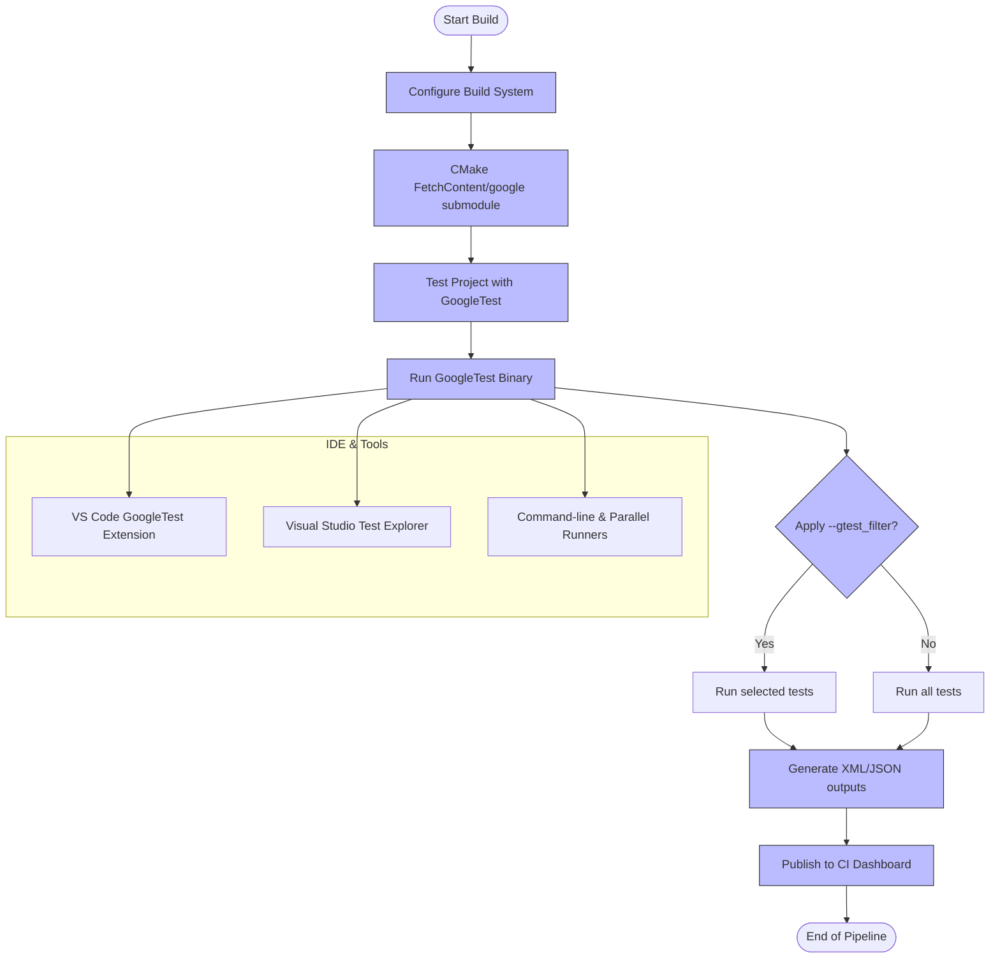

# Integration Patterns and Ecosystem Interoperability

GoogleTest is more than a standalone testing library: it is designed to integrate seamlessly into modern C++ build, continuous integration (CI/CD), and tool ecosystems. This guide explains how GoogleTest fits into these workflows, detailing common integration patterns with build systems and other tooling, along with the design choices that ensure reliability and scalability in large environments.

---

## How GoogleTest Integrates Into Your Build System

GoogleTest supports various mechanisms for integration into your project’s build process, aiming for easy adoption without sacrificing flexibility.

### Using GoogleTest with CMake

*GoogleTest ships with official CMake support*, enabling straightforward incorporation into CMake-based projects. You can either build GoogleTest as a standalone project and link against installed targets or embed it directly as part of your project build tree.

**Typical workflow with FetchContent**:

```cmake
include(FetchContent)
FetchContent_Declare(
  googletest
  URL https://github.com/google/googletest/archive/5376968f6948923e2411081fd9372e71a59d8e77.zip
)
set(gtest_force_shared_crt ON CACHE BOOL "" FORCE)
FetchContent_MakeAvailable(googletest)

add_executable(my_test test_main.cpp)
target_link_libraries(my_test gtest_main)
add_test(NAME my_test COMMAND my_test)
```

This ensures consistent compiler flags and build options between GoogleTest and your code.

### Other Build Systems

GoogleTest can be integrated into other build systems such as Bazel manually by adding relevant workspace entries and linking against gtest targets. For manual or custom build systems, simply include GoogleTest headers and link to precompiled GoogleTest binaries or build the source as part of your build.

<br>

<Tip>
Refer to the guide on [Integrating with CMake and Bazel](../guides/test-automation-and-integration/integrating-with-build-systems) for detailed step-by-step instructions and troubleshooting.
</Tip>

---

## Continuous Integration (CI) and Test Automation Workflows

GoogleTest’s architecture and CLI flags are tailored to modern CI/CD environments where automated test execution, filtering, and reporting are essential.

### Running Tests in CI

You can control which tests run, their ordering, and output format with GoogleTest flags:

- `--gtest_filter` to run a subset of tests.
- `--gtest_output=xml:<file>` to generate reports consumable by CI dashboards.
- `--gtest_repeat` and `--gtest_shuffle` for robustness testing.
- `--gtest_shard_count` and `--gtest_test_shard_index` for test sharding.

A typical CI pipeline sequence:

1. Build your test binaries using your build system.
2. Invoke the test binary with appropriate flags to run selected tests and generate XML reports.
3. Publish reports and logs to your CI server.

<br>

<Steps>
<Step title="Configure Test Selection and Output">
Set up command-line flags like `--gtest_filter` for targeted testing and `--gtest_output=xml` for structured results.
</Step>
<Step title="Execute Tests">
Run `./my_test_binary`; GoogleTest runs selected tests, sharding and repeating as configured.
</Step>
<Step title="Collect and Analyze Reports">
CI parses XML reports, aggregates results, and displays summaries with links to logs and failing tests.
</Step>
</Steps>

<Tip>
The [Running Tests in CI](../guides/test-automation-and-integration/running-tests-in-ci) guide provides deeper insights and examples.
</Tip>

---

## Interoperability with Third-Party Tools

GoogleTest is designed to work smoothly with a range of tools across the C++ ecosystem.

### IDE Support

- **Visual Studio**: Integration via extensions and default support for test discovery and execution.
- **VS Code**: GoogleTest extensions can discover and run tests, display in test explorers.
- **CLion** and other JetBrains Tools: Native support for GoogleTest with test runners and output parsing.

### Test Reporting and Format Support

- GoogleTest natively supports XML output via `--gtest_output=xml`, fitting into standard CI reporting workflows.
- It supports TAP listeners and can be extended with custom listeners via its event listening framework.

### Test Filtering and Execution Control

- GoogleTest supports granular filtering by test suite and test name.
- Test sharding and parallel execution flags enable integration with distributed and parallel test runners like `gtest-parallel`.

### Extensibility and Customization Points

GoogleTest’s listener interfaces and internal helpers (see API references) allow advanced users to integrate with custom monitoring, logging, or analytics tools.

<br>

<Info>
GoogleTest provides a robust, extensible event listener framework that enables integration with non-standard reporting systems and test harnesses.
</Info>

---

## Reliability and Scalability at Scale

GoogleTest’s multi-thread-safe architecture and design for test isolation ensure that tests remain reliable and scalable as test suites grow.

### Thread Safety

- GoogleTest is thread-safe on platforms with pthreads support.
- The framework carefully coordinates test execution and result reporting for parallel or concurrent test runs.

### Test Isolation

- Each test runs in a fresh fixture instance.
- Global test environments can be registered, with well-defined lifecycle hooks for setup and teardown.

### Scalability Features

- Test sharding divides tests across multiple worker nodes.
- Repeat modes and randomized test ordering help detect flaky tests.

### Interaction with GoogleMock

- GoogleMock supports safe concurrent mock usage across threads when used according to documented rules.
- Expectations and actions remain consistent and thread-safe.

<br>

<Note>
The multi-threaded usage of GoogleMock is detailed in the [Using GoogleMock Effectively](../guides/mocking-and-advanced-testing/using-googlemock-effectively) guide.
</Note>

---

## Summary Diagram of Integration Workflow



---

## Practical Tips for Smooth Integration

- Always call `testing::InitGoogleTest(&argc, argv)` before `RUN_ALL_TESTS()` to initialize flags and environment.
- Use CMake's `FetchContent` or add_subdirectory to keep GoogleTest in sync with your project’s toolchain.
- Leverage `--gtest_output=xml` for consistent CI reporting.
- Use `--gtest_filter` and test sharding capabilities to speed up large test suites.
- Consider custom event listeners for specialized reporting needs or integration with proprietary tools.
- Manage mock behavior carefully in multi-threaded contexts to avoid race conditions.

---

## Troubleshooting Integration Issues

- Linking errors often stem from missing or incompatible GoogleTest libraries – ensure correct linking as per your build system.
- Misconfigured filters can lead to zero tests running; verify patterns comply with GoogleTest syntax.
- Parallel execution may expose concurrency issues; isolate tests and leverage GoogleMock’s thread-safety guidelines.

<br>

<AccordionGroup title="Common Integration Issues and Solutions">
<Accordion title="Build Failures or Linker Errors">
Check that GoogleTest libraries are correctly linked and built with your toolchain. For CMake, ensure `gtest` and `gtest_main` targets are included.
</Accordion>
<Accordion title="Tests Not Discovered or Running">
Verify your naming conventions, that tests are registered, and your `--gtest_filter` does not exclude all tests.
</Accordion>
<Accordion title="Concurrency and Flaky Test Failures">
Review use of shared resources; use synchronization primitives or isolate tests. GoogleTest and GoogleMock support concurrency but require correct usage.
</Accordion>
</AccordionGroup>

---

## Additional Resources

- [GoogleTest Primer](../overview/product-intro-and-value/what-is-googletest) – Getting started with basics.
- [Integrating with CMake and Bazel](../guides/test-automation-and-integration/integrating-with-build-systems) – Practical build system integration.
- [Running Tests in CI](../guides/test-automation-and-integration/running-tests-in-ci) – Automate running and reporting tests.
- [GoogleMock and Thread Safety](../guides/mocking-and-advanced-testing/using-googlemock-effectively) – Best practices for mocking in concurrent contexts.
- Official [GoogleTest GitHub Repository](https://github.com/google/googletest) – Source and samples.

---

Leveraging these patterns will embed GoogleTest naturally into your C++ development lifecycle, ensuring robust, scalable, and maintainable test automation.
