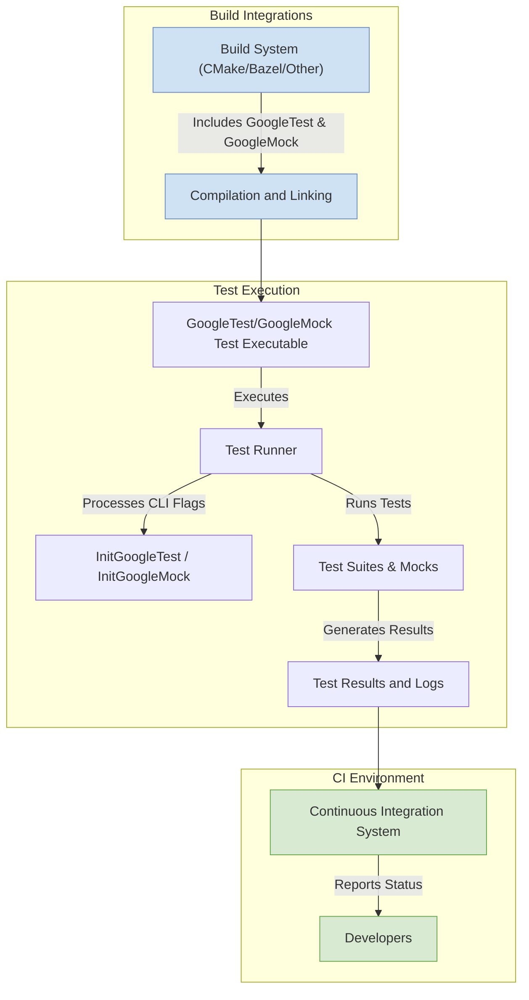

# Integration Patterns & System Compatibility

GoogleTest and GoogleMock are designed to integrate seamlessly into a variety of build systems and continuous integration (CI) pipelines, supporting workflows across multiple platforms. This guide explains how these frameworks fit into popular build environments like CMake and Bazel, outlines integration hooks, and covers environment configuration options to ensure smooth and reliable testing.

---

## Integration with Build Systems

### CMake

GoogleTest and GoogleMock provide dedicated support for CMake, the de facto standard for cross-platform C++ build configuration.

- **FetchContent & ExternalProject:** You can incorporate the googletest and googlemock sources directly through CMake's `FetchContent` or `ExternalProject` modules. This eliminates the need for manual downloads or separate installation steps.
- **Targets:** The project exports targets such as `gtest`, `gtest_main`, `gmock`, and `gmock_main` that can be linked into your tests.
- **Customization:** Various CMake options allow customizing compilation flags, enabling or disabling building of tests, and controlling installation.

**Example usage:**

```cmake
include(FetchContent)
FetchContent_Declare(
  googletest
  GIT_REPOSITORY https://github.com/google/googletest.git
  GIT_TAG main
)
FetchContent_MakeAvailable(googletest)

add_executable(MyTest test.cpp)
target_link_libraries(MyTest gtest_main gmock_main)
```

### Bazel

Bazel users can integrate GoogleTest and GoogleMock via the official BUILD targets.

- **Predefined Rules:** Bazel repositories often include `@com_google_googletest//:gtest` and `@com_google_googletest//:gmock` as accessible targets.
- **Test Rules:** You can define `cc_test` rules that depend on gtest and gmock libraries to create unit tests.
- **Cross-platform:** Bazel enforces hermetic builds and caching, enabling fast and reproducible test runs.

**Example snippet:**

```bazel
cc_test(
  name = "my_test",
  srcs = ["test.cpp"],
  deps = ["@com_google_googletest//:gmock_main"],
)
```

### Manual and Other Build Systems

While CMake and Bazel are primary supported build systems, GoogleTest and GoogleMock can be manually integrated by including source files and headers directly. However, this approach requires careful attention to compiler flags, linkage, and platform-specific configurations.


---

## Continuous Integration (CI) Pipeline Integration

GoogleTest and GoogleMock fit well into diverse CI setups:

- **Command-line invocation:** The test runners are designed for command-line use, supporting filtering of tests, output styling, and detailed failures.
- **Exit codes:** Following standard conventions, the test runner returns zero on success and non-zero on failure, making it easy to incorporate automated checks.
- **Verbosity controls:** Users can configure log verbosity to fine-tune the feedback from test runs, for example using `--gmock_verbose=info|warning|error`.
- **Cross-platform portability:** The framework supports Linux, Windows, macOS, BSD variants, and embedded systems, allowing consistent test execution across environments.


---

## Cross-Platform Workflows

GoogleTest and GoogleMock emphasize compatibility:

- **Consistent API:** The user experience and APIs remain consistent regardless of platform.
- **Compiler compatibility:** Requires C++17-compliant compilers with support for modern features.
- **Macros and configuration:** Platform-specific macros identify OS and compiler for conditional compilation.
- **Thread safety:** The framework supports multi-threaded tests safely when used according to guidelines.


---

## Integration Hooks and Environment Configuration

Users can customize integration and test behavior via:

- **gtest and gmock initialization:** Use `testing::InitGoogleTest(&argc, argv)` or `testing::InitGoogleMock(&argc, argv)` in `main()` to parse test-related flags and initialize the framework.
- **Flags:**
  - `--gmock_verbose` controls how much detail logs produce.
  - `--gtest_filter` lets you run subsets of tests.
  - `--gmock_catch_leaked_mocks` controls mock leak detection.
- **Mock strictness modifiers:**
  - `NiceMock`, `NaggyMock`, and `StrictMock` wrappers provide varying strictness levels, affecting warning and error behavior for uninteresting mock calls.
- **Mock object lifecycle:**
  - Users can control verification timing via scoped destruction or explicit calls to `Mock::VerifyAndClearExpectations`.


---

## Practical Recommendations and Best Practices

- Prefer using `FetchContent` in CMake or the official Bazel targets to avoid manual source management.
- Set up the default mock behaviors using `ON_CALL` and specify expectations with `EXPECT_CALL` to clarify intent.
- Control verbosity during CI runs to reduce noise but keep enough detail for debugging failures.
- Use `NiceMock` to suppress warnings on uninteresting calls during routine test runs, and `StrictMock` when needing precise call control.
- Remember to call the appropriate initialization function (`InitGoogleMock` or `InitGoogleTest`) before running tests.


---

## Troubleshooting Integration Issues

- Verify compiler compatibility with C++17 or higher.
- Ensure proper linkage of gtest and gmock libraries.
- Use the verbosity flags to capture detailed log information during test runs.
- When integrating into complex build systems, confirm that the correct include paths and link flags are applied.
- Confirm CI environment matches local environment for consistent test execution.


---

## Diagram: Integration Flow with Build and CI Systems


```

---

For further details, see the official [gMock for Dummies](https://google.github.io/googletest/gmock_for_dummies.html) and [Mocking Reference](https://google.github.io/googletest/reference/mocking.html).


---

## Additional Resources

- [GoogleTest GitHub Repository](https://github.com/google/googletest)
- [gMock Cookbook](https://google.github.io/googletest/gmock_cook_book.html)
- [Integration with Bazel](https://docs.bazel.build/versions/main/gcc.html#googletest) (external)
- [CMake Integration](https://cmake.org/cmake/help/latest/module/FetchContent.html) (external)

---


<script async src="https://www.googletagmanager.com/gtag/js?id=UA-XXXXXX-Y"></script>


