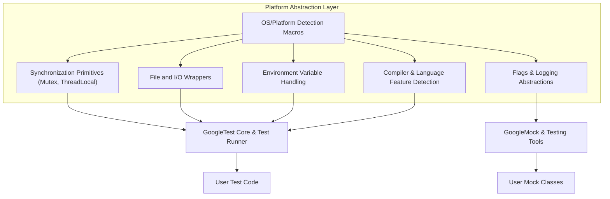

# Platform Portability and Compatibility

GoogleTest (and its companion GoogleMock) are designed to run consistently and reliably across a wide variety of platforms, compilers, and environments. This page explains how GoogleTest abstracts away the differences between operating systems and compilers, ensuring that your tests remain portable and compatible regardless of your development or target environment.

---

## Understanding Platform Portability in GoogleTest

### Why Portability Matters

Imagine you are writing tests for cross-platform C++ code that must work seamlessly on Linux, Windows, macOS, and even embedded systems. Variations in OS-level APIs, threading libraries, compiler features, and language standards could easily break your tests or force you to write platform-specific code. GoogleTest minimizes this burden through careful abstraction layers, enabling you to focus on writing tests rather than wrestling with platform quirks.

### Platform-Neutral Operation

GoogleTest detects the operating system and environment during compilation and adapts accordingly. It supports:

- Multiple operating systems, including Windows (Desktop and variations), Linux, macOS, FreeBSD, OpenBSD, QNX, Solaris, Fuchsia, and others.
- Different compilers and language features, with a baseline requirement of C++17.
- Threading support, with abstraction over pthreads and Windows threads.
- Environment-specific capabilities like file system access, regular expressions, and exception handling.

### Detection Macros

GoogleTest internally defines macros indicating the compilation platform, such as:

- `GTEST_OS_WINDOWS`
- `GTEST_OS_LINUX`
- `GTEST_OS_MAC`
- `GTEST_OS_FREEBSD`
- `GTEST_OS_QNX`

These allow conditional compilation within GoogleTest itself and enable customizing or extending portability where needed.


## Core Compatibility Mechanisms

### Abstraction Headers (`gtest-port.h` and `gmock-port.h`)

GoogleTest and GoogleMock place their platform abstraction logic primarily in internal headers like `gtest-port.h` and `gmock-port.h`. These headers handle:

- Defining platform-specific features and environment capabilities.
- Declaring synchronization primitives: mutexes, locks, thread-local storage compatible across platforms.
- Providing wrappers for system calls with differing implementations, e.g., file operations and error handling.
- Managing symbol visibility and exporting API symbols consistently.

##### Customization Points

In addition, users can extend or override certain macros via the customization directories (`custom/gtest-port.h` and `custom/gmock-port.h`). This helps adapt GoogleTest to unusual or unsupported environments by defining custom implementations for features like threading, logging, or temporary directories.

### Compiler and Language Standard Support

GoogleTest requires **at least C++17 support**. It also:

- Detects whether RTTI and exception support are enabled, adjusting internal code accordingly.
- Supports compilers including MSVC (Visual Studio 2015 and later), GCC, Clang, and several specialized toolchains.
- Provides options to disable or enable exceptions, RTTI, and other features for embedded or constrained systems.

### Threading and Synchronization

GoogleTest abstracts threading and synchronization primitives:

- Uses **pthread** on POSIX systems when available.
- Uses native Windows threading primitives on Windows.
- Provides internal `Mutex`, `MutexLock`, and `ThreadLocal` abstractions that behave consistently across platforms.
- Detects and adapts to platforms lacking threading support, providing dummy implementations where necessary.

## Flag and Logging Portability

GoogleMock integrates with GoogleTest's portability layer and builds on top of Abseil's flag system when available. Flags are defined using macros that adapt to the environment:

```cpp
// Example macros for defining flags in gmock-port.h
#define GMOCK_DEFINE_bool_(name, default_val, doc) \
  ABSL_FLAG(bool, gmock_##name, default_val, doc)
```

If Abseil is not present, GoogleMock mimics flag storage with plain global variables ensuring compatibility.

Similarly, logging macros are abstracted to work across platforms. Users can supply custom logging implementations if desired, especially on embedded or highly customized platforms.

## Handling Platform-Specific Limitations and Failures

### Known Limitations

Some platforms or compiler configurations may have limitations. For example:

- Thread safety is limited or unavailable on some systems.
- Certain embedded platforms might lack full file system support, affecting features like death tests or output capturing.
- Stream redirection capabilities vary, which can alter test output capture behavior.

GoogleTest provides compile-time and runtime detection of such capabilities, gracefully disabling unsupported features.

### Avoiding Platform-Specific Failures

Best practices for ensuring portability:

- Avoid relying on platform-specific features unless guarded by feature detection macros.
- Use GoogleTest's provided abstractions and APIs rather than direct OS calls.
- Extend or override portability macros only when necessary.
- Regularly test your test suite on all target platforms.

## Building and Integration Considerations

GoogleTest provides extensive support for building with tools like CMake and Bazel, which respect platform differences:

- Compiler flags and link options are set based on the detected platform.
- On Windows, special attention is given to runtime library linkage (static vs dynamic CRT).
- Platform-specific dependencies such as pthreads or Windows threading are linked automatically as needed.

Example CMake snippet for Windows runtime linkage adjustment:

```cmake
if (MSVC AND NOT BUILD_SHARED_LIBS)
  string(REPLACE "/MD" "-MT" CMAKE_CXX_FLAGS "${CMAKE_CXX_FLAGS}")
endif()
```

This ensures that tests built on Windows work without runtime conflicts.

## Summary Diagram of Portability Layer



This diagram illustrates that GoogleTest's core internal layer adapts testing functionality based on platform detection and abstracts essential OS, compiler, and environment differences.

---

## Practical Tips for Leveraging Platform Portability

- **Write tests agnostic of platform features:** Use GoogleTest APIs without embedding direct OS calls.
- **Leverage Customization Points:** If targeting unique platforms, extend portability macros in the `custom` headers.
- **Check feature macros:** Use GoogleTest's feature macros (e.g., `GTEST_HAS_PTHREAD`) to conditionally compile platform-specific tests.
- **Test across platforms:** Validate your test suite on all deployment platforms to detect portability issues early.

---

## Troubleshooting Common Portability Issues

### 1. Tests Fail to Compile on a Certain Platform

- Verify that your compiler supports C++17 as required.
- Check if any macros in `custom/gtest-port.h` or `custom/gmock-port.h` need adjustments.
- Ensure threading flags (`GTEST_HAS_PTHREAD`) and environment variables are correctly set.

### 2. Thread Safety Not Working or Tests Flake Under Concurrency

- Confirm that your platform supports threading as GoogleTest requires (`GTEST_IS_THREADSAFE` macro).
- On Windows, verify correct CRT linkage (static vs dynamic).

### 3. Flags or Logging Do Not Behave as Expected

- If using Abseil flags, ensure Abseil dependencies are included.
- If on a minimal platform, consider customizing flag macros to suit your runtime.

### 4. File System or I/O Redirection Fails

- Check `GTEST_HAS_FILE_SYSTEM` and `GTEST_HAS_STREAM_REDIRECTION` macros.
- Avoid tests that depend on file I/O in restricted environments.

---

## Related Documentation

- [GoogleTest Primer](docs/primer.md) — Introduction and test writing basics.
- [Portability and Internal Utilities](api-reference/advanced-customization/portability-internals.mdx) — More on low-level compatibility.
- [System Architecture Overview](concepts/core-architecture/system-overview.mdx) — How components interact including portability layer.
- [Supported Platforms](docs/platforms.md) — List of officially supported OSes and compilers.
- [GoogleTest Build & Installation Guides (CMake, Bazel)](googletest/README.md) — Platform-aware build integration.
- [Customization Points](googletest/include/gtest/internal/custom/README.md) — How to extend portability support.

---

## Conclusion

GoogleTest’s detailed internal abstractions and compile-time detection of platform capabilities ensure your C++ tests are portable, reliable, and consistent across a wide range of operating systems and compilers. Understanding these layers empowers you to write tests once and run them anywhere, unlocking seamless cross-platform testing workflows and boosting development confidence.


---

<Check>
To maximize portability, always keep your tests platform agnostic and leverage GoogleTest’s abstraction layers and customization macros. Validate your setup regularly on all target platforms to catch any compatibility gaps early.
</Check>

<Info>
Explore the `custom` directory headers if your platform needs special adaptations beyond the standard environment assumptions.
</Info>

