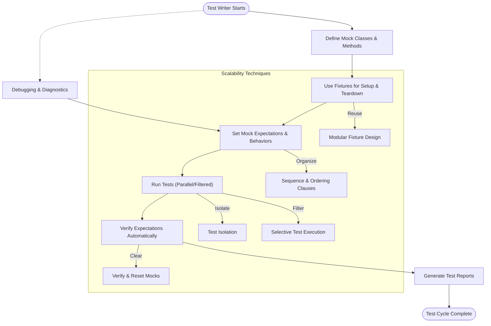

# Scalable Testing Patterns

Explore patterns and design techniques for scaling tests, including test isolation, fixture reuse, and test discovery in large projects. Learn how the framework facilitates robust, maintainable, and performant test suites.

---

## Introduction

As C++ projects grow in size and complexity, maintaining fast, reliable, and manageable test suites becomes critical. This page introduces scalable testing patterns supported by the GoogleTest and GoogleMock frameworks to help teams build robust tests that scale gracefully with their codebase.

You will learn techniques for isolating tests, reusing setup code effectively, and enabling efficient test discovery and execution in large-scale projects. These patterns are essential for maintaining continuous integration pipelines and supporting rapid feedback during development.

---

## 1. Test Isolation

Maintaining test isolation is paramount for scaling tests safely. Isolated tests ensure:

- **Predictability:** Each test runs independently without interference from others.
- **Parallelism:** Tests can execute concurrently, dramatically reducing total test run time.
- **Maintainability:** Failures are easier to diagnose because side effects are contained.

### How GoogleTest Supports Isolation

GoogleTest's test framework structure enables isolation through:

- **Fixture Classes**: Use test fixtures (`TEST_F`) to encapsulate setup and teardown logic for related tests. Fixtures keep test state tightly scoped and promote reuse without shared mutable state across tests.
- **SetUp and TearDown**: Implement `SetUp()` and `TearDown()` methods in fixtures to prepare clean environments for each test method execution.
- **Isolated Test Instances**: GoogleTest creates a new fixture instance for each test, preventing state leakage.

### Best Practices

- Avoid global or static mutable state that can be shared inadvertently.
- Use mock objects (`gMock`) to isolate dependencies, controlling interactions explicitly.
- Keep tests independent and deterministic to enable parallel execution.

<Check>
Isolate your tests by structuring your tests into fixtures and avoid shared state to maximize scalability.
</Check>

---

## 2. Fixture Reuse and Modular Setup

Repeated setup code across many tests slows test creation and upkeep. Reusing fixtures and modularizing setup helps scale test development:

### Fixture Sharing Patterns

- **Base Fixture Classes:** Define abstract base fixtures encapsulating common setup, then derive specialized fixtures for subsets of tests.
- **Composition Over Inheritance:** Factor reusable components into helper classes or utilities used by fixtures.
- **Parameterized Tests:** Use `TEST_P` and `INSTANTIATE_TEST_SUITE_P` to run the same test logic on multiple inputs or configurations, minimizing duplication.

### Practical Example

```cpp
class DatabaseTestBase : public ::testing::Test {
 protected:
  void SetUp() override {
    ConnectToTestDatabase();
    PrepareSchema();
  }
  void TearDown() override {
    DisconnectDatabase();
  }
};

class UserModelTest : public DatabaseTestBase {
  // Tests for User model functionality
};
```

This pattern provides the benefits of isolation and reduces boilerplate.

### Tips for Scalable Fixtures

- Limit expensive setup by sharing fixtures only when tests truly require the same environment.
- Use `SetUpTestSuite()` and `TearDownTestSuite()` for global one-time setup/teardown to save test time without sacrificing isolation.
- Use dependency injection and mocks (`gMock`) to replace heavy or slow dependencies.

---

## 3. Efficient Test Discovery in Large Projects

GoogleTest automatically discovers tests via static registration macros. This works well even as test suites grow large.

### How It Works

- Test macros (`TEST`, `TEST_F`, `TEST_P`) register tests statically in a global linked list.
- The test runner queries this registry at execution time to enumerate and invoke tests.

### Optimizing Discovery and Runtime

- Group related tests into test suites for organized reporting and selective execution.
- Use `--gtest_filter` to focus test runs, accelerating debug cycles.
- Implement test sharding or parallel execution (via external tools) for huge test collections.

### Integrating with Continuous Integration

- Leverage test segmentation and selective test runs (e.g., targeting changed modules) for fast CI feedback.
- Use test timeout flags and flaky test detection to improve stability.

---

## 4. Managing Mock Expectations at Scale

Mock objects (via GoogleMock) allow precise control of dependencies, essential for scalable tests:

- **Controlling Call Expectations**: Use `EXPECT_CALL` to specify the expected calls, their order, and return behaviors.
- **Sequence and Ordering**: Use `Sequence`, `InSequence`, and `After()` to model complex interaction orders without brittle tests.
- **Managing Uninteresting Calls**: Use `NiceMock`, `NaggyMock`, and `StrictMock` to handle warnings or failures on unanticipated calls, according to test strictness needs.

### Reusing and Composing Mocks

- Define reusable mock classes in shared locations, preferably close to the interface or component they mock.
- Use helper functions to set common expectations or default behaviors across tests.

### Best Practices

- Favor `ON_CALL` for setting default behaviors shared across tests.
- Use precise matchers and cardinalities (`Times`, `AtLeast`, etc.) to avoid brittle tests.
- Retire expectations with `.RetiresOnSaturation()` when modeling sequences that should deactivate older expectations.

---

## 5. Performance Considerations and Debugging at Scale

Large projects require attention to test performance and debuggability:

- Minimize unnecessary setup/teardown per test for faster runs.
- Use `--gmock_verbose=info` to trace mock call matching during debugging.
- Balance `NiceMock` and `StrictMock` usage to reduce noise but catch regressions.

### Troubleshooting Common Scaling Issues

- Look out for excessive or redundant expectations that slow down runs.
- Diagnose flaky or order-dependent tests by leveraging sequencing features.
- Use mocks’ built-in verification and explicit expectation clearing (`Mock::VerifyAndClear`) for incremental testing.

---

## Summary

Scalable testing with GoogleTest and GoogleMock involves careful design of isolated, reusable test fixtures, efficient test discovery, and sophisticated mock management. These patterns empower teams to maintain fast, clean, and effective test suites as codebases grow.

Continue your learning journey by exploring related documentation such as the [gMock Cookbook](https://google.github.io/googletest/gmock_cook_book.html), [Mocking Reference](https://google.github.io/googletest/reference/mocking.html), and [gMock Cheat Sheet](https://google.github.io/googletest/gmock_cheat_sheet.html).

---

## Additional Resources

- [Defining Mock Methods and Classes](https://google.github.io/googletest/api/gmock_reference.html#MockingReference-MOCK_METHOD)
- [Setting Call Expectations and Cardinalities](https://google.github.io/googletest/reference/mocking.html#EXPECT_CALL)
- [Matchers Reference](https://google.github.io/googletest/reference/matchers.html)
- [Actions Reference](https://google.github.io/googletest/reference/actions.html)
- [Test Runner Entrypoints and Initialization](https://google.github.io/googletest/reference/test_runner_entrypoint.html)


---

## Diagram: Scalable Testing Workflow



