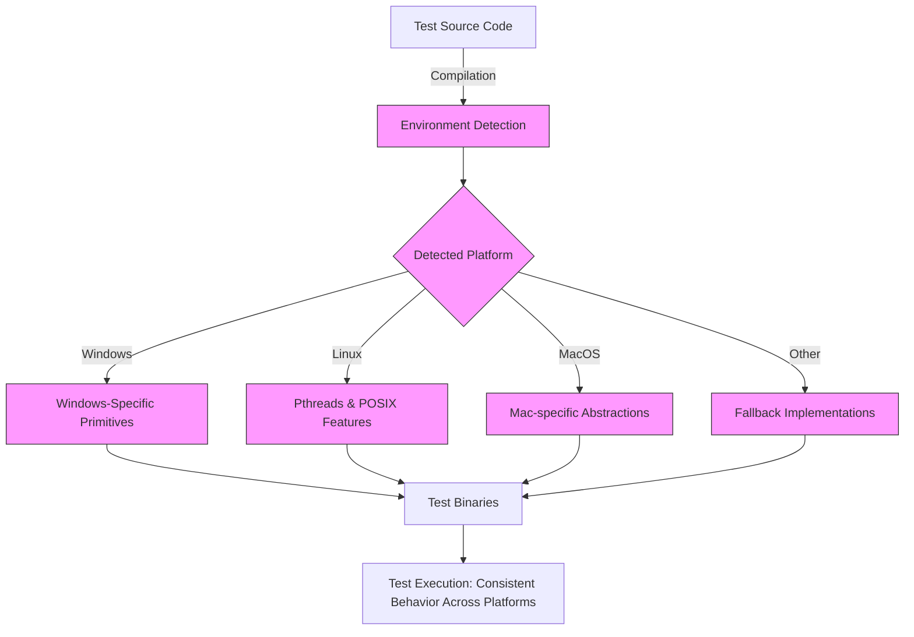

# Portability and Platform Support

GoogleTest is designed with portability at its core, enabling consistent and reliable test execution across a wide variety of operating systems, compilers, and build environments. This guide provides a conceptual overview of the mechanisms GoogleTest employs to detect and adapt to different platforms, ensuring your tests remain robust and behave consistently regardless of where they run.

---

## Understanding Platform Variability in Testing

When writing and running tests, unexpected differences between platforms can lead to flaky tests, subtle bugs, or even compilation failures. Factors like differing compiler behaviors, threading models, filesystem characteristics, and operating system APIs can influence test outcomes. GoogleTest addresses these concerns by abstracting platform-specific details and providing unified interfaces and macros that normalize behavior across environments.

**User Goal:** Write tests once and run them reliably on Windows, Linux, macOS, embedded systems, and other supported platforms without modifying test logic or worrying about platform-specific quirks.

---

## Key Concepts Behind Portability in GoogleTest

### 1. Environment Detection Macros

GoogleTest uses a rich set of predefined macros that automatically identify the operating system, compiler, and certain platform features during compilation. These macros allow GoogleTest to tailor its behavior precisely to the environment.

- **Platform Indicators:** Macros such as `GTEST_OS_WINDOWS`, `GTEST_OS_LINUX`, `GTEST_OS_MAC`, and various others denote the detected operating system.
- **Feature Flags:** Macros like `GTEST_HAS_PTHREAD`, `GTEST_HAS_EXCEPTIONS`, `GTEST_HAS_RTTI`, and `GTEST_HAS_FILE_SYSTEM` signal availability of threading libraries, exception support, runtime type information, and filesystem support.

This detection enables GoogleTest to enable or disable features, adjust synchronization primitives, and choose appropriate implementations for platform-dependent functionality.

### 2. Abstraction of System Primitives and APIs

GoogleTest encapsulates access to system-level features such as:

- **Thread Synchronization:** Uses platform-specific mutexes and thread-local storage mechanisms uniformly, hiding differences between pthreads and Windows kernel objects.
- **Filesystem Operations:** Provides a consistent interface for file handling, path separators, and directory operations, automatically adapting path styles and method implementations to the host OS.
- **Regular Expressions:** Chooses the best available regex engine — RE2, POSIX regex, or a simple built-in regex — based on platform capabilities.

### 3. Compiler and Build Tool Compatibility

Portability extends not only to runtime but also to compile-time. GoogleTest:

- Supports major compilers including MSVC (Visual Studio 2015 and later), GCC, Clang, Intel, and others.
- Requires a minimum standard of C++17 for reliable compilation and features.
- Includes build system integrations (e.g., CMake configurations) that detect platform and compiler specifics to apply suitable flags automatically.

### 4. Feature Enablement and Fallbacks

Where advanced features or libraries are not available, GoogleTest gracefully falls back to simplified implementations or disables some features while maintaining core testing functionality. For example:

- On platforms lacking pthread support, a non-threadsafe fallback is used, with warnings about concurrency.
- When Wide String support (`std::wstring`) is unavailable, GoogleTest adjusts output and test behavior correspondingly.

This approach ensures tests can still run, albeit sometimes with reduced feature sets.

---

## How Portability Works in Practice

### User Flow: Writing Portable Tests

1. **Write your tests as normal** using GoogleTest APIs without embedding platform-specific code.
2. **Compile your tests on the target platform** using a supported compiler.
3. GoogleTest internally uses environment detection macros to configure itself correctly, enabling matching implementations of threading, file I/O, and other primitives.
4. **Run the tests on any supported platform**, relying on GoogleTest to correctly handle platform differences.

### Example: Platform-Independent File Access

GoogleTest abstracts the path separator used in file paths:

```c++
#ifdef GTEST_OS_WINDOWS
  const char kPathSeparator = '\\';
#else
  const char kPathSeparator = '/';
#endif

std::string filepath = std::string("testdata") + kPathSeparator + "input.txt";
```

The macros automatically reflect the detected platform, so your tests can work seamlessly on Windows or UNIX-like systems.

### Flagging and Feature Control

Advanced users can override detection or enable flags explicitly through compiler definitions (e.g., `-DGTEST_HAS_PTHREAD=0` to disable pthread support when not desired).

<br>

---

## Supported Platforms and Compiler Versions

GoogleTest aligns with Google's Foundational C++ Support Policy and maintains an evolving list of supported compilers, platforms, and build tools. The status of support and compatibility is continuously updated.

- **Operating Systems:** Windows (Desktop, MinGW), Linux, macOS, BSD variants, Solaris, Android, embedded systems with limited features
- **Compilers:** Microsoft Visual C++ 2015+, GCC, Clang, Intel, and supported versions thereof
- **Build Systems:** CMake, Bazel, pkg-config integration

For an up-to-date and detailed list, see the [Supported Platforms](https://github.com/google/oss-policies-info/blob/main/foundational-cxx-support-matrix.md) and the `docs/platforms.md` documentation.

---

## Best Practices for Ensuring Portability

- **Do not embed platform-specific code in tests:** Keep tests at the logical level using GoogleTest APIs; rely on the framework for portability.
- **Avoid assumptions about file paths or environment variables:** Use GoogleTest-provided macros and helper functions when possible.
- **Leverage build system support:** Use the provided CMake scripts and `pkg-config` files to automatically manage platform differences in compilation and linking.
- **Test on all relevant platforms early:** Continuous Integration (CI) pipelines should include a diverse set of build environments to catch portability issues.
- **Control platform features using compiler flags if necessary:** For tricky environments, explicitly disable or enable Windows or POSIX threading support or exception handling.

---

## Troubleshooting Common Portability Issues

<AccordionGroup title="Troubleshooting Platform Support">
<Accordion title="Test Fails to Compile on a New Platform">
Check whether your compiler version meets our [minimum C++17 requirement](https://github.com/google/googletest). Verify that all necessary platform macros are defined correctly. You can manually set `-DGTEST_HAS_PTHREAD=0` or similar flags if detection is incorrect.
</Accordion>
<Accordion title="Tests Are Flaky or Fail Only on Certain OS">
Ensure that your test code does not depend on undefined behavior related to threading, timing, or file system paths. Confirm your build environment properly initializes GoogleTest and uses correct system calls.
</Accordion>
<Accordion title="Linker Errors Related to Threading or File I/O">
Make sure your build system links with pthreads on Linux/UNIX platforms if threads are enabled. Use our CMake integration which handles this automatically. On Windows, verify linking against required system libraries.
</Accordion>
</AccordionGroup>

---

## Visualizing Portability Mechanisms



This diagram illustrates how, upon compilation, GoogleTest identifies the current platform and adapts its internal implementations accordingly to ensure the final test binaries behave consistently no matter where executed.

---

## Further Considerations

### Integration with Build Tools

GoogleTest provides pkg-config files and CMake support that automatically inject platform-specific compiler flags and definitions (`-DGTEST_HAS_PTHREAD=1`, `-DGTEST_OS_WINDOWS=1`, etc.) during builds. Using these tools ensures your builds remain portable and maintainable.

### Customization Points

Advanced users requiring special platform behavior can customize via macros defined in `gtest-port.h` or by supplying custom definitions in build configurations, enabling preprocessor-based feature toggling.

### Continuous Integration

To maximize value, incorporate multi-platform CI pipelines and regularly validate GoogleTest builds and test runs on all targeted platforms, detecting integration or portability regressions quickly.

---

## Summary

GoogleTest’s portability and platform support form a foundational pillar that abstracts away differences across operating systems, compilers, and threading models. By using environment detection macros, layered abstractions for system features, and build system integrations, GoogleTest guarantees your C++ tests remain consistent, reliable, and easy to maintain wherever they run.

---

## Additional Resources

- [GoogleTest Supported Platforms & Versions](https://github.com/google/googletest/blob/main/docs/platforms.md)
- [Platform & Portability API Reference](/api-reference/integration-extension/platform-portability)
- [Installation Instructions](/getting-started/setup-basics/installation)
- [Configuring Your Project with CMake and pkg-config](/getting-started/setup-basics/configuring-project)  
- [System Architecture Overview](/overview/architecture-features-integration/architecture-overview)

---

For a hands-on approach, review the build and environment detection macros located primarily within `gtest-port.h` and `gmock-port.h` source headers in the repository.


&lt;Source url="https://github.com/google/googletest" branch="main" paths={[{"path": "googletest/include/gtest/internal/gtest-port.h","range": "1-1100"},{"path": "googlemock/include/gmock/internal/gmock-port.h","range": "1-150"}]} /&gt;
