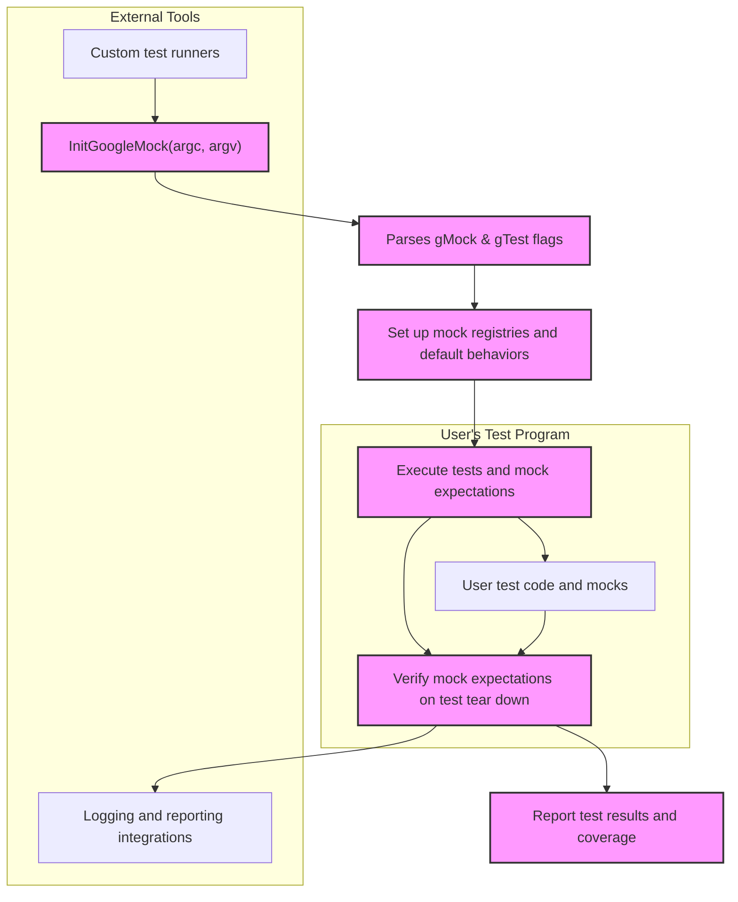

# Extending and Integrating the Framework

Explore how GoogleTest and GoogleMock can be extended or integrated with other tools, by leveraging its powerful extension and customization points. This guide introduces advanced concepts that enable you to tailor GoogleMock’s behavior for your specific needs or integrate it into more complex testing environments.

---

## Introduction to Extensibility

GoogleMock is designed to be highly extensible and adaptable. The framework supports numerous extension points that allow advanced users to customize mocking behaviors or create new utilities that complement the testing workflow. These extension points include:

- Writing custom matchers for fine-grained argument validation.
- Defining new actions to specify complex mock behavior.
- Integrating with custom test runners or external tools.
- Handling user-defined types and printers to improve output readability.

Through these mechanisms, GoogleMock empowers you to maintain precise and expressive specifications in challenging test scenarios.

---

## Writing Custom Matchers

Matchers are the predicates used to verify function call arguments. While the built-in matchers cover common use cases, you might need to define your own for domain-specific validations.

### Quick Matcher Creation with `MATCHER` Macros

GoogleMock offers convenient macros such as `MATCHER`, `MATCHER_P`, and `MATCHER_Pn` to define custom matchers succinctly. These macros allow you to specify the matching logic and descriptive strings in a readable manner without boilerplate.

**Example:** Define a matcher verifying divisibility by 7:

```cpp
MATCHER(IsDivisibleBy7, "is divisible by 7") {
  return (arg % 7) == 0;
}

// Usage:
EXPECT_CALL(mock_obj, Method(IsDivisibleBy7()));
```

You can extend these matchers with custom failure messages or more complex logic.

### Implementing Matcher Classes

For advanced scenarios or reusable matchers, implement matcher classes following the matcher interface. This approach provides fine-grained control over type handling, polymorphism, and descriptive outputs.

See the [Matchers Reference](https://google.github.io/googletest/reference/matchers.html) for detailed guidance.

---

## Creating Custom Actions

Actions define what a mock method does when invoked. Beyond simple returns, you can compose or create custom actions for more expressive and complex behaviors.

### Defining Inline Actions

Use lambdas or functor objects as custom actions directly within your tests for concise behaviors:

```cpp
EXPECT_CALL(mock_obj, Compute(_))
    .WillOnce([](int x) { return x * 2; });
```

### Implementing Action Classes

If an action needs state or reusability, implement a class with a call operator compatible with the mock's signature. This is preferred for complex or polymorphic actions.

### Using Polymorphic Actions

For behaviors applicable across multiple function signatures, use polymorphic action factories provided by GoogleMock’s `MakePolymorphicAction()` utility.

Refer to the [Actions Reference](https://google.github.io/googletest/reference/actions.html) for comprehensive instructions.

---

## Integrating with Other Tools and Test Environments

GoogleTest and GoogleMock offer integration points for embedding in wider build and test ecosystems.

### Custom Test Runners

You can embed GoogleTest/GoogleMock initialization easily into custom test runners by calling `::testing::InitGoogleMock(argc, argv)`. This setup parses framework flags and prepares the testing environment.

### Reporting and Output Customization

Leverage user-extensible printers to customize how GoogleTest prints user-defined types in failure messages and expectations. Implement operator `<<` overloads or specialize value printers to improve readability.

### Controlling Verbosity and Logs

Adjust GoogleMock’s runtime verbosity using the `--gmock_verbose` flag (`info`, `warning`, or `error`) to balance the level of mock call tracing and warnings, useful when integrating with IDEs or CI pipelines.

### Managing Leaked Mocks

Enable the `--gmock_catch_leaked_mocks` flag to identify leaked mocks to avoid silent test failures, crucial in long-running test suites or complex frameworks.

---

## Advanced Techniques

### Delegating Calls

GoogleMock supports delegation patterns where calls to mock methods can be forwarded to fakes, real objects, or parent classes. This enables flexible layering between mocks and actual implementations.

### Sequencing and Partial Ordering

Leverage the sequence and expectation ordering APIs (`InSequence`, `.After`) to integrate mocks smoothly in tests requiring specific call sequences, especially when combining GoogleMock with asynchronous or multi-threaded frameworks.

### Mock Strictness Control

Use `NiceMock`, `NaggyMock`, and `StrictMock` to control mock strictness, adjusting behavior for uninteresting calls depending on your integration and debugging needs.

---

## Example: Extending GoogleMock with a Custom Matcher and Action

```cpp
// Custom matcher to verify if an integer is even.
MATCHER(IsEven, "is an even number") {
  return (arg % 2) == 0;
}

// Custom action that doubles the input and returns it.
struct DoubleThenReturn {
  int operator()(int x) const { return 2 * x; }
};

TEST(ExtensionTest, CustomMatcherAndAction) {
  MockCalculator mock_calc;

  EXPECT_CALL(mock_calc, Process(IntIsEven()))
      .WillOnce(DoubleThenReturn());

  EXPECT_EQ(mock_calc.Process(4), 8);
}
```

---

## Troubleshooting Common Extension Issues

- **Matcher Evaluation:** Ensure custom matchers are pure functions with no side effects, as GoogleMock may invoke them multiple times.
- **Action Signature Compatibility:** Confirm that custom actions match the mock method signature exactly.
- **Mock Leaks:** Remember to delete mocks or mark them as allowed leaks to avoid false positives.
- **Verbosity Setting:** Use the `--gmock_verbose` flag to gain insights during debugging.

---

## Mermaid Diagram: Integration Workflow Overview



---

## References

- [gMock Cookbook](https://google.github.io/googletest/gmock_cook_book.html) - Practical recipes for advanced mocking
- [Matchers Reference](https://google.github.io/googletest/reference/matchers.html) - Comprehensive guide to matchers
- [Actions Reference](https://google.github.io/googletest/reference/actions.html) - Detailed API for mock method actions
- [Mocking Reference](https://google.github.io/googletest/reference/mocking.html) - API details for mocks
- [Mocking Model Concepts](https://google.github.io/googletest/concepts/mocking-in-depth/core-mocking-model.html) - Conceptual understanding of mocking

---

Harness the full power of GoogleTest and GoogleMock by mastering extensibility and integration strategies detailed here, enabling you to craft precise, maintainable, and robust tests highly customized to your development ecosystem.
