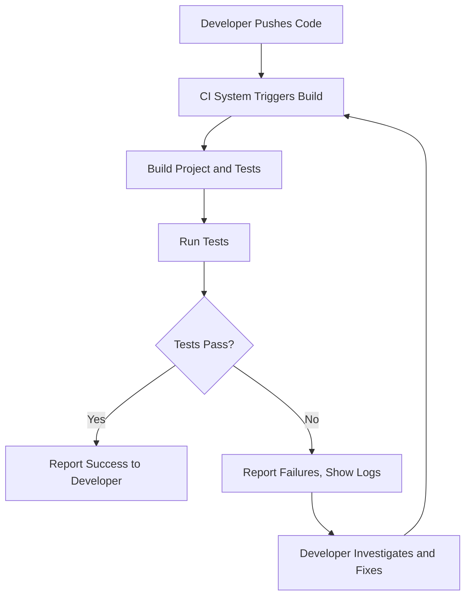

# Integration with Build Tools and CI/CD

Integrating GoogleTest and GoogleMock into your build system and continuous integration (CI) pipelines is crucial for enabling automated, repeatable, and efficient test execution across different platforms and environments. This guide explores common patterns and best practices for embedding GoogleTest within industry-standard build tools like Bazel and CMake, as well as setting up robust CI pipelines.

---

## Build System Integration Overview

To make the most of GoogleTest's testing and mocking capabilities, you need a well-structured build and test setup. Integration involves pulling in source code, configuring build rules, and ensuring correct linking and runtime behavior.

### Key Objectives

- Seamlessly compile and link GoogleTest and GoogleMock libraries with your project source.
- Enable reuse of GoogleTest APIs and headers across multiple test targets.
- Support both standalone builds of GoogleTest as well as in-tree builds.
- Facilitate cross-platform builds with minimal platform-specific modifications.
- Allow developers to write, build, and run tests easily and consistently.

---

## CMake Integration

### Standalone GoogleTest Build

You can build GoogleTest as a standalone library outside your project tree. This is useful if you want to manage GoogleTest as an external dependency.

1. **Download or clone GoogleTest source:**

   ```bash
   git clone https://github.com/google/googletest.git
   cd googletest
   mkdir build && cd build
   cmake ..
   make
   sudo make install  # Optional: to install globally
   ```

2. **Link GoogleTest to your project:**

   In your CMakeLists.txt, add:

   ```cmake
   find_package(GTest REQUIRED)
   include_directories(${GTEST_INCLUDE_DIRS})

   add_executable(my_test test.cpp)
   target_link_libraries(my_test ${GTEST_LIBRARIES} pthread)
   ```

### In-Tree GoogleTest Build

GoogleTest can also be built from within your project tree, which is useful if you vendor the source.

1. **Add GoogleTest as subdirectory:**

   ```cmake
   add_subdirectory(googletest)
   include_directories(googletest/include)

   add_executable(my_test test.cpp)
   target_link_libraries(my_test gtest gmock gtest_main gmock_main pthread)
   ```

2. **Use targets:**

   GoogleTest exports targets `gtest`, `gmock`, `gtest_main`, and `gmock_main` to link.

3. **Example `test.cpp`:**

   ```cpp
   #include <gtest/gtest.h>

   TEST(ExampleTest, SimpleCheck) {
     EXPECT_EQ(1, 1);
   }

   int main(int argc, char** argv) {
     ::testing::InitGoogleTest(&argc, argv);
     return RUN_ALL_TESTS();
   }
   ```

### Best Practices

- Use `gtest_main` or `gmock_main` targets to avoid writing your own `main()` in most tests.
- Avoid building GoogleTest multiple times by sharing installed or vendored libraries.
- Consider controlling dependency versions for reproducibility.

---

## Bazel Integration

Bazel is a widely used build system at Google and in open source.

### Adding GoogleTest Dependency

In your `WORKSPACE` file, add the GoogleTest repository:

```bazel
http_archive(
    name = "com_google_googletest",
    urls = ["https://github.com/google/googletest/archive/release-1.12.1.tar.gz"],
    strip_prefix = "googletest-release-1.12.1",
)
```

### Using GoogleTest in BUILD Files

```bazel
cc_test(
    name = "my_test",
    srcs = ["my_test.cc"],
    deps = ["@com_google_googletest//:gtest_main", "@com_google_googletest//:gmock"],
)
```

### Tips

- Use the pre-defined Bazel targets `:gtest`, `:gmock` and their `_main` versions.
- For large projects, control versions and apply patches if needed using `http_archive` rule.
- Consider splitting your test code into modules and specifying dependencies accordingly.

---

## Integration with Continuous Integration (CI) Pipelines

### Primary Goals

- Automate building and running all tests on every commit or pull request.
- Provide quick and clear test feedback to developers.
- Support multiple platforms and configurations.
- Ensure reproducibility and consistency.

### Common CI Setup Steps

1. **Set up dependencies**

   - Install compilers, CMake, Bazel, or any build tools required.
   - Clone or checkout correct GoogleTest versions.

2. **Configure build**

   - Run CMake or Bazel builds with testing enabled.
   - Compile both production code and tests.

3. **Execute tests**

   - Run all test binaries.
   - Capture and archive logs.

4. **Analyze and report results**

   - Fail builds on test failures.
   - Process GoogleTest's XML output for integration with dashboards.

### Example CMake-Based CI Command Sequence

```bash
mkdir build && cd build
cmake -DCMAKE_BUILD_TYPE=Release ..
make -j$(nproc)
ctest --output-on-failure
```

Pass CTest options to have verbose test output and fail fast.

### Example Bazel-Based CI Command Sequence

```bash
bazel test //... --test_output=errors
```

This runs all tests recursively and prints errors.

### Best Practices

- Cache build artifacts where possible to speed up builds.
- Use GPU or cloud runners as needed for cross-platform coverage.
- Monitor flakiness and reduce it by improving tests or test setup.
- Use `--gtest_output=xml` or Bazel's test outputs to integrate with dashboards.

---

## Tips for Robust Integration

- **Avoid hardcoding paths:** Use relative paths or discovery mechanisms.
- **Keep GoogleTest updated:** Pin versions, but update regularly for new features and fixes.
- **Separate tests and production code:** Keep test-only dependencies isolated.
- **Use GoogleMock only when necessary:** Prefer fakes for simple scenarios.
- **Manage test parallelism:** Control resource usage in CI to avoid overload.
- **Utilize GoogleTest filters:** Run subsets of tests to speed up iterative development.

---

## Troubleshooting

### Tests Not Discovered or Run

- Verify test naming conventions and test suite registration.
- Ensure build rules expose test binaries correctly.
- Run tests manually with verbose flags to check for silent failures.

### Linking Issues

- Ensure GoogleTest and GoogleMock libraries are linked to the test targets.
- Check for mismatches in C++ standard versions between test and GoogleTest builds.

### Flaky Tests

- Isolate external dependencies.
- Use mocks and fakes as appropriate.
- Avoid timing-dependent fixtures if possible.

---

## Recommended Reading

- [GoogleTest Primer](/guides/getting-started/primer)
- [Quickstart: Build and Run Tests](/guides/getting-started/quickstart)
- [Mocking Best Practices](/guides/real-world-patterns/mocking-best-practices)
- [gMock for Dummies](https://google.github.io/googletest/gmock_for_dummies.html)
- [gMock Cheat Sheet](https://google.github.io/googletest/gmock_cheat_sheet.html)
- Official GoogleTest [GitHub Repository](https://github.com/google/googletest)

---

## Diagram: Typical CI Integration Flow



---

By integrating GoogleTest and GoogleMock smoothly within your build and CI pipelines, you ensure early detection of defects, faster feedback loops, and better software quality. Follow these guidelines to craft stable, maintainable, and scalable testing infrastructures.
