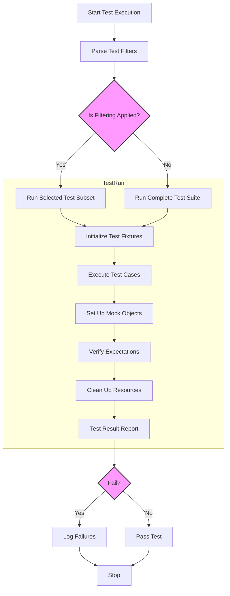

# Scaling Test Suites in Large Codebases

GoogleTest is designed to support projects of all sizes, from small libraries to large-scale software systems spanning multiple repositories. As test suites grow, maintaining their performance, organization, and reliability requires thoughtful strategies. This guide covers best practices and practical techniques for scaling test suites efficiently with GoogleTest and GoogleMock.

---

## Organizing Tests for Scalability

As the number of tests expands, it becomes vital to organize them in a maintainable and discoverable way.

### Logical Grouping with Test Suites and Fixtures

- **Group related tests into test suites** that reflect the structure and modules of your codebase. This improves discoverability and test management.
- **Use test fixtures (`TEST_F`)** to share setup and teardown logic efficiently across many related tests, reducing duplication and speeding test execution.

### Modularizing Test Code

- Place tests in appropriately named source files and directories that mirror your project hierarchy.
- Extract reusable utility functions, helpers, and mock classes into easily accessible locations to avoid redundancy and promote consistency.

### Naming Conventions

- Follow consistent and descriptive naming for test suites and test cases to facilitate filtering and diagnostics.
- Avoid underscores in test names to comply with GoogleTest naming conventions and enable smooth automatic test discovery.

<Info>
Consider using parameterized tests (`TEST_P`) or typed tests when you have multiple tests that differ only by input values or types, reducing code duplication.
</Info>

---

## Efficient Test Discovery and Filtering

GoogleTest discovers and registers all tests automatically, but as test counts rise, selectively running tests becomes important.

### Using Test Filters

- Leverage the `--gtest_filter` flag to run specific subsets of tests by name or pattern.
- Organize tests with naming strategies that enable intuitive filters—for example, prefix tests with subsystem names.

### Selective Test Execution for Large Suites

- Combine filters with `--gtest_repeat` or continuous integration scripts to iteratively run targeted test sets.

<Note>
Avoid writing overly broad filters, which may unintentionally execute very large numbers of tests, affecting CI and local runs.
</Note>

---

## Running Tests in Parallel

To speed up large test suites, distribute test execution.

### Parallelizing with Sharding

- Use GoogleTest's built-in test sharding via `--gtest_shard_index=N` and `--gtest_total_shards=M` flags to split tests across multiple processes.
- Combine with CI job parallelism or custom scripts to optimally utilize resources.

### Integration with Build Systems and CI/CD

- Incorporate parallel test jobs into your continuous integration pipelines.
- Use build systems like Bazel or CMake with GoogleTest integration to manage dependencies and build incremental test runs efficiently.

---

## Managing Test Dependencies and Isolation

Large tests often interact with shared resources, making isolation critical.

### Test Isolation Principles

- Ensure tests do not depend on state mutated by other tests.
- Use fixtures to setup and teardown isolated environments.

### Resource Handling

- Manage external resources (files, network, databases) carefully to avoid flaky tests.
- Use mocks and fakes extensively to control dependencies.

<Tip>
Writing tests that run independently improves their reliability and scaling.
</Tip>

---

## Continuous Maintenance and Build Optimization

Keeping your large test suite fast and robust also requires ongoing practices.

### Build System Integration

- Integrate GoogleTest binaries efficiently using modern build systems supporting incremental builds.
- Separate tests into smaller binaries for better parallel build and test execution.

### Compilation Optimization

- Use precompiled headers, header guards, and minimal includes in test files.
- Extract mock class constructor/destructor implementations into `.cc` files to speed up compilation.

---

## Handling Large Numbers of Mocks

Mock management is key in large test suites.

### Defining and Reusing Mocks

- Place mocks in shared, well-documented locations.
- Code to interfaces to minimize direct mocking of concrete classes.

### Mock Strictness

- Use `NiceMock` to suppress warnings in less critical tests and `StrictMock` to enforce call expectations when precision is required.

### Delegation

- Delegate calls to real or fake implementations when appropriate to avoid over-mocking and maintain behavior fidelity.

---

## Test Execution Strategies

### Ordering and Dependency Management

- Avoid ordering dependencies between tests.
- Use `InSequence` or `Sequence` when call ordering within a mock is significant.

### Expectation and Behavior Setting

- Set expectations using `EXPECT_CALL` before the code under test runs.
- Use `ON_CALL` to define default behaviors without imposing call count expectations.

---

## Troubleshooting Common Scaling Issues

### Slow Test Suite

- Profile to identify hotspots.
- Isolate slow tests and dependencies.
- Mock expensive resources where possible.

### Flakiness

- Identify tests with side effect dependencies.
- Improve test isolation and cleanup.

---

## Best Practices Summary

- Group tests logically using suites and fixtures.
- Employ filtering and sharding to manage large test runs.
- Use mocks selectively and delegate to real implementations when beneficial.
- Optimize builds by structuring mocks and test sources thoughtfully.
- Maintain test independence and reliable resource management.

---

## Helpful Links

- [Mock Objects: Structure and Lifecycle](https://google.github.io/googletest/concepts/mocking-models/mock-object-lifecycle)
- [Mocking and Setting Expectations](https://google.github.io/googletest/guides/core-testing-workflows/mocking-and-expectations)
- [gMock Cookbook](https://google.github.io/googletest/gmock_cook_book.html)
- [Test Structure and Discovery](https://google.github.io/googletest/guides/getting-started/test-structure-and-discovery.html)
- [Integration with Build Systems & Platforms](https://google.github.io/googletest/guides/real-world-patterns/integrating-with-build-systems)

---

## Diagram: Typical Large-Scale Test Suite Workflow

This flow represents how GoogleTest scales the execution of tests including filtering, fixture management, mocks, and verification.

---

This guide equips you to manage the growth of your GoogleTest test suites with efficiency and reliability. Consistent structure, strategic execution, and disciplined mocking will support your codebase as it expands.
