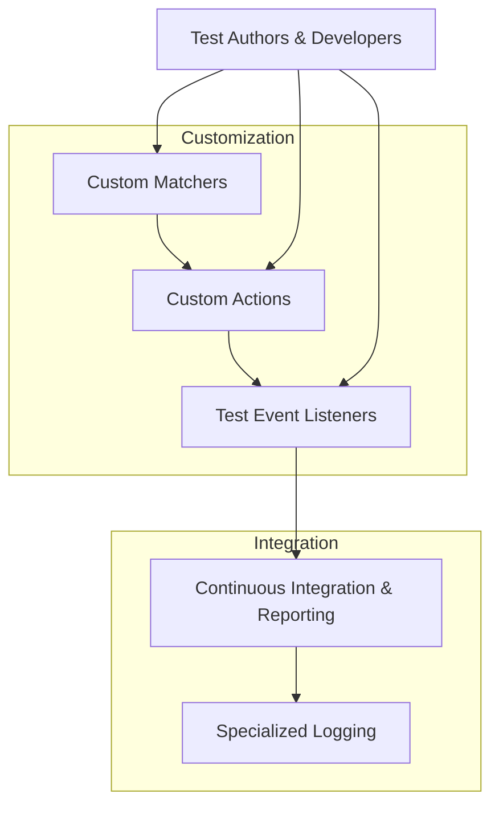

# Customization and Integration Patterns

GoogleTest and its mocking extension, GoogleMock, offer powerful customization and integration points designed to fit seamlessly into diverse CI/CD workflows, logging solutions, and extended reporting systems. This guide explores the key extension mechanisms—custom matchers, custom actions, and test event listeners—that allow you to adapt GoogleTest’s behavior precisely to your project's needs.

---

## Extension Points in GoogleTest and GoogleMock

GoogleTest is inherently extensible, enabling developers to write tests that not only express validation intent clearly but also integrate smoothly with external tooling and reporting systems. Here’s what this page focuses on:

- **Custom Matchers:** For expressive verification of arguments and test values.
- **Custom Actions:** To control mocked method behaviors beyond built-in capabilities.
- **Test Event Listeners:** To hook into the test lifecycle for specialized logging, metrics, or reporting.

### Why Customize?

Customization empowers you to:
- Tailor test output to fit your CI system’s requirements.
- Integrate with external log aggregators or dashboarding tools.
- Implement domain-specific validation rules, beyond simple equality or range checks.
- Automate cleanup, setup, or resource tracking steps tied to tests.


## Custom Matchers: Writing Expressive Argument Validators

Matchers are the predicates GoogleMock uses to verify whether mock method arguments satisfy expected conditions. The built-in set covers common needs, but custom matchers let you encapsulate complex domain-specific logic with clear failure messages.

### Creating a Custom Matcher

You can define custom matchers quickly using the `MATCHER` family of macros. For example:

```cpp
MATCHER(IsEven, "") {
  return (arg % 2) == 0;
}

// Usage:
EXPECT_CALL(mock, Foo(IsEven()));
```

This verifies that the argument passed to `Foo()` is even.

### Parameterized Matchers

To accept parameters, use `MATCHER_P` and its variants:

```cpp
MATCHER_P(IsDivisibleBy, divisor, "") {
  return (arg % divisor) == 0;
}

// Usage:
EXPECT_CALL(mock, Bar(IsDivisibleBy(3)));
```

### Advantages of Custom Matchers

- Abstract complex validation logic into readable, reusable components.
- Improve failure messages with detailed explanations.
- Support polymorphic matching across different argument types.

### Best Practices

- Ensure matchers are **purely functional**—no side effects or calls to other mock methods.
- Provide informative descriptions and negation messages.
- Use parameterized matchers for flexibility.


## Custom Actions: Controlling Mock Method Behavior

Actions specify what a mocked method *does* when called. GoogleMock offers a rich suite of built-in actions—from returning fixed values to invoking callables or changing arguments.

### Extending with User-Defined Actions

If built-in actions don’t cover your needs, you can define custom actions:

- Use lambdas, functors, or function pointers compatible with the mock method’s signature.
- Macros like `ACTION`, `ACTION_P`, `ACTION_Pk` define new action types with argument access via `arg0`, `arg1`, etc.

Example defining an action that increments argument 1:

```cpp
ACTION(IncrementArg1) {
  ++(*arg1);
}

// Usage:
EXPECT_CALL(mock, Foo(_)).WillOnce(IncrementArg1());
```

### Combining Multiple Actions

Use `DoAll()` to chain several actions into one, returning the result of the last:

```cpp
EXPECT_CALL(mock, Func(_))
    .WillOnce(DoAll(SetArgPointee<0>(5), Return(true)));
```

### Using Callables Directly

Any callable compatible with the mock signature can be used with `Invoke()`.

```cpp
EXPECT_CALL(mock, Func(_))
    .WillOnce(Invoke([](int val) { return val * 2; }));
```

### Useful Built-in Actions

- `Return(value)`: Return a fixed value.
- `SetArgPointee<N>(value)`: Set the value of the Nth pointer argument.
- `Invoke(f)`: Call a callable `f` with the mock function's arguments.
- `DeleteArg<N>()`: Delete a pointer argument.
- `Throw(exception)`: Throw an exception.

### Best Practices

- When returning references, prefer `ReturnRef()` to ensure the reference remains valid.
- Use `ReturnPointee()` to return the live value behind a pointer.
- Avoid side effects in actions that complicate test behavior.


## Test Event Listeners: Hooking into the Test Lifecycle

GoogleTest provides a comprehensive test lifecycle API accessible via *event listeners*. You can plug in custom listeners to integrate additional logging, metrics collection, or reporting tools.

### Key Events Available

- **OnTestProgramStart / OnTestProgramEnd:** Coarse-grained test run framing.
- **OnTestSuiteStart / OnTestSuiteEnd:** For grouping-related processing.
- **OnTestStart / OnTestEnd:** Per-test execution events for tracking duration or logging.
- **OnTestPartResult:** Capturing individual assertion results.

### Implementing a Custom Listener

To create your own listener, subclass `::testing::EmptyTestEventListener` and override desired methods:

```cpp
class MyListener : public ::testing::EmptyTestEventListener {
 public:
  void OnTestStart(const ::testing::TestInfo& test_info) override {
    // Custom logic, e.g., start a timer
  }

  void OnTestEnd(const ::testing::TestInfo& test_info) override {
    // Custom logic, e.g., record duration, send metrics
  }
};
```

### Installing Your Listener

Replace or augment the existing listeners via the `::testing::TestEventListeners` interface:

```cpp
auto& listeners = ::testing::UnitTest::GetInstance()->listeners();

// Optionally remove the default console output listener:
// delete listeners.Release(listeners.default_result_printer());

listeners.Append(new MyListener);
```

### Use Cases

- Export test results in custom formats (e.g., JSON, XML)
- Integrate with CI systems’ dashboards
- Collect detailed timing or resource usage metrics
- Log additional contextual information

### Best Practices

- Avoid long-running operations in listeners to prevent test slowdowns.
- Do not throw exceptions from listener methods; handle errors gracefully.


## Integration with CI/CD and Reporting

GoogleTest’s customizable logging and listener system, combined with its detailed failure messages and rich mocking capabilities, enable seamless integration with continuous integration pipelines and complex reporting infrastructures.

### Tips for Effective Integration

- Leverage the custom listener API to export test metadata directly into CI reporting formats.
- Use flags like `--gmock_verbose=info` to debug test expectations during development.
- Utilize `Mock::VerifyAndClearExpectations()` explicitly to enforce verification in long-running or complex tests.
- Control uninteresting call warnings with `NiceMock`, `NaggyMock`, or `StrictMock` according to project policy.


## Troubleshooting Common Customization Issues

<AccordionGroup title="Common Challenges and Solutions">
<Accordion title="Suppressing Uninteresting Call Warnings">
GoogleMock warns on "uninteresting calls" (mock methods called without expectations). Use `NiceMock<>` to suppress warnings or explicitly add `EXPECT_CALL(...).Times(AnyNumber())` to document permissible calls. Avoid suppressing warnings by adding frivolous `EXPECT_CALL`s as this makes tests brittle.
</Accordion>
<Accordion title="Custom Matcher Failures Not Descriptive">
Provide `DescribeTo()` and `DescribeNegationTo()` methods in your matcher implementation or use the description string in `MATCHER_P` macros to improve failure messages.
</Accordion>
<Accordion title="Mocking Methods with Move-Only Types">
Mocking methods accepting move-only types like `std::unique_ptr<T>` is supported; for returning new objects each time, use a lambda in `WillOnce()` or `WillRepeatedly()`. The `Return()` action with move-only types can only be performed once.
</Accordion>
</AccordionGroup>


## Additional Resources

- [GoogleMock Cookbook](https://google.github.io/googletest/gmock_cook_book.html) — In-depth recipes and best practices for mocking and customization.
- [Actions Reference](reference/actions.md) — Detailed guide to built-in and custom actions.
- [Matchers Reference](reference/matchers.md) — Full list and usage of built-in and user-defined matchers.
- [Mocking Reference](reference/mocking.md) — Comprehensive reference on mocking APIs.

---

### Diagram: Customization and Extension Points in GoogleMock



This diagram illustrates the main customization mechanisms feeding integration points.

---

For your first steps:
- Define custom matchers to enhance verification expressiveness.
- Use custom actions to program how mocks behave during tests.
- Implement test event listeners to integrate with your CI/CD or logging setups.

Together, these points allow you to adapt GoogleTest and GoogleMock to any testing scenario you face.

---

## Summary

This page detailed the main customization and integration capabilities of GoogleTest and GoogleMock, focusing on custom matchers, actions, and event listeners that empower sophisticated verification and seamless integration into modern development workflows.


---

# Appendix: Example Code Snippet

### Custom Matcher Example

```cpp
MATCHER_P(IsMultipleOf, n, "") {
  return (arg % n) == 0;
}

// Usage:
EXPECT_CALL(mock_obj, Process(IsMultipleOf(5)));
```

### Custom Action Example

```cpp
ACTION(IncrementSecondArg) {
  ++(*arg1);
}

EXPECT_CALL(mock_obj, Update(_, _)).WillOnce(IncrementSecondArg());
```

### Custom Test Listener Example

```cpp
class CsvListener : public ::testing::EmptyTestEventListener {
 public:
  void OnTestEnd(const ::testing::TestInfo& test_info) override {
    std::cout << test_info.test_suite_name() << ","
              << test_info.name() << ","
              << (test_info.result()->Passed() ? "PASS" : "FAIL") << std::endl;
  }
};

// To install
::testing::UnitTest::GetInstance()->listeners().Append(new CsvListener);
```

---