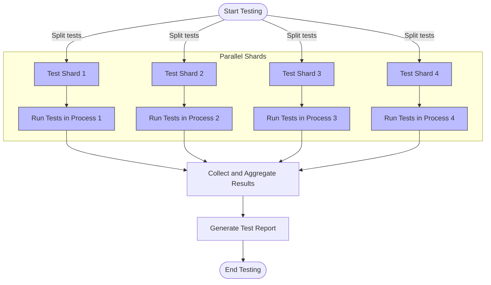

# Performance and Scalability Considerations

Efficiently running large volumes of tests and scaling GoogleTest's mocking framework require thoughtful strategies to minimize performance bottlenecks while maximizing reliability and accuracy. This guide discusses proven techniques for achieving scalable test execution, focusing on parallelization, minimizing overhead in test harnesses, and using advanced test runners.

---

## Understanding Test Execution Bottlenecks

When executing extensive test suites, several common bottlenecks can slow your testing workflow:

- **Sequential Test Runs:** Running tests one after another can waste CPU resources, especially on multicore machines.
- **Test Fixture Overhead:** Repeated setup and teardown can introduce latency, particularly in resource-heavy fixtures.
- **Synchronization Costs:** GoogleMock’s internal locking guarantees thread safety but may impose overhead under high concurrency.
- **Excessive Logging or Debug Output:** Verbose output during test runs can slow down execution and I/O.

To optimize, the goal is to distribute work effectively, avoid redundant operations, and leverage GoogleTest's concurrency support.

---

## Running Tests in Parallel

Parallel test execution is the most effective means to speed up test suites, particularly for large C++ projects. GoogleTest supports running tests in parallel at the process level, while GoogleMock enables thread-safe mocks.

### Parallel Execution Strategies

1. **Process-Level Parallelism:** Run multiple test binaries or shards simultaneously on different CPU cores or machines. GoogleTest’s sharding environment variables (`GTEST_TOTAL_SHARDS` and `GTEST_SHARD_INDEX`) can split test suites across workers.

2. **Thread-Level Parallelism Within a Test:** Advanced users can configure some tests or fixtures to run multiple threads, exercising code concurrency but require careful synchronization.

3. **Parallel Test Runners:** CI systems or build tools that support parallel execution can launch multiple test processes, balancing resource usage.

### GoogleMock Support for Concurrency

GoogleMock is designed to be thread-safe. It protects mock state using internal mutexes, allowing multiple threads to invoke mock methods safely.

However, users must:

- Set expectations (`EXPECT_CALL`) before concurrent use to avoid undefined behavior.
- Avoid modifying mocks concurrently from multiple threads.
- Ensure that the test code invoking mocks appropriately synchronizes shared state.

The `StressTest` in the source code demonstrates multiple threads using mocks concurrently with no failures, illustrating the framework's capability for parallelism.

---

## Leveraging Advanced Test Runners

GoogleTest provides `RUN_ALL_TESTS()` to execute all registered tests. For large test suites, advanced runners or custom main functions can:

- Filter tests precisely to run subsets when iterating.
- Combine parallel runs with deterministic ordering.
- Manage test resource constraints.

Extending test runners to integrate GoogleTest’s sharding can further accelerate testing in CI environments.

---

## Reducing Overhead in Test Fixtures

To optimize individual test performance:

- Use **test fixtures and setup/teardown** judiciously; avoid expensive global initializations in individual test setups.
- Employ **parameterized tests** to reduce code duplication and increase reuse of setup code.
- When applicable, use `SetUpTestSuite` and `TearDownTestSuite` for shared expensive resources instead of per-test setup.

---

## Managing Logging and Verbosity

High verbosity impacts test performance:

- Use flags like `--gmock_verbose=warning` (default) or `error` to limit unnecessary output from mock objects.
- Reserve `info` verbosity for debugging to diagnose unexpected or uninteresting mock calls.

---

## Resilience and Best Practices

- Use `NiceMock` to suppress warnings on uninteresting calls in large test suites,
- Use `StrictMock` sparingly to catch unexpected calls early, but be aware of potential test brittleness.
- Minimize over-specifying mock expectations to reduce verification overhead and false failures.

---

## Summary

Optimizing GoogleTest and GoogleMock for performance and scalability revolves around parallel execution, reducing per-test setup overhead, and managing mock behavior verbosity. Combined with thoughtful test organization and CI integration, GoogleTest can efficiently handle testing large and complex C++ codebases with robust mocking needs.

---

## Additional Resources

- [GoogleTest Guide on Test Execution and Parallelism](https://github.com/google/googletest/tree/main/googletest/docs)
- [gMock Cookbook: Mocking Best Practices](https://google.github.io/googletest/gmock_cook_book.html)
- [GoogleTest Sharding Documentation](https://github.com/google/googletest/blob/main/googletest/docs/advanced.md#distributing-test-functions-to-multiple-machines)
- [Concurrency and Thread Safety in GoogleMock](https://github.com/google/googletest/blob/main/googlemock/test/gmock_stress_test.cc)

---

### Example: Using GoogleTest Sharding for Parallel Test Execution

In your CI or test runner setup, you can run the same test binary multiple times, each with different environment variables:

```bash
export GTEST_TOTAL_SHARDS=4
export GTEST_SHARD_INDEX=0
./my_test_binary

export GTEST_TOTAL_SHARDS=4
export GTEST_SHARD_INDEX=1
./my_test_binary

# ... and so on for each shard
```

This splits the tests evenly, speeding up test runs across available hardware.

---

### Example: Basic Parallel Thread Use with GoogleMock

```cpp
class MockWorker {
 public:
  MOCK_METHOD(void, DoWork, (int job_id));
};

void ThreadFunc(MockWorker* mock, int job_id) {
  mock->DoWork(job_id);
}

TEST(ParallelMockTest, MultipleThreads) {
  MockWorker mock;

  ON_CALL(mock, DoWork).WillByDefault(Return());
  EXPECT_CALL(mock, DoWork(testing::_)).Times(10);

  std::vector<std::thread> threads;
  for (int i = 0; i < 10; ++i) {
    threads.emplace_back(ThreadFunc, &mock, i);
  }
  for (auto& t : threads) {
    t.join();
  }
}
```

This demonstrates thread-safe usage and concurrent expectations on a mock object.

---

### Diagram: Simplified Data Flow of Parallel Test Execution



This illustrates how GoogleTest shards tests into parallel processes that run independently and aggregate results.

---