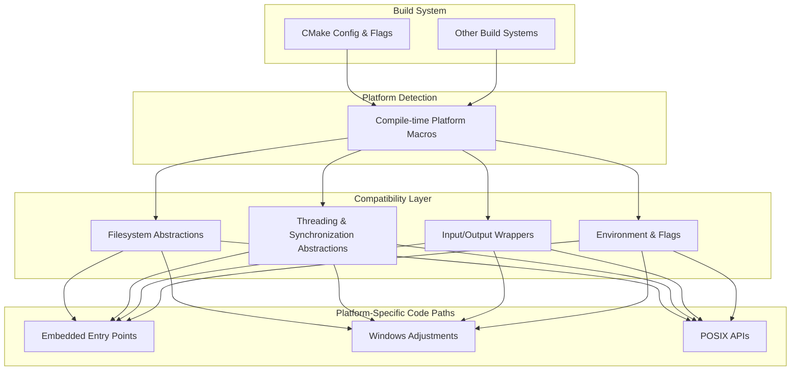

# Portability and Platform Abstraction

Ensuring your tests run smoothly across different operating systems, compilers, and hardware architectures is fundamental for reliable software validation. This page explains the strategies GoogleTest employs to achieve cross-platform compatibility, including abstractions, compatibility utilities, and platform-specific code paths. With these mechanisms in place, you gain confidence that your tests will build and execute consistently in diverse environments, from embedded systems to desktop platforms.

---

## Understanding Portability in GoogleTest

GoogleTest is built with portability at its core, designed to seamlessly support a wide array of platforms including Windows, Linux, macOS, Android, embedded systems such as ESP8266/ESP32, and mobile variants like Windows Mobile or iOS. This diversity demands robust abstractions to handle differences in system APIs, threading models, filesystem availability, compiler quirks, and runtime characteristics.

The framework uses a combination of environment detection, conditional compilation, and compatibility layers to mask these differences from your test code. This means you write tests once, and GoogleTest adapts its behavior according to the build and runtime environment.

<Info>
GoogleTest targets C++17 or later, which ensures it can rely on modern language features that improve portability and maintainability across compilers.
</Info>

---

## Platform Detection and Conditional Compilation

### Automatic Platform Identification

GoogleTest automatically detects the target platform via predefined macros detected during compilation. For instance, macros such as `GTEST_OS_WINDOWS`, `GTEST_OS_LINUX`, `GTEST_OS_MAC`, `GTEST_OS_ESP32`, and many more are defined internally to represent supported OSes and environments.

This detection dictates which code paths and platform-specific utilities are activated. It includes nuanced checks for variants like Windows Desktop vs. Windows Mobile or Linux vs. Android.

### User Overrides

In rare cases where automatic detection does not fit the use case (e.g., unusual compiler setups), users can override platform macros in build settings to force GoogleTest into a compatible mode.

<Warning>
Altering platform macros manually can cause undefined behavior; use overrides only if you fully understand the implications.
</Warning>

---

## Compatibility Utilities

GoogleTest uses a broad set of utility functions to unify platform differences, enabling consistent test behavior:

- **File and Directory Operations**: Abstract wrappers for file operations such as opening, reopening, reading, writing, closing, and querying file descriptors. For example, on Windows, `fopen` is internally managed to handle wide-character paths, while POSIX systems use the standard API.

- **Path Separators**: GoogleTest defines `GTEST_PATH_SEP_` to handle platform-specific path separators: `\\` for Windows and `/` for POSIX-like systems.

- **Threading and Synchronization**: GoogleTest abstracts mutexes and thread local storage, using native Windows APIs, pthreads on POSIX, or dummy implementations where threading is unavailable.

- **Stream Redirection**: Support for capturing and redirecting standard output streams is conditionally enabled only on platforms that support stream redirection (typically desktop OSes).

These utilities provide a consistent interface for the rest of the framework and your tests.

---

## Build-Time Configuration and Compiler Support

GoogleTest supports various compilers, including MSVC, Clang, GCC, Intel LLVM, and others, managing compiler-specific flags for warnings, exception support, and runtime library linkage.

### CMake Build Adjustments

The CMake configurations include logic to:

- Enforce static or shared runtime linkage as appropriate to avoid runtime conflicts (important on Windows).
- Set strict warning levels (-W4 for MSVC, -Wall and extra flags for GCC/Clang).
- Detect and adjust for exceptions and RTTI availability.

This ensures your build environment aligns with GoogleTest's portability expectations.

### Compiler and Runtime Macros

GoogleTest defines feature detection macros such as:

- `GTEST_HAS_EXCEPTIONS` — whether exceptions are enabled,
- `GTEST_HAS_RTTI` — whether runtime type information is available,
- `GTEST_HAS_PTHREAD` — whether pthreads are available for threading,

allowing the framework to adapt accordingly.

<Note>
An environment with C++17 support is required to successfully build and use GoogleTest.
</Note>

---

## Platform-Specific Code Paths

GoogleTest takes special care to support embedded and restricted environments (e.g., ESP8266, ESP32) by providing custom entry points and adapted test runners.

For example, embedded platforms use alternative main entry points like `setup()` and `loop()` to integrate seamlessly with Arduino environments.

Windows platforms adjust the main function signature to address known compiler and linker issues, especially with Unicode and static library interaction.

These built-in accommodations remove the need for users to write custom glue code to bootstrap tests.

---

## Threading and Synchronization Abstractions

GoogleTest abstracts threading primitives to provide mutual exclusion and thread-local storage:

- On POSIX systems with pthreads available, the framework uses native pthread mutexes and keys.
- On Windows desktop platforms, native critical sections and thread local storage are used.
- On platforms without threading support, dummy mutex and thread-local implementations do not enforce synchronization to preserve build capability.

This abstraction lets tests rely on synchronization semantics while GoogleTest manages platform peculiarities.

---

## Filesystem and Environment Support

GoogleTest assumes filesystem availability for many features such as death tests or output capturing. It detects at compile time and runtime if a file system exists (`GTEST_HAS_FILE_SYSTEM`) to enable or disable these features.

On embedded or restricted platforms where environment variables or filesystem access are unavailable, GoogleTest gracefully handles these limitations.

---

## Practical Usage Tips

- **Build Configuration**: Use GoogleTest's CMake scripts or supported build integrations (like Bazel) to correctly set up compiler flags and platform macros — this ensures portability without manual intervention.

- **Flag Control**: Use provided macros (`GTEST_HAS_PTHREAD`, `GTEST_HAS_EXCEPTIONS`, etc.) if you encounter platform detection issues to force desired behaviors.

- **Static vs. Shared Runtime on Windows**: Match your project settings with GoogleTest's runtime linkage using the `gtest_force_shared_crt` option in CMake to avoid linker errors.

- **Cross-Platform Builds**: Write test code using GoogleTest APIs without platform-specific logic; GoogleTest handles the compatibility layer.

- **Embedded Platforms**: When targeting Arduino or ESP platforms, use the embedded entry points (`setup()`, `loop()`) provided by GoogleTest.

---

## Troubleshooting Common Portability Issues

<AccordionGroup title="Troubleshooting Portability Issues">
<Accordion title="Linker errors on Windows related to CRT mismatch">
This happens when your project and GoogleTest use different runtime libraries (dynamic vs static). Enable the CMake option `gtest_force_shared_crt` to align runtime linkage.
</Accordion>
<Accordion title="Threading primitives unavailable on target platform">
If your platform lacks pthread support or equivalent, GoogleTest disables threading-dependent features. To disable threading support explicitly, define `-DGTEST_HAS_PTHREAD=0` in your compiler flags.
</Accordion>
<Accordion title="Compilation errors due to missing C++17 support">
Ensure your compiler supports C++17 and that your build system requests it (e.g., `-std=c++17`), as older standards are unsupported.
</Accordion>
<Accordion title="Filesystem-related features not working on embedded platforms">
Features relying on file I/O (like death tests or output capture) may be disabled if `GTEST_HAS_FILE_SYSTEM` is detected as false. Adjust your test strategy accordingly.
</Accordion>
</AccordionGroup>

---

## Summary Diagram of Portability Abstractions

---

## Additional Resources

- [System Requirements & Supported Platforms](/getting-started/setup-prerequisites-installation/system-requirements-supported-platforms): Learn which platforms and compiler versions are officially supported.
- [Integrating GoogleTest into Your Workflow](/overview/integration-and-getting-started/integration-with-build-systems-and-tools): How to set up builds correctly for your environment.
- [Quickstart & Resources](/overview/integration-and-getting-started/quickstart-resources): Guides for getting up and running fast.

---

With these portability and platform abstraction mechanisms, GoogleTest ensures your tests remain stable, consistent, and maintainable across the environments critical to your software development lifecycle.