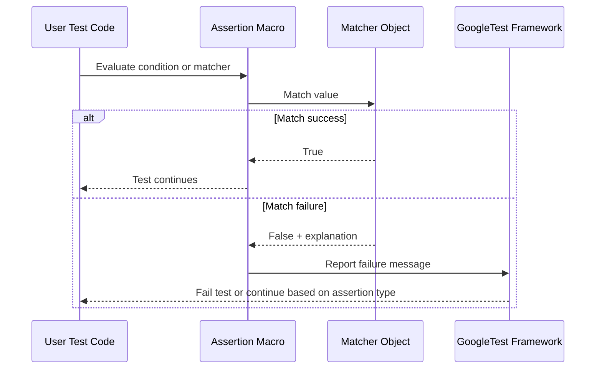

# Assertions, Matchers, and Validation Logic in GoogleTest

GoogleTest offers a rich array of validation tools enabling thorough and expressive verification of your C++ code. This guide focuses specifically on the concepts and mechanisms behind assertions, matchers, and validation logic, empowering you to write readable, maintainable, and powerful tests.

---

## Introduction to Assertions and Matchers

When testing, the goal is to verify that your code behaves as expected. GoogleTest supports this primarily through **assertions** and **matchers**:

- **Assertions** check conditions and generate test failures when expectations are not met.
- **Matchers** provide expressive predicates to specify what values or states are acceptable.

This combination forms the foundation of GoogleTest's validation system, allowing tests to be both precise and human-readable.

Imagine checking a turtle graphics library's movement commands: with matchers, you can say "I expect the turtle to move forward by exactly 100 units" or "the turtle should go to a point where the x-coordinate is positive." This empowers tests that describe intent clearly.

---

## Understanding Assertions in GoogleTest

Assertions enable you to verify Boolean conditions, value comparisons, exceptions, and complex predicates.

### Types of Assertions

GoogleTest provides paired assertion macros that come in **EXPECT_** (non-fatal) and **ASSERT_** (fatal) variants:

- **Boolean Assertions:** `EXPECT_TRUE`, `ASSERT_TRUE`, `EXPECT_FALSE`, `ASSERT_FALSE`
- **Binary Comparisons:** `EXPECT_EQ`, `ASSERT_EQ`, `EXPECT_NE`, `ASSERT_NE`, `EXPECT_LT`, and others
- **String Comparison:** `EXPECT_STREQ`, `ASSERT_STREQ`, `EXPECT_STRNE`, and variants
- **Floating-Point Comparison:** `EXPECT_FLOAT_EQ`, `ASSERT_DOUBLE_EQ`, `EXPECT_NEAR`
- **Exception Assertions:** `EXPECT_THROW`, `ASSERT_NO_THROW`, and more
- **Predicate Assertions:** `EXPECT_PRED*`, `EXPECT_PRED_FORMAT*`, and `EXPECT_THAT`

### Using Assertion Macros

Assertions are invoked typically in test functions, checking conditions that must hold for the test to pass.

Example:

```cpp
EXPECT_EQ(turtle.GetX(), 100) << "Turtle's X coordinate should be 100 after move";
```

Here, failure will generate an informative message showing expected and actual values.

### Explicit Success and Failure

GoogleTest also provides `SUCCEED()` and `FAIL()` for cases where control flow dictates success or failure:

```cpp
if (some_condition) {
  SUCCEED();
} else {
  FAIL() << "Condition not met";
}
```

Note that `FAIL()` aborts the current function and can only be used in `void` functions.

---

## Matchers: Expressive Validation of Values and Arguments

Matchers are objects or predicates that allow detailed specification of what values are acceptable in assertions or mock expectations.

### What Is a Matcher?

A matcher is a predicate with abilities to:

- Test if a value satisfies specified criteria
- Generate human-readable descriptions for failure messages

Example: `Ge(100)` matches any value greater than or equal to 100.

### Common Built-in Matchers

- **Wildcard matcher:** `_` matches any value
- **Relational matchers:** `Eq(value)`, `Ne(value)`, `Lt(value)`, `Le(value)`, `Gt(value)`, `Ge(value)`
- **String matchers:** `StartsWith(str)`, `EndsWith(str)`, `HasSubstr(str)`, `MatchesRegex(regex)`
- **Pointer matchers:** `IsNull()`, `NotNull()`, `Pointee(matcher)`
- **Composite matchers:** `AllOf(m1, m2, ...)`, `AnyOf(m1, m2, ...)`, `Not(m)`

### Parameterizing Matchers

Matchers can be parameterized for more specific match behavior:

```cpp
EXPECT_THAT(turtle.GetY(), AllOf(Ge(50), Le(100)));  // Y in [50,100]
```

### Using Matchers in Assertions

The `EXPECT_THAT(value, matcher)` macro combines matchers and assertions for expressive validation:

```cpp
EXPECT_THAT(message, StartsWith("Error: "));
```

If the assertion fails, the failure message includes the value and a clear explanation.

---

## Matchers in Mock Expectations

When working with mocks (GoogleMock), matchers enable precise control over what inputs to expect and how to respond.

### Expectations with Matchers

Set an expectation on a mock method with `EXPECT_CALL`, specifying argument matchers:

```cpp
EXPECT_CALL(mock_turtle, GoTo(50, _));
```

This expects the method `GoTo` with any Y-coordinate, but X-coordinate 50.

### Combining Matchers for Arguments

You can combine matchers for multiple arguments:

```cpp
EXPECT_CALL(mock_turtle, Move(AllOf(Ge(0), Le(100)), _));
```

Additionally, use `.With` clause in `EXPECT_CALL` to impose conditions on all arguments as a whole.

### Custom Matchers

Beyond built-in matchers, GoogleMock allows defining custom matchers to encapsulate complex validation logic. See the [Custom Matcher Guide](guides/advanced-and-integration/custom-actions-matchers) for details.

---

## Assertion Evaluation and Output Messages

GoogleTest evaluates assertions by checking the condition or matcher against values and printing descriptive failure messages when expectations are not met.

### Details in Failure Messages

- The failing expression and its result
- Expected condition or matcher description
- Actual value printed elegantly with `AbslStringify` or `operator<<`
- For `EXPECT_THAT`, matcher explanations accompany the actual value

### Tracing Assertion Failures

Using `SCOPED_TRACE()` helps identify assertion failures in nested or repeated tests by attaching contextual messages.

### Debugging Tips

- Verbose mode (`--gmock_verbose=info`) reveals matcher evaluations and mock call traces.
- Use `GTEST_SKIP()` to conditionally skip tests when prerequisites aren't met.

---

## Best Practices and Common Pitfalls

- **Use matchers to avoid hardcoding literal values unless necessary.**
- **Prefer `EXPECT_` over `ASSERT_` to allow tests to continue for more comprehensive failure info, except where fatal failure is needed.**
- **Avoid over-specification of expectations; be as precise as needed but not more.**
- **Remember that matchers must be pure functions with no side effects.**
- **Set expectations on mocks prior to exercising test scenarios (before calls occur).**
- **Use `RetiresOnSaturation()` in sequences of calls to avoid conflicts stemming from "sticky" expectations.**

---

## Summary

Assertions and matchers are the backbone of validation in GoogleTest and GoogleMock. Through expressive expectations, users write tests that document the contract of their code clearly, while getting precise and helpful feedback when tests fail. From simple Boolean checks to sophisticated matcher compositions, these concepts enable robust, maintainable testing.

---

## Additional Resources

- [Assertions Reference](/api-reference/core-apis/assertion-macros)
- [Matchers Reference](/api-reference/core-apis/matchers)
- [Mocking Reference](/docs/reference/mocking)
- [gMock Cookbook](https://google.github.io/googletest/gmock_cook_book.html)
- [Custom Matchers and Actions](guides/advanced-and-integration/custom-actions-matchers)
- [gMock for Dummies](docs/gmock_for_dummies.md)
- [Mastering Assertions Guide](guides/core-testing-workflows/using-assertions)

---

## Example

```cpp
#include <gmock/gmock.h>
#include <gtest/gtest.h>

class Turtle {
 public:
  virtual ~Turtle() {}
  virtual void PenDown() = 0;
  virtual void GoTo(int x, int y) = 0;
};

class MockTurtle : public Turtle {
 public:
  MOCK_METHOD(void, PenDown, (), (override));
  MOCK_METHOD(void, GoTo, (int x, int y), (override));
};

TEST(PainterTest, MustDrawOnPaper) {
  MockTurtle turtle;

  using ::testing::_;
  using ::testing::Ge;

  EXPECT_CALL(turtle, PenDown());
  EXPECT_CALL(turtle, GoTo(Ge(0), _));

  // Code under test...
  turtle.PenDown();
  turtle.GoTo(10, 20);
}
```

In this example, the test asserts that `PenDown()` is called and that `GoTo()` is called with an X coordinate >= 0 and any Y coordinate.

---

## Diagram: Flow of Assertion and Matcher Evaluation



This flow shows how test code invokes an assertion, which delegates matching to a matcher object. The outcome determines whether the test passes or a failure message is generated.

---

## Troubleshooting Common Issues

- **Uninteresting call warnings:** Use `NiceMock` to suppress or add catch-all `EXPECT_CALL` with `Times(AnyNumber())`.
- **Ambiguous overloads:** Specify argument matchers or use `Const()` when mocking overloaded const methods.
- **Unexpected calls:** Ensure all expected calls are defined with `EXPECT_CALL` before exercising the mock.
- **Sticky expectations leading to failures:** Use `.RetiresOnSaturation()` to retire saturated expectations for ordered call sequences.

Consider reviewing the [Mocking Reference](docs/reference/mocking.md) and [gMock Cookbook](docs/gmock_cook_book.md) for more advanced scenarios and solutions.

---

## Practical Tips

- Add descriptive messages to assertions via stream operator `<<` to clarify failures.
- Use `EXPECT_THAT` for expressive, readable tests especially with complex predicates.
- Reuse matchers by assigning them to variables for clarity and maintainability.
- Use sequences (`InSequence`) to express call ordering constraints.
- Avoid excessive expectations; keep tests focused for ease of maintenance.


