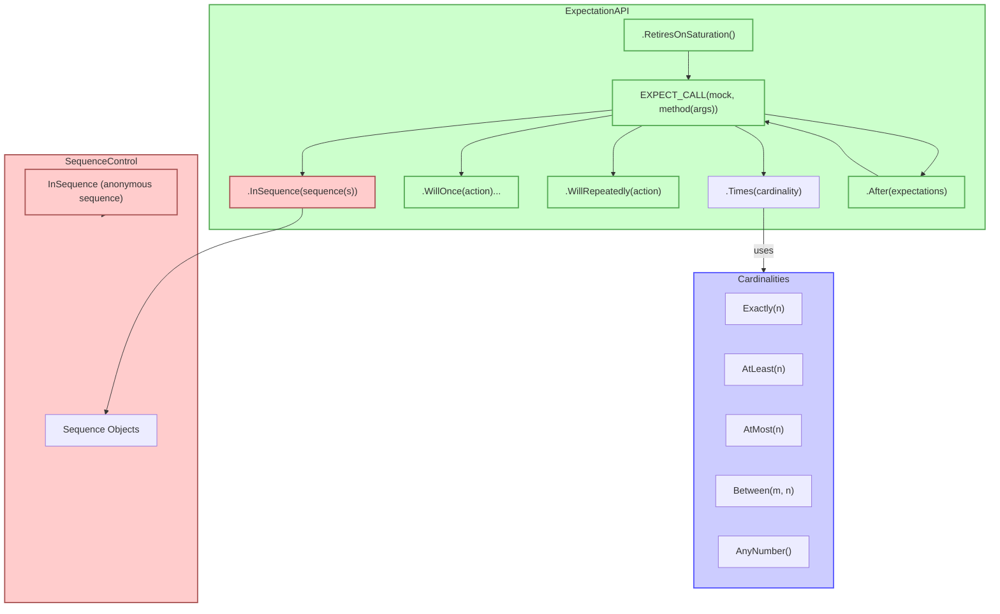

# Call Cardinalities and Sequences

Understanding how many times a mock function is called and in what order can make your tests both precise and maintainable. GoogleMock provides a rich set of ways to express these constraints through **call cardinalities** and **call sequencing** mechanisms. This guide explores these concepts, showing you how to enforce and verify interaction patterns with your mock objects effectively.

---

## Understanding Call Cardinalities

### What Are Cardinalities?

A **cardinality** defines *how many times* you expect a particular mock function to be called during a test. It is used with the `.Times()` clause in an `EXPECT_CALL()` expression to describe these expectations declaratively.

GoogleMock supports a variety of cardinalities, from strict counts to flexible ranges:

| Cardinality       | Meaning                                                           |
|-------------------|-------------------------------------------------------------------|
| `Exactly(n)` or `Times(n)`   | Expect the function to be called exactly `n` times.               |
| `AtLeast(n)`      | Expect the function to be called at least `n` times.              |
| `AtMost(n)`       | Expect the function to be called at most `n` times.               |
| `Between(m, n)`   | Expect the function to be called between `m` and `n` times, inclusive. |
| `AnyNumber()`     | Function may be called any number of times, including zero.       |

### Cardinality Inference

If `.Times()` is omitted, GoogleMock *infers* the cardinality based on other clauses:

- If there are no `WillOnce()` or `WillRepeatedly()` clauses, then
  the default inferred cardinality is exactly 1.
- If there are `n` `WillOnce()` clauses but no `WillRepeatedly()`, the cardinality is `Times(n)`.
- If there are `n` `WillOnce()` clauses and one `WillRepeatedly()`, the cardinality is `Times(AtLeast(n))`.


### Specifying Cardinalities: Examples

```cpp
using ::testing::Exactly;
using ::testing::AtLeast;
using ::testing::AnyNumber;
using ::testing::Between;

EXPECT_CALL(mock_obj, Foo())
    .Times(Exactly(3));          // Called exactly 3 times.

EXPECT_CALL(mock_obj, Bar(_))
    .Times(AtLeast(2));         // Called 2 or more times.

EXPECT_CALL(mock_obj, Baz(_))
    .Times(AnyNumber());        // Called zero or more times.

EXPECT_CALL(mock_obj, Qux(42))
    .Times(Between(1, 4));      // Called between 1 and 4 times.
```

### What Happens on Violations?

- If a call happens fewer times than the lower bound, test failures occur at mock destruction or when calling `Mock::VerifyAndClearExpectations()`.
- If a call exceeds the upper bound, GoogleMock immediately reports an error upon the *excess* call.


## Enforcing Call Sequences

### The Importance of Call Order

Not all mock interactions are about *how many* times a function is called—sometimes *when* these calls happen relative to other calls matters. GoogleMock supports ordering expectations via **sequences**.

### Defining Sequences Using `InSequence` Class

The simplest way to enforce a strict call order is by declaring an `InSequence` object within a scope. All expectations declared inside this scope are expected to be called in the order they appear.

#### Example

```cpp
using ::testing::InSequence;
using ::testing::Return;

{  
  InSequence s;

  EXPECT_CALL(mock_obj, Initialize())
      .WillOnce(Return(true));
  EXPECT_CALL(mock_obj, DoWork(42));
  EXPECT_CALL(mock_obj, Cleanup());
}
```

This ensures `Initialize()` is called before `DoWork(42)`, which is called before `Cleanup()`.

### Creating Custom Sequences with `Sequence` Objects

For more complex or partial orders, you can explicitly create one or more `Sequence` objects and assign expectations to them using the `.InSequence()` clause.

```cpp
using ::testing::Sequence;
Sequence seq1, seq2;

EXPECT_CALL(mock_obj, Start())
    .InSequence(seq1, seq2);
EXPECT_CALL(mock_obj, Step1())
    .InSequence(seq1);
EXPECT_CALL(mock_obj, Step2())
    .InSequence(seq2);
```

This forms a partial ordering: `Start()` must come before both `Step1()` and `Step2()`, but `Step1()` and `Step2()` can happen in any order relative to each other.

### Using the `.After()` Clause

The `.After()` clause on an expectation specifies that the expectation must occur *after* one or more other expectations have been satisfied.

```cpp
using ::testing::Expectation;

Expectation init_called = EXPECT_CALL(mock_obj, Initialize());
EXPECT_CALL(mock_obj, DoAction()).After(init_called);
```

You can specify multiple prerequisites with up to 5 `Expectation` or `ExpectationSet` objects.

### Combining `.InSequence()` and `.After()`

These clauses can be combined to express intricate dependencies and partial orders.

### What Happens When Call Order is Violated?

GoogleMock reports a failure immediately if a call is made out of the expected order.


## Managing Expectation Lifetime: Retiring Saturated Expectations

By default, expectations remain active even after their upper call bound is reached, potentially causing conflicts with overlapping expectations.

If you want an expectation to become inactive (or "retire") once it's saturated, use `.RetiresOnSaturation()`:

```cpp
EXPECT_CALL(mock_obj, SomeMethod())
    .Times(2)
    .RetiresOnSaturation();
```

This means after those 2 calls, this expectation will no longer match calls.


## Practical Usage Patterns

### Expressing "Exactly Twice"

```cpp
EXPECT_CALL(mock_obj, Foo())
    .Times(2);
```

### Expressing "At Least Once"

```cpp
EXPECT_CALL(mock_obj, Foo())
    .Times(AtLeast(1));
```

### Enforcing a Sequence of Calls

```cpp
{
  InSequence s;
  EXPECT_CALL(mock_obj, FirstCall());
  EXPECT_CALL(mock_obj, SecondCall());
  EXPECT_CALL(mock_obj, ThirdCall());
}
```

### Expressing Partial Order with Multiple Sequences

```cpp
Sequence s1, s2;
EXPECT_CALL(mock_obj, A()).InSequence(s1, s2);
EXPECT_CALL(mock_obj, B()).InSequence(s1);
EXPECT_CALL(mock_obj, C()).InSequence(s2);
```

### Using `.After()` with Prerequisites

```cpp
Expectation e1 = EXPECT_CALL(mock_obj, Init1());
Expectation e2 = EXPECT_CALL(mock_obj, Init2());
EXPECT_CALL(mock_obj, DoAction()).After(e1, e2);
```


## Best Practices and Tips

- Set expectations *before* exercising the mock to avoid undefined behavior.
- Use `.RetiresOnSaturation()` when you want consecutive, non-overlapping calls with different expectations.
- Use `InSequence` judiciously: overly strict ordering can make tests brittle.
- For less strict ordering but still partial constraints, prefer `Sequence` objects with `.InSequence()` over a long chain.
- Use `.After()` for specifying specific prerequisite expectations when order is needed but sequences are cumbersome.
- Remember that expectations remain "sticky" unless retired, so overlapping expectations can cause unexpected failures.


## Troubleshooting Common Issues

- **Too Few Calls Failure:** Occurs if the actual call count is below the lower bound. Verify your test triggers all expected calls.
- **Too Many Calls Failure:** Happens when call count exceeds upper bound. Consider using `.RetiresOnSaturation()` to avoid sticky expectations or adjust `.Times()`.
- **Out of Order Calls:** If calls happen out of sequence, check sequences and `.After()` clauses correctness.
- **Expectation Shadowing:** The last matching expectation is selected. Be mindful of order of `EXPECT_CALL`s to prevent shadowing.


## Summary

Cardinalities and sequences empower you to express precise interaction expectations with your mocks. Mastery of these concepts leads to robust tests that catch both the correctness of behavior and the correct order and frequency of calls.


---

## Diagram: Overview of Expectations, Cardinalities, and Sequences



---

## Additional Resources

- [GoogleMock EXPECT_CALL Reference](https://github.com/google/googletest/blob/main/docs/reference/mocking.md#EXPECT_CALL)
- [GoogleMock Cardinalities Tests & Definitions](https://github.com/google/googletest/blob/main/googlemock/src/gmock-cardinalities.cc)
- [GoogleMock Sequences and Partial Ordering](https://github.com/google/googletest/blob/main/docs/gmock_cook_book.md#OrderedCalls)
- [gMock for Dummies: Using Expectations](https://google.github.io/googletest/gmock_for_dummies.html#expectations)

---

This page builds on core concepts of mocks, expectations, and actions, focusing on how to specify call counts and enforce call orders via cardinalities and sequences. It complements guides on creating mocks, setting expectations and actions, and mock strictness.
