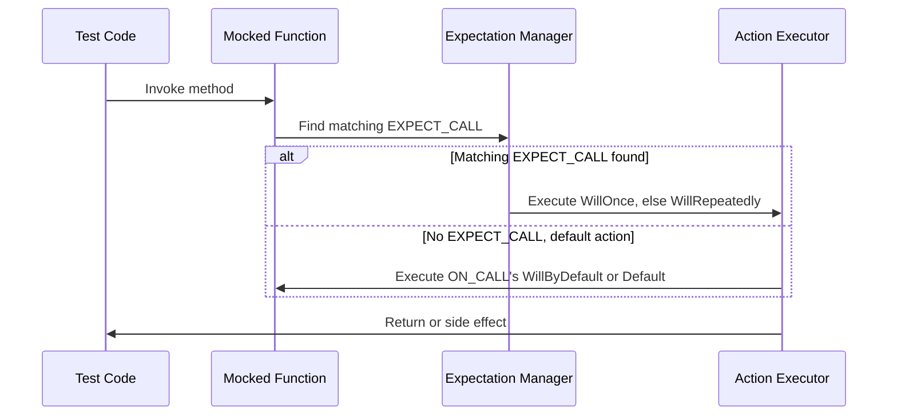

# Actions and Mocked Return Behaviors

Discover how actions define the behavior of mocked methods and how to specify return values, triggers, or side effects in your mocks. Address action composition and custom action definitions.

---

## Understanding Actions in GoogleMock

Actions in GoogleMock determine what a mock function does when it is called. Unlike simply verifying calls, actions allow you to specify return values, modify arguments, trigger callbacks, or even execute custom logic when a mocked method is invoked.

Setting effective actions is critical to simulating the behavior of dependencies and controlling test outcomes precisely.

### Why Actions Matter

Imagine you are testing a class that depends on an external service interface with a method `GetData()`. Simply knowing that `GetData()` is called isn't enough; you need it to return specific values or trigger side effects to test your component's reactions. Actions let you do exactly that.

## Basic Action Types and Their Use

### Returning Values

Most mock methods return values or references. GoogleMock provides ready-to-use actions to return these:

- `Return(value)`: Returns `value`. The value is copied or converted once when the expectation is set, so changes to `value` later do not affect the returned value.
- `ReturnRef(variable)`: Returns a reference to an existing variable. Useful when the return type is a reference.
- `ReturnPointee(pointer)`: Returns the value pointed to by a pointer at call time, allowing for dynamic return values.
- `ReturnNew<T>(args...)`: Returns a newly allocated object of type `T` constructed with the given arguments.
- `ReturnNull()`: Returns a null pointer.
- `ReturnRoundRobin({val1, val2, ...})`: Returns each value in order for successive calls, cycling through the list.

#### Example: Returning Different Values in Sequence

```cpp
using ::testing::Return;

EXPECT_CALL(mock_turtle, GetX())
    .WillOnce(Return(10))
    .WillOnce(Return(20))
    .WillRepeatedly(Return(30));
```

This sequence returns 10 on the first call, 20 on the second, and 30 thereafter.

### Side Effect Actions

Sometimes the mock method affects the program state not by returning a value but by modifying output arguments or global states.

- `SetArgPointee<N>(value)`: Assigns `value` to the variable pointed to by the N-th argument.
- `SetArrayArgument<N>(first, last)`: Copies elements from `[first, last)` into the array/iterator argument at position N.
- `Assign(variable_ptr, value)`: Assigns `value` to a variable.
- `DeleteArg<N>()`: Deletes the object that the N-th argument points to.
- `SaveArg<N>(pointer)`: Saves a copy of the N-th argument to `*pointer`.

#### Example: Setting an Output Argument

```cpp
using ::testing::SetArgPointee;

EXPECT_CALL(mock_mutator, Mutate(true, _))
    .WillOnce(SetArgPointee<1>(42));
```

When `Mutate` is called, this action sets the second argument's pointee to 42.

### Using Functions, Lambdas, and Functors as Actions

You can use any callable object that matches the mock function's signature as an action.

- `Invoke(function)`: Calls the given function or functor with the mock function's arguments.
- `Invoke(object_pointer, &class::method)`: Invokes a member function on a specific object.
- `InvokeWithoutArgs(function)`: Calls the function ignoring the mock function's arguments.
- `InvokeArgument<N>(args...)`: Invokes the N-th argument (which must itself be a callable) with the supplied arguments.

#### Example: Returning Sum Using a Function

```cpp
int Sum(int a, int b) { return a + b; }

EXPECT_CALL(mock, Add(_, _))
    .WillOnce(Invoke(Sum));
```

### Composing Multiple Actions

If a mock method needs to do several things on each call, `DoAll()` lets you do multiple actions in order; only the last action's return value is used.

```cpp
using ::testing::DoAll;
using ::testing::SetArgPointee;
using ::testing::Return;

EXPECT_CALL(mock, MutateInt(_))
    .WillOnce(DoAll(SetArgPointee<0>(5), Return(true)));
```

Here, the side effect of setting an argument and returning a value are combined.

The first n-1 actions must return `void`.

### Ignoring Unused Return Values

When your action returns a non-void value but you want to use it in a void mock method or in `DoAll()` before the last action, use `IgnoreResult(action)`:

```cpp
EXPECT_CALL(mock, DoSomething(_))
    .WillOnce(IgnoreResult(Return(42)));
```

This tells GoogleMock to discard the returned value.

## Setting Default Behavior with `ON_CALL`

`ON_CALL(mock, Method(matchers))` allows you to specify default actions for calls to mock methods.

- Default actions are used when no matching `EXPECT_CALL` is found.
- Useful for providing general stubs or backing implementations.
- You must specify a `.WillByDefault(action)` clause.

Example:

```cpp
ON_CALL(mock, GetData()).WillByDefault(Return(10));
```

This lets calls to `GetData()` return 10 unless explicitly overridden by an `EXPECT_CALL`.

## Setting Expectations with `EXPECT_CALL` and Actions

`EXPECT_CALL` sets both an expectation and an action.

- You can specify multiple `WillOnce` actions for ordered behavior.
- `WillRepeatedly` defines the behavior after all `WillOnce` actions are used.
- If no action is specified, the default action or default return value is used.

Example:

```cpp
EXPECT_CALL(mock, Compute(42))
    .WillOnce(Return(100))
    .WillRepeatedly(Return(200));
```

## Putting it Together: A Sample Workflow

```cpp
class MockService {
 public:
  MOCK_METHOD(int, GetValue, (), ());
  MOCK_METHOD(void, SetValue, (int v), ());
};

TEST(ServiceTest, UsesMockActions) {
  MockService mock_service;

  // Define default behavior when GetValue() is called.
  ON_CALL(mock_service, GetValue()).WillByDefault(Return(10));

  // Expect SetValue() to be called once, and set a variable.
  int stored_value = 0;
  EXPECT_CALL(mock_service, SetValue(_))
      .WillOnce(Invoke([&stored_value](int v) { stored_value = v; }));

  // Use mock_service in the code under test...
  ...

  // Validate that stored_value is modified as expected.
  EXPECT_EQ(stored_value, 42);
}
```

## Custom Actions: Extending Behavior

When built-in actions are insufficient, define your own actions:

- Use lambdas or functors compatible with the mock function's signature.
- Implement `ActionInterface<F>` for monomorphic actions tied to a specific function signature.
- Use `MakePolymorphicAction()` for actions usable with varying mock signatures.

### Example: Custom Action via Lambda

```cpp
EXPECT_CALL(mock, Process(_))
    .WillOnce([](int val) {
      if (val < 0) return false;
      // complex logic
      return true;
    });
```

### Legacy Macros for Actions

GoogleMock supports `ACTION`, `ACTION_P`, and `ACTION_TEMPLATE` macros to write concise custom actions, though lambdas and functors are preferred nowadays.

For example:

```cpp
ACTION(IncrementArg0) { return ++(*arg0); }
EXPECT_CALL(mock, Foo(_)).WillOnce(IncrementArg0());
```

## Chaining Actions and Lifetime

- Actions passed to `WillOnce()` are called at most once and may be move-only.
- Actions passed to `WillRepeatedly()` must be copyable and stateless or safely copyable.
- Be mindful of object lifetimes for captured variables in lambdas used as actions.

## Best Practices

- Prefer `ON_CALL` to set default behaviors shared across tests.
- Use `EXPECT_CALL` to specify expectations and the exact behavior for calls you want to verify.
- Use `ReturnPointee` to provide dynamic return values from mutable variables.
- Use `DoAll` to combine side effects with return values.
- Use lambdas for complex or custom behavior inline.
- Avoid over-specifying expectations to reduce brittle tests.

## Troubleshooting Common Action Issues

- Returning a value from `Return()` is fixed at setup time, often causing stale values if modified later—use `ReturnPointee()` instead.
- If multiple actions need to be performed, make sure that all but the last return `void` when using `DoAll()`.
- Use `IgnoreResult()` to suppress unwanted return values where necessary.
- If you have deadlocks or strange behaviors, ensure actions are thread-safe or executed in the calling thread.

---

## See Also

- [GoogleMock Actions Reference](../api-reference/core-apis/actions-and-responses)
- [Using `EXPECT_CALL` and `ON_CALL`](../guides/mocking-techniques/expectations-and-actions)
- [Creating Custom Actions](../guides/advanced-and-integration/custom-actions-matchers)
- [GoogleMock Basics and Tutorials](docs/gmock_for_dummies.md)

---

### Diagram: Action Execution Flow


```

This flow depicts how a call to a mock function triggers lookup of applicable expectations and executes associated actions or defaults.
