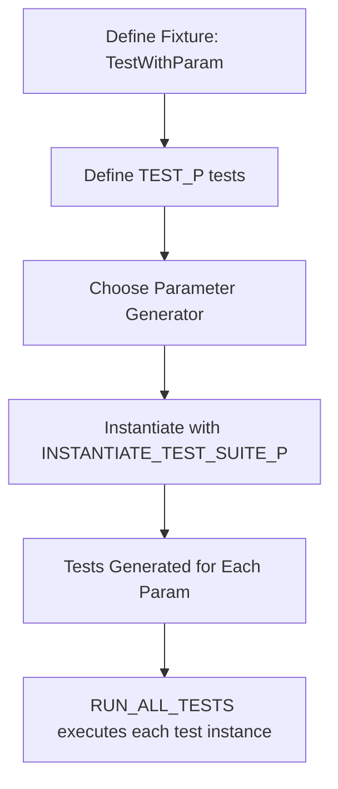
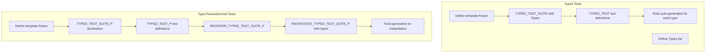

# Value-Parameterized and Type-Parameterized Tests

GoogleTest provides powerful mechanisms to write flexible and reusable test code by allowing tests to be run multiple times with different values or types. This guide unpacks how value-parameterized and type-parameterized tests work, explaining how to define test fixtures, generate test parameters, instantiate test suites, and customize test naming — all designed to minimize duplication and maximize test coverage.

---

## Understanding Value-Parameterized Tests

### What are Value-Parameterized Tests?
Value-parameterized tests enable you to write a single test logic that executes multiple times with varied input values. Instead of duplicating tests for different datasets or configurations, you define your test once and run it across diverse parameter values.

This approach is invaluable when you want to:

- Validate your code against different inputs or flag combinations.
- Test various interfaces or algorithms systematically.
- Perform data-driven tests efficiently.

### Defining a Value-Parameterized Test Fixture

A value-parameterized test fixture class must derive from `testing::Test` and implement the `testing::WithParamInterface<T>` interface, where `T` is the parameter type. For convenience, GoogleTest provides `testing::TestWithParam<T>`, which inherits from both.

```cpp
class MyValueParamTest : public ::testing::TestWithParam<int> {
  // Fixture members and methods
};
```

You can also adapt an existing fixture by inheriting it along with `WithParamInterface`. For example:

```cpp
class BaseTest : public ::testing::Test {
  // shared setup etc.
};

class DerivedValueParamTest : public BaseTest, public ::testing::WithParamInterface<std::string> {
  // test code
};
```

### Writing Value-Parameterized Tests

Use the `TEST_P` macro to define tests using your fixture. The `_P` suffix indicates parameterization.

Inside the test body, access the current parameter value via `GetParam()`.

```cpp
TEST_P(MyValueParamTest, HandlesVariousInputs) {
  int value = GetParam();
  EXPECT_GT(value, 0);
  // more test logic
}
```

You may define multiple such tests for your fixture.

### Instantiating Tests with Parameters

To run the parameterized tests with actual values, you instantiate them using the `INSTANTIATE_TEST_SUITE_P` macro.

```cpp
INSTANTIATE_TEST_SUITE_P(
    PositiveInts, MyValueParamTest, testing::Values(1, 2, 3));
```

Here, `PositiveInts` is an arbitrary instantiation name used as a prefix to distinguish test sets.

You can also instantiate multiple times with different sets of parameters.

### Parameter Generators

GoogleTest provides several built-in parameter generators to produce sequences for your instantiations:

| Generator                             | Description                                     |
| ----------------------------------- | ----------------------------------------------- |
| `Range(begin, end [, step])`         | Values from `begin` up to (but excluding) `end` in increments of `step` (default 1). |
| `Values(v1, v2, ..., vN)`            | Explicit list of values.                         |
| `ValuesIn(container)` or `ValuesIn(begin,end)` | Values from an array, STL container, or iterator range. |
| `Bool()`                            | Boolean values `{false, true}`.                  |
| `Combine(g1, g2, ..., gN)`           | Cartesian product (all combinations) of multiple generators, yielding tuples. |

Example of combining parameters:

```cpp
INSTANTIATE_TEST_SUITE_P(
    Combo, MyValueParamTest,
    testing::Combine(
        testing::Values(1, 2),
        testing::Bool()));
```

### Customizing Test Names

By default, instantiated tests get numbered suffixes (e.g., `/0`, `/1`). You can provide a custom naming function or functor as the last argument to `INSTANTIATE_TEST_SUITE_P` that returns a unique, alphanumeric name for each parameter:

```cpp
INSTANTIATE_TEST_SUITE_P(
    NamedInst, MyValueParamTest, testing::Values(5, 10),
    [](const testing::TestParamInfo<MyValueParamTest::ParamType>& info) {
      return "Val" + std::to_string(info.param);
    });
```

These names must only contain letters, digits, or underscores.

### Abstract Value-Parameterized Tests Pattern

You can declare your parameterized tests in a header and define them in a `.cc` file, facilitating reuse across different code bases or modules. Others can then instantiate your abstract tests with their own parameters in their test builds.

---

## Understanding Typed and Type-Parameterized Tests

### Why Use Typed Tests?
Typed tests enable running the same test logic over a list of types. This is perfect when you want to verify that different types (e.g., container implementations, numeric types) meet a set of common expectations without writing duplicated tests.

Typed tests require you to know the list of types at the time you write your tests.

### Defining a Typed Test Fixture

Create a template fixture class parameterized on a type `T`, deriving from `testing::Test`:

```cpp
template <typename T>
class MyTypedTest : public testing::Test {
 public:
  T value_; // example member
};
```

### Associating Types and Registering Typed Tests

Declare the types list with the `::testing::Types<T1, T2, ...>` template and bind it with `TYPED_TEST_SUITE`:

```cpp
using MyTypes = ::testing::Types<int, double, char>;
TYPED_TEST_SUITE(MyTypedTest, MyTypes);
```

Use `TYPED_TEST` to define test cases that run for each type:

```cpp
TYPED_TEST(MyTypedTest, FooTest) {
  TypeParam n = this->value_;      // TypeParam resolves to type for this instantiation
  EXPECT_GE(n, 0);
}
```

Repeat for as many tests as you need.

### Understanding Type-Parameterized Tests

Type-parameterized tests let you *define* tests without specifying the types; then *instantiate* the tests later with different type lists. This allows abstracting interfaces or concepts and verifying any implementation's correctness by instantiating the generic tests.

### Defining Type-Parameterized Tests

Start by defining a template fixture and marking it with `TYPED_TEST_SUITE_P`:

```cpp
template <typename T>
class MyTypeParamTest : public testing::Test {};

TYPED_TEST_SUITE_P(MyTypeParamTest);
```

Then define the test logic using `TYPED_TEST_P`:

```cpp
TYPED_TEST_P(MyTypeParamTest, DoesItWork) {
  TypeParam val {};
  EXPECT_TRUE(SomeCheck(val));
}
```

Register all tests with `REGISTER_TYPED_TEST_SUITE_P`:

```cpp
REGISTER_TYPED_TEST_SUITE_P(MyTypeParamTest, DoesItWork);
```

Finally, instantiate the tests with the desired types and prefix name:

```cpp
using ImplTypes = ::testing::Types<int, float>;
INSTANTIATE_TYPED_TEST_SUITE_P(MyInst, MyTypeParamTest, ImplTypes);
```

### Customizing Typed Test Suite Names

`TYPED_TEST_SUITE` accepts an optional third argument: a class with a static template `GetName(int index)` method for custom naming of typed test suites.

For instance:

```cpp
class MyNameGen {
 public:
  template <typename T>
  static std::string GetName(int) {
    if constexpr (std::is_same_v<T, int>) return "Int";
    if constexpr (std::is_same_v<T, float>) return "Float";
    return "Unknown";
  }
};

TYPED_TEST_SUITE(MyTypedTest, MyTypes, MyNameGen);
```

---

## Practical Usage Examples

### Value-Parameterized Test Example

```cpp
class StringLengthTest : public ::testing::TestWithParam<std::string> {};

TEST_P(StringLengthTest, HasExpectedLength) {
  EXPECT_GT(GetParam().size(), 0);
}

INSTANTIATE_TEST_SUITE_P(VariousStrings,
                         StringLengthTest,
                         testing::Values("hello", "world", "!"));
```

### Typed Test Example

```cpp
template <typename T>
class NumericOpsTest : public testing::Test {
 public:
  T a = 1;
  T b = 2;
};

using NumericTypes = ::testing::Types<int, double>;
TYPED_TEST_SUITE(NumericOpsTest, NumericTypes);

TYPED_TEST(NumericOpsTest, SumIsCorrect) {
  EXPECT_EQ(this->a + this->b, 3);
}
```

### Type-Parameterized Test Example

```cpp
template <typename T>
class ContainerTest : public testing::Test {};

TYPED_TEST_SUITE_P(ContainerTest);

TYPED_TEST_P(ContainerTest, IsEmptyInitially) {
  TypeParam container;
  EXPECT_TRUE(container.empty());
}

REGISTER_TYPED_TEST_SUITE_P(ContainerTest, IsEmptyInitially);

using MyContainerTypes = ::testing::Types<std::vector<int>, std::list<int>>;
INSTANTIATE_TYPED_TEST_SUITE_P(MyInst, ContainerTest, MyContainerTypes);
```

---

## Tips and Best Practices

- Always provide unique instantiation names when using `INSTANTIATE_TEST_SUITE_P` to avoid collisions.
- Consider defining custom test name generators for complex or string parameters to make test results clearer.
- Use `GTEST_ALLOW_UNINSTANTIATED_PARAMETERIZED_TEST` to suppress errors if you declare but do not instantiate tests intentionally.
- When using type-parameterized tests, remember to register test patterns before instantiation.
- Tests generated by these mechanisms participate fully in filtering, sharding, and other GoogleTest features.
- Keep the test logic simple and delegate customization to parameters or types for maximum reuse.

---

## Troubleshooting Common Issues

- If tests do not run or seem missing, ensure you have instantiated the test suite properly.
- Duplicate parameter names or invalid characters in test names will cause registration failures.
- Beware of parameter generators producing empty sequences; no tests will be run for that instantiation.
- Make custom name generators stateless or ensure thread safety.

---

## How This Fits in the GoogleTest Ecosystem

This page is part of the core testing workflows category, complementing guides on assertions, mocking, fixtures, and test lifecycle. It builds on foundational concepts introduced in the Primer and expands on the parameterization APIs detailed in the Testing Reference. For deeper understanding and examples, review the source files `sample7_unittest.cc` and `sample6_unittest.cc` in the GoogleTest samples.

---

## Related Documentation

- [Testing Reference - Macros](../api-reference/core-testing-api/test-definition-execution.md#TEST_P)
- [Testing Reference - INSTANTIATE_TEST_SUITE_P](../api-reference/core-testing-api/test-definition-execution.md#INSTANTIATE_TEST_SUITE_P)
- [Typed Tests](../advanced.md#typed-tests)
- [Type-Parameterized Tests](../advanced.md#type-parameterized-tests)
- [GoogleTest Primer](primer.md)

---

## Summary

**Value-Parameterized tests** let you run the same test logic repeatedly over a set of values using a parameterized fixture and parameter generators. 

**Typed tests** repeat tests over a list of known types, while **type-parameterized tests** define generic test logic and instantiate it later with types.

By leveraging these features, you can reduce boilerplate, increase coverage, and structure tests for flexible, maintainable testing.

---

# Diagram: Simplified Flow of Value-Parameterized Tests



# Diagram: Simplified Flow of Typed and Type-Parameterized Tests


