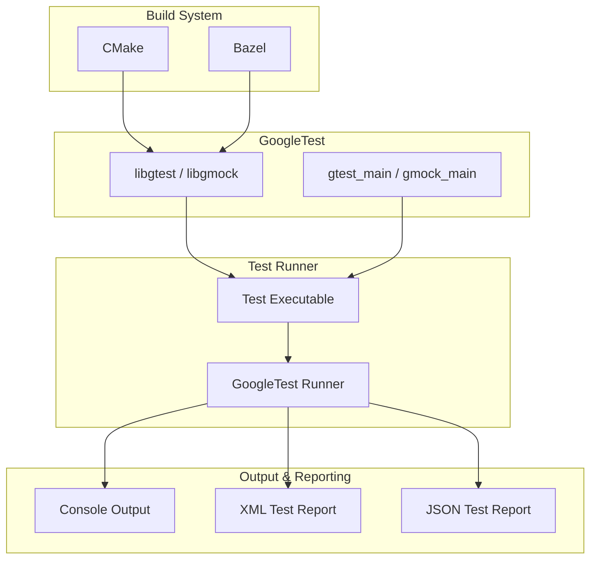

# Integration with Build Systems and Tooling

GoogleTest offers comprehensive integration touchpoints to fit seamlessly into your development workflow. This guide surveys the key mechanisms available for integrating GoogleTest and GoogleMock with popular build systems like Bazel and CMake, details custom test runner support, and explains output formatting options for test reporting. Understanding these integrations will help you embed robust testing within your build pipelines and continuous integration environments, thereby maximizing feedback speed and test visibility.

---

## Build System Support

### Bazel Integration

GoogleTest supports Bazel, Google's build system, enabling you to incorporate testing directly in your Bazel build targets. By defining appropriate Bazel test rules, you can automate test compilation and execution alongside your codebase.

- Bazel ensures tests run in hermetic and isolated environments, improving reliability.
- Typical Bazel `cc_test` rules invoke GoogleTest binaries, automatically discovering tests.

Although detailed Bazel configuration is not part of this guide, you can expect smooth integration for test discovery, parallelism, and caching.

### CMake Integration

CMake support for GoogleTest and GoogleMock is widely adopted for cross-platform builds. The provided `CMakeLists.txt` files in both `googletest/` and `googlemock/` directories facilitate:

- Compilation of GoogleTest/GoogleMock libraries.
- Setup of test targets and dependencies.
- Optional building of GoogleTest/GoogleMock internal tests for validation.

Key points to consider:

- **Standalone and Subdirectory Builds**: You can build GoogleTest as a standalone project or add it as a subdirectory in your existing CMake project using `add_subdirectory()`.
- **Thread Support**: The CMake scripts auto-detect pthread availability and configure accordingly for thread-safe test execution.
- **Versioning and Options**: You can control shared/static build options, and force use of shared runtime libraries with flags like `gtest_force_shared_crt`.

#### Typical Workflow Example in CMake

```cmake
# Add GoogleTest as a subdirectory in your project.
add_subdirectory(path/to/googletest)

# Link your test executable against gtest_main or gmock_main
add_executable(my_tests test_main.cpp)
target_link_libraries(my_tests PRIVATE gtest_main)

# Register tests with CTest
include(CTest)
add_test(NAME MyTests COMMAND my_tests)
```

#### Installation and PkgConfig Support

GoogleTest's CMake files generate and install pkgconfig files (e.g., `gtest.pc`, `gmock.pc`) that simplify integration with other build systems by exposing compile and link flags.

### Custom Test Runners

For users needing advanced control over test execution, GoogleTest allows:

- Embedding the test runner inside custom code.
- Using command-line flags to filter tests, control output format, and enable sharding.

These features make it easy to integrate with CI systems, test dashboards, or other external tools.

---

## Test Output Formats and Reporting

To integrate GoogleTest results smoothly with external tools like CI servers, dashboards, or XML parsers, GoogleTest supports multiple output formats.

### Console Output

The default and most familiar output is printed to the console. It shows test progress, pass/fail results, and diagnostic messages.

### XML Output

Enable XML output with the flag:

```
--gtest_output=xml[:path/to/output.xml]
```

- The XML format complies with the JUnit schema, facilitating integration with CI tools like Jenkins and GitLab.
- You can customize the output filename or directory.

### JSON Output

JSON output is available through:

```
--gtest_output=json[:path/to/output.json]
```

- Supports easy ingestion by modern tools and dashboards.
- Preserves detailed test structure and result information.

### Event Listener API

GoogleTest provides an event listener API that lets you write custom extensions to capture test lifecycle events, tailor output, or forward results to other systems.

This is ideal for integrating specialized reporting or notifying issue trackers automatically.

---

## Embedding in Continuous Integration (CI) Pipelines

Because GoogleTest can emit structured XML and JSON output and supports test filtering and sharding, it fits naturally into CI/CD workflows:

- Use the `--gtest_filter` flag to run subsets of tests during parallel builds.
- Output XML reports can be consumed by CI dashboards for visual pass/fail summaries.
- The test sharding feature helps speed up large test suites by distributing tests across multiple CI agents.

By leveraging these integration points, test execution becomes more transparent, scalable, and efficient.

---

## Practical Tips for Integration Success

- **Match Compiler and Build Settings**: Ensure consistent C++ standard, warning, and runtime settings between your code and GoogleTest or GoogleMock builds to avoid linkage or runtime errors.

- **Use FetchContent or add_subdirectory**: Prefer adding GoogleTest as a subdirectory or using CMake's FetchContent module to avoid path and versioning issues.

- **Enable Tests to Run Under CTest**: When building with CMake, use `enable_testing()` and `add_test()` commands to integrate with `ctest` seamlessly.

- **Customize Output for CI**: Configure `--gtest_output` flags so that CI tools can parse and display test results clearly.

- **Control Build Options**: Adjust build flags (e.g., `gtest_force_shared_crt`, `BUILD_SHARED_LIBS`) for compatibility with your environment and platform.

- **Run Internal Tests for Validation**: Optionally build and run GoogleTest and GoogleMock internal tests during setup to validate your build environment correctness.

---

## Troubleshooting Common Integration Issues

### Tests Not Discovered or Executed

- Verify that your test binaries are linked with `gtest_main` or provide your own main function that calls `RUN_ALL_TESTS()`.
- Ensure the test executable is registered correctly in your build system to be discoverable.

### Linker Errors

- Check for inconsistencies in runtime library usage, especially on Windows (e.g., static vs dynamic CRT).
- Utilize the `gtest_force_shared_crt` option if you encounter runtime mismatch errors.

### Runtime Environment Issues

- Make sure dependencies such as pthreads (where applicable) are correctly linked.
- Confirm that environment variables or working directories are correctly set when running tests in CI or IDEs.

### Output Format Not Generated

- Confirm that `--gtest_output=xml` or `json` is correctly specified and that the output directory is writable.

---

## Summary

GoogleTest is designed to be a flexible and powerful testing framework that integrates effortlessly with modern C++ build systems and CI pipelines. Its native support for Bazel and CMake, coupled with structured output formats and customizable runners, ensures that it fits naturally into nearly any software development workflow. Making use of these integrations will help you achieve robust automated testing with clear, actionable feedback.

---

## Additional Resources

- [GoogleTest CMake Build Script Details](https://github.com/google/googletest/blob/main/googletest/CMakeLists.txt)
- [GoogleMock CMake Build Script](https://github.com/google/googletest/blob/main/googlemock/CMakeLists.txt)
- [GoogleTest XML and JSON Output Reference](https://github.com/google/googletest/blob/main/googletest/docs/advanced.md#generating-xml-tests-reports)
- [GoogleTest `gtest_force_shared_crt` Option Explanation](https://github.com/google/googletest/blob/main/googletest/README.md#visual-studio-dynamic-vs-static-runtimes)
- [Guide: Installing with CMake](getting-started/installation-guide/installing-cmake)
- [Guide: Integrating with Build Systems and CI](concepts/test-execution-performance-scalability/integration-build-systems)
- [Troubleshooting Common Build System Configuration Issues](getting-started/troubleshooting/configuring-build-systems)

---

## Diagram: Simplified Integration Flow with CMake


