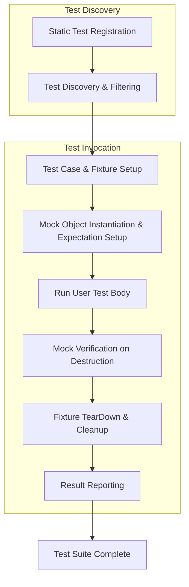

# Architecture Overview

Understanding how GoogleTest and GoogleMock are architected provides a clear view of how tests are structured, discovered, executed, and reported. This architecture is designed to support extensibility, maintainability, and usability both for everyday users writing tests and developers extending or integrating with the framework.

---

## Modular Structure and Relationship of Components

GoogleTest and GoogleMock are separate yet closely integrated modules:

- **GoogleTest** (gTest) provides the core testing framework: defining and running test cases, fixtures, assertions, and reporting results.
- **GoogleMock** (gMock) provides the mocking framework for creating and using mock objects within tests.

Despite their separation, gMock depends on gTest for test execution and reporting, while gTest does not depend on gMock.

This modular approach enables users to just use GoogleTest if they only want unit testing, or add GoogleMock for richer testing capabilities involving mock objects.

## Core Components and Their Roles

GoogleTest and GoogleMock each contain several fundamental components that fulfill distinct responsibilities:

### GoogleTest core components

- **Test Cases and Fixtures:** User-defined classes and macros organize tests and shared setup/teardown logic.
- **Test Discovery:** Automatically finds test cases and individual tests within test binaries.
- **Test Execution Engine:** Runs tests in the correct order, handles lifecycle hooks, and tracks results.
- **Assertion Handling:** Provides rich macros and machinery to report failures with detailed context.
- **Event Listeners:** Hooks to customize or extend reporting and test-running behaviors.
- **Test Result Reporting:** Generates detailed output with success, failure, and trace information.

### GoogleMock components

- **Mock Classes and Methods:** Generated classes with mocked methods implementing interfaces, created using macros such as `MOCK_METHOD`.
- **Matchers and Expectations:** Define argument matching and expected calls on mocks.
- **Actions:** Control mock method behavior upon invocation, such as returning specific values or invoking callbacks.
- **Strictness Wrappers:** Classes like `NiceMock`, `NaggyMock`, and `StrictMock` that control how unexpected or uninteresting calls are handled.
- **Verification:** Automatic and manual checks to ensure that expectations are satisfied.

## Test Lifecycle and Execution Flow

The lifecycle of a test integrates GoogleTest and GoogleMock functionality seamlessly:

1. **Test Discovery:** The framework discovers all test cases and test functions.
2. **Test Setup:** For each test, fixtures are created and `SetUp()` methods are called.
3. **Mock Initialization:** Mock objects are created, and expectations set by the user are installed before exercising code.
4. **Test Execution:** The test function is run.
5. **Mock Verification:** Upon mock destruction (usually at test end), GoogleMock automatically verifies that all expectations are met.
6. **Test Teardown:** Fixture `TearDown()` is called, and resources cleaned up.
7. **Test Reporting:** Results are collected and reported, including assertions and mock verification statuses.

Because GoogleMock builds on GoogleTest, its lifecycle is fully integrated into the test flow, allowing seamless interaction between mocks and tests.

## Separation of Concerns: Discovery, Execution, and Reporting

### Test Discovery

GoogleTest uses static initialization macros to register tests within the binary. This enables:

- Automated discovery of all user-defined tests without manual listing.
- Support for test filtering by name, test suite, or both.

### Test Execution

Running tests involves:

- Creating fixture instances.
- Running the test body.
- Managing setup/teardown and mock expectation lifecycle.

The execution engine ensures expected behavior, including ordered sequences and expected call counts for mocks.

### Reporting

GoogleTest provides flexible, event-driven reporting mechanisms:

- Captures success/failure, errors, and stack traces.
- Reports mock failures from GoogleMock.
- Supports multiple formats (console, XML, JSON) and customizable listeners.

## Integration between Test Cases, Fixtures, and Mocks

Mocks in GoogleMock are typically used within test fixtures:

- Fixtures hold mock object instances as members.
- Expectations on mocks are configured before exercising the system under test.
- User code interacts with mocks as stand-ins for real collaborators, enabling behavior verification.

A typical user flow is:

- Define mock classes implementing interfaces.
- Create mock objects in the test fixture.
- Set expectations using `EXPECT_CALL` before exercising the code.
- Run test code that calls mock methods.
- Upon test completion, automatic verification confirms all expectations.

This pattern separates setup, execution, and verification cleanly, contributing to robust and maintainable tests.

## Execution Flow Diagram

## Design Decisions Driving the Architecture

- **Separation of GoogleTest and GoogleMock:** Promotes clean modularity, allowing use of one without the other as needed.
- **Automatic Test & Mock Verification:** Ensures correctness while reducing boilerplate for users.
- **Rich Expectation Syntax:** Enables expressive, human-readable mock definitions.
- **Extensible Event Listeners:** Facilitates customization without modifying core.
- **Strictness Control on Mocks:** Lets users choose warning/error behaviors adapting to their workflow.

## Best Practices for Users

- Always set mock expectations **before** the code exercise phase to enable immediate verification.
- Define mock classes in proximity to the original interfaces to ease maintenance.
- Use fixture setup and teardown methods to manage mock object lifecycle and avoid leaks.
- Employ strictness wrappers (`NiceMock`, `StrictMock`) thoughtfully according to test requirements.

## Troubleshooting Common Issues

- **Tests not discovered?** Ensure tests use proper GoogleTest macros and are linked correctly.
- **Expectations not verified?** Confirm mock objects are destroyed at test end or explicitly verified.
- **Unexpected call failures?** Check the matchers and order of `EXPECT_CALL` statements, especially with multiple expectations.

---

## Further Reading and Cross-References

- [gMock for Dummies](https://google.github.io/googletest/gmock_for_dummies.html): Tutorial on mock usage patterns
- [gMock Cookbook](https://google.github.io/googletest/gmock_cook_book.html): In-depth recipes and patterns for mocking
- [Mock Objects and Method Expectations](https://google.github.io/googletest/api/reference/mocking-framework/mock-objects-and-methods.html): Detailed reference on mocks
- [Test Lifecycle and Execution Flow](https://google.github.io/googletest/concepts/test-framework-architecture/test-lifecycle.html)

---

This foundational architecture overview equips you to better understand how GoogleTest and GoogleMock interact, setting the stage for both using and extending the framework effectively.