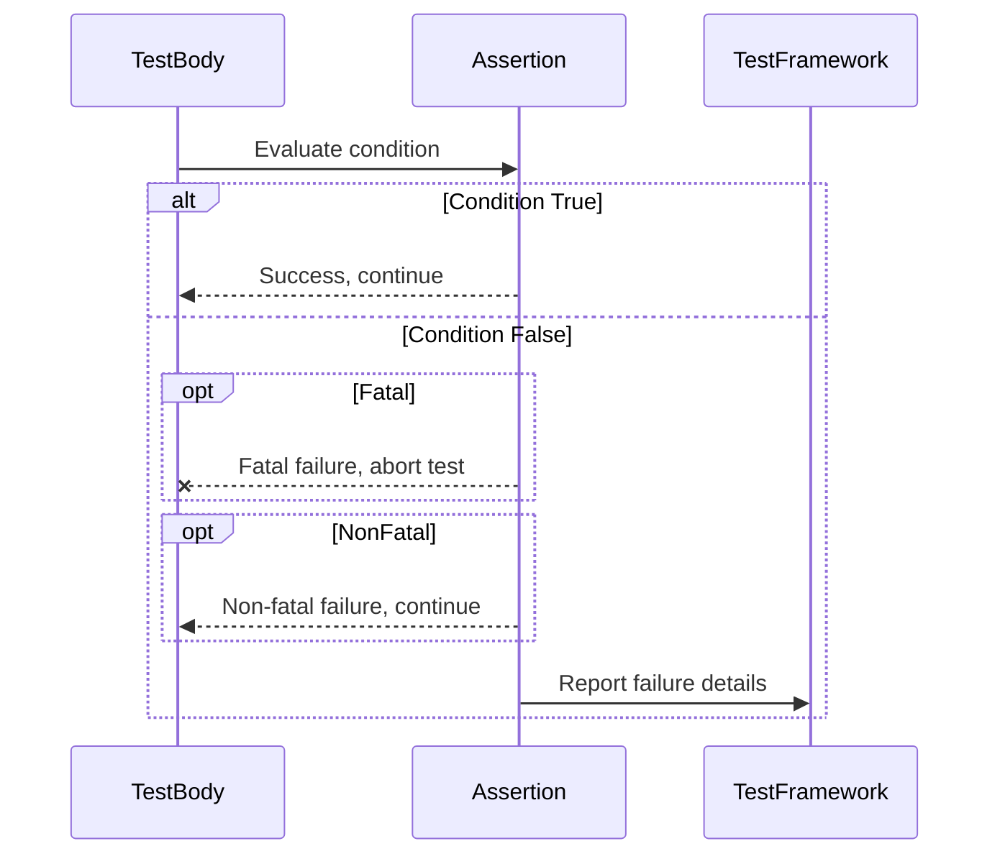

# Assertions and Failure Reporting

GoogleTest provides a rich and expressive assertion framework that allows you to verify the correctness of your code during testing. This guide explains the structure and behavior of assertions in GoogleTest, the distinctions between fatal and non-fatal failures, and how detailed result messages are generated and presented to help you diagnose issues quickly and effectively.

---

## Understanding Assertions

At the core of GoogleTest's testing mechanism are **assertions** — macros that evaluate conditions you expect in your code and report success or failure accordingly. Assertions come in pairs: `EXPECT_` which report **non-fatal failures**, allowing tests to continue after failure, and `ASSERT_` which report **fatal failures**, causing immediate abortion of the current test function.

### Types of Assertion Outcomes

- **Success**: The checked condition is true. The test continues silently.
- **Non-Fatal Failure**: The condition is false, but the test keeps running. These allow multiple problems in a test to surface at once.
- **Fatal Failure**: The condition is false and the current function immediately returns, preventing subsequent code in the test from executing.

Example:

```cpp
ASSERT_EQ(x.size(), y.size()) << "Vectors x and y differ in size.";
for (int i = 0; i < x.size(); ++i) {
  EXPECT_EQ(x[i], y[i]) << "Vectors differ at index " << i;
}
```

The above pattern ensures the size equality is critical and stops the test if it fails, while element-wise equality failures allow the test to continue checking all elements.

### Assertion Macros

GoogleTest includes macros for a variety of checks, including:

- Boolean conditions: `EXPECT_TRUE()`, `ASSERT_FALSE()`
- Equality/Inequality: `EXPECT_EQ()`, `ASSERT_NE()`
- Relational comparisons: `EXPECT_LT()`, `ASSERT_GE()`
- String comparisons: `EXPECT_STREQ()`, `ASSERT_STRNE()`, ignoring case with `EXPECT_STRCASEEQ()`
- Floating-point comparisons: `EXPECT_FLOAT_EQ()`, `ASSERT_DOUBLE_EQ()`, and `EXPECT_NEAR()`
- Exception checking: `EXPECT_THROW()`, `ASSERT_NO_THROW()`
- Predicate assertions for complex predicates with rich failure messages

All macros support streaming custom messages with the `<<` operator to give additional details on failure.

## Anatomy of an Assertion Message

When an assertion fails, GoogleTest prints a detailed message including:

- The expression tested as-written in your code.
- The actual value(s) that caused the failure, elegantly formatted.
- Optional user-supplied messages if you streamed anything into the assertion.

For example, a failure in `EXPECT_EQ(5, foo)` when `foo` is `6` produces:

```
Expected equality of these values:
  5
  foo
    Which is: 6
```

When strings differ, GoogleTest shows the string values, and for multiline or long strings, helpful diffs highlight the difference.

### How Custom Messages Are Appended

Your custom messages, streamed via `<<`, are appended to the built-in failure message, separated by a line break, improving clarity and debugging.

## Fatal vs. Non-Fatal Assertions

- **Fatal Assertions (`ASSERT_*`)**: These halt the current test function immediately upon failure, skipping steps that follow. Use fatal assertions when further execution would be meaningless or potentially cause crashes.

- **Non-Fatal Assertions (`EXPECT_*`)**: These record a failure but allow the test body to continue, making it easier to identify multiple defects in one test run.

```cpp
// Fatal: immediately returns on failure
ASSERT_NE(ptr, nullptr);
*ptr = value;  // safe only if ptr is non-null
// Non-fatal: continues running even if fails
EXPECT_EQ(foo(), bar());
EXPECT_EQ(foo2(), bar2());
```

### Checking Assertion Status in Code

You can query if the current test has had a fatal or non-fatal failure:

```cpp
if (testing::Test::HasFatalFailure()) { return; } // skip rest if fatal failure
if (testing::Test::HasNonfatalFailure()) { /* ... */ }
if (testing::Test::HasFailure()) { /* Does both fatal or non-fatal failures exist */ }
```

This is useful in subroutines where continuing after a fatal failure is not desired.

## Result Message Construction and Tracing

GoogleTest uses an internal `Message` class to accumulate strings streamed into assertions. When an assertion macro is invoked, it generates a base failure message describing the assertion, to which any user messages are appended with appropriate formatting.

In addition to message construction, GoogleTest enriches failure reports with:

- **Code Location**: The precise source file and line number where the failure occurred.
- **Stack Trace**: Optionally, a stack trace is included for failures that warrant it (i.e., non-success, non-skipped assertions).
- **Active Traces**: If you use the `SCOPED_TRACE` macro, the trace stack is appended to failure messages, indicating the context of nested calls for easier diagnosis.

## Using Scoped Trace for Better Debugging

When a failure occurs deep in a call stack or inside helper functions, it can be tough to know what led there. Use `SCOPED_TRACE()` to add messages that GoogleTest will include with failures occurring within the scope.

Example:

```cpp
void Helper(int n) {
  SCOPED_TRACE(testing::Message() << "Processing n=" << n);
  EXPECT_EQ(n % 2, 0);
}

TEST(MyTest, TestHelper) {
  Helper(1);  // failure message will include "Processing n=1"
}
```

The trace messages accumulate and show full path context, simplifying debugging.

## Recording Additional Test Properties

You can log key-value pairs (properties) associated with tests to be included in test reports, typically XML or JSON:

```cpp
TEST(MyTest, RecordsProperties) {
  testing::Test::RecordProperty("MaxIterations", 100);
  testing::Test::RecordProperty("ResultPath", "/tmp/out.log");
}
```

Properties should not clash with reserved XML attributes such as `name`, `status`, `time`, etc. Recording properties outside of individual tests is possible at suite or global level.

## Assertion Macros: Summary and Usage Tips

| Assertion Macro             | Failure Type    | Effect                                  | Typical Use Case                  |
|-----------------------------|-----------------|----------------------------------------|--------------------------------|
| `EXPECT_TRUE(cond)`          | Non-fatal       | Reports failure but test continues      | Check an optional condition      |
| `ASSERT_TRUE(cond)`          | Fatal           | Aborts current test function            | Check necessary test condition   |
| `EXPECT_EQ(val1, val2)`      | Non-fatal       | Reports equality failure but continues  | Value checks in tests            |
| `ASSERT_EQ(val1, val2)`      | Fatal           | Aborts current test function            | Critical equality checks         |
| `EXPECT_STREQ(str1, str2)`   | Non-fatal       | Compares C-strings, continues            | Checking string equality         |
| `ASSERT_STREQ(str1, str2)`   | Fatal           | Compares C-strings, aborts               | Critical string equality         |
| `EXPECT_THROW(stmt, exc)`    | Non-fatal       | Verifies exception thrown, continues    | Check for expected exceptions   |
| `ASSERT_THROW(stmt, exc)`    | Fatal           | Verifies exception thrown, aborts       | Critical exception testing       |
| `ADD_FAILURE()`              | Non-fatal       | Records nonfatal failure immediately    | Inject failure unconditionally   |
| `FAIL()`                    | Fatal           | Records fatal failure and aborts        | Inject failure unconditionally   | 


## Troubleshooting Common Pitfalls

- Fatal assertions (e.g., `ASSERT_*`) **only abort the current function**, not the entire test or test suite. Use `HasFatalFailure()` to stop executing following code.
- Avoid side effects in assertion arguments; they are evaluated exactly once but may be skipped early due to fatal failures.
- Streaming wide strings (e.g., `wchar_t*`) into assertions is supported, with automatic UTF-8 encoding.
- Do not mix `TEST()` and `TEST_F()` in the same test suite, as this violates the requirement that all tests in a suite share the same fixture type.
- Be mindful to call `testing::InitGoogleTest()` before `RUN_ALL_TESTS()` to properly initialize assertions and flags.

## Summary

GoogleTest's assertions and failure reporting combine expressive power and clarity to make your testing effective. The framework provides macros to check conditions, generate detailed and contextual failure messages, and control test flow via fatal vs non-fatal failures. Combined with trace facilities and property recording, assertions form the backbone of reliable, diagnosable tests.

---

## Code Snippet: Example of a Simple Test with Assertions

```cpp
#include <gtest/gtest.h>

// Function to test
int Sum(int a, int b) {
  return a + b;
}

TEST(SumTest, HandlesPositiveValues) {
  EXPECT_EQ(Sum(2, 3), 5) << "Sum of 2 and 3 should be 5";
  ASSERT_GT(Sum(10, 0), 5) << "Sum should be greater than 5";
}

int main(int argc, char **argv) {
  testing::InitGoogleTest(&argc, argv);
  return RUN_ALL_TESTS();
}
```

This example shows use of `EXPECT_EQ` (non-fatal) and `ASSERT_GT` (fatal) assertions used to verify the `Sum` function's behavior.

---

## Visualizing Assertion Flow



---

## Related Tools and APIs

- **`SCOPED_TRACE` Macro**: Adds detailed context to failures occurring within a lexical scope, improving diagnosis of deep errors.
- **`RecordProperty()`**: Logs custom key/value pairs for test results, aiding in enriched reports.
- **Test Event Listeners**: Extend reporting capabilities by subscribing to test lifecycle events.

---

## Best Practices

- Use non-fatal assertions (`EXPECT_`) when you want tests to continue after failures to collect more error data.
- Use fatal assertions (`ASSERT_`) when continued execution would be unsafe or meaningless.
- Leverage scoped traces to understand failing calls in nested helper functions.
- Stream clear, informative custom messages in assertions for easier debugging.
- Avoid mixing test macros incorrectly within the same suite.

---

For full details on assertion macros and usage, refer to the [Assertions Reference](reference/assertions.md) and the [GoogleTest Primer](docs/primer.md). To learn about advanced failure handling, see the [Advanced GoogleTest Topics](docs/advanced.md#more-assertions).

---

## Source

[`googletest/include/gtest/gtest.h`](https://github.com/google/googletest/blob/main/googletest/include/gtest/gtest.h)

[`googletest/include/gtest/gtest-test-part.h`](https://github.com/google/googletest/blob/main/googletest/include/gtest/gtest-test-part.h)

[`googletest/src/gtest.cc`](https://github.com/google/googletest/blob/main/googletest/src/gtest.cc)

[`googletest/src/gtest-test-part.cc`](https://github.com/google/googletest/blob/main/googletest/src/gtest-test-part.cc)

---

# Appendix

### TestPartResult Details

Each individual assertion result is represented by a `TestPartResult` which captures:

- Result Type (`kSuccess`, `kNonFatalFailure`, `kFatalFailure`, `kSkip`)
- File Name and Line Number
- Failure Message Summary and Full Message

### TestResult Details

A `TestResult` aggregates all assertion results for a single test. It includes counts of successes and failures, elapsed time, properties, and allows iteration over the `TestPartResult`s.

---

This completes the detailed conceptual guide on GoogleTest Assertions and Failure Reporting.