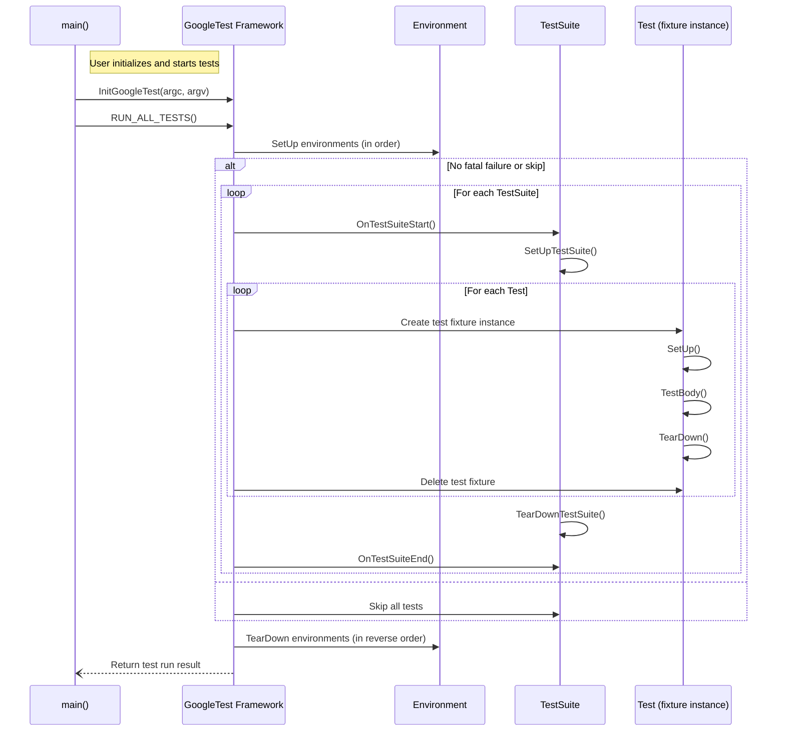

# Test Lifecycle and Execution Flow

GoogleTest and GoogleMock provide a rich framework for defining, managing, and executing tests with high reliability and reproducibility. This guide walks you through the journey of a test within the framework — from definition and registration, through setup, execution, and teardown, to final result reporting. Understanding this lifecycle helps you write better tests, manage test suites efficiently, and diagnose issues when they arise.

---

## 1. Test Definition and Registration

GoogleTest offers several macros and APIs for defining tests with various degrees of complexity and parameterization:

- **Simple Tests:** Use `TEST(TestSuiteName, TestName)` to define basic, standalone tests.

- **Test Fixtures:** Use `TEST_F(TestFixtureName, TestName)` to run tests that share a common test fixture class, allowing reuse of setup and teardown logic.

- **Parameterized Tests:** Use `TEST_P` along with `INSTANTIATE_TEST_SUITE_P` to define tests that run the same logic over varying input data.

- **Typed and Type-Parameterized Tests:** Use `TYPED_TEST_SUITE`/`TYPED_TEST` and `TYPED_TEST_SUITE_P`/`TYPED_TEST_P` for repeating a test logic across multiple types.

- **Dynamic Registration:** For advanced use cases, you can register tests dynamically at runtime using `::testing::RegisterTest`, supplying a factory callable that creates the test object.

All defined tests are automatically registered with GoogleTest, enabling seamless discovery and execution without manual enumeration.

### Example: Defining a Basic Test
```cpp
TEST(FactorialTest, HandlesZeroInput) {
  EXPECT_EQ(Factorial(0), 1);
}
```

### Example: Registering Tests Dynamically
```cpp
class MyFixture : public testing::Test { ... };
class MyTest : public MyFixture {
 public:
  explicit MyTest(int data) : data_(data) {}
  void TestBody() override { ... }
 private:
  int data_;
};

void RegisterMyTests(const std::vector<int>& values) {
  for (int v : values) {
    ::testing::RegisterTest(
        "MyFixture", ("Test" + std::to_string(v)).c_str(), nullptr,
        std::to_string(v).c_str(), __FILE__, __LINE__,
        [=]() -> MyFixture* { return new MyTest(v); });
  }
}
```

---

## 2. Test Suite and Environment Management

Tests are organized into **test suites** (formerly called test cases), which group related tests logically and may share static resources.

- The test fixture class governs per-test setup and teardown via `SetUp()` and `TearDown()` methods.

- For expensive shared resources, test suites can define `static void SetUpTestSuite()` and `static void TearDownTestSuite()` methods, executed once before the first and after the last test in the suite respectively.

- Global test **environments** subclass from `::testing::Environment` and provide program-wide setup and teardown via `SetUp()`/`TearDown()`. Register them before `RUN_ALL_TESTS()` with `::testing::AddGlobalTestEnvironment()`.

- Multiple environments execute set-up in registration order and tear-down in reverse order.

### Example: Shared Suite-level Setup
```cpp
class FooTest : public testing::Test {
 protected:
  static void SetUpTestSuite() {
    shared_resource_ = new ...;
  }

  static void TearDownTestSuite() {
    delete shared_resource_;
    shared_resource_ = nullptr;
  }

  void SetUp() override { ... }
  void TearDown() override { ... }

  static T* shared_resource_;
};
```

---

## 3. Test Execution Flow

When `RUN_ALL_TESTS()` is called (usually in `main()`), GoogleTest orchestrates the entire test run:

### 3.1 Initialization

- **Flag Parsing:** The command-line is parsed by `InitGoogleTest()`, extracting framework flags that control filtering, repetition, shuffling, reporting, and more.

- **Test Discovery:** All registered tests and parameterized instantiations are gathered.

- **Filtering and Sharding:** Tests are filtered based on user-specified patterns and optionally sharded for parallel execution using environment variables like `GTEST_TOTAL_SHARDS` and `GTEST_SHARD_INDEX`.

### 3.2 Environment Setup

- The global environments’ `SetUp()` methods run in registration order, provided there is at least one test to execute.

- Fatal failures or skips during environment setup prevent tests from running but **do not** prevent environment teardown.

### 3.3 Test Suite Execution

For each **test suite**:

1. Notify listeners the suite is starting.
2. Call `SetUpTestSuite()` for per-suite initialization.
3. For each test:
  - If tests are skipped due to prior failure (`--gtest_fail_fast`) or filter/shard exclusion, skip the test and notify listeners.
  - Otherwise, create a fresh test fixture object.
  - Run its `SetUp()` method.
  - Run the test body (`TestBody()`).
  - Run the test `TearDown()`.
  - Delete the fixture.
4. Call `TearDownTestSuite()` for suite-wide cleanup.
5. Notify listeners the suite has ended.

Tests run independently; failures in one do not affect others.

### 3.4 Environment Teardown

- Global environments’ `TearDown()` methods execute in reverse registration order.

- `TearDown()` runs even if earlier setup or tests failed or skipped.

### 3.5 Result Reporting

- Test listeners receive events about test lifecycle transitions (start, end, failures).

- Results and timing information are collected for each test, test suite, and overall run.

- Optional output formats (console, XML, JSON) and streaming endpoints produce detailed reports.

- Finally, `RUN_ALL_TESTS()` returns 0 if all tests passed, 1 otherwise.

### Example: Typical Call Flow


---

## 4. Isolation and Reproducibility Mechanisms

GoogleTest enforces test independence and reproducibility through:

- **Test Fixture Instances:** Each test method runs on its own fresh fixture object. State is never shared between tests unless explicitly arranged via static members.

- **Strict Lifecycle Order:** `SetUp()` must succeed (and no fatal failures have occurred) before the test body runs. Regardless of test success or failure, `TearDown()` will always run.

- **Test Filtering and Sharding:** Only selected tests based on filter patterns and shard assignments execute. Tests in other shards are skipped.

- **Repeat and Shuffle:** Tests can be repeated multiple times with or without reshuffling to uncover flaky or order-dependent bugs.

- **Exception Handling:** When enabled, exceptions inside tests are caught and treated as test failures, preventing abrupt termination.

- **Resource Management:** Test suites can use `SetUpTestSuite()` and `TearDownTestSuite()` for shared expensive resources. Global environments handle program-wide resources.

- **Skips:** Via `GTEST_SKIP()`, tests or entire suites can skip execution gracefully during runtime.

---

## 5. Event Listener Hooks

GoogleTest fires a rich set of events to which you can subscribe by implementing the `TestEventListener` interface:

- **Program-level:** `OnTestProgramStart`, `OnTestIterationStart`, `OnTestIterationEnd`, `OnTestProgramEnd`
- **Environment:** `OnEnvironmentsSetUpStart`, `OnEnvironmentsSetUpEnd`, `OnEnvironmentsTearDownStart`, `OnEnvironmentsTearDownEnd`
- **Test Suite:** `OnTestSuiteStart`, `OnTestSuiteEnd`
- **Test case:** `OnTestStart`, `OnTestPartResult`, `OnTestEnd`

By using listeners, you can add custom reporting, integrate with CI, or extend test instrumentation.

Example of adding a simple event listener:
```cpp
class MyListener : public testing::EmptyTestEventListener {
 public:
  void OnTestStart(const testing::TestInfo& test_info) override {
    std::cout << "Starting " << test_info.test_suite_name() << "." << test_info.name() << std::endl;
  }

  void OnTestEnd(const testing::TestInfo& test_info) override {
    std::cout << "Completed " << test_info.test_suite_name() << "." << test_info.name() << std::endl;
  }
};

int main(int argc, char **argv) {
  testing::InitGoogleTest(&argc, argv);
  testing::UnitTest::GetInstance()->listeners().Append(new MyListener());
  return RUN_ALL_TESTS();
}
```

---

## 6. Troubleshooting Common Lifecycle Issues

### Test Not Running
- Check test filters to ensure your test matches.
- Verify that test is not disabled (via prefix `DISABLED_`).
- If sharding, confirm environment variables `GTEST_TOTAL_SHARDS` and `GTEST_SHARD_INDEX` are correctly set.

### Setup or Teardown Failures
- Fatal failures during environment or suite setup block test execution.
- Ensure `SetUpTestSuite()` and environment `SetUp()` methods are robust.
- `TearDown()` always runs; make cleanup idempotent where possible.

### Unexpected Skips
- Check for `GTEST_SKIP()` calls in your test or setup code.
- Confirm no fatal failures occurred earlier in the suite or environment.

### Flaky Tests
- Use `--gtest_repeat` to run tests multiple times.
- Use `--gtest_shuffle` to randomize execution order.
- Isolate shared state alterations in fixtures or environment.

---

## 7. Summary

The test lifecycle in GoogleTest and GoogleMock spans definition through teardown, ensuring reliable execution, isolation, and comprehensive result reporting. Understanding the lifecycle empowers test authors to write maintainable, reproducible tests and integrate seamlessly with their build and CI environments.

For more detail on specific points:

- See [TEST Macros and Parameterized Tests](reference/testing.md#TEST) for definition styles.
- Explore [Advanced GoogleTest Topics](advanced.md) for setup, skips, and lifecycle management.
- Consult [Test Event Listeners](reference/testing.md#TestEventListener) for extending reporting capabilities.
- Review [Global Set-Up and Tear-Down](advanced.md#global-set-up-and-tear-down) for environment handling.

---

For a holistic view of GoogleTest, also consider:

- [Core Concepts & Terminology](overview/getting-started/core-terminology) for foundational ideas.
- [Test Cases, Fixtures, and Lifecycle API](api-reference/core-testing-api/test-case-and-fixture-api) for API-centric details.
- [Matchers and Expectations](concepts/core-building-blocks/matchers-and-expectations) for assertion mechanics.
- [Mock Objects and Method Expectations](api-reference/mocking-framework/mock-objects-and-methods) for mocking integration.

---

For sample usages and live code, visit the [GoogleTest repository samples](https://github.com/google/googletest/tree/main/googletest/samples).

---