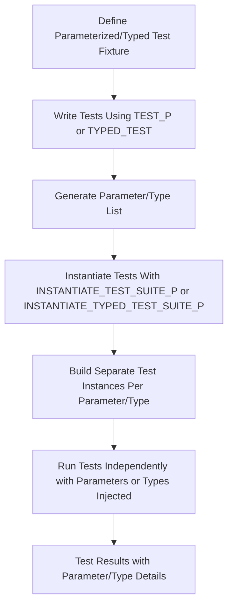

# Parameterized & Typed Testing Models

GoogleTest provides powerful abstractions for writing scalable and reusable tests through **value-parameterized** and **type-parameterized** testing models. These models enable you to run the same test logic with different inputs or types without repeating code, significantly improving test coverage and maintainability.

This guide explains the core principles behind these models and how parameters and type information flow through test suites to deliver flexible test patterns.

---

## 1. Introduction to Parameterized Testing Models

GoogleTest supports two primary parameterization strategies:

- **Value-Parameterized Tests:** Run the same test logic with various data values.
- **Typed Tests:** Run the same test logic for a list of types known at compile time.

A third variant, **Type-Parameterized Tests**, lets you define abstract test patterns with types resolved later at instantiation time, enabling reusable test suites for concepts or interfaces.


### Why Parameterized & Typed Tests?

Imagine you want to verify that a function behaves correctly for different input values or different data types (e.g., `int`, `double`, a custom class). Writing separate test cases for each quickly becomes tedious and error-prone.

By using parameterized or typed tests, you write the test logic once and let GoogleTest generate individual tests for all specified parameters or types, ensuring comprehensive coverage with minimal duplication.

---

## 2. Value-Parameterized Tests

### Concept

Value-parameterized tests enable running the same test functionality repeatedly, each time with a different parameter value. Typically, you use this to feed different inputs or configurations into your tests.

### Defining Value-Parameterized Tests

1. Define a **test fixture** class templated on the parameter type by inheriting from `testing::TestWithParam<T>`, where `T` is the parameter type.

2. Define tests within this fixture using the `TEST_P` macro.

3. Instantiate the test suite with a generator of parameters using `INSTANTIATE_TEST_SUITE_P`.


#### Example

```cpp
// Define the parameter type.
class MyType {
 public:
  explicit MyType(const std::string& val) : value_(val) {}
  const std::string& value() const { return value_; }
 private:
  std::string value_;
};

// Teach GoogleTest how to print the parameter (optional but recommended).
void PrintTo(const MyType& x, std::ostream* os) { *os << x.value(); }

// Create the test fixture with the parameter type.
class ValueParamTest : public testing::TestWithParam<MyType> {};

// Define tests using TEST_P and access parameter with GetParam().
TEST_P(ValueParamTest, TestA) {
  const MyType& param = GetParam();
  EXPECT_FALSE(param.value().empty());
}

// Instantiate the test suite with a set of parameters.
INSTANTIATE_TEST_SUITE_P(
    MyInstantiation, ValueParamTest,
    testing::Values(
        MyType("one line"), MyType("two\nlines"),
        MyType("a very long line with newline characters inside")
    ));
```

### Parameter Generators

GoogleTest provides powerful parameter generators for `INSTANTIATE_TEST_SUITE_P` including:

| Generator            | Description                                                    |
|----------------------|----------------------------------------------------------------|
| `Range(start, end)`   | Yields values from `start` to one before `end` with step 1     |
| `Range(start, end, step)` | Same as above with custom step                              |
| `Values(v1, v2, ...)` | Yields explicit list of values                                |
| `ValuesIn(container)` | Yields values from container or iterator range                |
| `Bool()`              | Yields `{false, true}` for boolean tests                      |
| `Combine(g1, g2, ...)`| Yields the Cartesian product of multiple generators            |

### Custom Test Names

To improve test output readability, you can supply a custom **name generator** function or functor when instantiating tests. It takes the test parameter (`TestParamInfo<T>`) and returns an alphanumeric string used as a test suffix.

### Tips & Best Practices

- Always provide a way to print parameters for meaningful test output.
- Use `Combine` generator to test combinations of multiple parameters efficiently.
- When a parameter type is not implicitly convertible from generated types, use `ConvertGenerator` with a conversion lambda to adapt parameter values.

### Common Pitfalls

- Failing to instantiate a parameterized test suite causes tests not to run; GoogleTest will report errors.
- Test suite names and test names should not contain underscores `_` (see [FAQ](../faq.md#why-should-test-suite-names-and-test-names-not-contain-underscore) for details) to avoid conflicts.

---

## 3. Typed Tests

### Concept

Typed tests run the same test code for a compile-time list of types. This is ideal to verify the behavior of templates or type-dependent code across multiple data types.

### Defining Typed Tests

1. Define a test fixture **class template** parameterized by the type, inheriting from `testing::Test`.

2. Declare a **type list** using `testing::Types<T1, T2, ...>`.

3. Use `TYPED_TEST_SUITE` to associate type list with the fixture.

4. Define typed tests using `TYPED_TEST` macro.


#### Example

```cpp
template <typename T>
class TypedTest : public testing::Test {
 public:
  T value_ = T();
};

using MyTypes = testing::Types<int, double, std::string>;
TYPED_TEST_SUITE(TypedTest, MyTypes);

TYPED_TEST(TypedTest, IsDefaultConstructible) {
  TypeParam x = this->value_;
  // Your test logic here
  EXPECT_TRUE(true);
}

TYPED_TEST(TypedTest, CanBeCopied) {
  TypeParam x = this->value_;
  TypeParam y = x;
  EXPECT_EQ(x, y);
}
```

### Custom Type Naming

`TYPED_TEST_SUITE` accepts an optional third parameter — a name generator class template with a static `GetName(int)` function to provide human-friendly test suite names for types with verbose or inconvenient names.

---

## 4. Type-Parameterized Tests

### Concept

Type-parameterized tests follow a pattern similar to typed tests but allow defining test patterns without knowing the types upfront. Types can be registered and instantiated multiple times across translation units, enabling tests for interface compliance across implementations.

### Defining Type-Parameterized Tests

1. Define a class template fixture derived from `testing::Test`.

2. Declare the test suite with `TYPED_TEST_SUITE_P`.

3. Define tests using `TYPED_TEST_P`.

4. Register tests with `REGISTER_TYPED_TEST_SUITE_P`.

5. Instantiate test suites with `INSTANTIATE_TYPED_TEST_SUITE_P` supplying the list of types.


#### Example

```cpp
template <typename T>
class AbstractTest : public testing::Test {};

TYPED_TEST_SUITE_P(AbstractTest);

TYPED_TEST_P(AbstractTest, TestA) { /* test code using TypeParam */ }
TYPED_TEST_P(AbstractTest, TestB) { /* another test */ }

REGISTER_TYPED_TEST_SUITE_P(AbstractTest, TestA, TestB);

using Implementations = testing::Types<int, double>;
INSTANTIATE_TYPED_TEST_SUITE_P(MyImpls, AbstractTest, Implementations);
```

---

## 5. How Parameters and Type Information Flow

When tests are instantiated, GoogleTest generates separate test cases for each parameter/type. Each test has its own test fixture instance to ensure independence.

- **In Value-Parameterized Tests:** `GetParam()` method inside `TEST_P` gives the current parameter value.
- **In Typed/Type-Parameterized Tests:** The special name `TypeParam` inside `TYPED_TEST` refers to the current test type.

Test suite and test case names include parameter/type information to make test results self-explanatory.

---

## 6. Practical Guidance

### Choosing Between Value-Parameterized and Typed Tests

| Scenario                                | Recommended Model          |
|----------------------------------------|---------------------------|
| Testing different values of one type   | Value-Parameterized Tests |
| Testing multiple types of data         | Typed Tests               |
| Defining abstract test patterns for any implementations | Type-Parameterized Tests |

### Best Practices

- Use **value-parameterized tests** for input variations where construction may vary or parameter type is complex.
- Use **typed tests** when you want to reuse the same test logic for multiple types that can be default constructed or uniformly accessed.
- **Name your instantiated test suites and tests** clearly to reflect parameters and types for easier diagnosis.
- Use **custom parameter name generators** to provide human-readable test suffixes.

### Common Pitfalls

- Forgetting `INSTANTIATE_TEST_SUITE_P` leads to tests silently not running.
- Mixing `TEST_F` and `TEST` within the same test suite causes errors.
- Overly complicated or non-copyable parameter types may cause failures; ensure parameters meet copy and stream-ability requirements.

---

## 7. Troubleshooting

- **Tests not running?** Ensure your parameterized test suites are properly instantiated with `INSTANTIATE_TEST_SUITE_P`.
- **Test names unreadable?** Implement `PrintTo()` for custom types or provide custom name generators.
- **Failures when mixing test fixture classes?** Check that all tests in a suite use the same fixture.
- **Undefined references in typed tests?** Make sure your test fixture templates have default constructors.

---

## 8. Summary Diagram

To visualize the parameterized and typed testing flow:



---

For more detailed API and usage examples, see the [API Reference for Parameterized and Typed Tests](../api-reference/gtest-core-apis/parameterized-and-typed-tests.md) and [Core Testing Workflows: Parameterized and Typed Tests](../guides/core-testing-workflows/parameterized-type-tests.md).


---

## References

- [Value-Parameterized Tests](../advanced.md#value-parameterized-tests)
- [Typed Tests](../advanced.md#typed-tests)
- [Type-Parameterized Tests](../advanced.md#type-parameterized-tests)
- [INSTANTIATE_TEST_SUITE_P](../docs/reference/testing.md#INSTANTIATE_TEST_SUITE_P)
- [TYPED_TEST_SUITE](../docs/reference/testing.md#TYPED_TEST_SUITE)
- [TYPED_TEST](../docs/reference/testing.md#TYPED_TEST)
- [INSTANTIATE_TYPED_TEST_SUITE_P](../docs/reference/testing.md#INSTANTIATE_TYPED_TEST_SUITE_P)
- [PrintToStringParamName](../docs/reference/testing.md#PrintToStringParamName)

Explore related concepts like **Assertions and Matchers**, **Mocking Models**, and **Test Configuration** for comprehensive testing mastery.

---

## Additional Resources

- Getting Started: [Your First Test](../../guides/getting-started/first-test.md)
- Core Concepts: [Core Concepts & Terminology](../../overview/architecture-concepts/core-concepts-terminology.md)
- Advanced Use: [Advanced Mocking Patterns](../../guides/core-testing-workflows/advanced-mocking-patterns.md)
- FAQ: [Choosing Between Typed and Parameterized Tests](../../faq/getting-started-faq/basic-usage-questions.md#i-need-to-test-different-implementations-should-i-use-typed-or-parameterized-tests)


---

This guide empowers you to write scalable, reusable tests that elegantly cover diverse inputs and data types, shining light on test failures and enabling robust automated verification across your C++ projects.


---