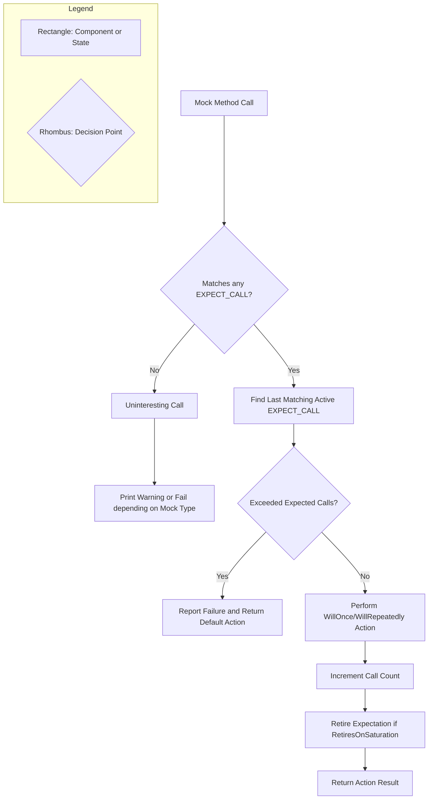

# Mocking Concepts and Expectations

GoogleMock (gMock) is a powerful C++ framework that allows you to create mock objects to isolate code dependencies and verify behavioral interactions precisely. This document unpacks the core concepts of mocking in gMock—how expectations govern mock behavior, and how cardinalities, matchers, and actions combine to define flexible, expressive test scenarios.

---

## Introduction to Mocking in GoogleMock

At its heart, mocking is about controlling and verifying interactions between a unit under test and its dependencies. Mock objects implement the same interface as real objects but allow tests to specify:

- Which methods will be called
- How many times (cardinalities)
- With what arguments (matchers)
- What they should do when called (actions)

GoogleMock provides a rich syntax to express these aspects declaratively and fluently, empowering you to write robust tests that observe and constrain behavior precisely.

## Expectations: Defining Behavior and Verification

The cornerstone of gMock is the *expectation*. An expectation establishes a contract between your test code and the mock object, specifying how the mock should be used.

- **EXPECT_CALL** creates an expectation asserting a mock method must be called with given arguments, a certain number of times, possibly in a particular order.
- **ON_CALL** sets default behaviors for matching calls but does *not* impose an expectation that such a call will occur.

> **Key Insight:** Use `ON_CALL` for configuring default behavior without verification. Use `EXPECT_CALL` when you want to verify that specific calls actually happen.

### Expectation Clauses and Syntax

Here’s the general structure of an `EXPECT_CALL`:

```cpp
EXPECT_CALL(mock_object, MethodName(arg_matchers...))
    .With(multi_arg_matcher)  // Optional, matches all args as a tuple
    .Times(cardinality)       // Optional, how many times to expect
    .InSequence(sequences...) // Optional, specify call order sequences
    .After(other_expectations) // Optional, specify dependent expectations
    .WillOnce(action)         // Zero or more; actions for specific calls
    .WillRepeatedly(action)   // Optional; action for subsequent calls
    .RetiresOnSaturation();   // Optional; ends expectation when saturated
```

**Ordering matters:** Clauses must appear in the prescribed order. For example, `Times()` must appear before `WillOnce()`.

### Cardinality: Specifying "How Many Times"

Cardinalities describe the expected number of times a mock method call matching the expectation should occur. gMock supports both exact and fuzzy cardinalities:

| Cardinality       | Meaning                                     |
|-------------------|---------------------------------------------|
| `Exactly(n)` / `n`| Exactly *n* calls expected (0 means never called) |
| `AtLeast(n)`      | At least *n* calls expected                  |
| `AtMost(n)`       | At most *n* calls expected                   |
| `Between(m, n)`   | Between *m* and *n* calls expected inclusive|
| `AnyNumber()`     | Any number of calls (no constraint)         |

If you omit `.Times()`, gMock infers cardinality based on the presence of `WillOnce()` and `WillRepeatedly()`. For example:

- No `WillOnce()` or `WillRepeatedly()` => Expect exactly one call
- `n` `WillOnce()` without `WillRepeatedly()` => Exactly `n` calls
- `n` `WillOnce()` with `WillRepeatedly()` => At least `n` calls

### Matchers: Defining Acceptable Arguments

Mock methods receive *arguments* in calls. Matchers specify the constraints those arguments must satisfy.

- Use exact values (`42` means equal to 42) or built-in matchers (`Ge(10)` meaning >= 10).
- Wildcard matcher `_` matches any value without verification.
- Combine matchers using `AllOf()`, `AnyOf()`, `Not()`, or write custom matchers.
- Use `.With()` to match multiple arguments *together* as a tuple.

Example:

```cpp
EXPECT_CALL(mock_obj, DoSomething(Ge(1), _, Eq("foo")));  // First arg >=1, second any, third == "foo"
EXPECT_CALL(mock_obj, Process(_)).With(Lt());              // Match only if arg < second argument
```

### Actions: Specifying What Mocks Do When Called

Actions define the behavior of the mock method when called:

- `WillOnce(action)` specifies the action for individual calls, used in order.
- `WillRepeatedly(action)` specifies the action for all subsequent calls after `WillOnce` actions are exhausted.
- Typical actions include `Return(value)`, `ReturnRef(reference)`, `Invoke(function)`, `DoAll(...)` for multiple actions, and `SetArgPointee<N>(value)` for modifying output parameters.

Example:

```cpp
EXPECT_CALL(mock, GetValue())
    .WillOnce(Return(10))
    .WillRepeatedly(Return(20));

EXPECT_CALL(mock, SetData(_, _))
    .WillOnce(DoAll(SetArgPointee<1>(42), Return(true)));
```

### Controlling Call Order and Dependencies

By default, call order does not matter. gMock provides tools to enforce ordering:

- **Sequences** (`Sequence` class): Group expectations into ordered sequences using `.InSequence(sequence...)`. Calls on expectations in the same sequence **must** happen in the declared order.

- **After Clause:** Use `.After(expectation)` or `.After(expectation_set)` to specify calls that happen only after certain other calls.

Example:

```cpp
Sequence s1, s2;
EXPECT_CALL(obj, Initialize()).InSequence(s1, s2);
EXPECT_CALL(obj, Start()).InSequence(s1);
EXPECT_CALL(obj, Stop()).InSequence(s2);

EXPECT_CALL(obj, Finalize()).After(initialize_expectation);
```

### Retiring Expectations

Occasionally you want an expectation to become inactive once it has been satisfied (saturated). Use `.RetiresOnSaturation()` to indicate that after the expected number of calls is reached, the expectation no longer matches calls.

This helps avoid errors when multiple expectations could match the same call after one has already fulfilled its quota.

## Uninteresting and Unexpected Calls

- **Uninteresting calls:** Calls to mock methods with no matching `EXPECT_CALL`.
  - By default, these generate warnings but do not fail the test.
  - Use wrappers like `NiceMock` to silence these warnings, or `StrictMock` to make these errors.

- **Unexpected calls:** Calls that fail to match *any* declared `EXPECT_CALL` expectations.
  - Always an error.

Use `NaggyMock` (default) for warnings, `NiceMock` for silence, and `StrictMock` to turn them into test failures.

## Verifying and Managing Expectations

- Upon destruction of a mock object, gMock automatically verifies whether all expectations have been met.
- You can explicitly verify expectations at any time using `Mock::VerifyAndClearExpectations(&mock_obj)`.
- Use `Mock::AllowLeak(&mock_obj)` to intentionally allow leaking a mock, suppressing leak reports and expectation verification.

## Practical Tips and Common Pitfalls

- **Order of setting expectations matters:** Always set expectations before calling mock methods.
- **Sticky Expectations:** Expectations remain active after being saturated unless `RetiresOnSaturation` is specified.
- **Default Actions and ON_CALL:** Use `ON_CALL` to set default behaviors without enforcing calls. If you see warnings for uninteresting calls, consider if `EXPECT_CALL(...).Times(AnyNumber())` is more appropriate.
- **Sequence Scoping:** The `InSequence` object applies to all expectations declared in its scope.
- **Using Matchers in Overloaded Methods:** When mocking overloaded methods, use `using Base::Method;` to bring in signatures or specify exact overloads.

## Example Workflow

```cpp
class MockTurtle : public Turtle {
 public:
  MOCK_METHOD(void, PenUp, (), (override));
  MOCK_METHOD(void, PenDown, (), (override));
  MOCK_METHOD(int, GetX, (), (const, override));
};

TEST(PaintTest, CallsPenDownOnce) {
  MockTurtle turtle;

  // Expect PenDown to be called exactly once.
  EXPECT_CALL(turtle, PenDown()).Times(1);

  Painter painter(&turtle);
  painter.DrawCircle();
}
```

## Summary Diagram: Expectation Call Handling Flow



---

## Additional Resources

- [gMock Cookbook](https://google.github.io/googletest/gmock_cook_book.html) - Recipes and examples for common mocking scenarios.
- [gMock Cheat Sheet](https://google.github.io/googletest/gmock_cheat_sheet.html) - Quick syntax and usage summary.
- [Mocking Reference](https://google.github.io/googletest/reference/mocking.html) - In-depth API details for defining and working with mocks.
- [Introduction to Mocking Guide](https://google.github.io/googletest/guides/mocking-and-behavior-verification/introduction-to-mocking.html) - Beginner-friendly conceptual guide.

---

## Troubleshooting

### Common Issues

- **No verification occurs:** Ensure the mock object is destructed or explicitly verify using `Mock::VerifyAndClearExpectations`.
- **Warning about uninteresting calls:** Use `EXPECT_CALL` with `.Times(AnyNumber())` or wrap the mock with `NiceMock`.
- **Unexpected call errors:** Verify that your expectations cover all expected code paths.
- **Compilation issues with `MOCK_METHOD` due to commas in types:** Wrap types with commas in extra parentheses or use type aliases.

### Best Practices

- Define expectations as specifically as necessary—not too strict, not too loose.
- Use sequences or `.After()` clauses to enforce call ordering only when important.
- Delegate complex behavior to actions or separate fake implementations when appropriate.
- Prefer interfaces with virtual functions to simplify mocking.

---

This page focuses solely on the concepts and behavior of mocking with GoogleMock, building the fundamental mental model for writing effective tests that leverage its expressive APIs to verify interaction-based contracts robustly.