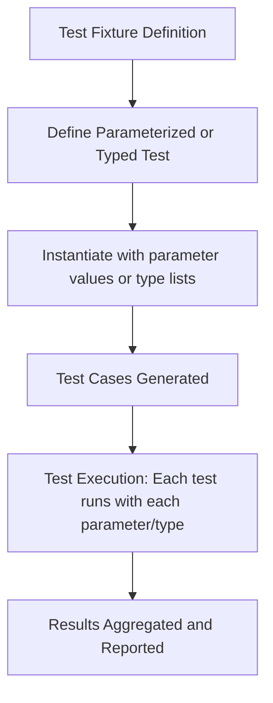

# Parameterized and Typed Test Patterns

GoogleTest empowers you to write systematic and scalable tests by providing **parameterized** and **typed test** patterns. These patterns enable the reuse of the same test logic across multiple data values or multiple types, dramatically improving coverage, reducing duplication, and making your test suites easier to maintain.

---

## Why Use Parameterized and Typed Tests?

Imagine you have a function or class that needs to be tested against various input values or different data types. Writing distinct tests for each scenario becomes cumbersome, error-prone, and difficult to maintain.

GoogleTest’s parameterized and typed tests solve this by letting you define:

- **Value-Parameterized Tests**: Run the same test logic multiple times with different input values.
- **Typed Tests**: Run the same suite of tests on different types, ideal for templated classes or interfaces.
- **Type-Parameterized Tests**: Flexible test patterns that can be instantiated with different types in multiple translation units.

This approach increases your test coverage without redundant test code, while keeping tests concise and clear.

---

## Value-Parameterized Tests

### Concept Overview

In value-parameterized tests, a test fixture is parameterized by values — such as numbers, strings, or user-defined objects. Each test defined using the fixture runs with different parameters, which can be iterated through systematically.

### Typical Use Case

For example, when testing a function that processes various string inputs, you can define a value-parameterized test and instantiate it with a list of input strings to cover multiple cases.

### How to Define and Use Value-Parameterized Tests

1. **Define a Test Fixture** derived from `::testing::TestWithParam<T>`, where `T` is the parameter type.

2. **Write Test Cases** using the `TEST_P` macro. Inside each test, access the parameter via `GetParam()`.

3. **Instantiate the Test Suite** with parameter sets using `INSTANTIATE_TEST_SUITE_P` and any of GoogleTest’s parameter generators like `Values()`, `ValuesIn()`, `Range()`, or `Combine()`.

### Example

```cpp
class StringTest : public ::testing::TestWithParam<std::string> {};

TEST_P(StringTest, HandlesEmptyString) {
  const auto& param = GetParam();
  EXPECT_FALSE(param.empty());  // For demo: expects param to not be empty
}

INSTANTIATE_TEST_SUITE_P(
    NonEmptyStrings,
    StringTest,
    testing::Values("hello", "world", "!")
);
```

This creates multiple test cases, one per string in the values list.

### Tips for Value-Parameterized Tests

- You can combine multiple parameter lists using `Combine()` to perform Cartesian product testing.
- For complex parameter types, define custom printing functions using `PrintTo()` to improve test output clarity.
- Provide a custom name generator to `INSTANTIATE_TEST_SUITE_P` for more readable test names.

---

## Typed Tests

### Concept Overview

Typed tests allow you to write tests that are run once per type listed in a type list, ideal for classes and functions templated on types.

### Typical Use Case

For example, testing a templated `Stack<T>` class with `int`, `double`, and `std::string` without rewriting the same test logic.

### How to Define and Use Typed Tests

1. **Define a Fixture Class Template** parameterized by a type `T`, inheriting from `::testing::Test`.

2. **Associate a Type List** with the fixture using the `TYPED_TEST_SUITE` macro.

3. **Write Typed Tests** using the `TYPED_TEST` macro, referencing the type parameter as `TypeParam` inside the test body.

### Example

```cpp
template<typename T>
class StackTest : public ::testing::Test {
 protected:
  Stack<T> stack_;
};

using MyTypes = ::testing::Types<int, double, std::string>;

TYPED_TEST_SUITE(StackTest, MyTypes);

TYPED_TEST(StackTest, IsEmptyInitially) {
  EXPECT_TRUE(this->stack_.empty());
}

TYPED_TEST(StackTest, PushIncreasesSize) {
  this->stack_.push(TypeParam{});
  EXPECT_EQ(this->stack_.size(), 1);
}
```

Each typed test runs against every type in `MyTypes`.

### Notes

- Use `typename TestFixture::` to refer to typedefs inside the fixture.
- `TYPED_TEST_SUITE` accepts an optional third argument to customize test names based on types.

---

## Type-Parameterized Tests

### Concept Overview

Type-parameterized tests are similar to typed tests but designed to be defined without knowing the types in advance, allowing the tests to be instantiated with different type lists in separate translation units.

### When to Use

Ideal when defining test patterns for interfaces or concepts, where multiple implementations can instantiate the pattern to validate compliance.

### How to Use

1. **Define a Fixture Template**

2. **Declare the Test Suite Pattern** with `TYPED_TEST_SUITE_P`.

3. **Write Tests** using `TYPED_TEST_P`.

4. **Register Test Patterns** via `REGISTER_TYPED_TEST_SUITE_P`.

5. **Instantiate** with `INSTANTIATE_TYPED_TEST_SUITE_P` supplying a type list.

### Example

```cpp
template <typename T>
class AnimalTest : public ::testing::Test {};

TYPED_TEST_SUITE_P(AnimalTest);

TYPED_TEST_P(AnimalTest, EatsFood) {
  TypeParam animal;
  EXPECT_TRUE(animal.EatsFood());
}

TYPED_TEST_P(AnimalTest, SleepsAtNight) {
  TypeParam animal;
  EXPECT_TRUE(animal.SleepsAtNight());
}

REGISTER_TYPED_TEST_SUITE_P(AnimalTest, EatsFood, SleepsAtNight);

using AnimalTypes = ::testing::Types<Dog, Cat, Bird>;

INSTANTIATE_TYPED_TEST_SUITE_P(MyAnimals, AnimalTest, AnimalTypes);
```

---

## Advanced Parameterization Techniques

- **Combine()** allows creating Cartesian products of multiple parameter generators, enabling exhaustive multi-dimensional value testing.

- **ConvertGenerator&lt;&gt;** allows transforming generated parameters into custom types or struct-like wrappers to suit complex fixture parameter needs.

- **Custom Name Generators** enable better human-readable test names for parameterized tests, improving test suite reporting clarity.

---

## Common Pitfalls and How to Avoid Them

- **Avoid Underscores in Test Names:** GoogleTest reserves underscores and uses concatenations that can break or confuse naming. Follow recommended naming conventions with alphanumeric characters.

- **Manage Parameter Ownership:** If your parameters involve pointers or resources, ensure proper management to avoid leaks or undefined behavior.

- **Provide Custom Printing:** For user-defined parameter types, implement `PrintTo()` to enhance test output readability.

- **Instantiate All Parameterized Tests:** Failure to instantiate your parameterized test suites with `INSTANTIATE_TEST_SUITE_P` or `INSTANTIATE_TYPED_TEST_SUITE_P` leads to tests registered but not executed.

---

## Summary

Value-parameterized, typed, and type-parameterized tests are powerful patterns in GoogleTest that enable expressing complex testing needs clealy and concisely. They are indispensable for scalable unit testing, especially when handling multiple data inputs or verifying template code. Embracing these patterns elevates your test suite’s expressiveness, coverage, and maintainability.

For extensive examples, see the [GoogleTest Samples repository](https://github.com/google/googletest/tree/main/googletest/samples), particularly samples #6 (typed tests), #7 (value-parameterized tests), and #8 (Combine usage).

---

## Visual Overview of Parameterized Test Instantiation



---

## Additional Resources

- [Value-Parameterized Tests in Advanced Guide](../advanced.md#value-parameterized-tests)
- [Typed Tests in Advanced Guide](../advanced.md#typed-tests)
- [Test Macros Reference](../reference/testing.md#TEST_P)
- [GoogleTest Samples Directory](https://github.com/google/googletest/tree/main/googletest/samples)

---

You now have a comprehensive understanding of GoogleTest’s parameterized and typed test patterns. Use these tools to maximize test reuse and coverage with minimal overhead.