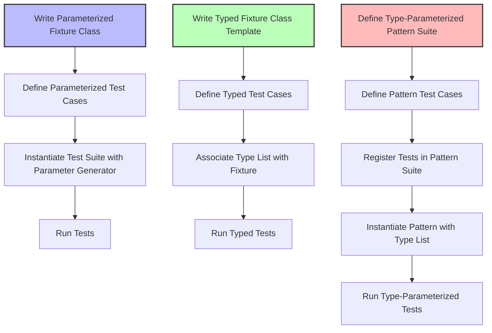

# Parameterized and Typed Test Models

GoogleTest provides powerful mechanisms to write tests that run with multiple data values or across multiple types. By leveraging **value-parameterized** and **type-parameterized** tests, you can achieve high coverage and reduce code duplication, making your tests more maintainable, expressive, and scalable.

---

## Why Parameterized and Typed Tests?

Imagine you have a piece of logic that must be verified against different inputs or data types. Writing a test for each variation quickly becomes repetitive and hard to maintain. Parameterized and typed tests allow you to author test logic once and then execute it with various inputs or for various types, automating broad-spectrum validation.

These test models embrace the following key goals:

- **DRY (Don't Repeat Yourself):** Define the behavior or pattern once, while running it on many data or types.
- **Coverage:** Easily test edge cases and multiple scenarios systematically.
- **Scalability:** Add new parameters or types without duplicating test code.

---

## Value-Parameterized Tests

### Concept

Value-parameterized tests run the same test code with different *runtime values* as parameters. This approach is ideal when the test logic is generic but needs to be verified with different input values or configurations.

### Setup and Usage

To create a value-parameterized test:

1. Derive your test fixture class from `::testing::TestWithParam<T>`, where `T` is the type of test parameter.
2. Write test cases using `TEST_P` to access the parameter via `GetParam()`.
3. Instantiate the test suite for a given set of parameter values using `INSTANTIATE_TEST_SUITE_P` with a *parameter generator* like `Values()`, `Range()`, or `Combine()`.

#### Example

```cpp
#include <gtest/gtest.h>

class IsEvenTest : public ::testing::TestWithParam<int> {};

TEST_P(IsEvenTest, CheckEven) {
  int value = GetParam();
  EXPECT_EQ(value % 2, 0);
}

INSTANTIATE_TEST_SUITE_P(EvenNumbers, IsEvenTest, ::testing::Values(2, 4, 6, 8));
```

This code runs the `CheckEven` test four times, each with a different integer value.

### Parameter Generators

GoogleTest provides several generators:

| Generator          | Description                                         |
|--------------------|-----------------------------------------------------|
| `Range(begin, end[, step])` | Produces a range of values, `[begin, end)` with optional stepping |
| `Values(v1, v2, ..., vN)`   | Enumerates explicit values                                |
| `ValuesIn(container)`        | Uses values from a container or iterator range          |
| `Bool()`                    | Boolean values `{false, true}`                           |
| `Combine(g1, g2, ..., gN)`  | Cartesian product of generators, producing tuples        |
| `ConvertGenerator<T>(gen[, func])` | Converts generated values to type `T` optionally using a conversion function |

### Advanced Features

- Custom test name generation through the last argument of `INSTANTIATE_TEST_SUITE_P`.
- Use `Combine()` for multidimensional parameter spaces.
- Multiple instantiations with different parameter sets possible.

---

## Typed Tests

### Concept

Typed tests run the same test logic for different *types* specified at compile time. They are especially useful to verify template classes or functions work correctly across a variety of type arguments.

### Usage Steps

1. Define your test fixture as a class template parameterized by type `T`, inheriting from `::testing::Test`.
2. Define your test suite type list by associating a list of types.
3. Use `TYPED_TEST_SUITE` (or the legacy `TYPED_TEST_CASE`) to bind the fixture template with the type list.
4. Write tests via `TYPED_TEST`, where inside the test body the type parameter is available as `TypeParam`.

#### Example

```cpp
template <typename T>
class StackTest : public ::testing::Test {
 protected:
  StackTest() {}
  // You can declare variables or helper methods here.
};

using MyTypes = ::testing::Types<int, double, std::string>;
TYPED_TEST_SUITE(StackTest, MyTypes);

TYPED_TEST(StackTest, DefaultConstructedIsEmpty) {
  TypeParam value{};
  // Test code using TypeParam.
  EXPECT_EQ(value, TypeParam());
}
```

The above creates a test suite `StackTest` that runs `DefaultConstructedIsEmpty` test for `int`, `double`, and `std::string`.

### Customizing Test Names

You can provide a class with a `static GetName(int index)` method to custom-generate suffixes for test case names in `TYPED_TEST_SUITE`.

---

## Type-Parameterized Tests (Pattern Tests)

Type-parameterized tests differ slightly from typed tests:

- They define an abstract test pattern without specifying types upfront.
- Registered test patterns can be instantiated multiple times with different types, potentially in different translation units.

This is beneficial for interface/concept testing to verify any implementation consistently.

The workflow includes:

1. Defining a template fixture.
2. Declaring the test suite as `TYPED_TEST_SUITE_P` (the `_P` indicates a pattern).
3. Defining tests with `TYPED_TEST_P`.
4. Registering test names with `REGISTER_TYPED_TEST_SUITE_P`.
5. Instantiating the pattern with `INSTANTIATE_TYPED_TEST_SUITE_P`.

---

## Summary Diagram of Test Flows



---

## Best Practices

- Prefer `ON_CALL` for default behaviors and `EXPECT_CALL` when the call *must* occur.
- Use value-parameterized tests to reduce duplication when testing across many inputs.
- Use typed tests for template code coverage across types.
- Combine value and type parameterization carefully when complex test permutations are needed.
- Provide meaningful names for parameterized instances to aid debugging.
- Avoid over-constraining with too many expectations; verify only what matters.

## Troubleshooting

- Ensure your test fixture inherits correctly (`TestWithParam<T>` for value-parameterized).
- Use the proper macros (`TEST_P` vs `TEST_F` vs `TYPED_TEST`).
- When using `INSTANTIATE_TEST_SUITE_P`, remember to provide unique prefix names to prevent conflicts.
- If parameter types or values can't convert implicitly, use `ConvertGenerator` with an appropriate conversion function.

---

## Additional Resources

- [Value-Parameterized Tests Official Docs](../advanced.md#value-parameterized-tests)
- [Typed Tests Official Docs](../advanced.md#typed-tests)
- [GoogleTest Primer](docs/primer.md) for foundational concepts
- [Mocking Reference](docs/reference/mocking.md) for integrating mock expectations in parameterized tests
- [gMock Cookbook](docs/gmock_cook_book.md) for mock behavior recipes

---

Embracing parameterized and typed test models will transform your testing workflow by increasing coverage, reducing maintenance, and enabling elegant verification patterns.
