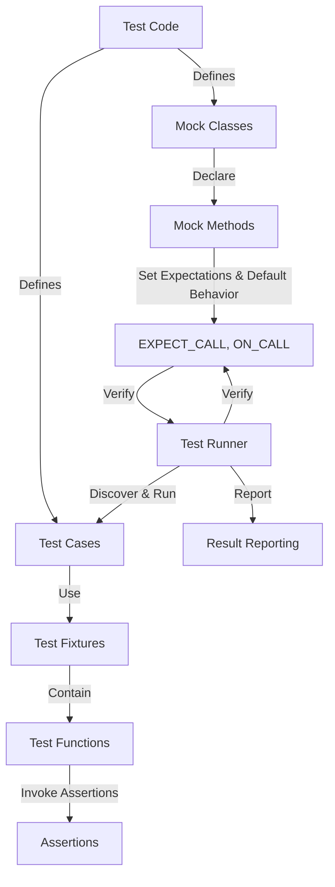

# Core Architecture & Components

This guide explores the foundational architectural building blocks that compose the GoogleTest and GoogleMock frameworks. Understanding these components—their roles and interactions—is essential for building scalable, robust C++ test suites. This page focuses specifically on core components such as test cases, test fixtures, assertions, mock objects, and test runners, explaining their user-centric purposes and how they fit together during test discovery and execution.

---

## 1. Test Cases and Test Fixtures

### 1.1 Defining Test Cases

At the heart of GoogleTest lies the concept of **test cases** (now called test suites in later versions), which group individual test functions that verify specific behavior of the code under test. Each test case contains one or more **test functions**, each representing an independent unit test.

Users define test cases and tests with the `TEST()` macro, where each test takes no parameters and describes a single test scenario.

```cpp
TEST(FactorialTest, ComputesFactorialOfPositiveNumbers) {
  EXPECT_EQ(Factorial(1), 1);
  EXPECT_EQ(Factorial(5), 120);
}
```

This approach facilitates modular testing where each test focuses on one aspect.

### 1.2 Sharing Setup with Test Fixtures

When multiple tests require a common environment or repetitive setup/teardown code, **test fixtures** come into play. Test fixtures enable grouping tests under a class derived from `testing::Test` that encapsulates shared setup (`SetUp()`) and teardown (`TearDown()`).

Within a fixture, the `TEST_F()` macro is used to define tests that inherit this shared context.

```cpp
class FileParserTest : public testing::Test {
 protected:
  void SetUp() override {
    file_ = OpenTestFile("sample.txt");
  }

  void TearDown() override {
    CloseFile(file_);
  }

  FileHandle file_;
};

TEST_F(FileParserTest, ParsesCorrectly) {
  EXPECT_TRUE(Parse(file_));
}

TEST_F(FileParserTest, ReportsErrors) {
  EXPECT_FALSE(Parse(nullptr));
}
```

**Tip:** Use fixtures to reduce code duplication and manage test state cleanly. Always ensure resources allocated in `SetUp()` are properly released in `TearDown()`.

---

## 2. Assertions: Verifying Expected Behavior

Assertions in GoogleTest serve as the primary means for verifying expected conditions and outcomes. They provide immediate feedback on test failures, pinpointing the exact expectation that failed.

### 2.1 Types of Assertions

- **Fatal Assertions (`ASSERT_`)**: Immediately abort the current test if the assertion fails.
- **Non-Fatal Assertions (`EXPECT_`)**: Record failure but allow the test to continue, useful for checking multiple conditions within a single test.

### 2.2 Common Assertions Examples

```cpp
EXPECT_EQ(value, expected);        // Checks equality
ASSERT_TRUE(IsValid(value));       // Aborts test if condition false
EXPECT_NE(value1, value2);          // Checks inequality
EXPECT_THROW(Foo(), std::runtime_error);  // Checks exceptions
```

**Practical Advice:** Prefer `EXPECT_` when you want your test to verify multiple conditions in one go, and `ASSERT_` when subsequent test statements are meaningless without the condition.

See the detailed [Assertions API reference](/api_reference/test_framework_api/assertions) for comprehensive coverage.

---

## 3. Mock Objects: Isolating Dependencies with GoogleMock

GoogleMock extends GoogleTest by enabling **mock objects**, which simulate and control the behavior of dependencies, allowing users to verify interactions precisely.

### 3.1 Creating Mock Classes

Mock classes are user-defined by inheriting interfaces or abstract classes and using the `MOCK_METHOD` macro to declare mock methods.

```cpp
class MockDatabase : public DatabaseInterface {
 public:
  MOCK_METHOD(bool, Connect, (const std::string& url), (override));
  MOCK_METHOD(void, Disconnect, (), (override));
  MOCK_METHOD(std::string, Query, (const std::string& query), (override));
};
```

Important details about `MOCK_METHOD`:
- It takes 3 or 4 parameters: return type, method name, argument list, and optionally method qualifiers `(const, override, noexcept, Calltype(...), ref(...))`.
- Methods must be declared in the `public:` section.
- For methods with commas in their types, argument or return types should be wrapped in additional parentheses or use type aliases.

### 3.2 Setting Default Behavior and Expectations

- `ON_CALL` sets **default actions** for mock methods without generating an expectation that the method will be called.
- `EXPECT_CALL` sets **expectations** defining how many times and with which arguments the mock method should be called.

Usage example:

```cpp
MockDatabase mock_db;

ON_CALL(mock_db, Connect).WillByDefault(Return(true));
EXPECT_CALL(mock_db, Query("SELECT * FROM users"))
    .Times(1)
    .WillOnce(Return("result"));

// Code under test uses mock_db
```

### 3.3 Controlling Call Cardinalities and Order

Expectations specify:
- How many times a mock method is expected to be called using `.Times()` (e.g., `Exactly(n)`, `AtLeast(n)`, `AnyNumber()`).
- Partial or total order of calls using `.InSequence()`, `.After()`, or `Sequence` objects for fine-grained control.

Example of ordered calls:

```cpp
Sequence s;
EXPECT_CALL(mock_db, Connect())
    .InSequence(s);
EXPECT_CALL(mock_db, Query(_))
    .InSequence(s);
```

### 3.4 Special Mock Types

GoogleMock provides wrappers to control uninteresting calls (calls without expectations):

- `NiceMock<T>` suppresses warnings on uninteresting calls.
- `NaggyMock<T>` (default) warns on uninteresting calls.
- `StrictMock<T>` treats uninteresting calls as test failures.

See [Mocking Reference](/concepts/mocking-models/mock-object-model) for an exhaustive understanding.

---

## 4. Test Runner: Discovery and Execution

GoogleTest’s test runner automates finding and executing all declared tests across test cases and fixtures.

### 4.1 Test Discovery

- The `TEST()` and `TEST_F()` macros automatically register test functions with the test framework.
- Tests are discovered at runtime, enabling running all tests or specific subsets via filters.

### 4.2 Test Execution Flow

- The test runner initializes test environments.
- Executes each test case in a separate context, initializing and tearing down test fixtures if applicable.
- Captures and reports assertion failures.

### 4.3 Parallel Execution and Ordering

- Tests can be run in parallel or sequentially.
- Execution order can be customized via flags or programmatic APIs.

See [Test Lifecycle and Execution Model](/concepts/testing-architecture/test-life-cycle) for details on how tests progress from discovery to reporting.

---

## 5. Component Interaction Diagram

Below is a high-level illustration of the relationships among the core components discussed:



This diagram frames the user journey: they write test cases and fixtures, implement mock objects with expectations, and the test runner coordinates execution and verification.

---

## 6. Best Practices and Tips

- **Set Expectations Before Use:** Always declare `EXPECT_CALL` before exercising the mock method to ensure reliable verification.
- **Use Test Fixtures for Setup:** When multiple tests share setup steps, use test fixtures to reduce duplication and improve maintainability.
- **Leverage Default Actions:** Use `ON_CALL` to provide sensible default mock behaviors without over-constraining tests.
- **Control Mock Verbosity Strategically:** Use `NiceMock` for reducing noise when uninteresting calls are expected; use `StrictMock` when you want to enforce strict call adherence.
- **Use Sequences for Ordering:** When call order matters, employ `Sequence` and `.InSequence()` or `.After()` to specify expectations precisely.
- **Avoid Overly Tight Expectations:** Too strict or too many `EXPECT_CALL`s may result in brittle tests; verify only what matters for the test objective.

---

## 7. Troubleshooting Common Issues

- **Compilation Errors with `MOCK_METHOD`:** Wrap argument or return types with commas in extra parentheses or use type aliases.
- **Uninteresting Call Warnings:** Use `NiceMock` or set catch-all expectations with `.Times(AnyNumber())`.
- **Unexpected Call Failures:** Verify that all expected calls are declared correctly; check argument matchers.
- **Saturated Expectations:** Use `.RetiresOnSaturation()` if an expectation should become inactive after its call count is met.

For detailed symptom diagnosis, refer to [Troubleshooting Installation & Configuration](/getting-started/troubleshooting-common-issues/common-setup-issues).

---

## 8. Further Learning and Next Steps

To deepen your understanding and advance your testing expertise, explore the following:

- [Writing Your First Unit Tests](/guides/core-workflows/authoring-unit-tests) — learn test implementation hands-on.
- [Mocking Dependencies with GoogleMock](/guides/core-workflows/using-mocks) — dive into mocks in practical scenarios.
- [Matchers Reference](/api_reference/mocking_api/matchers_reference) — master argument matching strategies.
- [Assertion Models](/concepts/matchers-assertions-models/assertion-concepts) — understand assertion behavior.


<Tip>
Consider defining mock classes close to the interfaces they mock to ease maintenance and avoid duplication. Use sequences and ordering constraints to precisely specify interaction requirements.
</Tip>

<Note>
Remember that GoogleMock automatically verifies all expectations on mock objects upon their destruction. Use `Mock::VerifyAndClearExpectations()` to force verification early.
</Note>

---

**This page focuses on the user-relevant architecture of core components—test cases, fixtures, assertions, mocks, and runners—without delving into internal technical implementation details, aligning with progressive user mastery and practical application.**