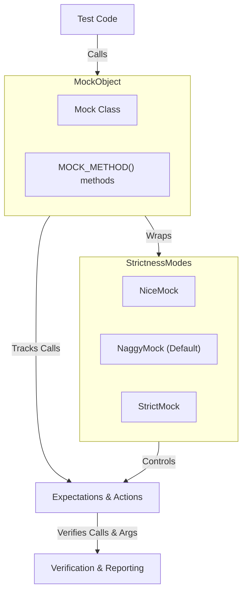

# Mock Object Architecture

Understanding how mock objects are structured and behave is essential to using GoogleMock effectively. This guide explores the fundamental principles of mock objects, how mock classes and methods work, and the available modes that control mock strictness and responsiveness.

---

## What Is a Mock Object?

A **mock object** is a programming construct that emulates the behavior of a real object in a controlled way. It implements the same interface or inherits from the same base as the real object, allowing it to be used in its place. Unlike simple test stubs or fakes, mocks enable precise control and verification of interactions, such as method calls, argument values, call order, and invocation count.

GoogleMock leverages mock objects to isolate dependencies in your tests, enabling you to test components independently and thoroughly.

## Defining Mock Classes and Methods

In GoogleMock, a mock class is defined by inheriting from the interface or base class you want to mock. Within that class, you declare mock methods using macros such as `MOCK_METHOD`. Each `MOCK_METHOD` specifies a method signature that will be implemented by GoogleMock to track calls and enforce expectations.

### Creating Mock Classes

Mock classes follow the interface of the real class and declare each virtual method with `MOCK_METHOD`. For example:

```cpp
#include <gmock/gmock.h>

class Foo {
 public:
  virtual ~Foo();
  virtual int GetSize() const = 0;
  virtual std::string Describe(const char* name) = 0;
};

class MockFoo : public Foo {
 public:
  MOCK_METHOD(int, GetSize, (), (const, override));
  MOCK_METHOD(std::string, Describe, (const char* name), (override));
};
```

This setup allows the mock to be used in tests, replacing real implementations with controllable stand-ins.

### Mocking Overloaded and Const Methods

GoogleMock supports mocking overloaded functions and `const` methods. You declare each overloaded version separately with the appropriate qualifiers:

```cpp
class MockFoo : public Foo {
 public:
  MOCK_METHOD(int, Add, (Element x), (override));
  MOCK_METHOD(int, Add, (int times, Element x), (override));

  MOCK_METHOD(Bar&, GetBar, (), (override));
  MOCK_METHOD(const Bar&, GetBar, (), (const, override));
};
```

If not all overloaded variants are mocked, use `using` declarations to avoid name hiding.

### Mocking Non-Virtual Methods

Mocking typically requires virtual methods. However, GoogleMock offers techniques for mocking non-virtual methods through template-based dependency injection, where mocks are unrelated classes sharing method signatures used at compile-time.

### Internal Behavior

Under the hood, GoogleMock generates code for each mocked method to:

- Track invocations and argument values
- Verify expectations on call order, frequency, and argument matching
- Execute predefined actions or default behaviors

This implementation enables immediate feedback about unexpected calls or unsatisfied expectations during tests.

## Setting Expectations and Default Behaviors

Mock objects in GoogleMock respond to method calls by matching them against defined expectations:

- `EXPECT_CALL` sets expectations that specify how many times and under what arguments a method should be called.
- `ON_CALL` sets default behaviors but does not assert that calls must happen.

Expectations can specify:

- **Cardinality** – how many times a call is expected.
- **Argument matchers** – predicates to match method arguments.
- **Sequence and ordering** – constraints for call order.
- **Actions** – what to do when a call matches (e.g., return values, side effects).

## Managing Uninteresting Calls: Nice, Naggy, and Strict Mocks

GoogleMock categorizes calls with no explicit expectations as **uninteresting calls**. By default, uninteresting calls produce warnings to highlight potential oversights but do not cause test failures.

GoogleMock offers three strictness wrappers to control these behaviors:

### 1. NaggyMock (Default)
- Prints warnings when uninteresting calls occur.
- Suitable during test development to catch missing expectations.

### 2. NiceMock
- Suppresses warnings and allows uninteresting calls silently.
- Ideal for tests where we accept untested interactions or want cleaner test output.

```cpp
using ::testing::NiceMock;

NiceMock<MockFoo> nice_foo;
EXPECT_CALL(nice_foo, DoThis());
// No warning if other methods are called unexpectedly.
```

### 3. StrictMock
- Treats uninteresting calls as errors.
- Enforces that every mock method call must be explicitly expected.

```cpp
using ::testing::StrictMock;

StrictMock<MockFoo> strict_foo;
EXPECT_CALL(strict_foo, DoThis());
// Test will fail if any unexpected calls occur.
```

### Implementation Details

These wrappers are implemented via subclasses that alter the internal reaction to uninteresting calls by registering different call reaction modes:

- `AllowUninterestingCalls` for `NiceMock`
- `WarnUninterestingCalls` for `NaggyMock`
- `FailUninterestingCalls` for `StrictMock`

They forward constructors to the underlying mock to support user-defined mock parameters.

### Important Notes on Strictness Modes

- The strictness wrappers affect **only** uninteresting calls, not unexpected calls (calls that don’t match any active expectation).
- They only affect mock methods defined *directly* in the mock class (not inherited ones).
- Wrapping mock classes with multiple strictness modifiers (e.g., nesting `NiceMock<StrictMock<MockFoo>>`) is unsupported.

## Verifying and Clearing Mock Expectations

Mock objects automatically verify their expectations when destroyed. You can also manually verify and clear expectations using:

```cpp
// Verifies and clears expectations.
bool success = ::testing::Mock::VerifyAndClearExpectations(&mock_foo);

// Verifies and clears both expectations and default actions.
bool success2 = ::testing::Mock::VerifyAndClear(&mock_foo);
```

Use manual verification when you want to ensure a mock object’s correctness while it is still alive or to detect violation earlier.

## Usage Flow of Mock Objects

1. Create mock object.
2. Set expectations (`EXPECT_CALL`) and default behaviors (`ON_CALL`).
3. Exercise the code-under-test that uses the mock.
4. Optionally verify or clear expectations.
5. At destruction, mocks automatically check that expectations are met.

## Troubleshooting and Common Pitfalls

- **Unexpected calls** (calls violating expectations) always cause failures.
- **Uninteresting calls** may cause warnings depending on strictness mode.
- If you see **nagging warnings for uninteresting calls**, consider using `NiceMock` or explicitly allowing calls with `EXPECT_CALL(...).Times(AnyNumber())`.
- **Destructor of base classes** must be `virtual` to avoid memory leaks when mocking polymorphic classes.
- To **mock variadic functions** directly is impossible. Instead, provide overloaded versions or refactor.

## Summary Diagram of Mock Object Interactions



---

For more detailed guidance on mock method behavior, matchers, actions, and strictness modes, please consult the following resources in this documentation set.

---

## Further Reading and Useful Links

- [Mocking Reference](docs/reference/mocking.md): Complete guide on mock macros, classes, and usage.
- [gMock Cookbook](docs/gmock_cook_book.md): Practical recipes and techniques for mocking scenarios.
- [Strictness and Mock Behavior Modes](docs/gmock_cook_book.md#NiceStrictNaggy): Detailed explanations of NiceMock, NaggyMock, and StrictMock.
- [gMock for Dummies](docs/gmock_for_dummies.md): Beginner-friendly introduction to mocking.
- [Expectations, Actions, and Cardinalities](api-reference/mocking-framework/expectations-actions-cardinalities.mdx): In-depth reference on setting expectations and controlling mock behavior.

---

This guide has offered a comprehensive look into the architecture and intended usage of mock objects within GoogleMock. By mastering these concepts, you can design robust, maintainable, and effective tests that isolate components and validate interaction precisely.