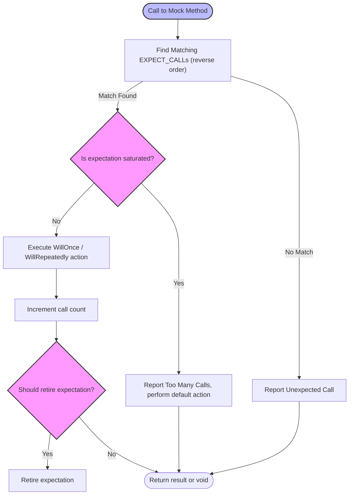

# Mock Objects and Expectations

GoogleMock (gMock) empowers C++ developers to create mock objects—test doubles that simulate real objects' interactions—to verify the behavior of the code under test precisely. This guide delves into the core philosophy and mechanisms behind mocking with GoogleMock, focusing on what mock objects are, how to set expectations, and how matchers, actions, and cardinalities combine to enforce interaction correctness.

---

## Understanding Mock Objects

Imagine replacing a complex dependency in your code with a controllable stand-in—an object that behaves exactly as you specify during testing. This *mock object* mimics the real dependency's interface but lets you:

- Specify which methods should be called and how often.
- Define what arguments they should receive.
- Control what they return or side effects they perform.
- Enforce the order or sequencing of expected calls.

By simulating collaborators in isolation, mocks enable **interaction-based testing**, allowing you to catch bugs arising from incorrect usage patterns, not merely incorrect outcomes.

### Defining Mocks with `MOCK_METHOD`

A mock class declares mocked methods using the macro:

```cpp
MOCK_METHOD(ReturnType, MethodName, (Args...), (Specs...));
```

- **ReturnType**: The function's return type.
- **MethodName**: The method's name.
- **Args**: Function argument types in parentheses.
- **Specs (optional)**: Qualifiers such as `const`, `override`, `noexcept`, calling convention specifiers (`Calltype(...)`), or reference qualifiers (`ref(&)`).

> **Important:** Place all `MOCK_METHOD` declarations in the `public:` section of your mock, even if the original method is protected or private, so that gMock can access them.

Example:

```cpp
class MockTurtle : public Turtle {
 public:
  MOCK_METHOD(void, PenUp, (), (override));
  MOCK_METHOD(void, Forward, (int distance), (override));
  MOCK_METHOD(int, GetX, (), (const, override));
};
```

### Dealing with Complex Types in Mock Methods

Types with commas like `std::pair<bool, int>` or template types require parentheses or type aliases to avoid parsing errors:

```cpp
MOCK_METHOD((std::pair<bool, int>), GetPair, ());
using MapIntDouble = std::map<int, double>;
MOCK_METHOD(bool, CheckMap, (MapIntDouble, bool));
```

### Mocking Overloaded Methods

Mock each overload explicitly, adding `const` in specs for const-qualified versions:

```cpp
MOCK_METHOD(int, Add, (Element x), (override));
MOCK_METHOD(int, Add, (int times, Element x), (override));
MOCK_METHOD(Bar&, GetBar, (), (override));
MOCK_METHOD(const Bar&, GetBar, (), (const, override));
```

Use `using BaseClass::MethodName;` if you don’t mock all overloads to avoid hiding warnings.

---

## Setting Expectations with `EXPECT_CALL`

The heart of mocking is in defining *expectations*—how your mock is expected to be *used* in the test. An expectation specifies:

- Which method is called.
- What argument values it receives (using matchers).
- How many times it is called (cardinality).
- What it does when called (actions).
- In what order calls must occur.

### Basic Syntax

```cpp
EXPECT_CALL(mock_object, Method(matchers...))
    .Times(cardinality)
    .WillOnce(action)
    .WillRepeatedly(action)
    .InSequence(sequences...)
    .After(expectations...)
    .RetiresOnSaturation();
```

- `mock_object`, `Method`: The target and method.
- `matchers`: Argument matchers (like `_` for any value, or `Eq(value)` for equality).

You may omit the matchers for non-overloaded methods to allow any arguments.

### Matchers: Expressing Argument Expectations

Matchers describe which argument values your code is expected to call with. Examples:

```cpp
EXPECT_CALL(turtle, Forward(100));          // Expect exact 100
EXPECT_CALL(turtle, GoTo(50, _));           // First argument 50, second anything
EXPECT_CALL(turtle, GoTo);                   // Any arguments (if not overloaded)
EXPECT_CALL(turtle, Forward(Ge(100)));      // Any argument >= 100
```

See the full [Matchers Reference](reference/matchers.md) for more.

### Cardinalities: Controlling Call Counts

The `.Times()` clause specifies how many times an expectation should be matched:

| Cardinality              | Meaning                                                              |
| ------------------------ | -------------------------------------------------------------------- |
| `Exactly(n)` or `n`      | The call should occur exactly `n` times.                            |
| `AtLeast(n)`             | The call should occur at least `n` times.                           |
| `AtMost(n)`              | The call should occur at most `n` times.                            |
| `Between(m, n)`          | The call should occur between `m` and `n` times (inclusive).        |
| `AnyNumber()`            | The call can occur any number of times (including zero).            |

If omitted, gMock infers cardinality based on calls to `.WillOnce()` and `.WillRepeatedly()`.

### Actions: Defining Mock Behavior

Actions determine what happens when a mock method is called.

- `.WillOnce(action)`: Specifies the behavior for the next matching call.
- `.WillRepeatedly(action)`: Specifies the behavior for all subsequent matching calls after `.WillOnce()`s are exhausted.

Example:

```cpp
EXPECT_CALL(foo, GetNumber())
    .WillOnce(Return(1))
    .WillOnce(Return(2))
    .WillRepeatedly(Return(3));
```

This means the first call returns 1, the second returns 2, and subsequent calls return 3.

### Controlling Call Order

By default, expectations can be matched in any order. You can enforce ordering:

- **Sequences** with `.InSequence(seq1, seq2, ...)` or the `InSequence` helper class to require calls in a strict order.
- **After clause** `.After(expectation)` to specify that a call must occur after other expectations have been satisfied.

Example with a `Sequence`:

```cpp
Sequence s1, s2;
EXPECT_CALL(mock, Reset()).InSequence(s1, s2);
EXPECT_CALL(mock, GetSize()).InSequence(s1);
EXPECT_CALL(mock, Describe()).InSequence(s2);
```

This ensures `Reset()` happens before `GetSize()` and `Describe()`, and those two can be unordered relative to each other.

### Retiring Expectations

By default, expectations remain active even after matching their call count (sticky). Use `.RetiresOnSaturation()` to deactivate an expectation immediately after it is saturated.

Example:

```cpp
EXPECT_CALL(mock, Func(7))
    .Times(2)
    .RetiresOnSaturation();
```

Once matched twice, this expectation retires, and subsequent matching calls will be handled by less specific expectations, if any.

### Multiple Expectations and Overriding

Newer expectations override older ones when they match the same method and arguments. Define specific expectations later to customize behavior:

```cpp
EXPECT_CALL(mock, Setup()).Times(AnyNumber());  // Allow any calls
EXPECT_CALL(mock, Setup(5)).Times(1).WillOnce(Return(true));  // Specific
```

### Uninteresting vs Unexpected Calls

- **Uninteresting call**: No expectations set on that method; call proceeds with default behavior, issues a warning by default.
- **Unexpected call**: There are expectations on the method, but none match the arguments for the current call; treated as a test failure.

Use **nice mocks** (`NiceMock<T>`) to silence warnings on uninteresting calls.
Use **strict mocks** (`StrictMock<T>`) to treat uninteresting calls as errors.

---

## Default Behavior with `ON_CALL`

`ON_CALL(mock, Method(matchers...))` sets the *default* behavior of a mock method when called but does *not* assert that the call is expected.

Syntax:

```cpp
ON_CALL(mock_object, Method(matchers...))
    .With(multi_argument_matcher)  // optional
    .WillByDefault(action);        // required
```

Default actions are superseded by actions defined in matching `EXPECT_CALL`s.

Example:

```cpp
ON_CALL(foo, GetSize())
    .WillByDefault(Return(1));
```

---

## Managing Mock Object Behavior Modes

Mocks can be wrapped for handling uninteresting calls differently:

- `NiceMock<MockClass>`: Suppresses warnings on uninteresting calls.
- `NaggyMock<MockClass>` (default): Prints warnings on uninteresting calls.
- `StrictMock<MockClass>`: Treats uninteresting calls as test failures.

They behave like subclasses of the mock class and preserve constructor arguments.

Example:

```cpp
NiceMock<MockFoo> nice_foo;
NaggyMock<MockFoo> naggy_foo;
StrictMock<MockFoo> strict_foo;
```

---

## Practical Workflow Example

```cpp
using ::testing::Return;
using ::testing::_;

TEST(ExampleTest, UsesMock) {
  MockFoo foo;

  // Default behavior if no matching EXPECT_CALL
  ON_CALL(foo, GetSize()).WillByDefault(Return(42));

  // Expect exactly one call to Describe with argument 5
  EXPECT_CALL(foo, Describe(5))
      .Times(1)
      .WillOnce(Return("five"));

  // Use foo in code under test
  std::string result = CodeUnderTest(&foo);

  EXPECT_EQ(result, "five");
}  
```

---

## Troubleshooting Tips

- Always set expectations *before* exercising the mock method; undefined behavior occurs otherwise.
- Use `--gmock_verbose=info` to get detailed call traces for debugging unmet expectations.
- Use `.RetiresOnSaturation()` with consecutive expectations to avoid saturation errors.
- For overloaded methods, specify matchers or use `Const(mock)` to disambiguate.
- Remember mocks verify expectations on destruction; if mocks leak, use `Mock::AllowLeak()` or explicitly invoke `Mock::VerifyAndClearExpectations()`.

---

## Additional Concepts

- **Matchers as predicates** and composing matchers provide rich expressive power for argument matching.
- **Sequences and `After()`** allow specifying complex partial orders on expectations.
- **Actions** can be simple (`Return`), side-effects (`SetArgPointee`), or custom callable objects/lambdas.
- **Default values** for return types can be set globally via `DefaultValue<T>::Set()`.

---

For comprehensive examples and advanced techniques, consult the [gMock Cheat Sheet](https://google.github.io/googletest/gmock_cheat_sheet.html), the [gMock Cookbook](https://google.github.io/googletest/gmock_cook_book.html), and the [Matchers Reference](reference/matchers.md).

---

## Mermaid Diagram: High-Level Expectation Matching Flow



---

## Conclusion

Mastering mock objects and expectations in GoogleMock transforms your testing capabilities by making interaction verification simple, expressive, and robust. Use this knowledge to design precise, maintainable tests that clearly specify how your code should behave under controlled scenarios.

---
