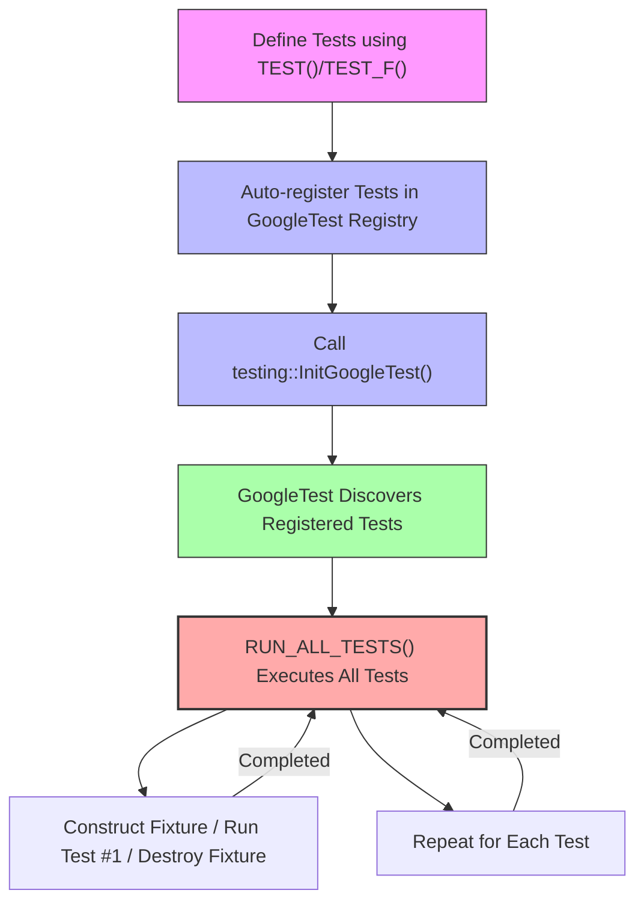

# Automatic Test Discovery & Categorization

GoogleTest streamlines the process of finding, grouping, and managing tests automatically — no manual listing or registration required. Whether your project is a small module or a large, complex codebase, this capability ensures your tests are organized logically and executed efficiently.

---

## Why Automatic Test Discovery Matters

Imagine adding a new test to your project. Traditionally, you might need to register it explicitly to run it. GoogleTest eliminates that burden by recognizing and collecting tests at runtime. This seamless approach enables you to focus purely on writing tests, confident they will be found and executed.

This automation saves significant developer time, prevents errors related to missing tests, and supports scalability as your codebase grows.

---

## How GoogleTest Discovers Tests Automatically

When you define a test using the `TEST()` or `TEST_F()` macros, GoogleTest registers the test within its internal global registry automatically. Each instance of these macros performs two critical actions:

- **Test Creation:** The macro defines a test function encapsulating your test logic.
- **Registration:** It registers metadata about that test (including its test suite and test name) into GoogleTest’s internal storage.

This registration happens before `main()` runs, allowing GoogleTest to enumerate all tests during initialization.

### Example
```cpp
TEST(MathTests, Addition) {
  EXPECT_EQ(2 + 2, 4);
}

TEST_F(StringTestFixture, Length) {
  EXPECT_EQ(str_.length(), 5);
}
```
Both `MathTests.Addition` and `StringTestFixture.Length` are discovered without any further user action.

---

## Test Case Grouping and Test Suites

Tests in GoogleTest are grouped logically into **test suites** (previously called test cases). The suite name is the first argument to `TEST()`, grouping related tests. Grouping tests:

- Simplifies reporting and output readability.
- Enables running subsets of tests via filters.
- Supports shared setup and teardown through fixtures (`TEST_F`).

### Understanding Test Suites

A test suite is a collection of related tests which may share common fixtures or context. Consider the following illustration:

```cpp
TEST(StringTests, EmptyString) {
  EXPECT_TRUE(std::string().empty());
}

TEST(StringTests, AppendText) {
  std::string s = "foo";
  s.append("bar");
  EXPECT_EQ(s, "foobar");
}
```

Here, both tests belong to the `StringTests` suite and will appear grouped in test output.

---

## Test Execution Order

GoogleTest executes tests in the order they were registered by default. This order corresponds to the order in which the test macros are instantiated during compilation and initialization.

Key considerations about execution order:

- **Test Independence:** Tests should never depend on execution order to ensure reliability.
- **Control via Filters:** You can selectively run specific tests or suites to prioritize or isolate tests.

> Tip: To run all tests in the `StringTests` suite, use the command-line flag:
>
> ```
> --gtest_filter=StringTests.*
> ```

---

## Organizing Complex Test Suites

For larger projects, GoogleTest supports organizing numerous tests effectively through:

- **Fixtures (`TEST_F`):** Provide reusable common setup/teardown for related tests.
- **Type-Parameterized and Parameterized Tests:** Enable running the same test logic across various input data.
- **Sub-suites (via naming conventions):** Although GoogleTest does not have nested suites, adopting naming schemes like `ModuleA_SubModuleB_TestName` helps in logically organizing tests and filtering them.

This structure supports maintainability and clarity as your test base expands.

---

## How Tests are Defined and Registered

1. **Defining Tests:** Using the `TEST()` and `TEST_F()` macros, you create independent test functions or tests that use fixtures.
2. **Linkage with GoogleTest Library:** When your test binary links against GoogleTest libraries, the macros expand into code that registers the test with the framework's internal registry.
3. **Test Registry:** This global repository holds all test metadata.
4. **Initialization:** Calling `testing::InitGoogleTest()` initializes the registry and prepares for execution.

You do NOT need to maintain any separate list or invoke registration calls manually.

### Simplified User Flow
<Steps>
<Step title="Write Test Code">
Define your test cases using `TEST()` or `TEST_F()` macros.
</Step>
<Step title="Build Your Test Binary">
Compile and link your tests with GoogleTest libraries.
</Step>
<Step title="Run Tests">
Execute your test binary, which automatically discovers and runs every registered test.
</Step>
</Steps>

---

## Practical Tips & Best Practices

- **Name Tests Clearly:** Ensure test suite and test names are meaningful. Avoid underscores as they are discouraged in suite or test names.
- **Keep Tests Independent:** Relying on execution order compromises test reliability.
- **Use Fixtures for Shared Setup:** Avoid code duplication by using `TEST_F()` where tests need common state.
- **Monitor Test Output:** Tests are reported grouped by suites, which helps diagnose issues faster.
- **Harness Filters:** Use `--gtest_filter` to run focused test selections.

---

## Troubleshooting Common Issues

### Why Are Some Tests Not Discovered?
- Check that tests use the `TEST()` or `TEST_F()` macros correctly with valid suite and test names.
- Ensure test files are linked into your test binary.
- Verify that `testing::InitGoogleTest()` is called before `RUN_ALL_TESTS()`.

### Tests Not Executing in Expected Order?
- GoogleTest runs tests in registration order; avoid depending on order.
- Use filters or organize tests by suite if specific run ordering is needed.

### Tests Being Skipped or Invisible?
- Confirm your build includes all test sources.
- Check for build or linkage errors that exclude certain tests.

---

## Summary

GoogleTest’s automatic test discovery and categorization dramatically simplify test maintenance and execution. By leveraging macros for automatic registration, logical grouping through test suites, and fixture-based shared context, it empowers developers to build scalable and robust test suites effortlessly.

<Check>
Remember: Write tests using `TEST()` or `TEST_F()`, link against GoogleTest, call `InitGoogleTest()`, and simply run your binary. Watch GoogleTest detect and organize the tests for you.
</Check>

---

## See Also

- [GoogleTest Primer](https://github.com/google/googletest/blob/main/docs/primer.md) — Get started writing your first tests.
- [Test Structure and Discovery](https://github.com/google/googletest/blob/main/guides/getting-started/test-structure-and-discovery.md) — Organizing and discovering tests in detail.
- [Test Case Construction API Reference](https://github.com/google/googletest/blob/main/api-reference/gtest-core-apis/test-case-construction.md) — Learn macros and internals of test declarations.
- [Running Tests with Filters](https://github.com/google/googletest/blob/main/docs/advanced.md#running-a-subset-of-the-tests) — Focus test runs on subsets.

---

## Diagram: Test Discovery and Execution Flow

